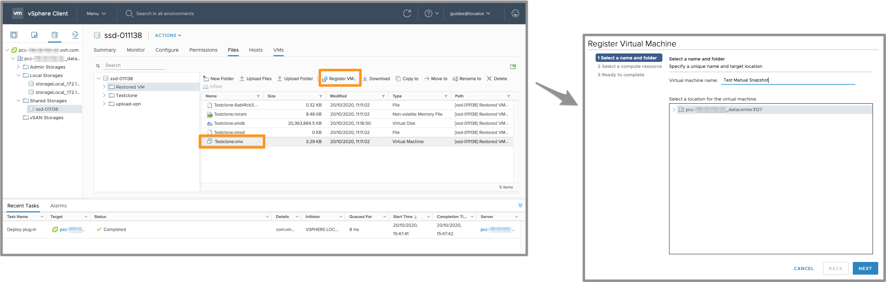

> [!primary]
> Tłumaczenie zostało wygenerowane automatycznie przez system naszego partnera SYSTRAN. W niektórych przypadkach mogą wystąpić nieprecyzyjne sformułowania, na przykład w tłumaczeniu nazw przycisków lub szczegółów technicznych. W przypadku jakichkolwiek wątpliwości zalecamy zapoznanie się z angielską/francuską wersją przewodnika. Jeśli chcesz przyczynić się do ulepszenia tłumaczenia, kliknij przycisk “Zaproponuj zmianę” na tej stronie.
> 

**Ostatnia aktualizacja z dnia 30-11-2020**

## Wprowadzenie

Aby zapewnić ciągłość usługi i uniknąć utraty danych, OVHcloud automatycznie wykonuje migawki szafy dyskowej (datastore) co godzinę.

**Niniejszy przewodnik wyjaśnia, jak to działa**

## Wymagania początkowe

* Posiadanie [infrastruktury Managed Bare Metal](https://www.ovhcloud.com/pl/managed-bare-metal/){.external} na koncie OVHcloud.
* Dostęp do interfejsu zarządzania vSphere Web Client HTML.

## W praktyce

System plików składa się z bloków zawierających dane. Na początku systemu plików znajduje się indeks, który zawiera wskaźniki, które pozwalają na odnalezienie lokalizacji poszczególnych bloków.

Plik jest często podzielony na kilka bloków, więc indeks pozwala na optymalizację czasu dostępu do pliku. Indeks jest jak skrót książki, pozwala poznać numer strony w rozdziale, który chcemy przeczytać.
 
Snapshot ZFS jest jak zdjęcie zrobione z systemu plików w momencie T. Zazwyczaj służy jako podstawa do tworzenia kopii zapasowej.
 
Podczas tworzenia snapshota ZFS nie musi skopiować całego dysku twardego, ponieważ wszystkie pliki są już na nim zapisane. Snapshot rejestruje indeks zawierający wskaźniki odnoszące się do wolnych bloków i używanych bloków. W sumie przechowuje on pozycjonowanie bloków, a ZFS będzie dodawać bloki w zależności od zmian danych. Snapshot nie zajmuje dużo miejsca dopóki nie zmieni się żadna z danych i jest bardzo szybki w wykonaniu.
 
Po utworzeniu snapshota ZFS przechwyci zapytania dotyczące zapisu. Wykona następujące czynności, jeżeli wskaźnik indeksu odnosi się do:
 
- Wykorzystany blok; skopiuje blok do snapshota i zaktualizuje indeks, aby wskazywał na nowy blok, a nie na stary blok.
- Wolny blok; skopiuje blok do systemu plików, a ZFS zaktualizuje cały indeks filesystemu.
 
Dodanie pliku nie powoduje powiększenia snapshota, ponieważ snapshot nie zajmuje się wolnymi blokami. Podobnie wielokrotne zapisy bloków nie mają wpływu na rozmiar snapshota, ponieważ snapshot zachowuje tylko jedną wersję dla każdego bloku: która pochodzi z chwili T.
 
Można więc powiedzieć, że rozmiar snapshota jest w przybliżeniu równy rozmiarowi bloków używanych do jego utworzenia, które zostały zmienione od tamtego czasu. Pamiętaj jednak przede wszystkim, że rozmiar snapshota zależy od sposobu użycia systemu plików oraz od długości życia snapshota.
 
W praktyce snapshot utworzony w tym momencie T będzie miał tylko kilka kilobajtów. Rozmiar snapshota zwiększy się w zależności od zmian dokonanych do kolejnego snapshota. Jeśli usuniesz dane, przestrzeń zostanie uwolniona tylko podczas usuwania snapshota.

## Snapshot H-1

Możesz pobrać snapshot ZFS z ostatniej godziny (H-1) z poziomu interfejsu vSphere Web Client HTML, ponieważ jest on przechowywany bezpośrednio w Twoich datastore. 

### Pobierz snapshot H-1

W interfejsie vSphere Web Client HTML przejdź do widoku datastores, a następnie do folderu `Shared Storages` w datastore z wirtualną maszyną do przywrócenia.

Odkryj datastore klikając `Browse Files`.

{.thumbnail}

Utwórz folder, do którego później skopiujesz pliki do przywrócenia.

{.thumbnail}

Przejdź do folderu `.zfs`, następnie rozwiń drzewo aż do folderu maszyny wirtualnej, do którego chcesz przywrócić pliki, a następnie skopiuj wszystkie pliki znajdujące się w tym folderze do nowego folderu utworzonego w poprzednim etapie.

{.thumbnail}

Pliki są już dostępne. Wystarczy dodać tę maszynę do **inwentarza**, klikając plik `.vmx`, a następnie `register VM`{.action} powyżej.

{.thumbnail}

W celu zakończenia procedury postępuj zgodnie z instrukcją tworzenia wirtualnych maszyn.

## A co z snapshotami po ostatniej godzinie?

OVHcloud przechowuje pozostałe 23 kopii zapasowych (do H-24) w szafie przestrzeni dyskowej (datastore), do której nie masz bezpośredniego dostępu. W przypadku danej wirtualnej maszyny można jednak, za pomocą prośby o interwencję (opłacanej 80€ netto), zażądać przywrócenia snapshota (poza H-1). Nie będziemy w stanie przywrócić zamówionego snapshota, który ma zostać zainstalowany na tym samym datastore i w żadnym razie nie możemy zagwarantować przywrócenia tej kopii.

Jest to bezpieczeństwo normalnie używane przez OVHcloud. Snapshoty godzinowe nie są systemem kopii zapasowych i nie są gwarantowane.

Jest to dodatkowy system bezpieczeństwa do użytku wewnętrznego wprowadzony w przypadku datastore, który ma być stosowany tylko w ostateczności, aby zapobiec utracie danych.

Zalecamy użycie pełnego rozwiązania do tworzenia kopii zapasowych, takiego jak usługa [Veeam Backup](https://docs.ovh.com/gb/en/managed-bare-metal/veeam-backup-as-a-service/) lub inny system realizujący kopię zapasową wirtualnych maszyn.

## Sprawdź również

Dołącz do społeczności naszych użytkowników na stronie<https://community.ovh.com/en/>.
