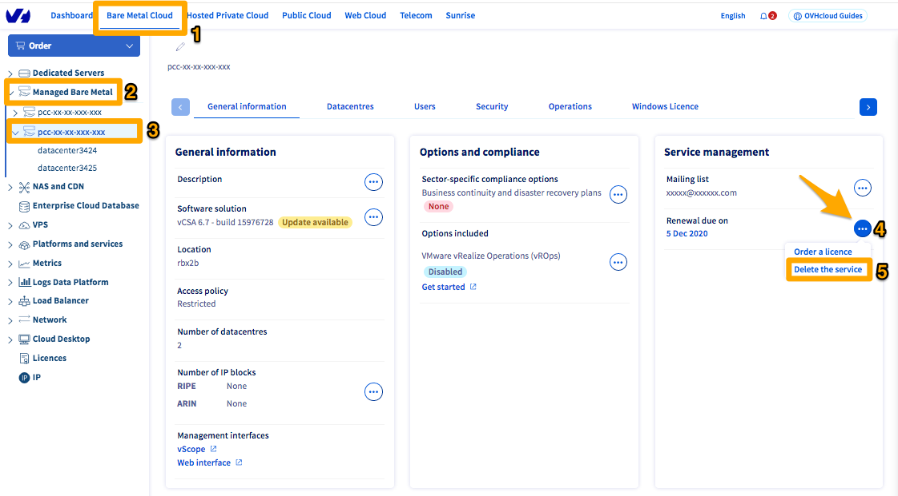
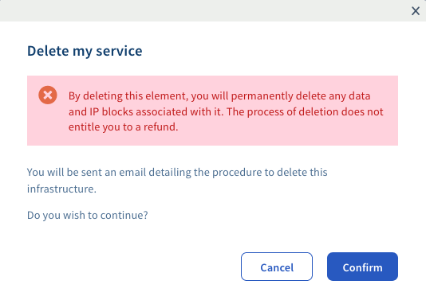

**Ostatnia aktualizacja z dnia 18-11-2020**

## Wprowadzenie

Jeśli usługa Managed Bare Metal nie jest już dla Ciebie odpowiednia lub jeśli zamówiłeś nową infrastrukturę, możesz wydać dyspozycję usunięcia starej infrastruktury, gdy wszystkie Twoje dane zostaną zabezpieczone.

**Dowiedz się, jak zrezygnować z infrastruktury Managed Bare Metal** 

## Wymagania początkowe

- Dostęp do [Panelu klienta OVHcloud](https://www.ovh.com/auth/?action=gotomanager&from=https://www.ovh.pl/&ovhSubsidiary=pl){.external} i sekcji `Bare Metal Cloud`{.action}, a następnie `Managed Bare Metal`{.action}
- Posiadanie usługi [Managed Bare Metal](https://www.ovhcloud.com/pl/managed-bare-metal/){.external}

## W praktyce

>[!warning]
>
> Zanim usługa zostanie zakończona, pamiętaj o pobraniu wszystkich danych, które chcesz zachować. Zakończenie usługi spowoduje całkowite usunięcie infrastruktury Managed Bare Metal i wszystkich zawartych w niej danych.
>

### Etap 1: złóż dyspozycję zakończenia usługi w Panelu klienta 

Zaloguj się do [Panelu klienta OVHcloud](https://www.ovh.com/auth/?action=gotomanager&from=https://www.ovh.pl/&ovhSubsidiary=pl){.external}, przejdź do sekcji `Bare Metal Cloud`{.action} (1), kliknij `Managed Bare Metal`{.action} (2) i wybierz serwer z listy (3).

W tabeli “Zarządzanie usługami” w zakładce “Informacje ogólne” kliknij przycisk `...`{.action} (4) po prawej stronie od daty odnowienia. Na koniec kliknij `Usuń usługę`{.action} (5).

{.thumbnail}

Pamiętaj, że ta czynność spowoduje usunięcie wszelkich danych obecnych w infrastrukturze, gdy tylko zostanie potwierdzone zakończenie usługi. Jeśli usługa zostanie zakończona przed końcem miesiąca, nie będzie przysługiwało prawo do zwrotu środków za niewykorzystany do końca miesiąca okres.

Kliknij `Zatwierdź`{.action}, aby potwierdzić rezygnację.

{.thumbnail}

Otrzymasz powiadomienie potwierdzające Twoją dyspozycję. Procedura potwierdzenia rezygnacji z usługi zostanie wysłana do Ciebie e-mailem na adres powiązany z kontem OVHcloud.

{.thumbnail}

### Etap 2: zatwierdź rezygnację

Po złożeniu rezygnacji otrzymasz potwierdzenie wysłane na Twój adres e-mail powiązany z kontem OVHcloud. 

E-mail ten możesz również znaleźć w Panelu klienta OVHcloud. Kliknij Twoją nazwę w prawym górnym rogu, a następnie `E-maile dotyczące usługi`{.action}.

{.thumbnail}

Temat e-maila:

> **Usunięcie usługi Managed Bare Metal pcc-xxx-xxx-xxx-xxx**".

W wiadomości e-mail zamieścimy link, który pozwoli Ci potwierdzić rezygnację z usługi.

> [!primary]
>
> Należy pamiętać, że link ważny jest przez 72 godziny. Dlatego zalecamy złożyć dyspozycję zakończenia usługi począwszy od 25 dnia miesiąca.
>

Możesz również zatwierdzić dyspozycję zakończenia usługi za pośrednictwem następującego API OVHcloud:

> [!api]
>
> @api {POST} /dedicatedCloud/{serviceName}/confirmTermination
>

Następnie wprowadź token zatwierdzający podany w przesłanym do Ciebie e-mailu.

## Sprawdź również

Dołącz do społeczności naszych użytkowników na stronie <https://community.ovh.com/en/>.
