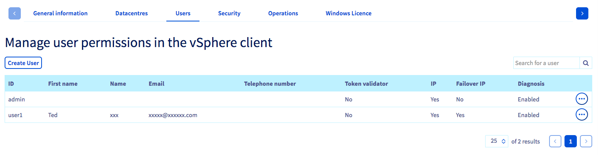
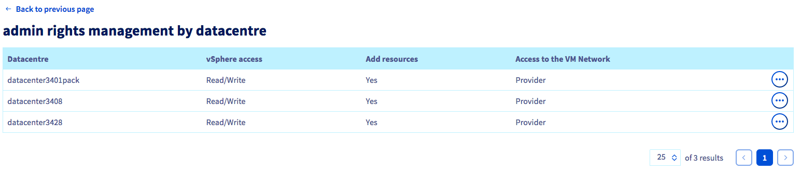
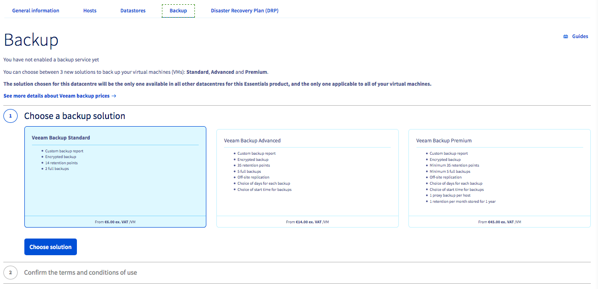

**Dernière mise à jour le 18/11/2020**

## Objectif

L'espace client OVHcloud vous propose de nombreuses options de paramétrage de votre infrastructure Managed Bare Metal.

**Ce guide vous en fait découvrir les multiples possibilités.**

## Prérequis

- Être connecté à votre [espace client OVHcloud](https://ca.ovh.com/auth/?action=gotomanager&from=https://www.ovh.com/ca/fr/&ovhSubsidiary=qc){.external} dans la partie `Bare Metal Cloud`{.action} puis `Managed Bare Metal`{.action}.
- Posséder un produit [Managed Bare Metal](https://www.ovhcloud.com/fr-ca/managed-bare-metal/){.external}.

## En pratique

### Onglet général

Une fois dans la partie `Bare Metal Cloud`{.action} puis `Managed Bare Metal`{.action} de votre [espace client OVHcloud](https://ca.ovh.com/auth/?action=gotomanager&from=https://www.ovh.com/ca/fr/&ovhSubsidiary=qc){.external}, vous aurez accès à un aperçu général de votre Managed Bare Metal :

{.thumbnail}

En haut de la page, `1 sur l'image`, vous retrouverez le nom et la description de votre Managed Bare Metal. N'hésitez pas à le personnaliser, cela vous sera d'une grande utilité si vous possédez plusieurs infrastructures. 

À gauche, `2 sur l'image`, vous retrouverez votre ou vos Managed Bare Metal ainsi que le ou les datacentres virtuels qui le composent.

#### Informations générales

Dans le tableau de gauche, vous trouverez les informations générales de votre Managed Bare Metal.

{.thumbnail}

- La description de votre Managed Bare Metal (Avec la possibilité de changer son nom)
- La version de votre Managed Bare Metal.
- Le datacenter et plus précisément la zone dans laquelle votre infrastructure est installée.
- La politique d'accès à votre infrastructure (`Ouvert` ou `Restreint`) avec les restrictions par IP source.
- Le nombre de datacenters virtuels dans votre infrastructure.
- Le nombre de blocs IP (Avec la possibilité de commander des blocs supplémentaires)

#### Options et conformité

Dans le tableau central, vous aurez un visuel sur l'état d'activation des options de votre Managed Bare Metal.

{.thumbnail}

#### Gestion du service

Dans le tableau de droite, vous pourrez gérer votre abonnement à la mailing list Managed Bare Metal OVHcloud.

Le prochain renouvellement de votre service Managed Bare Metal y est également mentionné. À droite de cette date, le bouton `...`{.action} vous permet de commander une licence ou de supprimer votre service Managed Bare Metal.

{.thumbnail}

Pour plus de détails sur la résiliation d'un service Managed Bare Metal, consultez notre guide [Comment résilier le Managed Bare Metal](../comment-resilier-le-managed-bare-metal/).

#### Datacentres

Vous retrouverez dans cet onglet un court résumé des datacentres virtuels présents dans votre offre Managed Bare Metal :

{.thumbnail}

Vous verrez plus bas dans ce guide, une vue plus détaillée des datacentres virtuels.

> [!primary]
>
> Vous pouvez ajouter un autre datacentre depuis cette page, cela n'engage aucun frais supplémentaire.
> 

#### Utilisateurs

Tous les utilisateurs pouvant se connecter à vSphere seront présents dans cette partie :

{.thumbnail}

Vous pouvez créer un utilisateur en cliquant sur le bouton `Créer un utilisateur`{.action} à gauche.

Pour chaque utilisateur vous trouverez différentes informations sur l'utilisateur, et les droits appliqués sur l'ensemble du Managed Bare Metal :

- L'identifiant.
- Son prenom (facultatif).
- Son nom de famille (facultatif).
- l'adresse e-mail (facultative).
- le numéro de téléphone (facultatif).
- le droit *token validator*, permettant de valider des opérations sensibles.
- Le droit *IP*, permettant d'accèder au plugin OVH network.
- Le droit *Additional IP*, permettant de gérer les Additional IPs relié à votre Managed Bare Metal.
- le statut (Diagnostic), permettant de voir si votre utilisateur est bien créé.

En cliquant sur le bouton `...`{.action} à droite du tableau, plusieurs choix se présentent à vous :

- Modifier les entrées de ce tableau (Modification des droits vus précédemment, ajout d'une adresse email, d'un numéro de téléphone).
- Voir et modifier les droits de cet utilisateur par datacentre.
- Changer le mot de passe de l'utilisateur.
- Supprimer cet utilisateur.

Nous allons voir plus en détails la modification des droits par datacentre :

{.thumbnail}

- `Accès vSphere`{.action} - il s'agit des droits globaux de l'utilisateur sur le vSphere :

|Droits|Description|
|---|---|
|Aucun|aucun accès|
|Lecture seule|accès en lecture seule|
|Lecture/Ecriture|accès en lecture/écriture|
|Operateur|accès réservé aux administrateurs OVHcloud|

- `Accès au VM Network`{.action} - il s'agit de la gestion des droits sur la partie réseau public (appelée `VM Network` dans l'interface vSphere) :

|Droits|Description|
|---|---|
|Aucun|aucun accès|
|Lecture seule|accès en lecture seule|
|Operateur|permet de configurer des machines virtuelles (VM) sur le réseau public|

- `Ajout de ressources`{.action} - ce bouton permet d'accorder ou non le droit d'ajouter des ressources supplémentaires via le plugin OVH dans le vSphere client.

#### Sécurité

La politique d'accès à votre vCenter est paramétrable dans cet onglet :

{.thumbnail}

Vous pourrez configurer les éléments au-dessus et dans le tableau avec les boutons disponibles sur la droite de ce dernier. Il est possible de configurer :

- Le délai d'expiration d'une session de connexion.

- Le nombre de connexions simultanées autorisées.

- la politique d'accès, restreinte ou non, avec une autorisation par IP source. Les IP seront présentes dans le tableau.
Il est possible de modifier ou de supprimer l'IP ou la plage en cliquant sur le bouton `...`{.action} présent sur la droite de ce tableau.

> [!warning]
>
> Si vous mettez la politique d'accès en mode restreint et que vous ne renseignez aucune IP, aucun utilisateur ne pourra se connecter au client vSphere. Les machines virtuelles resteront toutefois accessibles.
> 

- La politique de déconnexion consiste à déconnecter le premier ou le dernier utilisateur connecté.

Par exemple, si 50 utilisateurs sont connectés, et qu'un 51e se connecte, le premier à avoir établi la connexion sera déconnecté.

Un second tableau est disponible concernant l'option *VM encryption*.

Vous pourrez trouver plus de détails sur cette option dans [ce guide](../vm-encrypt/).

#### Opérations

Dans cet onglet, vous trouverez les opérations en cours sur votre infrastructure :

{.thumbnail}

Vous pouvez vérifier si une opération est en erreur, si une maintenance est planifiée...

Vous pouvez modifier la date d'une maintenance en cliquant sur le bouton `...`{.action} présent à droite de ce tableau.

> [!primary]
>
> Si votre accès au client vSphere n'est pas possible, une maintenance peut être en cours, cet onglet vous permet de le vérifier.
>

#### Licence Windows

L'onglet `Licence Windows`{.action} permet d'activer les licences SPLA Windows sur votre Managed Bare Metal en cliquant sur le bouton situé à droite :

{.thumbnail}

Vous pouvez retrouver la page des tarifs [ici](https://www.ovhcloud.com/fr-ca/managed-bare-metal/options/){.external}.

### Vue datacentre

Dans un Managed Bare Metal, vous pouvez avoir plusieurs datacentres. En cliquant sur votre Managed Bare Metal, vous les retrouverez :

{.thumbnail}

Vous pouvez personnaliser le nom de votre datacenter en cliquant sur le crayon, ainsi qu'ajouter description personnalisée.

Vous retrouverez les premières informations sur votre datacenter, sa gamme, le nombre d'hôtes et de datastores.

#### Hôtes

Ici sont présents les hôtes de votre datacenter :

{.thumbnail}

Vous retrouverez dans cette partie :

- Les noms des hôtes.
- Leurs profils (M, L, L+...).
- Le mode de facturation : si votre hôte est en facturation à l'heure, vous aurez la possibilité de le passer en facturation mensuelle en cliquant sur le bouton disponible à droite du tableau.
- Le statut de l'hôte.
- Le nombre d'heures utilisées (uniquement sur une ressource horaire).

En haut à gauche de ce tableau, vous pourrez commander un nouvel hôte en paiement mensuel.

#### Datastores

Le tableau des datastores est similaire à celui des hôtes :

{.thumbnail}

Vous retrouverez dans cette partie :

- Les noms des datastores.
- Leurs profiles.
- Leurs types (Hybrid ou full SSD).
- Leurs tailles.
- Le mode de facturation.
- Le statut du datastore, permettant de savoir s'il est correctement installé.
- Le nombre d'heures utilisées (uniquement sur une ressource horaire).

En haut à gauche de ce tableau, vous pourrez commander un nouveau datastore en paiement mensuel.

#### Backup

L'onglet de backup vous permet d'activer la solution `Veeam backup`.

{.thumbnail}

Pour plus d'informations sur cette option, vous pouvez consulter ce [guide](https://docs.ovh.com/gb/en/managed-bare-metal/veeam-backup-as-a-service/).

## Aller plus loin

Échangez avec notre communauté d'utilisateurs sur <https://community.ovh.com>.
