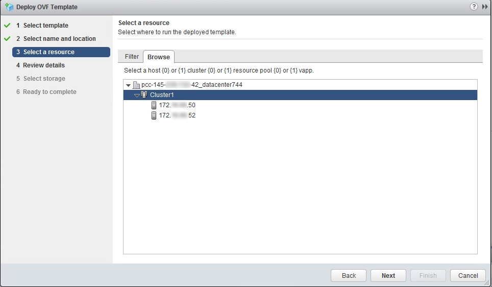

**Ostatnia aktualizacja dnia 18-11-2020**

## Wprowadzenie

OVH oferuje szablony Windows i SQL Server (w formacie OVF), które możesz wdrożyć bezpośrednio przy użyciu grubego klienta vSphere (wersja 5.5 i 6.0) oraz klienta sieciowego (flash i HTML 5 wersja 6.5).

**Niniejszy przewodnik wyjaśnia, gdzie znajdują się pliki źródłowe i jak przeprowadzić proces instalacji.**

> [!primary]
> 
> Ceny obrazów systemów oferowanych przez OVHcloud znajdziesz na [stronie WWW](https://www.ovhcloud.com/pl/managed-bare-metal/options/){.external}.
>

## Wymagania początkowe

- Dostęp do klienta sieciowego lub do grubego klienta w zależności od używanej wersji
- [Aktywowanie licencji Windows](../manager-ovhcloud/#licencja-windows) w [Panelu klienta OVHcloud](https://www.ovh.com/auth/?action=gotomanager&from=https://www.ovh.pl/&ovhSubsidiary=pl){.external} (zakładka `Licencje Windows`{.action} w odpowiednim centrum danych) 

## W praktyce

### Uzyskaj URL szablonu OVF

Otwórz przeglądarkę internetową i przejdź do strony głównej Managed Bare Metal, następnie kliknij `OVH Template`{.action}.

{.thumbnail}

Strona `OVH Templates` zawiera listę dostępnych szablonów Windows i SQL. 

Wybierz żądany szablon. Pojawi się okno z linkami, których możesz użyć do instalacji szablonu w zależności od Twojej wersji vSphere.

{.thumbnail}

### Instalacja VM z szablonu OVF

Po połączeniu się z klientem sieciowym vSphere przejdź do strony `Hosty i klastry`{.action}, kliknij prawym przyciskiem myszy odpowiednie centrum danych, a następnie kliknij `Wdrożenie szablonu OVF...`{.action}:

{.thumbnail}

Otworzy się menu kontekstowe i będziesz mógł rozpocząć konfigurację wirtualnej maszyny na bazie szablonu. W pierwszym kroku dodaj link, który uzyskałeś wcześniej.

{.thumbnail}

Teraz wybierz centrum danych.

{.thumbnail}

Następnie wybierz klaster, w którym wirtualna maszyna zostanie zainstalowana:

{.thumbnail}

Zostaną wyświetlone informacje dotyczące szablonu, w tym domyślne hasło. Ze względów bezpieczeństwa zmień hasło po pierwszym logowaniu:

{.thumbnail}

Wybierz przestrzeń dyskową, na której przechowywana będzie wirtualna maszyna i określ format dysku:

{.thumbnail}

Wybierz sieć, której chcesz użyć.

{.thumbnail}

Konfiguracja jest prawie ukończona. Zapoznaj się z jej podsumowaniem:

{.thumbnail}

Kliknij przycisk `Zakończ`{.action}. Zostanie utworzone zadanie umożliwiające śledzenie postępu procesu:

{.thumbnail}

Po zakończeniu procesu możesz zamknąć okno.

Nowo uruchomiona maszyna wirtualna znajduje się teraz w Twoim katalogu.

{.thumbnail}

## Sprawdź również

Przyłącz się do społeczności naszych użytkowników na stronie <https://community.ovh.com/en/>.