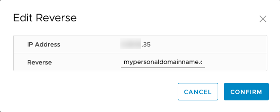

**Stand 18.11.2020**

## Einleitung

Das OVHcloud Network Plugin wurde entwickelt,  um alle IP-Adressen effizient zu verwalten, die mit Ihrer Managed Bare Metal Lösung verbunden sind.

**In dieser Anleitung erfahren Sie, wie Sie das OVHcloud Network Plugin für Ihre Managed Bare Metal Lösung verwenden.**

## Voraussetzungen

- Sie nutzen ein Angebot der Art [Managed Bare Metal](https://www.ovhcloud.com/de/managed-bare-metal/){.external}.
- Sie sind in Ihrem [OVHcloud Kundencenter](https://www.ovh.com/auth/?action=gotomanager&from=https://www.ovh.de/&ovhSubsidiary=de) angemeldet.
- Sie haben einen mit Ihrer Managed Bare Metal verbundenen IP-Block.
- Sie haben Zugang zum vSphere Interface.

## Praktische Anwendung

Wenn Sie mit dem vSphere Interface verbunden sind, wählen Sie im Menü links Ihr Rechenzentrum aus. Gehen Sie auf den Reiter `Configure`{.action} und klicken Sie dann unter “OVHcloud” auf `Network`{.action}. Es erscheint “Network summary”.

{.thumbnail}

Hier sehen Sie Ihre IP-Blöcke und einige grundlegende Informationen zu ihnen. Klicken Sie auf einen IP-Block, um alle seine IP-Adressen in einer Tabelle zu sehen.

{.thumbnail}

Hier können Sie das Ziel jeder Adresse und ihre “Reverse-IP” überprüfen. Einige Adressen werden als “Reserved” markiert sein. Achten Sie darauf,  **nicht die fünf IP-Adressen zu verwenden, die für die Konfiguration des Blocks und die Hochverfügbarkeit reserviert sind**. Diese sind:

- die erste IP, die Ihren Block auf dem Router anzeigt;
- die letzte IP, die für Broadcast verwendet wird;
- die vorletzte IP, die für Ihr Gateway verwendet wird;
- die beiden IPs vor dem Gateway, die auf den Routern als HSRP (Hot Standby Router Protocol) verwendet werden.

> [!warning]
> Bei manchen Konfigurationen mit virtueller Firewall ist es nicht möglich, MAC-Adressen zurückzuverfolgen, wenn das ARP-Protokoll nicht zugelassen ist.
>

Sie können nun die “Reverse-IP” Ihrer IP-Adresse in dieser Tabelle individuell festlegen (z.B., wenn Sie einen Mailserver konfigurieren). Klicken Sie links neben der IP auf die drei vertikalen Punkte und dann auf `Edit Reverse`{.action}.

{.thumbnail}

Geben Sie die “Reverse-IP” ein und klicken Sie auf `Confirm`{.action}.

Die neue “Reverse-IP” wird dann in der Tabelle angezeigt.

> [!primary]
>
> Diese Konfiguration können Sie auch in Ihrem [OVHcloud Kundencenter](https://www.ovh.com/auth/?action=gotomanager&from=https://www.ovh.de/&ovhSubsidiary=de) vornehmen. 
> 

## Weiterführende Informationen

Für den Austausch mit unserer User-Community gehen Sie auf [https://community.ovh.com/en/](https://community.ovh.com/en/){.external}.
