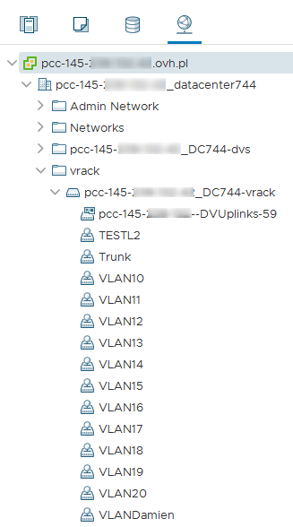

> [!primary]
> Tłumaczenie zostało wygenerowane automatycznie przez system naszego partnera SYSTRAN. W niektórych przypadkach mogą wystąpić nieprecyzyjne sformułowania, na przykład w tłumaczeniu nazw przycisków lub szczegółów technicznych. W przypadku jakichkolwiek wątpliwości zalecamy zapoznanie się z angielską/francuską wersją przewodnika. Jeśli chcesz przyczynić się do ulepszenia tłumaczenia, kliknij przycisk “Zaproponuj zmianę” na tej stronie.
> 

**Ostatnia aktualizacja z dnia 05-11-2020**

## Wprowadzenie

vRack umożliwia podłączenie różnych usług cloud OVHcloud w ramach jednej lub kilku zabezpieczonych prywatnych sieci (VLAN).

**Niniejszy przewodnik wyjaśnia, jak go uruchomić**

## W praktyce

### Panel klienta

Podczas dostarczania usługi [Managed Bare Metal](https://www.ovhcloud.com/pl/managed-bare-metal/) część *datacenter* jest już w sieci vRack.

{.thumbnail}

Możesz przenieść *centrum danych* usługi Managed Bare Metal do innego rozwiązania vRack klikając na przycisk `Przenieś`{.action}

### Klient vSphere

W panelu klienta vSphere możesz odnaleźć kompatybilne sieci *VLANs* vRack w rozproszonym wirtualnym switchu (vds), który znajduje się w katalogu **vrack**.

> [!success]
>
> OVHcloud dostarcza domyślnie infrastrukturę z 11 sieciami VLAN (VLAN10-VLAN20).
>

{.thumbnail}

Możesz zmienić lub utworzyć nowe parametry, postępując zgodnie z instrukcjami dotyczącymi [tworzenia sieci VLAN](../tworzenie-vlan/).

Następnie będziesz mógł przypisać te *grupy* serwerów do interfejsów sieciowych Twoich wirtualnych maszyn.

## Sprawdź również

Dołącz do społeczności naszych użytkowników na stronie <https://community.ovh.com/en/>.