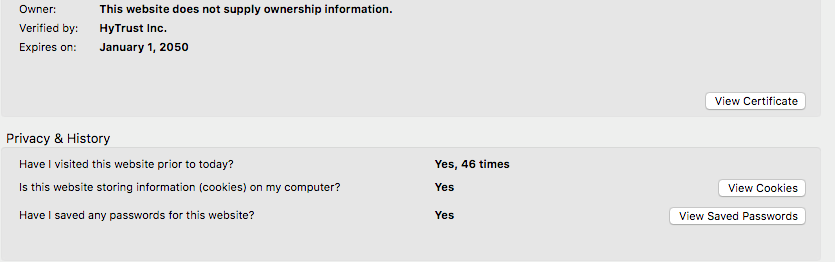
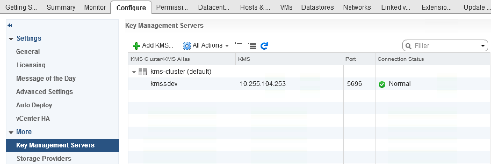

**Stand 18.11.2020**

## Einleitung

Die vorliegende Anleitung erklärt die Vorgehensweise zur Einrichtung von VM Encryption auf der OVHcloud Managed Bare Metal. Hierzu wird eine Storage-Strategie verfolgt, bei der ein externer *Key Management Server* (KMS) verwendet wird.

**In dieser Anleitung erfahren Sie, wie Sie die VMware-Funktion zur Verschlüsselung Ihrer virtuellen Maschinen einrichten.**

## Voraussetzungen

- Sie haben ein [Managed Bare Metal](https://www.ovhcloud.com/de/managed-bare-metal/){.external} Angebot abonniert.
- Sie verfügen über einen externen Key Management Server (KMS), der **[KMIP](https://en.wikipedia.org/wiki/Key_Management_Interoperability_Protocol_(KMIP)){.external}-1.1**-konform ist und in der [Kompatibilitätsmatrix](https://www.vmware.com/resources/compatibility/search.php?deviceCategory=kms&details=1&feature=293&page=1&display_interval=500&sortColumn=Partner&sortOrder=Asc){.external} von VMware aufgeführt wird.
- Sie haben Zugriff auf das vSphere-Verwaltungsinterface.
- Sie verfügen über virtuelle Maschinen mit Hardware-Version 13 oder höher.

## Beschreibung

### Zertifikat-Thumbprint des Key Management Servers (KMS) abrufen

Je nach verwendetem KMS können Sie sich über den Browser auf Ihrem Server einloggen. Klicken Sie anschließend auf `View Certificate`{.action} und dann auf `Thumbprint`{.action}.

{.thumbnail}

{.thumbnail}

Extrahieren Sie den Wert aus der Zeile `SHA1 Fingerprint`.

Alternative Vorgehensweise mit OpenSSL:

```shell
openssl s_client -connect 192.0.2.1:5696 < /dev/null 2>/dev/null | openssl x509 -fingerprint -noout -in /dev/stdin
```

Hier ist es der Wert rechts neben dem Gleichheitszeichen:


```shell
> SHA1 Fingerprint=7B:D9:46:BE:0C:1E:B0:27:CE:33:B5:2E:22:0F:00:84:F9:18:C6:61
```

### Key Management Server (KMS) registrieren

#### Über das OVHcloud Kundencenter

Begeben Sie sich in Ihrem Kundencenter in den Bereich `Bare Metal Cloud`. Klicken Sie im linken Menü auf `Managed Bare Metal`{.action} und wählen Sie den betreffenden Managed Bare Metal Dienst aus.

Klicken Sie auf der Hauptseite des Dienstes auf `Sicherheit`{.action}.

{.thumbnail}

Weiter unten auf der Seite finden Sie den Abschnitt “**Virtual Machine Encryption Key Management Servers**”. Klicken Sie auf den Button `Neuen KMS-Server hinzufügen`{.action}.

{.thumbnail}

Geben Sie im daraufhin geöffneten Fenster folgende Informationen ein:

* die IP-Adresse des KMS
* den zuvor abgerufenen SSL Thumbprint des KMS

Bestätigen Sie, dass Sie die zugehörige Dokumentation gelesen haben, und bestätigen Sie anschließend den Vorgang, indem Sie auf `Weiter`{.action} klicken. 

{.thumbnail}

Im nächsten Fenster wird der Prozessfortschritt angezeigt.

#### Über die OVHcloud API

Verschlüsselungsfunktionen können über die OVHcloud API aktiviert werden.

Um Ihren “serviceName” abzurufen, verwenden Sie folgenden API-Aufruf:

> [!api]
>
> @api {GET} /dedicatedCloud
>

Um zu überprüfen, dass die Verschlüsselung noch nicht aktiviert ist, verwenden Sie diesen API-Aufruf:

> [!api]
>
> @api {GET} /dedicatedCloud/{serviceName}/vmEncryption
>

```shell
>     "state": "disabled"
```


Registrieren Sie anschließend Ihren KMS:

> [!api]
>
> @api {POST} /dedicatedCloud/{serviceName}/kms
>

Hierzu benötigen Sie folgende Informationen:

* den zuvor abgerufenen “serviceName”
* die IP-Adresse des KMS
* den zuvor abgerufenen SSL Thumbprint des KMS

### Key Management Server (KMS) zum vCenter hinzufügen

#### Zu diesem Abschnitt

**Der vCenter-Server erstellt einen KMS-Cluster, wenn Sie Ihre erste KMS-Instanz hinzufügen.** 

- Wenn Sie den KMS hinzufügen, werden Sie aufgefordert, den Cluster als Standard festzulegen. Sie können diesen später anpassen. 
- Nachdem das vCenter den ersten Cluster erstellt hat, können Sie neue KMS-Instanzen desselben Anbieters hinzufügen. 
- Um den Cluster zu konfigurieren, benötigen Sie mindestens eine KMS-Instanz.
- Wenn Ihre Umgebung KMS-Lösungen von verschiedenen Anbietern verwendet, können Sie mehrere KMS-Cluster hinzufügen. 
- Wenn Ihre Umgebung mehrere KMS-Cluster beinhaltet und Sie den Standard-Cluster löschen, muss ein anderer Standard-Cluster festgelegt werden. Siehe “Festlegen des Standard-KMS-Clusters”.

#### Vorgehensweise

Loggen Sie sich zunächst über den vSphere Web Client auf Ihrer Managed Bare Metal ein. Durchsuchen Sie anschließend Ihre Inventarliste und wählen Sie das betreffende vCenter aus. Gehen Sie auf “Verwalten” und dann auf “Key Management Server”. Klicken Sie auf `KMS hinzufügen`{.action}, geben Sie die KMS-Informationen im neu geöffneten Assistenten ein und klicken Sie anschließend auf `OK`{.action}.
Bestätigen Sie das Zertifikat, indem Sie auf `Trust`{.action} klicken.

{.thumbnail}

Wählen Sie die folgenden Optionen aus:

|Name der Option|Beschreibung|
|---|---|
|“KMS-Cluster”|Wählen Sie “Neuen Cluster erstellen” aus, um einen neuen Cluster zu erhalten. Wenn bereits ein Cluster vorhanden ist, können Sie diesen auswählen.|
|“Clustername”|Name des KMS-Clusters. Dieser Name kann für den Login auf Ihrem KMS erforderlich sein, wenn Ihr vCenter nicht verfügbar ist. Es ist sehr wichtig, dass der Name des Clusters einzigartig und für dieses Element repräsentativ ist.|
|“Serveralias”|Alias für den KMS. Dieser Alias kann für den Login auf Ihrem KMS erforderlich sein, wenn Ihr vCenter nicht verfügbar ist.|
|“Serveradresse”|IP-Adresse oder FQDN des KMS.|
|“Serverport”|Port, an dem sich vCenter mit dem KMS verbindet. Der Standard-KMIP-Port ist 5696. Dieser kann abweichen, wenn der KMS eines anderen Anbieters auf einem bestimmten Port konfiguriert ist.|
|“Proxy-Adresse”|Lassen Sie dieses Feld leer.|
|“Proxyport”|Lassen Sie dieses Feld leer.|
|“Benutzername”|Einige KMS-Anbieter erlauben, dass Benutzer Verschlüsselungsschlüssel isolieren, die von verschiedenen Benutzern oder Gruppen verwendet werden, indem sie einen Benutzernamen und ein Passwort angeben. Geben Sie nur dann einen Benutzernamen an, wenn Ihr KMS diese Funktion unterstützt und Sie beabsichtigen, sie zu verwenden.|
|“Kennwort”|Einige KMS-Anbieter erlauben, dass Benutzer Verschlüsselungsschlüssel isolieren, die von verschiedenen Benutzern oder Gruppen verwendet werden, indem sie einen Benutzernamen und ein Passwort angeben. Geben Sie nur dann ein Passwort an, wenn Ihr KMS diese Funktion unterstützt und Sie beabsichtigen, sie zu verwenden.|


#### KMS-Zertifikat importieren

Die meisten KMS-Anbieter benötigen ein Zertifikat, um [eine sichere Verbindung mit dem vCenter herzustellen](https://docs.vmware.com/de/VMware-vSphere/6.5/com.vmware.vsphere.security.doc/GUID-0212CEF2-7871-4E00-ADF2-0C71401D5E1A.html){.external}.

Wählen Sie über das vCenter, in das Sie den KMS hinzugefügt haben, ebendiesen KMS aus. Klicken Sie im Bereich “Alle Optionen” auf “`Vertrauenswürdige Verbindung mit KMS einrichten`{.action}”

> [!warning]
>
> Stellen Sie sicher, dass das Zertifikat nicht mit einem Passwort verschlüsselt ist, wenn Sie es über den KMS herunterladen. Wenn Sie zum Beispiel einen Benutzer erstellen, erstellen Sie diesen ohne Passwort und laden Sie das Zertifikat für den KMS-Benutzer herunter.
> 

{.thumbnail}

#### Überprüfen, dass der KMS konfiguriert ist

Stellen Sie sicher, dass der zum KMS gehörige “**Connection Status**” als “Normal” eingestellt ist.

{.thumbnail}

#### Speicherrichtlinien von “VM Encryption Storage” bearbeiten

Erstellen Sie eine virtuelle Maschine. Wenn diese fertig erstellt ist, klicken Sie mit der rechten Maustaste auf sie. Klicken Sie anschließend auf `VM Policies`{.action} und dann auf `Edit VM Storage Policies`{.action}.

{.thumbnail}

Wählen Sie die Dateien der virtuellen Maschine sowie anderer Festplatten aus, die verschlüsselt werden sollen.

{.thumbnail}

Überprüfen Sie, dass die Tasks fehlerfrei abgeschlossen wurden.

> [!primary]
>
> Wenn der KMS nicht korrekt konfiguriert ist und es beim Schlüsselaustausch zwischen vCenter und KMS zu Problemen kommt, wird im Task ein “RuntimeFault”-Fehler mit der Fehlermeldung “Cannot generate key” angezeigt.
>

#### Verschlüsseltes vMotion

Was vMotion betrifft, erfolgt die Verschlüsselung auf Ebene der virtuellen Maschine. Für die Synchronisierung werden 256-Bit-Verschlüsselungsschlüssel verwendet.

Die Verschlüsselung des vMotion-Traffics geschieht auf Ebene des Kernels der virtuellen Maschine mit dem häufig verwendeten AES-GCM- (Advanced Encryption Standard-Galois Counter Mode) Algorithmus.

Bearbeiten Sie die virtuelle Maschine und klicken Sie auf `VM Options`{.action}.

Die Optionen müssen speziell ausgewählt werden, wenn vMotion verschlüsselt werden soll. Für ein verschlüsseltes vMotion gibt es drei mögliche Richtlinien:

|Status|Beschreibung|
|---|---|
|Disabled|Aus.|
|Opportunistic|Nur verschlüsselt, wenn dies vom Quell-Host und ESXi-Ziel-Host unterstützt wird. Ist das nicht der Fall, wird vMotion nicht verschlüsselt.|
|Required|Verschlüsselung wird verwendet.|

{.thumbnail}

Die Übertragung von Maschinen zwischen den Hosts geschieht über den Austausch einzigartiger Schlüssel, die über den vCenter-Server und nicht über den KMS generiert und bedient werden.

#### Konfiguration überprüfen

{.thumbnail}

{.thumbnail}

{.thumbnail}

## Weiterführende Informationen

Für den Austausch mit unserer User Community gehen Sie auf <https://community.ovh.com/en/>.
