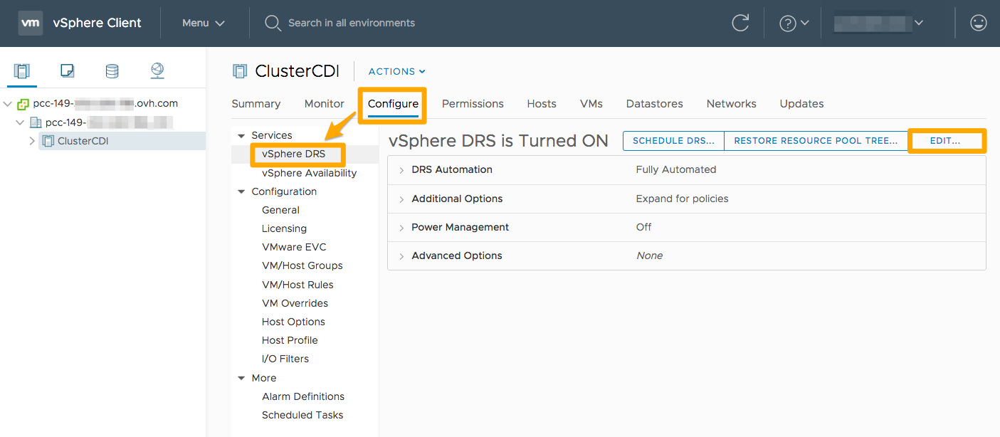
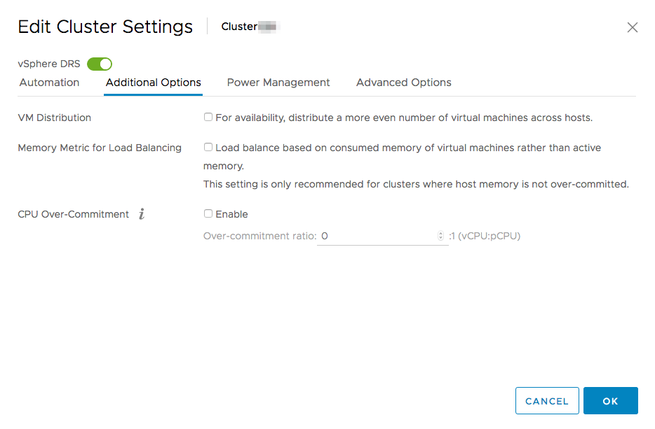

**Ostatnia aktualizacja z dnia 18-11-2020**

## Wprowadzenie

Funkcja **DRS** (Distributed Ressource Scheduler), dostępna w klastrze **VMware**, umożliwia równoważenie obciążenia hostów dzięki automatycznemu migrowaniu maszyn wirtualnych (vMotion). Pozwala ona przydzielać maszyny wirtualne do różnych hostów w klastrze w zależności od ich użycia i dostępnych zasobów.

**Z tego przewodnika dowiesz się, jak skonfigurować tę funkcję**

## Wymagania początkowe

- Posiadanie usługi [Managed Bare Metal](https://www.ovhcloud.com/pl/managed-bare-metal/){.external}
- Dostęp do [interfejsu vSphere](../polaczenie-interfejs-vsphere/)

## W praktyce

Funkcja **DRS**, której zadaniem jest optymalne rozdzielenie zasobów, przeprowadzi (lub zaleci użytkownikowi) przeniesienie maszyn wirtualnych na host lub pulę (bardziej odpowiednia opcja) w ramach Twojego klastra.

{.thumbnail}

### Aktywacja

Funkcja DRS jest domyślnie aktywowana w klastrze podstawowym, który OVHcloud dostarcza razem z usługą Managed Bare Metal.

Funkcję DRS możesz też aktywować podczas tworzenia nowego klastra lub później.

Jeśli funkcja DRS nie jest aktywna w klastrze, wybierz ją, a następnie przejdź do karty `Konfiguruj`{.action}.

Kliknij menu `Usługi`{.action} i wybierz podmenu `vSphere DRS`{.action}.

Kliknij `Edytuj`{.action} i przesuń przycisk `vSphere DRS`, aby włączyć funkcję DRS.

{.thumbnail}

### Parametry 

W tym samym oknie edycji ustawień znajdziesz cztery kategorie opcji.

#### Automatyzacja

Dostępne są trzy różne poziomy automatyzacji:

- W trybie “Ręcznym” funkcja DRS nie przeniesie maszyn wirtualnych, użytkownik musi samodzielnie zarządzać przemieszczaniem i przydzielaniem maszyn wirtualnych.

- W trybie “Częściowo automatycznym” funkcja DRS zaleci przeprowadzenie migracji maszyn wirtualnych, ale nie wykona ich, jeśli użytkownik nie zatwierdzi operacji.

- W trybie “Całkowicie automatycznym” funkcja DRS automatycznie przeniesie maszyny wirtualne bez zatwierdzenia przez użytkownika, w zależności od obciążenia hostów.

Możliwe jest również określenie mniej lub bardziej agresywnego progu migracji w trybach automatycznych.

Opcja “Predictive DRS”, dostępna od wersji 6.5 narzędzia VMware, umożliwia przeprowadzanie migracji w zależności od prognoz przesłanych przez vRops,
który jest zatem niezbędny dla działania tej opcji DRS.

Opcja “Automatyzacja maszyny wirtualnej” umożliwia skonfigurowanie konkretnych ustawień DRS dla niektórych maszyn wirtualnych w podmenu `Wyjątków dla maszyny wirtualnej` w karcie `Konfiguruj`. (Niektóre maszyny wirtualne mogą być w częściowo automatycznym trybie migracji, mimo że klaster jest w trybie całkowicie automatycznym).

{.thumbnail}

#### Dodatkowe opcje

W ustawieniach DRS możesz skonfigurować trzy dodatkowe opcje:

- Dystrybucja maszyn wirtualnych: aby zapewnić dostępność, rozdziel jeszcze bardziej równomiernie maszyny wirtualne pomiędzy hostami. 

- Mierniki pamięci dla równoważenia obciążenia: równoważenie obciążenia w oparciu o pamięć zużytą przez maszyny wirtualne, a nie pamięć aktywną.
To ustawienie jest zalecane tylko dla klastrów, w których pamięć hosta nie jest przeciążona. 

- Przeciążenie CPU: ograniczenie przeciążenia CPU dla wszystkich hostów klastra. To ustawienie spowoduje utworzenie wirtualnego CPU na podstawie głównego współczynnika ilości dla fizycznego CPU (vCPU:pCPU) ustawionego dla każdego hosta ESXi. 

{.thumbnail}

#### Zarządzanie zasilaniem

**Ta opcja powinna zawsze być wyłączona.**

Jej głównym celem jest wyłączenie hostów w Twojej infrastrukturze, jeśli DRS uzna, że nie są one potrzebne do działania, zachowując jednocześnie wymagany przez HA poziom przełączenia awaryjnego.
Monitoring w OVHcloud wykryje to wyłączenie jako nietypowe i wygeneruje interwencję w centrum danych.

#### Zaawansowane opcje

W klastrze DRS można użyć kilku parametrów konfiguracji zaawansowanej.

Oto kilka przykładów:

|Nazwa opcji zaawansowanej|Opis|Wartość domyślna|Najbardziej agresywna wartość|
|:---|:---|:---|:---|
|UseDownTime|Jeśli analiza kosztów powinna uwzględniać wpływ ewentualnych spadków wydajności pamięci na obciążenie pracą podczas migracji|1|0 (bez uwzględnienia wpływów)|
|IgnoreDownTimeLessThan|Próg (w sekundach) do zignorowania skumulowanych czasów spadków wydajności podczas migracji w analizie kosztów (może zostać zwiększony, jeśli obciążenie pracą maszyn wirtualnych nie jest wrażliwe na spadki wydajności pamięci podczas migracji)|1|Duża liczba (bez uwzględnienia czasów zatrzymania)|
|MinImbalance|Opcja używana do obliczania docelowej nierównowagi|50|0|
|MinGoodness|Minimalna poprawa nierównowagi w klastrze wymagana przy każdym przeniesieniu|Adaptacyjna|0 (wszystkie przesunięcia są brane pod uwagę)|
|MaxMovesPerHost|Maksymalna liczba przemieszczeń na host zalecana na jedno wywołanie|Adaptacyjna|0 (bez limitu)|

{.thumbnail}

### Reguły DRS

W karcie `Konfiguruj` można zarządzać regułami VM/hosta.

{.thumbnail}

- Zachować maszyny wirtualne razem: maszyny wirtualne znajdują się na jednym hoście.
- Rozdzielić maszyny wirtualne: maszyny wirtualne są rozdzielone na oddzielnych hostach w ramach jednego klastra.
- Maszyny wirtualne do hostów: maszyny wirtualne należące do grupy VM danego klastra muszą działać w określonej grupie hosta. W karcie `Grupy VM/Host` trzeba utworzyć grupy maszyn wirtualnych i hostów.

Czwarta reguła — Maszyny wirtualne do maszyn wirtualnych — została wyjaśniona w przewodniku dotyczącym [funkcji HA](../vmware-ha-high-availability/).

{.thumbnail}

## Sprawdź również

Dołącz do społeczności naszych użytkowników na stronie <https://community.ovh.com/en/>.
