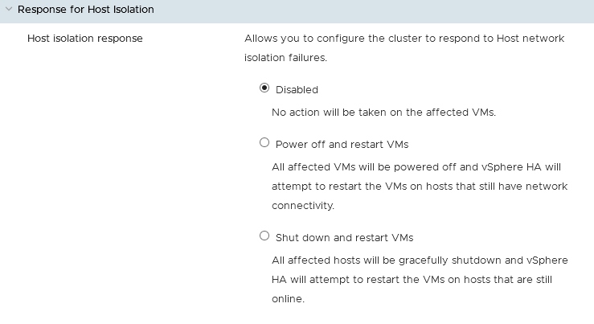

**Stand 18.11.2020**

## Einleitung

Die Hauptfunktion von **VMware HA** (High Availability) ist, virtuelle Maschinen im Falle einer Hardwarestörung auf einem anderen Host des Clusters neu zu starten. Darüber hinaus ermöglicht **HA** die Überwachung von VMs und Anwendungen.

{.thumbnail}

**In dieser Anleitung erfahren Sie, wie Sie diese Funktion konfigurieren.**

## Voraussetzungen

- Sie sind auf Ihrem [vSphere Interface](../den_vsphere_client_installieren/) eingeloggt.
- Sie verfügen über ein [Managed Bare Metal](https://www.ovhcloud.com/de/managed-bare-metal/){.external} Produkt.

## Beschreibung

### Aktivierung

HA ist standardmäßig im Basis-Cluster, das Ihnen OVHcloud bei Lieferung Ihrer Managed Bare Metal bereitstellt, aktiviert.

Wird ein neues Cluster erstellt, können Sie HA direkt bei Erstellen des Clusters oder auch im Nachhinein aktivieren.

Wenn HA in Ihrem Cluster nicht aktiviert ist, gehen Sie in den Tab `Konfigurieren` Ihres Clusters und dann im Bereich `Services` in den Tab `vSphere Availability`.

Klicken Sie auf `Bearbeiten`{.action} und setzen Sie einen Haken, um die HA-Funktion zu aktivieren.

Außerdem ist wichtig, dass Sie das Monitoring des Hosts aktivieren. Mit dieser Einstellung können Taktsignale zwischen den ESXi-Hosts gesendet werden, um eine mögliche Störung zu ermitteln.
Diese Funktion muss wieder deaktiviert werden, um zum Beispiel Aktualisierungen über den Update Manager durchzuführen. In diesem Fall wird der Host isoliert.

{.thumbnail}

### Einstellungen

#### Fehler und Reaktionen

Diese erste Kategorie erlaubt das Festlegen der Neustarteinstellungen für VMs im Falle verschiedener möglicher Fehler.

##### Reagieren auf Hostfehler

Diese Kategorie legt die Neustarteinstellungen Ihrer VMs im Falle eines Hostausfalls fest.

So können Sie bestimmen, ob Ihre virtuellen Maschinen automatisch neu gestartet werden oder nicht.
Eine standardmäßige Neustartverwaltung für das Cluster ist ebenfalls möglich. Sie können dies für jede virtuelle Maschine im Tab `VM-Außerkraftsetzungen` genauer einstellen.

Darüber hinaus können Sie eine andere Bedingung als die standardmäßige Einstellung (Zugeteilte Ressourcen) auswählen, die vSphere HA vor Ausführen des Neustarts überprüfen wird.

{.thumbnail}

##### Reaktion bei Hostisolierung

Diese Kategorie erlaubt es Ihnen, die Aktionen festzulegen, die bei Verlust der Netzwerkkonnektivität eines Hosts durchzuführen sind.

Sie können auswählen aus: 

- Nichts tun.
- Die virtuellen Maschinen herunterfahren und versuchen, diese auf einem anderen verfügbaren Host neu zu starten.
- Den betroffenen Host ausschalten und versuchen, die virtuellen Maschinen auf einem anderen verfügbaren Host neu zu starten.

{.thumbnail}

##### Datenspeicher mit PDL

Wenn ein Datenspeicher mit PDL-Status (permanent device loss) ausfällt, können Sie hier festlegen, welche Aktionen ausgeführt werden sollen:

- Nichts tun.
- Nichts tun, aber Event-Logs erstellen.
- Virtuelle Maschinen herunterfahren und versuchen, diese auf Hosts neu zu starten, die noch über Konnektivität zum Datenspeicher verfügen.

{.thumbnail}

##### Datenspeicher mit APD

Wenn ein Datenspeicher mit APD-Status (all paths down) ausfällt, können Sie hier festlegen, welche Aktionen ausgeführt werden sollen:

- Nichts tun.
- Nichts tun, aber Event-Logs erstellen.
- Virtuelle Maschinen herunterfahren und versuchen, diese neu zu starten.

{.thumbnail}

##### VM-Überwachung

Das Monitoring für virtuelle Maschinen ist nach Installation der [VMware Tools](../wie_installiere_ich_die_vmware_tools/) verfügbar.
Bei Nichtverfügbarkeit über die **Tools** (Taktsignale) wird die virtuelle Maschine automatisch neu gestartet. Was diese Funktion betrifft, sind auch erweiterte Einstellungen möglich (zum Beispiel Neustartintervalle).

{.thumbnail}

#### Zugangssteuerung

vSphere HA nutzt die Zugangssteuerung, um sicherzustellen, dass ausreichend Ressourcen für die Wiederherstellung virtueller Maschinen im Falle eines Hostfehlers reserviert sind.

Die Zugangssteuerung legt Einschränkungen für die Ressourcenverwendung fest. Aktionen, die gegen diese Einschränkungen verstoßen könnten, sind nicht zulässig. Unter anderem sind folgende Aktionen möglicherweise nicht zulässig:

- Anschalten einer virtuellen Maschine
- Migration einer virtuellen Maschine
- Erhöhen der CPU- oder Arbeitsspeicherreservierung einer virtuellen Maschine

Grundlage der Zugangssteuerung von vSphere HA ist die Anzahl der Hostfehler, die das Cluster tolerieren darf, während die Failover-Funktion weiterhin gewährleistet bleibt. Die Failover-Kapazität der Hosts kann auf drei verschiedene Arten definiert werden:

- [Prozentsatz der Clusterressourcen](https://docs.vmware.com/de/VMware-vSphere/6.7/com.vmware.vsphere.avail.doc/GUID-FAFEFEFF-56F7-4CDF-A682-FC3C62A29A95.html){.external-link}

- [Richtlinie für die Steckplatzgröße](https://docs.vmware.com/de/VMware-vSphere/6.5/com.vmware.vsphere.avail.doc/GUID-85D9737E-769C-40B6-AB73-F58DA1A451F0.html){.external-link}

- [dedizierte Failover-Hosts](https://docs.vmware.com/de/VMware-vSphere/6.5/com.vmware.vsphere.avail.doc/GUID-C4F5F9EE-4235-4151-BEBE-FCB2A752407B.html){.external-link}

#### Taktsignal-Datenspeicher

Wenn der Master-Host in einem HA-Cluster nicht über das Verwaltungsnetzwerk mit einem untergeordneten Host kommunizieren kann, verwendet der Master-Host Datenspeicher-Taktsignale, um festzustellen, ob der untergeordnete Host ausgefallen ist, sich in einer Netzwerkpartition befindet oder vom Netzwerk isoliert ist.

#### Erweiterte Optionen

Sie können mehrere erweiterte Konfigurationseinstellungen in Ihrem Cluster verwenden.

Die Einstellungen finden Sie auf [dieser Seite](https://docs.vmware.com/de/VMware-vSphere/6.5/com.vmware.vsphere.avail.doc/GUID-E0161CB5-BD3F-425F-A7E0-BF83B005FECA.html){.external-link}.

### HA-Regel

Im Bereich `Konfiguration` im Tab `VM/Host-Regeln` können Sie eine Regel des Typs “Virtuelle Maschinen zu virtuelle Maschinen” erstellen.

Diese fügt eine Neustartbedingung hinzu, um sicherzustellen, dass alle virtuellen Maschinen einer ersten Gruppe vor den VMs einer zweiten Gruppe gestartet werden.

Diese Regel kann gut zu den im Tab `VM-Außerkraftsetzungen` einstellbaren Neustartprioritäten hinzugefügt werden.

## Weiterführende Informationen

Für den Austausch mit unserer User Community gehen Sie auf <https://community.ovh.com/en/>.
