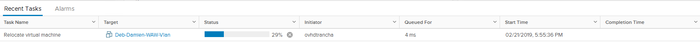

**Stand 18.11.2020**

## Einleitung

Mit **Storage vMotion** können Sie den Speicherort der Dateien auf der virtuellen Maschine ändern, ohne sie abzuschalten. Die virtuelle Maschine kann auf einmal oder Festplatte um Festplatte verlagert werden.

**Vorliegende Anleitung führt Sie durch diese Operation.**

## Praktische Anwendung

### Die Festplatte einer virtuellen Maschine verlagern 

Um Dateien von einer virtuellen Maschine auf einen anderen Speicher zu verlagern müssen Sie nur mit der rechten Maustaste auf die laufende virtuelle Maschine klicken. Wählen Sie dann das Menü `Migrate...`.

{.thumbnail}

### Wahl des vMotion-Typs

Das Menu bietet mehrere Optionen für  **vMotion**. In unserem Beispiel möchten wir nur die virtuelle Maschine in eine andere Datenbank verlagern. Daher wählen wir “Change storage only”.

Mit der Option “Change compute resource only” wird die virtuelle Maschine auf einen anderen Host verlagert.  

Diese Aktion wird **vMotion** genannt und in [dieser Anleitung beschrieben](../vmware-vmotion-neu/).

{.thumbnail}

### Wahl des Datastores

Wählen Sie aus, auf welchen Datenspeicher Sie die Daten verschieben möchten.

Bei dieser Aktion können Sie auch die Art der Speicherung verändern.

Sie können die bereits definierten Richtlinien zur Speicherung anwenden, wenn Sie die Option [VMencryption](../vm-encrypt/) nutzen.

{.thumbnail}

Wenn mehrere virtuelle Festplatten auf einer Maschine sind, können Sie auch nur eine Festplatte davon verlagern. Nutzen Sie dazu den Button `Configure per disk`{.action}.

Sie gelangen dann zu dieser Ansicht:

{.thumbnail}

### vMotion abschließen

Klicken Sie auf `Finish`{.action}, um den Migrationsprozess zu starten.

{.thumbnail}

### vMotion nachverfolgen

Aus den letzten Schritten können Sie den Stand der Migration ersehen. Je nach Größe der virtuellen Maschine, IO-Zugang und verwendeter Bandbreite nimmt diese mehr oder weniger Zeit in Anspruch.

{.thumbnail}

## Weiterführende Informationen

Für den Austausch mit unserer User Community gehen Sie auf <https://community.ovh.com/en/>.
