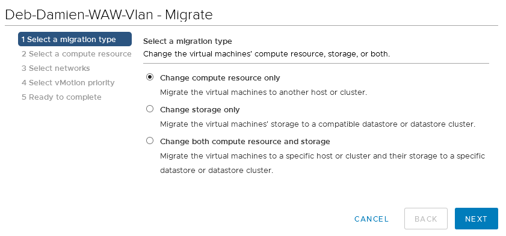
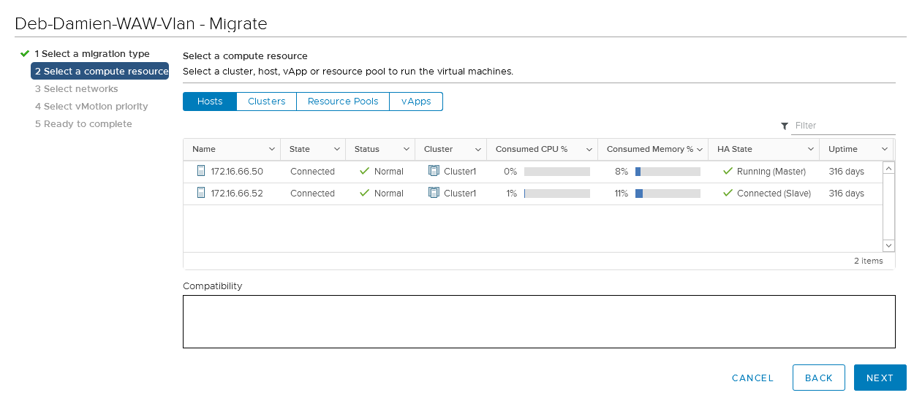
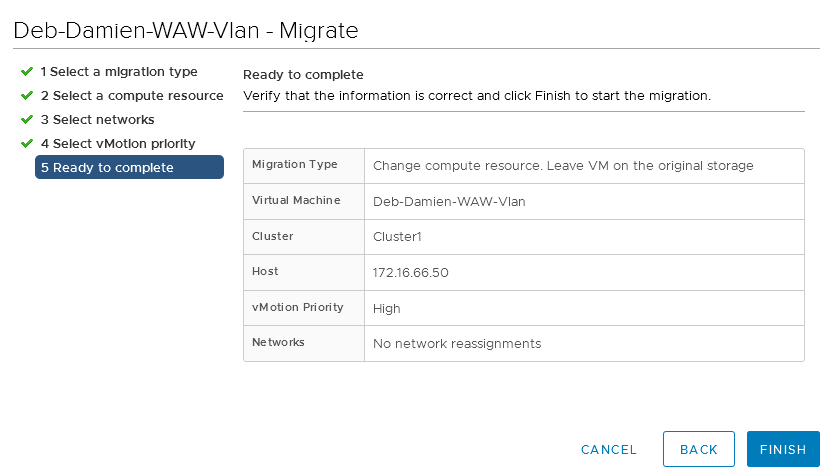
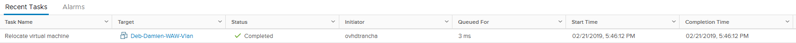

**Ostatnia aktualizacja z dnia 18-11-2020**

## Wprowadzenie

**vMotion** to operacja polegająca na przeniesieniu wirtualnej maszyny **bez jej wyłączania** na inny host lub przeniesieniu puli zasobów albo aplikacji Vapp w ramach tego samego **Klastra**.

**Ten przewodnik wyjaśnia, jak przeprowadzić tę operację**

## W praktyce

### Przeniesienie wirtualnej maszyny

Po otrzymaniu tokena w wiadomości SMS wprowadź go do bezpiecznego interfejsu, aby uruchomić oczekujące zadanie.
na inny zasób

Aby przenieść wirtualną maszynę na inny zasób, kliknij prawym przyciskiem myszy uruchomioną wirtualną maszynę i wybierz menu `Migracja...`{.action}. 

{.thumbnail}

## Wybór rodzaju vMotion

W menu znajdziesz kilka opcji vMotion. W naszym przykładzie opisujemy jedynie przypadek przeniesienia wirtualnej maszyny na innego hosta, dlatego wybieramy opcję "Zmień tylko zasób obliczeniowy".

Opcja “Zmień  tylko zasób obliczeniowy” pozwala przenieść wirtualną maszynę do innej bazy danych. Operacja ta, o nazwie**Storage vMotion**, opisana jest w [tym przewodniku](https://docs.ovh.com/gb/en/managed-bare-metal/vmware_storage_vmotion/).

{.thumbnail}

### Wybór zasobu

Wybierz zasób, do którego chcesz przenieść wirtualną maszynę. Możesz przenieść wirtualną maszynę na inny host, do innego klastera, ResourcePool lub Vapp.

W naszym przykładzie, przeniesiemy wirtualną maszynę na host .50.

{.thumbnail}

### Wybór sieci

Na tym etapie wybierz sieć przypisaną do wirtualnej maszyny. W naszym przykładzie pozostawiamy wirtualną  maszynę w jej oryginalnej sieci VLAN.

{.thumbnail}

### Wybór priorytetu

Zalecamy przeprowadzenie migracji z zastosowaniem wysokiego priorytetu. Aby to zrobić, wybierz "Zaplanuj vMotion z wysokim priorytetem".

{.thumbnail}

### Zakończenie operacji vMotion

Kliknij `Zakończ`{.action}, aby uruchomić proces migracji.

{.thumbnail}

## Śledzenie postępu vMotion

Możesz śledzić postęp migracji w ostatnich zadaniach. Migracja może zająć mniej lub więcej czasu, w zależności od przydzielonej pamięci RAM, obciążenia wirtualnej maszyny i wykorzystywanej przepustowości.

{.thumbnail}

## Sprawdź również

Przyłącz się do społeczności naszych użytkowników na stronie <https://community.ovh.com/en/>.
