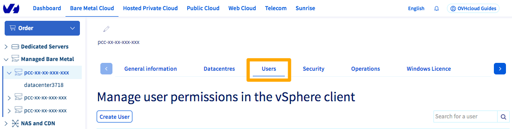

**Ostatnia aktualizacja z dnia 18-11-2020**

## Wprowadzenie

Możliwe jest powiązanie imienia, nazwiska, numeru telefonu i adresu e-mail z użytkownikiem vSphere Managed Bare Metal. Adres e-mail umożliwia w szczególności walidację przy użyciu tokenu.

**Dowiedz się, jak powiązać adres e-mail z użytkownikiem vSphere**

## Wymagania początkowe

- Wykupienie usługi [Managed Bare Metal](https://www.ovhcloud.com/pl/managed-bare-metal/).
- Dostęp do [Panelu klienta OVHcloud](https://www.ovh.com/auth/?action=gotomanager&from=https://www.ovh.pl/&ovhSubsidiary=pl).

## W praktyce

Zaloguj się do [Panelu klienta OVHcloud](https://www.ovh.com/auth/?action=gotomanager&from=https://www.ovh.pl/&ovhSubsidiary=pl) i przejdź do sekcji `Bare Metal Cloud`. Kliknij `Managed Bare Metal` na pasku usług po lewej stronie, po czym wybierz odpowiednią infrastrukturę.

{.thumbnail}

Przejdź do zakładki `Użytkownicy`{.action}, kliknij `...`{.action} po prawej stronie odpowiedniego użytkownika, po czym kliknij `Zmień`{.action} 

{.thumbnail}

Pojawi się następujące okno:

{.thumbnail}

Wpisz imię, nazwisko, numer telefonu i adres e-mail.

W tym oknie można również dodać prawa do edycji adresu **IP**, **Additional IP** oraz uprawnienie **Token validator** używane do zatwierdzania niektórych wrażliwych operacji na infrastrukturze z włączoną opcją **Advanced Security**.

Kliknij przycisk `Zatwierdź`{.action}, aby potwierdzić zmiany.

## Sprawdź również

Przyłącz się do społeczności naszych użytkowników na stronie [ https://community.ovh.com/en/](https://community.ovh.com/en/)
