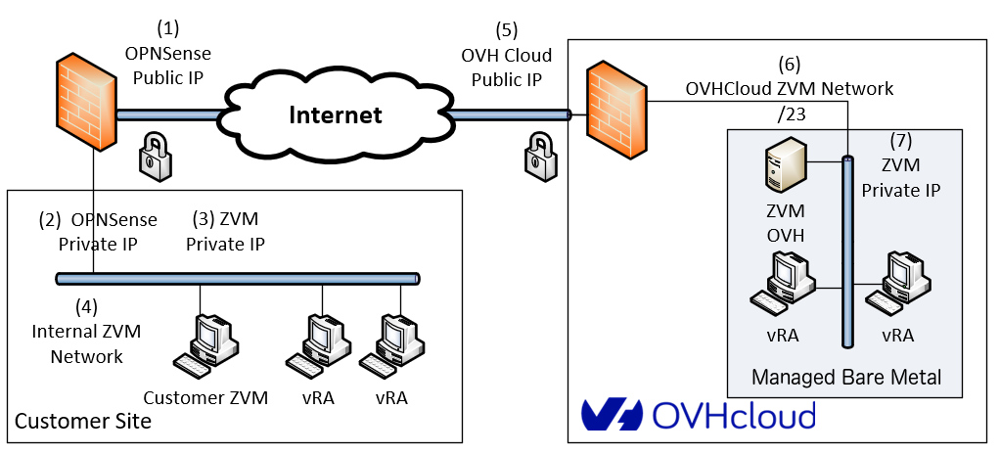
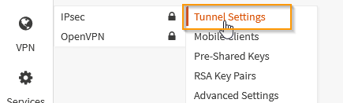
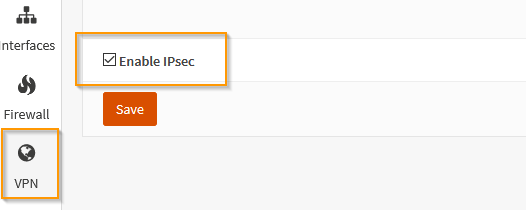
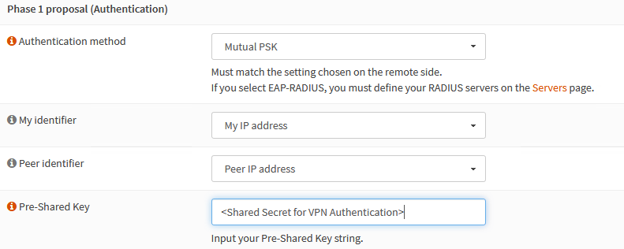
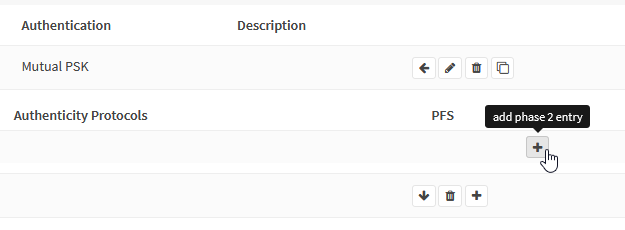
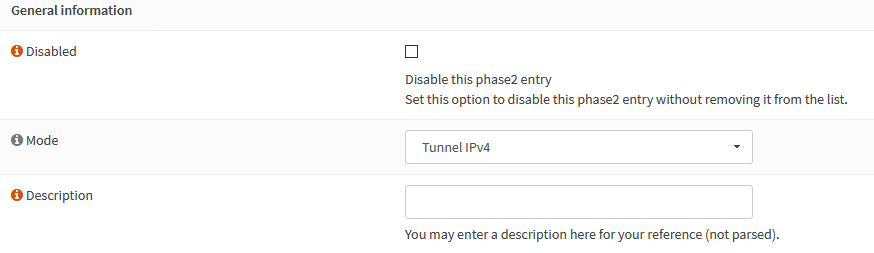
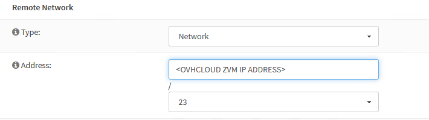

**Ostatnia aktualizacja z dnia 18-11-2020**

## Wprowadzenie:
Ten przewodnik ma na celu pomóc w skonfigurowaniu wirtualnej sieci prywatnej (VPN) w celu połączenia platformy lokalnej z infrastrukturą Managed Bare Metal OVHcloud i wdrożeniu rozwiązania do odzyskiwania danych po awarii
Zerto.
Dla zilustrowania realizacji wzajemnego połączenia wykorzystamy funkcje VPN w OPNSense, czyli platformie open source firewall/VPN.
Dla ułatwienia opiszemy najprostszą konfigurację, w której brama VPN ma połączenie w sieci Zerto Virtual Manager (ZVM). 

## Wymagania początkowe

- Docelowe PCC musi mieć co najmniej jeden publiczny adres IP dostępny dla punktu połączenia VPN.
- Lokalizacja klienta musi dysponować działającą instalacją Zerto.
- Maszyny replikacji Zerto (VRA: Virtual Réplication Appliance) po stronie klienta i po stronie OVHCloud muszą mieć możliwość wymiany informacji na portach TCP 4007 i 4008.
- Maszyny administracji Zerto (ZVM: Zerto Virtual Manager) po stronie klienta i po stronie OVHCloud muszą mieć możliwość wymiany informacji na portach TCP 9081.

## W praktyce

### Prezentacja architektury rozwiązania

{.thumbnail}

**Definicja parametrów architektury:**

Po stronie klienta:

- Publiczny adres punktu połączenia VPN (1)
- Wewnętrzny adres punktu połączenia VPN (2)
- Wewnętrzny adres ZVM (3)
- Plan adresowania sieci ZVM (4)

Po stronie OVHcloud:

- Publiczny adres punktu połączenia VPN (5)
- Plan adresowania sieci ZVM (6)
- Adres ZVM (7)

> [!primary]
>
>Musisz wybrać zakres sieci, w którym OVHcloud ma wdrożyć zdalną ZVM, by uniknąć konfliktu z Twoimi wewnętrznymi adresami. 
>
>Możesz po prostu zaakceptować domyślny zakres zaproponowany w interfejsie Panelu klienta, jeśli Ci odpowiada.
>

### Etap 1: aktywacja klienta Zerto w OVHcloud

Aktywację przeprowadza się prosty sposób w Panelu klienta OVHcloud. Najpierw wybierz centrum danych połączone z PCC, a następnie kliknij kartę `Plan odzyskiwania awaryjnego (DRP)`{.action}.

{.thumbnail}

Wybierz opcję `Między Twoją infrastrukturą i Managed Bare Metal OVH`{.action}, a następnie kliknij `Aktywuj Zerto DRP`{.action}.

{.thumbnail}

Wybierz dostępny publiczny adres z zaproponowanego zakresu.

{.thumbnail}

Następnie wprowadź żądany zakres sieci w celu wdrożenia ZVM.

{.thumbnail}

Następnie kliknij `Instaluj`{.action}.

{.thumbnail}

### Etap 2: aktywacja usługi IPSec

W konsoli OPNSense przejdź do menu `VPN`{.action} znajdującego się po lewej stronie, a następnie przejdź do rubryki `IPSec`{.action} i wybierz `Tunnel Setting`{.action}.

{.thumbnail}

Zaznacz pole `Enable IPsec`{.action}.

{.thumbnail}

Kliknij `Save`{.action}, aby zapisać.

### Etap 3: konfiguracja tunelu IPSec

Konfiguracja tunelu odbywa się przez uzupełnienie dwóch grup parametrów, nazywanych **Faza 1** i **Faza 2**.

#### 3.1 Dodawanie Fazy 1

W menu `VPN`{.action} przejdź do rubryki `Tunnel settings`{.action} i kliknij symbol `+`{.action} po prawej stronie ekranu.

{.thumbnail}

##### 3.1.1 Faza 1: dodawanie informacji ogólnych

{.thumbnail}

Możesz zachować wartości domyślne:

- Metoda połączenia: Default
- Protokół wymiany kluczy: V2
- Protokół internetowy: IPv4
- Interfejs: WAN

Jednak w polu `Remote gateway`{.action} musisz wpisać adres IP punktu połączenia IPSec OVHCloud.

##### 3.1.2 Faza 1: uwierzytelnianie

Tutaj również możesz zachować parametry domyślne. W polu `Pre-Shared Key`{.action} musisz tylko wpisać współdzielone hasło.

{.thumbnail}

##### 3.1.3 Faza 1: wybór algorytmów szyfrowania

{.thumbnail}

Obsługiwane są następujące wartości parametrów:

- Algorytm szyfrowania: AES, 256-bitowe
- Algorytm haszowania: SHA256
- Grupa kluczy Diffie-Hellman: 14 (2048-bitowa)
- Czas życia: 28 800 sekund

Parametry zaawansowane mogą zachować wartości domyślne. Kliknij `Save`{.action}, a następnie `Zastosuj zmiany`{.action}.

Faza 1 jest teraz dostępna w interfejsie.

{.thumbnail}

#### 3.2 Dodawanie pozycji Fazy 2

Kliknij przycisk `Pokaż pozycje Fazy 2`{.action}.

{.thumbnail}

Żadna faza 2 nie jest na razie dostępna, dlatego trzeba ją dodać:

{.thumbnail}

Kliknij przycisk `+`{.action}.

{.thumbnail}

##### 3.2.1 Faza 2: informacje ogólne

{.thumbnail}

Sprawdź, czy tryb jest ustawiony na “Tunnel IPv4”.

##### 3.2.2 Faza 2: sieć lokalna

{.thumbnail}

Wybrana sieć lokalna musi być typu “Podsieć lokalna”.

##### 3.2.3 Faza 2: sieć zdalna

Na tym etapie należy wprowadzić plan adresowania sieci, w której znajduje się ZVM OVHcloud. 

Sieć musi być ustawiona na /23 (512 IPs).

> [!warning]
>
> Zachowaj ostrożność, ponieważ jeśli na tym etapie wystąpi błąd, VPN nie będzie działać. 
>

{.thumbnail}

##### 3.2.4 Faza 2: Wymiana kluczy

Obsługiwane parametry są następujące:

- Protokół: ESP
- Algorytmy szyfrowania: AES, 256-bitowe
- Algorytmy haszowania: SHA256
- PFS: Off

{.thumbnail}

Nie ma potrzeby zmiany opcji zaawansowanych. Kliknij `Save`{.action}, a następnie `Zastosuj zmiany`{.action}.

#### 3.3 Weryfikacja statusu VPN

{.thumbnail}

Kliknij pomarańczowy trójkąt po prawej stronie, aby uruchomić połączenie.

{.thumbnail}

Jeśli parametry są prawidłowe, utworzy się tunel. Wówczas pojawią się nowe ikony:

- Wyłącz tunel
- Uzyskaj informacje o stanie tunelu

{.thumbnail}

Kliknij ikonę informacji.

{.thumbnail}

Tunel już działa. Pamiętaj, jeśli to konieczne na tym etapie, o dodaniu trasy z lokalnej ZVM do sieci ZVM OVHcloud.

**W przypadku nieprawidłowości**:

Jeśli tunel nie działa, sprawdź, czy następujące parametry zostały prawidłowo wprowadzone:

- Klucz współdzielony,
- IP zdalnego punktu połączenia,
- Zakres IP zdalnej sieci.

Upewnij się również, że zapora nie blokuje przepływu między dwoma końcami tunelu VPN.

Możesz również sprawdzić plik dziennika IPSec w /var/log/ipsec.log.

### Etap 4: konfigurowanie zapory

Aby umożliwić powiązanie między lokalizacją klienta a lokalizacją OVHcloud, musisz odblokować:

- Port 9081 między maszynami ZVM
- Porty 4007 i 4008 między maszynami vRA

#### 4.1 Otwieranie połączeń dla ZVM

Przejdź do menu `Firewall`{.action}, a następnie do sekcji `Rules`{.action} i wybierz `IPSec`{.action}.

{.thumbnail}

Kliknij `Add`{.action}, aby utworzyć nową regułę.

{.thumbnail}

{.thumbnail}

Reguła ta zawiera następujące parametry:

- Action: “Pass” (Zezwalaj na ruch)
- Interfejs: “IPsec” (dozwolony ruch przychodzący z VPN)
- Protokół: “TCP”

Sekcje Source i Destination są typu “Single host or Network” i oznaczają odpowiednio adresy IP ZVM OVHcloud i ZVM klienta.

{.thumbnail}

Dozwolony docelowy port TCP to 9081.

Zapisz regułę i zastosuj ją.

#### 4.2 Otwieranie połączeń dla maszyn vRA

Otwieranie połączeń dla maszyn vRA jest trochę bardziej skomplikowane, ponieważ jest tyle vRA co ESCi, zarówno po stronie klienta, jak i po stronie OVHcloud. 

Wszystkie muszą wymieniać informacje przez porty TCP 4007 i 4008. 

Aby zaradzić tej sytuacji, OPNSense oferuje aliasy. Alias to grupa obiektów (adresy IP, sieci, adresy URL itp.), których można użyć podczas określania reguł zapory.

W naszym przypadku potrzebujemy trzech aliasów:

- jednego dla adresów IP maszyn vRA po stronie klienta,
- jednego dla adresów IP maszyn vRA po stronie OVHcloud,
- jednego dla odblokowywanych portów.

Adres IP maszyn vRA po stronie OVHcloud widoczny w interfejsie vSphere docelowej infrastruktury Managed Bare Metal:

{.thumbnail}

Utwórz alias OVH_VRA dla maszyn vRA po stronie OVHcloud :

{.thumbnail}

W podobny sposób utwórz alias dla maszyn po stronie klienta:

{.thumbnail}

Teraz wystarczy utworzyć alias dla portów:

{.thumbnail}

Teraz masz wszystkie elementy niezbędne do utworzenia reguł zapory, które zezwalają na ruch z OVHcloud do platformy klienta. Procedura jest taka sama, tylko trzeba użyć aliasów w parametrach:

{.thumbnail}

Na tym etapie połączenie VPN działa i jest bezpieczne.

{.thumbnail}

### Etap 5: powiązanie maszyn ZVM

Po zainstalowaniu ZVM w lokalizacji klienta, możesz zalogować się do interfejsu Zerto. 

Pojawi się następujący ekran:

{.thumbnail}

Wybierz opcję `Pair to a site with a licence`{.action} i wprowadź adres IP maszyny ZVM po stronie OVHcloud, a następnie kliknij `Start`{.action}.

W pulpicie nawigacyjnym pojawi się komunikat informujący o trwającym parowaniu.

{.thumbnail}

Jeśli operacja się powiedzie, pojawi się następujący komunikat:

{.thumbnail}

Możesz sprawdzić, czy nazwa PCC OVHcloud jest widoczna w karcie `Lokalizacje`{.action}.

{.thumbnail}

Na tym etapie rozwiązanie Zerto działa i można utworzyć wirtualne grupy ochrony (VPG).

#### **Diagnostyka**:

Jeśli nie można nawiązać połączenia między maszynami ZVM (zwłaszcza w przypadku nieprawidłowości na etapie ustalania reguł zapory), pojawi się następujący komunikat:

{.thumbnail}

Nastąpi przekierowanie do ekranu połączenia ZVM i pojawi się następujący komunikat:

{.thumbnail}

Najbardziej prawdopodobną przyczyną jest to, że ZVM OVHCloud nie może nawiązać połączenia z ZVM klienta na porcie TCP 9081. Jest to niezbędne dla otwarcia połączenia.

## Sprawdź również

Dołącz do społeczności naszych użytkowników na stronie <https://community.ovh.com/en/>.
