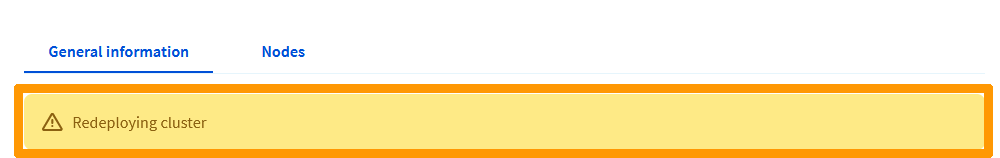
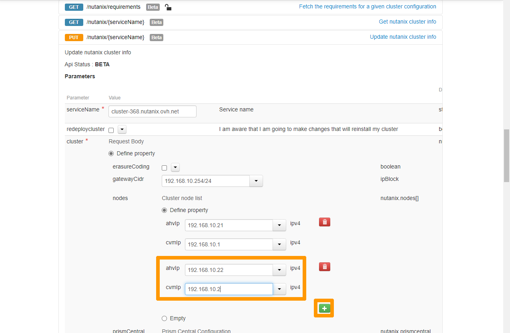

**Last updated 13th December 2022**

## Objective

**Find out how to repackage a Cluster with custom network settings in the OVHcloud Control Panel and API.**

> [!warning]
> OVHcloud provides services for which you are responsible, with regard to their configuration and management. It is therefore your responsibility to ensure that they work properly.
>
> This guide is designed to assist you as much as possible with common tasks. Nevertheless, we recommend contacting a specialist provider if you experience any difficulties or doubts when it comes to managing, using or setting up a service on a server.
>

## Requirements

- a Nutanix Cluster in your OVHcloud account
- access to the [OVHcloud Control Panel](https://ca.ovh.com/auth/?action=gotomanager&from=https://www.ovh.com/world/&ovhSubsidiary=we)
- access to the [OVHcloud API page](https://ca.api.ovh.com/)

> [!warning]
> If you have signed up to the **Nutanix on OVHcloud BYOL offer** and have activated licences on your cluster, you will need to uninstall your licences before you launch the redeployment. You can use this guide to manage your licences: [Manage licences in your Nutanix cluster on OVHcloud BYOL Offer](https://docs.ovh.com/us/en/nutanix/activate-licence-on-nutanix-byol/)
>

## Introduction to using the private network for a Nutanix Cluster at OVHcloud

Before redeploying a Nutanix Cluster, you must define a private network with its subnet mask, as follows: `XX.XX.XX.XX/XX`. 
You then need to choose IP addresses within this scope.

The list of required IP addresses varies depending on the number of servers ordered (the solution offered by OVHcloud ranges from 3 to 18 nodes) and the configuration mode of **Prism Central** (**Alone** or **Scale**). 

Here are the details:

- Between 6 and 36 IP addresses for physical servers (requires two addresses per server, one for the **AHV** hypervisor and another for the **CVM** virtual machine).
- An IP address for **Prism Element**.
- An IP address for the IP address of **Prism Central**.
- 3 optional IP addresses for **Prism Central** scale-mode deployment with 3 virtual machines.
- An IP address for the Internet gateway.

> [!warning]
> Some IP plan addresses are reserved for the **Load Balancer**. They are still on the network `XX.XX.XX.128/27`, i.e. the addresses between `XX.XX.XX.129` and `XX.XX.XX.158` of the network. They should not be used during redeployment.
>

Here are two possible examples of Nutanix cluster configuration at OVHcloud:

**Example 1:** Reconfiguring a cluster with 3 nodes on an IP plan in `192.168.10.0/24`.

- Server 1: VM address **CVM** `192.168.10.1`, hypervisor IP address **AHV** `192.168.10.21`.
- Server 2: VM address **CVM** `192.168.10.2`, hypervisor IP address **AHV** `192.168.10.22`.
- Server 3: VM address **CVM** `192.168.10.3`, hypervisor IP address **AHV** `192.168.10.23`.
- **Prism Element** virtual address: `192.168.10.111`.
- **Prism Central** IP address: `192.168.10.222`.
- Scope reserved for the load balancer: `192.168.10.128 to 192.168.10.159`.
- Gateway: `192.168.10.254`.

**Example 2:** Reconfiguring a cluster with 4 nodes in Scale mode for **Prism Central** on an IP plan in `172.16.0.0/16`.

- Server 1: VM **CVM** `address 172.16.0.1`, hypervisor IP address **AHV** `172.16.0.21`.
- Server 2: VM address **CVM** `172.16.0.2`, hypervisor IP address **AHV** `172.16.0.22`.
- Server 3: VM **CVM** `address 172.16.0.3`, hypervisor IP address **AHV** `172.16.0.23`.
- Server 4: VM **CVM** `address 172.16.0.4`, hypervisor IP address **AHV** `172.16.0.24`.
- **Prism Element** virtual address: `172.16.0.111`.
- **Prism Central** IP address: `172.16.0.222`.
- VM Prism Central: `172.16.0.223 to 172.16.0.225`.
- The load balancer: `172.16.0.128 to 172.16.0.159`.
- Gateway: `172.16.0.254`.

## Instructions

We will redeploy a cluster with 3 nodes, as in Example 1 in the previous chapter, either from the OVHcloud Control Panel or from the OVHcloud API.

> [!warning]
> The Cluster redeployment operation cannot be undone. All data in the Cluster will be deleted, and a new admin account password will be generated and sent by email to the OVHcloud customer account holder.
>

### Redeploy the cluster from the OVHcloud Control Panel

In the OVHcloud Control Panel, click on the `Hosted Private Cloud`{.action} tab, select your cluster below the `Nutanix` category on the left-hand side, then click on `Redeploy cluster`{.action}.

If you have subscribed to the Nutanix BYOL offer, a reminder will tell you not to forget to uninstall your licences. You can use this guide to manage your licences: [Managing licences in your Nutanix on OVHcloud BYOL Offer cluster](https://docs.ovh.com/us/en/nutanix/activate-license-on-nutanix-byol/). When your licences are uninstalled, click `Continue`{.action}.

Click `Customise the Configuration`{.action} and click `Next`{.action}

Enter the information for each of your nodes, which are:

- the private IP address of your AHV hypervisor.
- the private IP address of the CVM virtual machine.

Then scroll through the `Window`{.action}.

Leave these default settings :

* **Replication Factor** : RF2.
* **Erasure Coding feature** : Erasure Coding disabled.
* **Prism entral type** : Alone.

Modify these values:

* **Prism Central VIP** : Prism Central private IP address.
* **Prism Element Virtual IP(VIP)** : Prism Element private IP address.   
* **CIDR Gateway** : Private IP address of the gateway followed by the subnet mask of the form XX.XX.XX.XX/XX.
* **AOS Version**: Version of AOS chosen during redeployment.

Then click `Redeploy`{.action}.

Type `REDEPLOY`{.action} and click `Confirm`{.action}.

> [!warning]
> The Cluster redeployment takes a minimum of two hours. Wait until you receive an email to the OVHcloud account holder **before** using the Cluster again.
>
> The **Load Balancer** is reconfigured during redeployment, and points the FQDN address of the Cluster to the private address of **Prism Central**.
>

### Redeploy the cluster through the OVHcloud API

Log in to the [OVHcloud API](https://ca.api.ovh.com). For more details on how the OVHcloud API works, please refer to our guide on [Getting started with the OVHcloud APIs](https://docs.ovh.com/us/en/api/first-steps-with-ovh-api/)

> [!warning]
> If you use the OVHcloud API to repackage your cluster with a Nutanix BYOL offer, you will not receive a message to notify you to uninstall your licences. Don't forget to do so. You can use this guide to manage your licences: [Managing licences in your Nutanix on OVHcloud BYOL Offer cluster](https://docs.ovh.com/us/en/nutanix/activate-license-on-nutanix-byol/). After uninstalling your licences, you can redeploy your cluster with the OVHcloud API
>

Use the following API call:

> [!api]
>
> @api {put} /nutanix/{serviceName}
>

Enter this data:

- **ServiceName:** `FQDN name of your Nutanix Cluster`.
- **redeploycluster:** `Check the box`.
- **gatewayCidr:** `The gateway IP address followed by the subnet mask`.

Enter the following information below **nodes:**

- **ahvip:** `IP address of the hypervisor of the first node`.
- **cvmip:** `IP address of the first node's CVM`.

Then click the `+`{.action} button.

Add the information for the second node:
 
- **ahvip:** `IP address of the hypervisor of the second node`.
- **cvmip:** `IP address of the second node's CVM`.

Click the `+`{.action} button again.

Then add the information for the last node:

- **ahvip:** `IP address of the hypervisor of the last node`.
- **cvmip:** `IP address of the last node's CVM`.

Then scroll through the browser window with the scroll bar.

In the **Prism Central Configuration** section, check `Define property`{.action} and `Empty array`{.action}. 
Choose `alone` from the **type** drop-down menu and enter `The IP address of Prism Central` in the **vip** drop-down menu.

Then enter:

- `The IP address of Prism Element` in the **prismElementVip** drop-down menu.
- The `Number of the redundancy factor` in the **redundancyFactor** drop-down menu.
- The `version number of the cluster` in the **version** dropdown menu.

Click `Execute`{.action} to start the cluster redeployment.

> [!warning]
> The Cluster redeployment takes a minimum of two hours. Wait until you receive an email to the OVHcloud account holder **before** using the Cluster again.
>
> The **Load Balancer** is reconfigured during redeployment, and points the FQDN address of the Cluster to the private address of **Prism Central**.
>

## Go further

[Using the OVHcloud API](https://docs.ovh.com/us/en/api/)

[Managing licences in your Nutanix on OVHcloud BYOL Offer cluster](https://docs.ovh.com/us/en/nutanix/activate-license-on-nutanix-byol/)

Join our community of users on <https://community.ovh.com/en/>.
