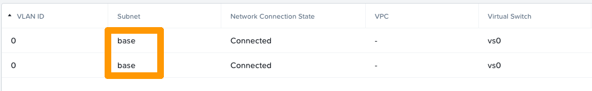
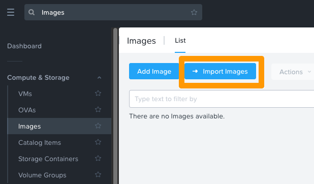

**Last updated 11th January 2022**

## Objective

OVHgateway is the name of the outgoing point of your cluster to the internet.

**This guide will explain how this gateway works.**

## Instructions

### Technical details

#### General information

The VM is based on Ubuntu 18.04.5 LTS (Bionic).
OVHgateway has a lightweight design, using 2 NICs, 1 vCPU, 1 GB memory and a 11 GiB disk.

`ens3` is the interface for the external network and owns the Failover IP address.<br>
`ens4` is the interface for the internal network.

OVHcloud teams have customised the VM with an *IPTABLES* script.

> [!primary]
> There is no way to connect with SSH or any other protocol.
>

> [!primary]
> The VM is used only to NAT traffic between hosts, CVM, VM and Internet.
>

ICMP requests are only allowed in the private network.

#### User data script

The VM is deployed with *cloud-init*, a tool that applies user data to your instances automatically.

```yaml
#cloud-config
hostname: gw
fqdn: gw.ovh.cloud
users:
  - name: ovh
    sudo: ['ALL=(ALL) NOPASSWD:ALL']
    groups: sudo
    shell: /bin/bash
    lock_passwd: false
    passwd: <>
write_files:
  - path: /etc/netplan/50-cloud-init.yaml
    content: |
      network:
        version: 2
        renderer: networkd
        ethernets:
          ens3:
            addresses: [PUBLICIP]
            gateway4: PUBLICGW
            nameservers:
              addresses: [DNS]
          ens4:
            addresses: [PRIVATEIP]
runcmd:
  - netplan apply
```

### How to re-deploy the VM gateway

#### Step 1: Collect information

To redeploy the gateway VM you will need:

- Failover IP address
- LAN subnet (subnet of CVM, Prism Central, AHV hypervisors)
- Subnet name

##### **Check the failover IP address**

Log in to the [OVHcloud Control Panel](https://www.ovh.com/auth/?action=gotomanager&from=https://www.ovh.es/&ovhSubsidiary=es) and open the management section of your [vRack](https://www.ovh.es/soluciones/vrack/){.external}. Verify the failover IP address used by the Nutanix Cluster.

{.thumbnail}

> [!primary]
> The following instructions will use the IP block 123.45.6.78/30 for example purposes.
>

For [vRack](https://www.ovh.es/soluciones/vrack/){.external} purposes, the first, penultimate, and last addresses in any given IP block are always reserved for the network address, network gateway, and network broadcast respectively. This means that the first usable address is the second address in the block, as shown below:

```console
123.45.6.76   Reserved: Network address
123.45.6.77   First usable IP
123.45.6.78   Reserved: Network gateway
123.45.6.79   Reserved: Network broadcast
```

##### **Check the private subnet or gateway private IP address**

If the gateway still exists, go to the VM in the VM section of your Prism Central WebUI.

The gateway IP is displayed here.

{.thumbnail}

However, if the gateway is not present, check the subnet by going to "Hardware" then "Hosts" in the Prism Central WebUI.

{.thumbnail}

In this case the subnet is 192.168.0.0/24. In the default configuration, the gateway IP address is therefore 192.168.0.254.

##### **Retrieve the subnet name**

If the gateway still exists, go to the VM in the VM section of your Prism Central WebUI.

Click on the OVHgateway VM and open the "NICs" tab.

{.thumbnail}

#### Step 2: Import an image on the cluster

Log in to Prism Central and go to `Compute & Storage`{.action}, then `Images`{.action}.

Click on the `Import Images`{.action} button.

{.thumbnail}

Click on the `Images on a cluster`{.action} button, then on `Select Images`{.action}.

{.thumbnail}

Check "ovh_gateway" and click on `Next`{.action}.

{.thumbnail}

Once the task is done, the "ovh_gateway" image will be available on the cluster.

{.thumbnail}

##### **Retrieve the necessary information with the Nutanix API**

To deploy the VM, you need the UUID of the "image" and the network.

Open a terminal and execute the following command:

```bash
curl -k -H Accept:application/json -H Content-Type:application/json -u "admin:PRISMADMINPASSWORD" -X POST https://fqdn-cluster:9440/api/nutanix/v3/images/list -d{} | jq .
```

> [!primary]
> Remember to enter your actual password and FQDN as parameters.
>

> [!primary]
> The "jq ." command will provide a readable json.
>

```json
{
  "api_version": "3.1",
  "metadata": {
    "total_matches": 1,
    "kind": "image",
    "length": 1,
    "offset": 0
  },
  "entities": [
    {
      "status": {
        "state": "COMPLETE",
        "name": "ovh_gateway",
        "resources": {
          "retrieval_uri_list": [
            "https://127.0.0.1:9440/api/nutanix/v3/images/54b919e1-b1e5-4d4a-b055-47ff298bf7d7/file"
          ],
          "current_cluster_reference_list": [
            {
              "kind": "cluster",
              "uuid": "0005d309-53ab-cfbb-6330-0c42a114b058"
            }
          ],
          "architecture": "X86_64",
          "size_bytes": 3221225472,
          "image_type": "DISK_IMAGE",
          "source_uri": "http://192.168.0.11:49200/ovhgateway.qcow2"
        },
        "description": "OVHGatewayVM"
      },
      "spec": {
        "name": "ovh_gateway",
        "resources": {
          "image_type": "DISK_IMAGE",
          "source_uri": "http://192.168.0.11:49200/ovhgateway.qcow2",
          "architecture": "X86_64"
        },
        "description": "OVHGatewayVM"
      },
      "metadata": {
        "last_update_time": "2021-12-15T09:30:34Z",
        "kind": "image",
        "uuid": "54b919e1-b1e5-4d4a-b055-47ff298bf7d7",
        "spec_version": 0,
        "creation_time": "2021-12-15T09:30:34Z",
        "categories_mapping": {},
        "categories": {}
      }
    }
  ]
}
```

In the metadata you can find the UUID, in this case: `54b919e1-b1e5-4d4a-b055-47ff298bf7d7`.

Next you need to find the correct subnet UUID. Execute the command below:

```bash
curl -k -H Accept:application/json -H Content-Type:application/json -u "admin:PRISMADMINPASSWORD" -X POST https://fqdn-cluster:9440/api/nutanix/v3/subnets/list -d{} | jq .
```

> [!primary]
> Remember to use your actual password and FQDN as parameters.
>


```json
{
  "api_version": "3.1",
  "metadata": {
    "total_matches": 1,
    "kind": "subnet",
    "length": 1,
    "offset": 0
  },
  "entities": [
    {
      "status": {
        "state": "COMPLETE",
        "name": "base",
        "resources": {
          "vswitch_name": "br0",
          "subnet_type": "VLAN",
          "virtual_switch_uuid": "1e9520a5-1d04-4857-8a32-4a09e923a688",
          "vlan_id": 0
        },
        "cluster_reference": {
          "kind": "cluster",
          "name": "uppercase",
          "uuid": "0005d309-53ab-cfbb-6330-0c42a114b058"
        }
      },
      "spec": {
        "name": "base",
        "resources": {
          "vswitch_name": "br0",
          "subnet_type": "VLAN",
          "virtual_switch_uuid": "1e9520a5-1d04-4857-8a32-4a09e923a688",
          "vlan_id": 0
        },
        "cluster_reference": {
          "kind": "cluster",
          "name": "uppercase",
          "uuid": "0005d309-53ab-cfbb-6330-0c42a114b058"
        }
      },
      "metadata": {
        "last_update_time": "2021-12-13T18:00:22Z",
        "kind": "subnet",
        "uuid": "4676d823-82dd-4c71-a95d-847e7cdc3a3e",
        "spec_version": 0,
        "creation_time": "2021-12-13T18:00:22Z",
        "categories_mapping": {},
        "categories": {}
      }
    }
  ]
}
```

In the metadata you can find the UUID, in this case: `4676d823-82dd-4c71-a95d-847e7cdc3a3e`.

#### Step 3: Create the necessary files

To deploy the VM you need two files: `vm.json`, describing the VM and the `cloud-init.yaml` configuration file which contains the user data such as password, network, etc.

Create the `vm.json` file:

```json
{
  "spec": {
    "name": "YOURVMNAME",
    "resources": {
      "power_state": "ON",
      "num_vcpus_per_socket": 4,
      "num_sockets": 1,
      "memory_size_mib": 4096,
      "disk_list": [
        {
          "disk_size_mib": 41264,
          "device_properties": {
            "device_type": "DISK",
            "disk_address": {
              "device_index": 0,
              "adapter_type": "SATA"
            }
          },
          "data_source_reference": {
            "kind": "image",
            "uuid": "54b919e1-b1e5-4d4a-b055-47ff298bf7d7"
          }
        }
      ],
      "nic_list": [
        {
          "nic_type": "NORMAL_NIC",
          "ip_endpoint_list": [
            {
              "ip_type": "DHCP"
            }
          ],
          "subnet_reference": {
            "kind": "subnet",
            "name": "base",
            "uuid": "4676d823-82dd-4c71-a95d-847e7cdc3a3e"
          },
          "is_connected": true
        },
        {
          "nic_type": "NORMAL_NIC",
          "ip_endpoint_list": [
            {
              "ip_type": "DHCP"
            }
          ],
          "subnet_reference": {
            "kind": "subnet",
            "name": "base",
            "uuid": "4676d823-82dd-4c71-a95d-847e7cdc3a3e"
          },
          "is_connected": true
        }
      ],
      "guest_customization": {
        "cloud_init": {
          "user_data": "USERDATA"
        },
        "is_overridable": false
      }
    }
  },
  "api_version": "3.1.0",
  "metadata": {
    "kind": "vm"
  }
}
```

> [!primary]
> You can adjust the settings with your values as needed: VM name, number of VCPUs, RAM size, disk size etc.
>

Check `data_source_reference` to ensure the UUID is the actual UUID of your OS image:

```json
"data_source_reference": {
            "kind": "image",
            "uuid": "54b919e1-b1e5-4d4a-b055-47ff298bf7d7"
                         }
```

Verify as well for your subnet UUID:

```json
          "subnet_reference": {
            "kind": "subnet",
            "name": "base",
            "uuid": "4676d823-82dd-4c71-a95d-847e7cdc3a3e"
                              }
```

Now you have to create the `cloud-init.yaml` file. This file contains the "user data". When the system boots, these parameters such as users, package, files, etc. will be applied to the VM.

Below, find a template that you can amend with your values to create your individual VM.

> [!primary]
>
> - Change "hostname", "fqdn", "name", "passwd", "ssh-autorized-keys" and ip addresses with the desired values.
> - This file will create the file for netplan, apply the configuration, and initiate a reboot.
> - The password must be a hash value. You can generate it with the command below.
>

```bash
mkpasswd --method=SHA-512 --rounds=4096
```


```yaml
#cloud-config
hostname: <yourhostname>
fqdn: <yourhostname.ovh.cloud>
users:
  - name: <yourusername>
    sudo: ['ALL=(ALL) NOPASSWD:ALL']
    groups: sudo
    shell: /bin/bash
    lock_passwd: false
    passwd: <yourhashpass>
    ssh-authorized-keys: <your public ssh key>
write_files: 
   - path: /etc/netplan/50-cloud-init.yaml
     content: |
        network:
           version: 2
           renderer: networkd
           ethernets:
              ens3:
                addresses: [123.45.6.77/30]
                gateway4: 123.45.6.78
                nameservers:
                  addresses: [213.186.33.99]
              ens4:
                addresses: [192.168.0.254]


runcmd:
   - netplan generate
```

#### Step 4: Create the VM 

Transform the `cloud-init.yaml` into "base64" and put it into a variable:

```bash
USERDATA=$(base64 -w 0 cloud-init.yaml)
```

Then replace the chain "USERDATA" in `vm.json` with the value of the `USERDATA` variable in the `vm.json` file:

```bash
sed -i s/USERDATA/${USERDATA}/g vm.json
```

Finally, use a cURL request to register and power on the VM:

```bash
curl -k -H Accept:application/json -H Content-Type:application/json -u "admin:PRISMADMINPASSWORD" -X POST https://fqdn:9440/api/nutanix/v3/vms -d @vm.json | jq .
```

## Go further

Join our community of users on <https://community.ovh.com/en/>.
