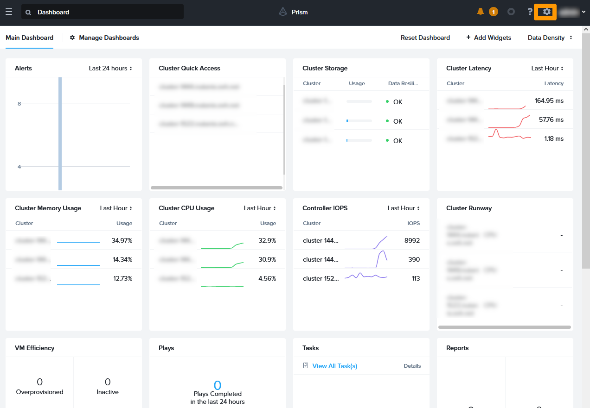

**Dernière mise à jour le 17/10/2022**

## Objectif

**Ce document vous montre comment activer vos licences sur une solution Nutanix on OVHcloud en mode *Bring Your Own Licence* (BYOL)**

> [!warning]
> OVHcloud vous met à disposition des services dont la configuration, la gestion et la responsabilité vous incombent. Il vous appartient donc de ce fait d’en assurer le bon fonctionnement.
>
> Ce guide a pour but de vous accompagner au mieux sur des tâches courantes. Néanmoins, nous vous recommandons de faire appel à un prestataire spécialisé si vous éprouvez des difficultés ou des doutes concernant l’administration, l’utilisation ou la mise en place d’un service sur un serveur.
>

## Prérequis

- Être connecté à votre [espace client OVHcloud](https://www.ovh.com/auth/?action=gotomanager&from=https://www.ovh.com/fr/&ovhSubsidiary=fr).
- Être connecté sur vos clusters via **Prism Central**.
- Posséder des licences Nutanix et les avoir à disposition sur le portail Nutanix.

## Présentation

> [!warning]
>
> OVHcloud propose Nutanix en version  *Bring Your Own Licence* (BYOL), ce qui signifie que vous devez, en tant que client OVHcloud, fournir les licences du cluster.
> Lorsque le cluster Nutanix est commandé en mode BYOL, le cluster est livré avec une version d'essai de 90 jours. Vous devez donc, en tant que client, installer vos licences pendant cette période.
>

Trois types de licences existent, pour :

- **Prism Element**. 
- **Prism Central**. 
- **Les add-ons**.

Vous pouvez installer toutes les licences à partir de **Prism Central**.

## En pratique

### Installation des licences

#### Récupération du résumé de votre configuration

Nous allons récupérer le résumé de la configuration du cluster pour le déposer sur le portail Nutanix et générer des licences.

Dans **Prism Central**, cliquez sur l'icône en forme d'`engrenage`{.action} pour aller dans les paramètres.

{.thumbnail}

Cliquez à gauche sur `Licensing`{.action}.

{.thumbnail}

Cliquez à gauche sur `Update Licenses`{.action}.

{.thumbnail}

Cliquez sur `Download`{.action} pour récupérer le fichier contenant les informations sur votre cluster.

{.thumbnail}

Cliquez en haut à droite sur `Show all downloads`{.action}

{.thumbnail}

Vous trouverez dans vos fichiers téléchargés un document dont le nom commence par **ntnx** et qui est le résumé de votre configuration. Il vous faudra déposer de fichier sur le portail de licences Nutanix.

{.thumbnail}

### Connexion au portail Nutanix 

Toujours dans **Prism Central**, rendez-vous sur la page des licences et cliquez sur `Licenses page`{.action}.

{.thumbnail}

Le navigateur web se lance et vous propose de vous connecter au portail Nutanix.

Saisissez vos informations d'identification et connectez-vous au portail.

{.thumbnail}

Vous êtes alors connecté au gestionnaire de licences Nutanix.

{.thumbnail}

## Aller plus loin

[Guide de gestion des licences Nutanix](https://portal.nutanix.com/page/documents/details?targetId=Licensing-Guide:lic-lic-manage-manual-c.html)

Échangez avec notre communauté d'utilisateurs sur <https://community.ovh.com/>.
