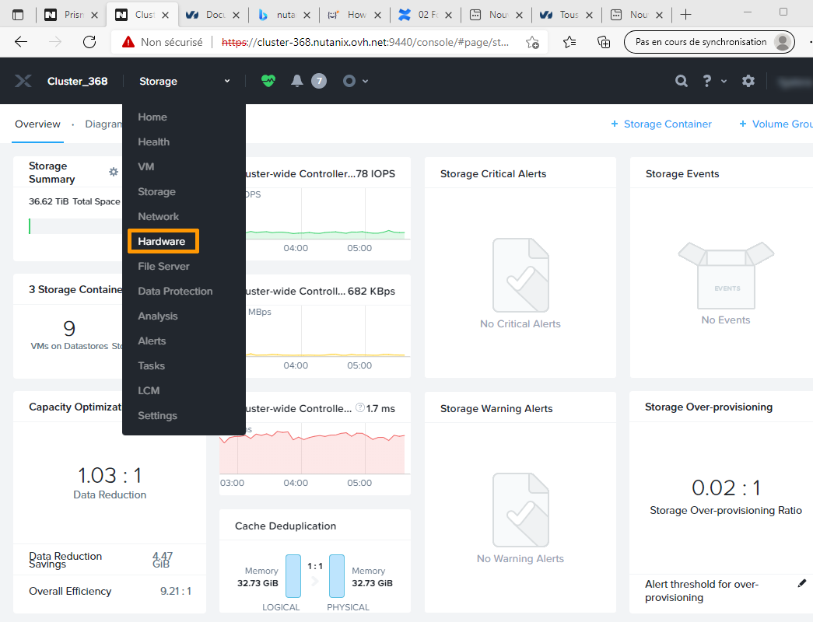

**Dernière mise à jour le 22/02/2022**

## Objectif

Ce document rappelle le fonctionnement d'une solution d'hyperconvergence Nutanix et propose une découverte de l'interface Prim Central et PRISM element.

> [!warning]
> OVHcloud vous met à disposition des services dont la configuration, la gestion et la responsabilité vous incombent. Il vous appartient donc de ce fait d’en assurer le bon fonctionnement.
>
> Ce guide a pour but de vous accompagner au mieux sur des tâches courantes. Néanmoins, nous vous recommandons de faire appel à un [prestataire spécialisé](https://partner.ovhcloud.com/fr-ca/) si vous éprouvez des difficultés ou des doutes concernant l’administration, l’utilisation ou la mise en place d’un service sur un serveur.
>

## Prérequis

- Disposer d'un cluster Nutanix dans votre compte OVHcloud
- Être connecté à votre [espace client OVHcloud](https://ca.ovh.com/auth/?action=gotomanager&from=https://www.ovh.com/ca/fr/&ovhSubsidiary=qc)

## Présentation de la solution technique

### Rappel sur la définition d'un nœud

Une solution Nutanix est composée de ce que l'on appelle des nœuds. En pratique, un nœud est un ordinateur physique. Sur cet ordinateur, on retrouve :

* Un disque système ou deux disques systèmes en RAID. Sur ce disque système est installé l'hyperviseur AHV. 
* Un disque SSD ou est stocké la CVM (machine virtuelle qui assure les connexions entre chaque nœud et qui est une composante essentielle de la solution Nutanix). L'espace disque restant éventuellement disponible peut servir pour le stockage de données.
* D'autres disques SSD ou SAS, avec un coût de licence différent en fonction de la technologie de stockage choisie.
* Un ou plusieurs processeurs.
* De la mémoire.
* Parfois une carte graphique **GPU** (*Graphical Processor Unit*).

Dans l'idéal, chaque nœud d'un cluster Nutanix doit être identique. Il peut néanmoins arriver qu'il y ait des différences, notamment lorsqu'un GPU est présent. Cependant, les nœuds qui contiennent du stockage doivent être identiques.

### Fonctionnement du cluster Nutanix

Un cluster est créé à partir des nœuds du cluster. Il faut au minimum 3 nœuds pour faire fonctionner un cluster Nutanix.

Lors de la création d'un cluster, tous les disques disponibles sont ajoutés dans ce que l'on appelle un *Storage POOL*.
Nous recommandons de n'avoir qu'un seul Storage POOL.

Pour rappel, la solution Nutanix d'OVHcloud commence à partir de 3 nœuds et peut aller jusqu'à 18 nœuds.

La redondance des données ne se fait pas sur un nœud comme avec du RAID, mais au travers du réseau sur plusieurs nœuds. 
Il y a plusieurs niveaux de redondances :

* RF2: les données sont disponibles sur 2 nœuds, ce qui permet la défaillance d'un nœud ou d'un disque de données sur un des nœuds.
* RF3: Les données sont disponibles sur 3 nœuds. Cette solution n'est possible qu'à partir de 5 nœuds, elle est plus sécurisée car elle permet la perte de deux nœuds avec une capacité de stockage moindre.

### Présentation de la virtualisation

La virtualisation se fait au travers de l'hyperviseur AHV.
Cet hyperviseur est intégré sur chaque nœud et ne nécessite pas de licence supplémentaire.

Les ordinateurs virtuels fonctionnent sur un des nœuds et peuvent basculer à chaud d'un nœud à l'autre en fonctionnement normal.

En cas de défaillance d'un nœud, les ordinateurs virtuels redémarrent sur un des nœuds.

### Liste des possibilités de connexion à un cluster Nutanix

* À partir de l'interface WEB Prism Central (machine virtuelle supplémentaire qui possède des fonctionnalités que n'a pas Prism Element et qui permet de se connecter à un ou plusieurs clusters).
* Sur l'interface WEB Prism ELEMENT (il s'agit en réalité d'une des CVM).
* En SSH sur le cluster (dans ce cas-là, il s'agit aussi d'une des CVM).
* En SSH sur un des nœuds du cluster pour des opérations de maitenance sur l'hyperviseur.

Au travers de Prism Central et de Prism Element, il est possible d'utiliser l'interface RESTAPI pour automatiser certaines tâches en ligne de commande.

## En pratique

Maintenant que la solution Nutanix a été présentée, nous allons nous connecter aux interfaces Web de Nutanix et découvrir le stockage.

### Connexion à Prism Central depuis Internet

Nous allons nous connecter au travers de Prism Central qui est le point d'entrée, depuis Internet, dans la solution proposée par OVHcloud.

L'accès au cluster se fait via une adresse publique  du type <https://FQDN:9440>. Cette adresse vous est fournie lors de la création d'un cluster Nutanix chez OVHcloud.

Saisissez votre nom d'utilisateur et votre mot de passe et cliquez sur la flèche.

### Connexion à Prism Element via Prism Central

Sur le tableau de bord (*Dashboard*) de Prism Central, cliquez sur le nom du cluster dans le cadre **Cluster Quick Access**.

Vous accédez alors au tableau de bord de votre cluster.

À droite apparaît le nombre total de disques, le nombre de VMs ainsi que le le nombre d'hôtes. 
Un coeur de couleur verte indique que le cluster Nutanix fonctionne correctement. 
En bas de cet encadré est affiché le niveau de tolérance de panne (1 signifie que nous sommes en RF2 avec la possibilité d'une perte d'un disque sur un nœud ou d'un nœud entier).

À gauche est affiché un résumé du stockage et de l'espace disque disponible. 
Cliquez sur `View Details`{.action} pour obtenir davantage d'informations sur le stockage.

Vous pouvez ainsi vérifier l'état du stockage par nœud.

Cliquez sur le menu `Hardware`{.action} pour obtenir le détail du stockage par nœud, ainsi que le nombre de disques alloués par nœud.

Cliquez sur `Diagrams`{.action} pour obtenir un résumé graphique tel que présenté ci-dessous.

## Aller plus loin

Visitez le site <https://www.nutanixbible.com/> pour plus d'informations sur le fonctionnement de Nutanix.

Échangez avec notre communauté d'utilisateurs sur <https://community.ovh.com/>.
