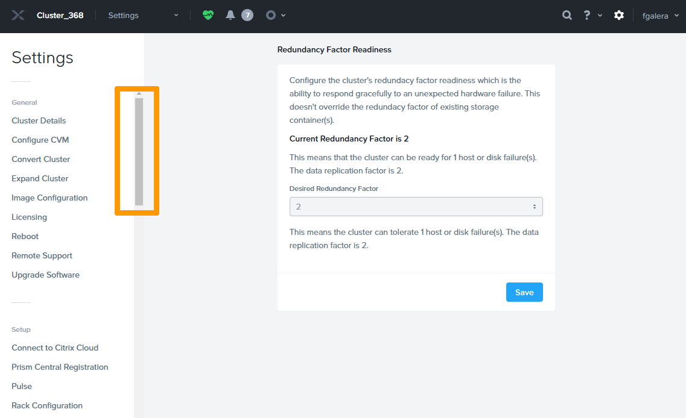
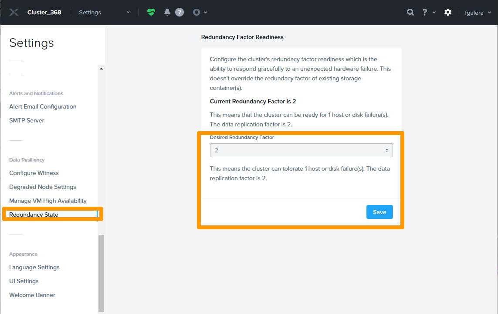
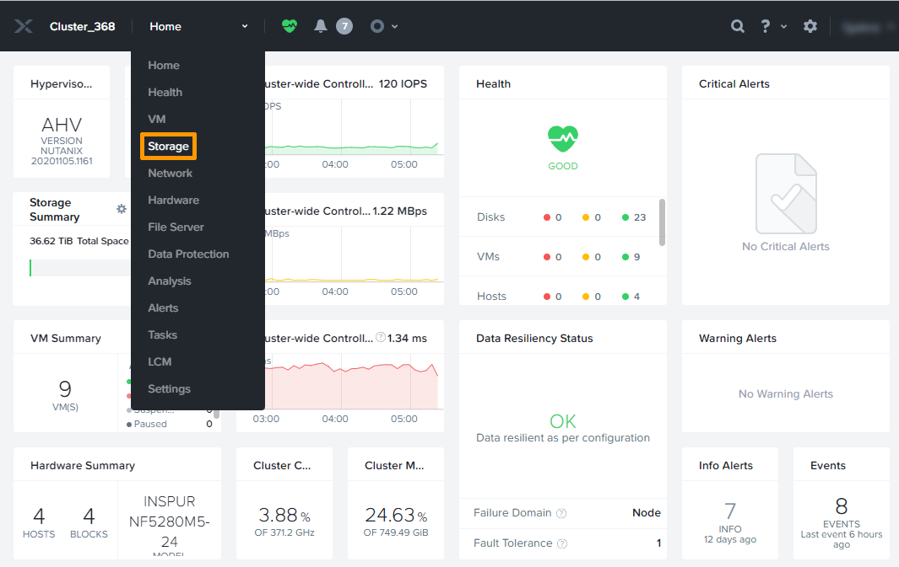
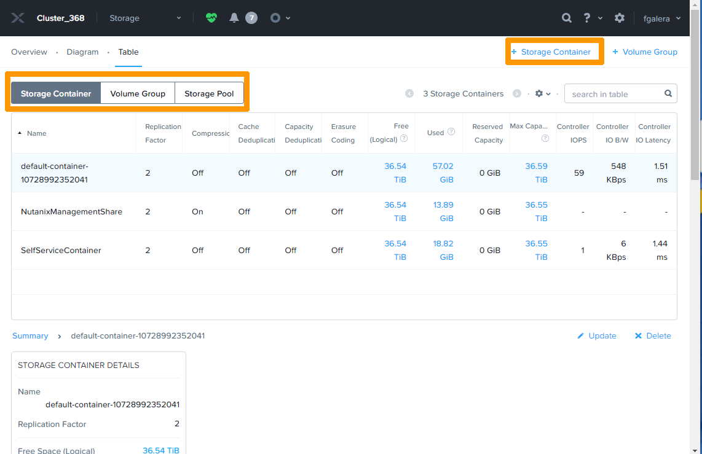
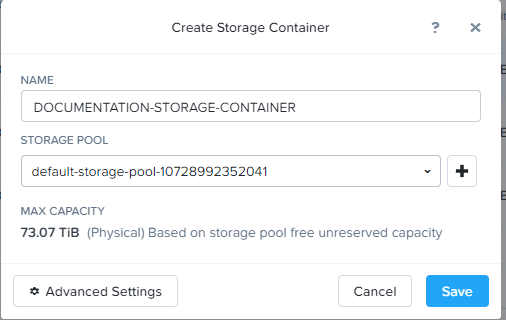
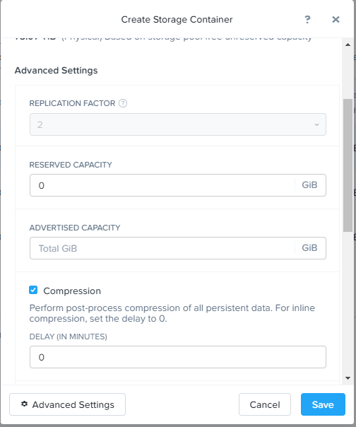
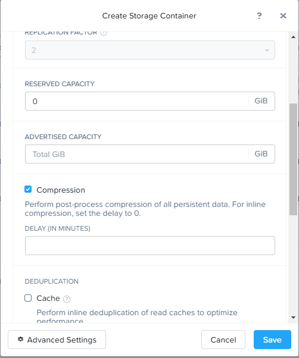
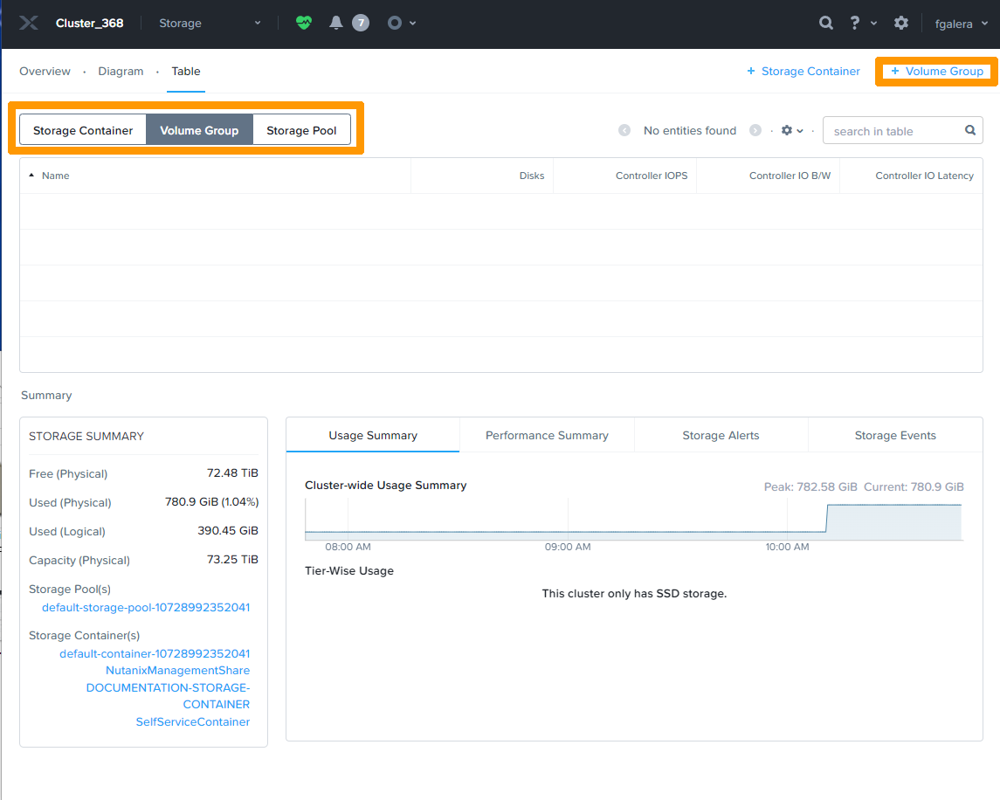
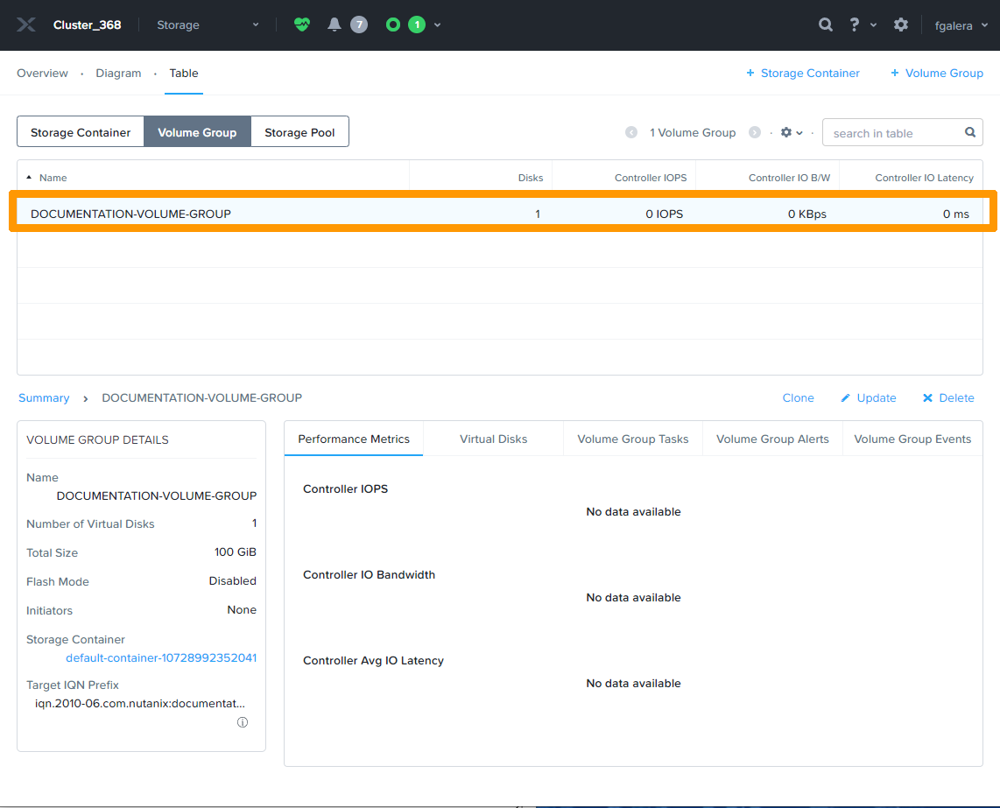

**Dernière mise à jour le 23/02/2022**

## Objectif

Documentation de présentation du stockage et création d'un **storage container** et d'un **volume group**.

> [!warning]
> OVHcloud vous met à disposition des services dont la configuration, la gestion et la responsabilité vous incombent. Il vous appartient donc de ce fait d’en assurer le bon fonctionnement.
>
> Ce guide a pour but de vous accompagner au mieux sur des tâches courantes. Néanmoins, nous vous recommandons de faire appel à un prestataire spécialisé si vous éprouvez des difficultés ou des doutes concernant l’administration, l’utilisation ou la mise en place d’un service sur un serveur.
>
> Certaines options comme l'utilisation de la compression ou de la deduplication necessitent des licences particulières fournies par NUTANIX au travers D'OVHcloud, il faudra se renseigner auprès du service commercial d'OVHcloud pour plus d'information.

## Prérequis

- Disposer d'un cluster Nutanix dans votre compte OVHcloud
- Être connecté à votre [espace client OVHcloud](https://www.ovh.com/auth/?action=gotomanager&from=https://www.ovh.com/fr/&ovhSubsidiary=fr)
- Être connecté à Prism Element sur le cluster

## Présentation du fonctionnement du stockage dans un cluster NUTANIX

Lors de la création d'un CLUSTER NUTANIX le système connecte tous les disques des nœuds dans un **Storage Pools** Il est déconseillé d'avoir plusieurs **Storage Pools**

Par défaut le Facteur de réplication est sur 2 et l'on peut passer à 3 si l'on a au minimum 5 nœuds.

les données ne sont pas stockées directement dans le **Storage Pools** elle le sont dans des **Storages containers** où il est possible d'activer des options de compressions, déduplications et autre pour optimiser l'utilisation du stockage. 

Il existe aussi des **Volume groups** qui donnent la possibilité d'avoir un accès en ISCSI ou directement en simulation SCSI pour :

* Un ordinateur tier hors du cluster ou une vm du cluster
* Plusieurs ordinateurs tier ou plusieurs Vm du cluster pour des applications nécessitant un stockage partagé comme par exemple des bases de données Microsoft SQL en mode CLUSTER.

## En pratique

### Modification du **facteur de réplication** 

Cliquer sur l'engrenage dans la sélection

Faire défiler Settings à l'aide de l'ascenseur dans la sélection jusqu'en bas de la page.

Dans la sélection de gauche se positionner sur **Redondancy state**. 

Dans la sélection de droite se positionner sur **Desired redondancy factor** remplacer 2 par 3 et faire Save *Cette opération n'est possible que si l'on a au minimum 5 nœuds.

Il faut un certain temps pour que les données se trouvent sur 3 nœuds.

### Création d'un **Storage container**

Nous allons créer un **Storage container** avec 300 Go minimum réservé pour ce stockage et les autres paramètres par défaut.

Dans le menu choisir la sélection **Storage**

Dans la sélection de gauche être positionné sur **Storage container**.

Dans la sélection de droite Cliquer sur le **signe + à gauche de Storage Container**.

Saisir le nom du storage container dans la zone de saisie **NAME**.

Cliquer sur **Advanced Settings** pour avoir les paramètres avancés.

Dans la sélection **RESERVED CAPACITY** saisir la taille ensuite faire défiler pour voir toutes les options possibles.

Cliquer sur **SAVE** pour finaliser la création du **Storage container**

Dans le tableau de bord le nouveau **Storage container** est visible.

Pour plus de détail sur la création de **Storage containers** voir les références dans la section aller plus loin.

### Création d'un **Volume group**

Dans la sélection de gauche être positionné sur **Volume GROUP**

Dans la sélection de droite Cliquer sur **le signe + à gauche de Volume Group**.

Cliquer sur **Add New Disk**.

Saisir la taille comme dans l'encadré **Size** au milieu et cliquer sur **Add** dans le deuxième encadré.

Le disque apparait, il est aussi possible d'ajouter plusieurs disques

Faire défiler pour voir les autres options

Pour valider la création d'un **Volume Group** cliquer sur *Save*

Le **Volume GROUP** apparait dans la liste 

## Aller plus loin

Documentation NUTANIX concernant le stockage [https://portal.nutanix.com/](https://portal.nutanix.com/page/documents/details?targetId=Web-Console-Guide-Prism-v5_20:wc-storage-management-wc-c.html)

Lien sur les licences NUTANIX [https://www.nutanix.com/products/software-options](https://www.nutanix.com/products/software-options)

Lien vers la présentation d'un cluster NUTANIX [<https://docs.ovh.com/fr/nutanix/nutanix-hci/>](<https://docs.ovh.com/fr/nutanix/nutanix-hci/>)

Échangez avec notre communauté d'utilisateurs sur <https://community.ovh.com/>.
