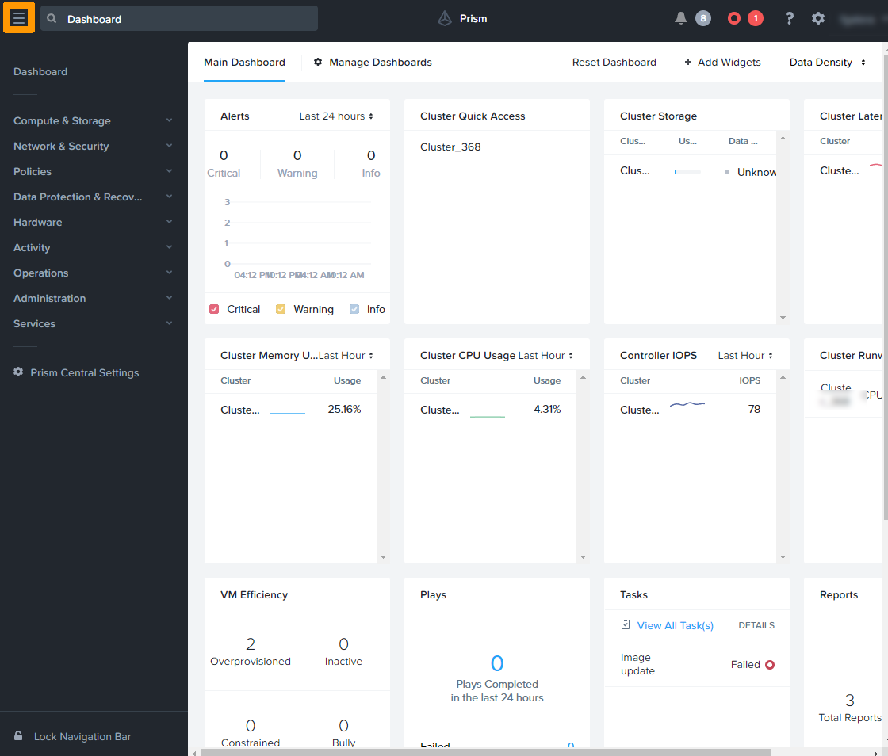
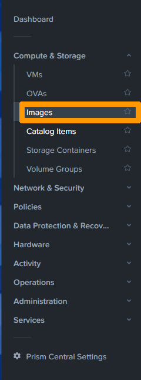
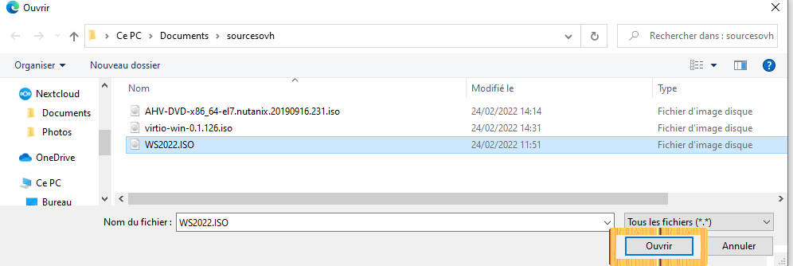

**Dernière mise à jour le 23/02/2022**

## Objectif

Etre capable d'ajouter des images ISO dans le système Nutanix pour les utiliser ultérieurment pour les installation des systèmes d'exploitations.

> [!warning]
> OVHcloud vous met à disposition des services dont la configuration, la gestion et la responsabilité vous incombent. Il vous appartient donc de ce fait d’en assurer le bon fonctionnement.
>
> Ce guide a pour but de vous accompagner au mieux sur des tâches courantes. Néanmoins, nous vous recommandons de faire appel à un prestataire spécialisé si vous éprouvez des difficultés ou des doutes concernant l’administration, l’utilisation ou la mise en place d’un service sur un serveur.
>
> Certains logiciels necessitent une licence comme les produits Microsoft il faudra alors s'assurer que tous les systèmes et logiciels installés possèdent ces licences.

## Prérequis

- Disposer d'un cluster Nutanix dans votre compte OVHcloud
- Être connecté à votre [espace client OVHcloud](https://www.ovh.com/auth/?action=gotomanager&from=https://www.ovh.com/fr/&ovhSubsidiary=fr)
- Être connecté à Prism Central sur le cluster

## En pratique

Cliquez sur les `Icone avec 3 traits en haut à gauche`{.action} 

Dépliez dans le menu de gauche **Compute & Storage** et `Cliquez sur Images`{.action}.

.

Cliquez sur `Add Image`{.action}.

Cliquer sur `Add FIle`{.action}

Selectionner le fichier et cliquer sur `Ouvrir`{.action}

Saisissez le nom du fichier, une description ensuite `Cliquez sur Next`{.action}

Laissez les options par défaut et `Cliquez sur Save`{.action}

## Aller plus loin

[Présentation d'un cluster Nutanix](https://docs.ovh.com/fr/nutanix/nutanix-hci/)

[Les licences Nutanix](https://www.nutanix.com/products/software-options)

Échangez avec notre communauté d'utilisateurs sur <https://community.ovh.com/>.