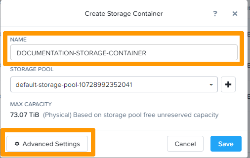
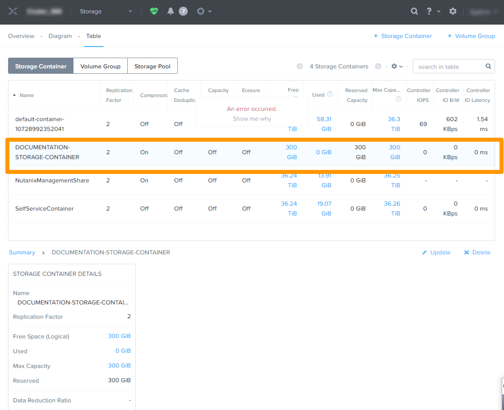
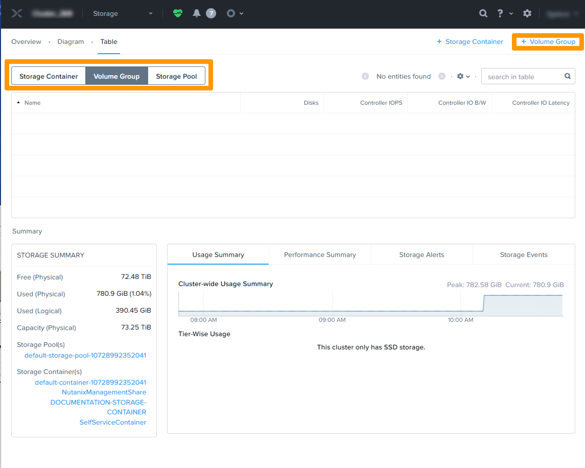
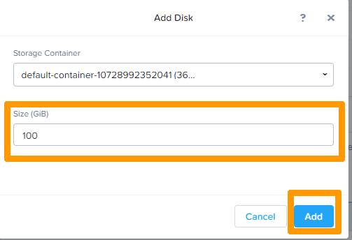
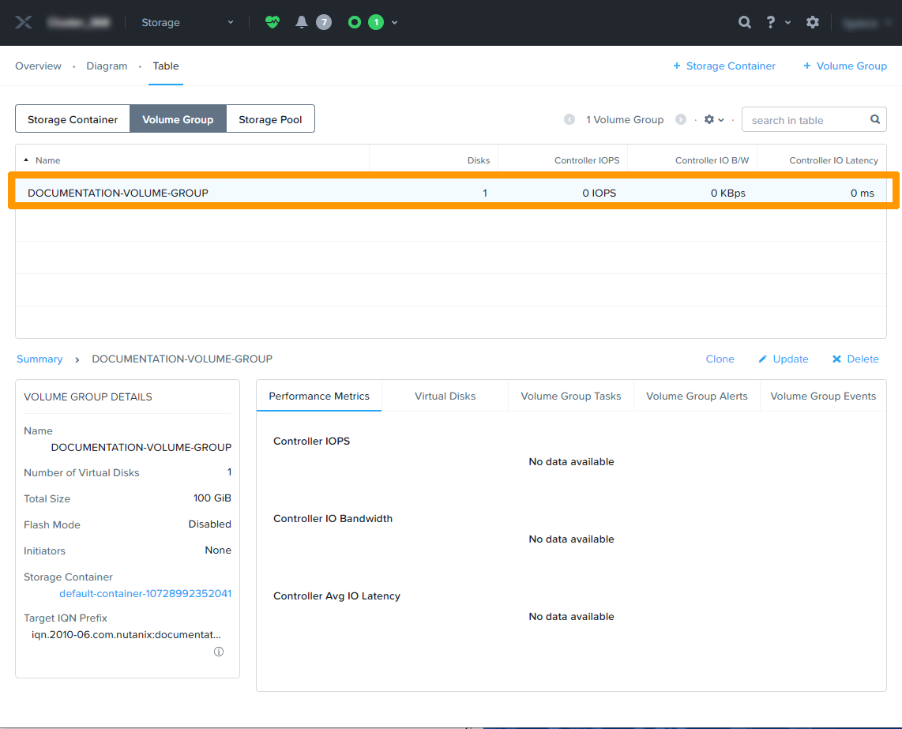

**Last updated 23rd February 2022**

## Objective

This guide will show you how to create a **storage container** and a **volume group**.

> [!warning]
> OVHcloud provides services for which you are responsible, with regard to their configuration and management. It is therefore your responsibility to ensure that they work properly.
>
> This guide is designed to assist you as much as possible with common tasks. Nevertheless, we recommend contacting a specialist provider if you experience any difficulties or doubts when it comes to managing, using or setting up a service on a server.
>
> Some options, such as the use of compression or deduplication, require specific licences provided by Nutanix through OVHcloud. Please contact OVHcloud Sales for more information.

## Requirements

- A Nutanix cluster in your OVHcloud account
- Access to the [OVHcloud Control Panel](https://www.ovh.com/auth/?action=gotomanager&from=https://www.ovh.pt/&ovhSubsidiary=pt)
- Being connected to the cluster via the Prism Element web interface

## Overview of storage operations in a Nutanix cluster

When a Nutanix cluster is created, the system connects all the nodes' disks in a **Storage Pool**. It is not recommended to have multiple Storage Pools.

By default, the **replication factor** is set to 2, and it can be changed to 3 if you have at least 5 nodes.

The data is not stored directly in the Storage Pool, it is stored in **Storage Containers** where it is possible to enable options for compression, deduplication, etc. to optimise storage utilisation. 

There are also **Volume Groups** that provide the ability to access via ISCSI or directly in SCSI simulation for:

- A third-party computer outside the cluster or a cluster VM
- Multiple third-party computers or VMs in the cluster for applications that require shared storage, such as Microsoft SQL databases in Cluster mode

## Instructions

### Modifying **replication factor** 

Click the gear in the top right of the Prism Element interface.

{.thumbnail}

Scroll through the settings and click `Redundancy state`{.action}.

If you have 5 nodes, you can change the **Desired Redundancy factor** setting from 2 to 3.

{.thumbnail}

It takes some time for the data to be on 3 nodes.

### Creating a **Storage Container**

We will create a **Storage Container**, with a minimum of 300 GB reserved for this storage. The other settings are default ones.

From the menu, select `Storage`{.action}.

{.thumbnail}

Select the `Storage Container`{.action} tab and click `+ Storage Container`{.action} on the right.

{.thumbnail}

Enter a name for the storage container in the **NAME** entry box. 
Then click `Advanced Settings`{.action}.

{.thumbnail}

In the **RESERVED CAPACITY** field, enter the size of your container. Other options are also available.

{.thumbnail}

Then click `Save`{.action} to finish creating the **Storage Container**.

{.thumbnail}

The new **Storage Container** is then visible in the dashboard.

{.thumbnail}

For details on creating a **Storage Container**, see the [Go further](#gofurther) section of this guide.

### Create a **Volume Group**

Select the `Volume Group`{.action} tab and click `+ Volume Group`{.action} on the right.

{.thumbnail}

Click **+ Add New Disk**.

{.thumbnail}

Enter a **size** in the dedicated field and click `Add`{.action}.

{.thumbnail}

The disk appears in the **Volume Group**. You can then add several other disks.

{.thumbnail}

Once you have created your disk(s), browse the available options and confirm that you want to create the **Volume Group** by clicking `Save`{.action}.

{.thumbnail}

The **Volume Group** will then appear in the list.

{.thumbnail}

## Go further 

[Presentation of a Nutanix cluster](https://docs.ovh.com/pt/nutanix/nutanix-hci/)

[Nutanix storage documentation](https://portal.nutanix.com/page/documents/details?targetId=Web-Console-Guide-Prism-v5_20:wc-storage-management-wc-c.html)

[Nutanix licences](https://www.nutanix.com/products/software-options)

Join our community of users on <https://community.ovh.com/en/>.
