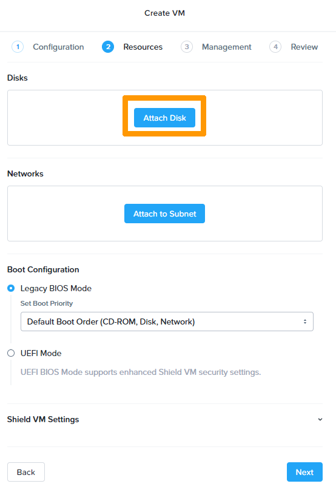
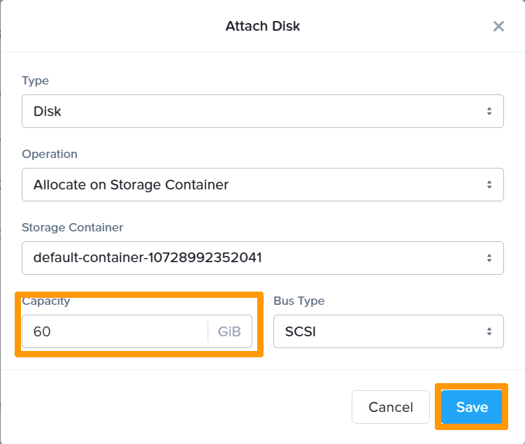
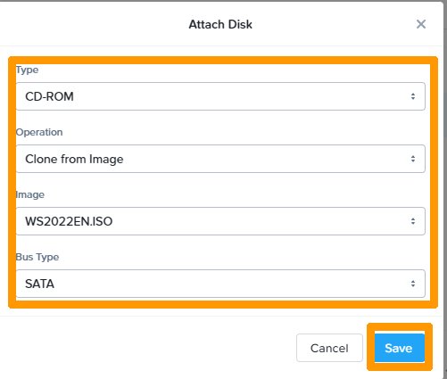
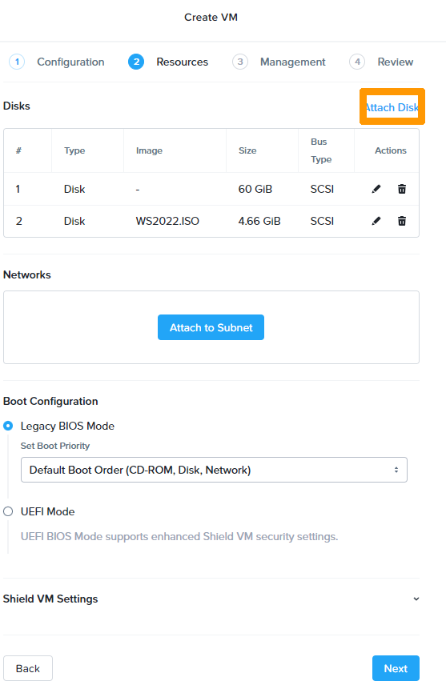
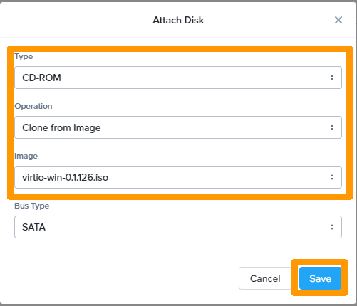
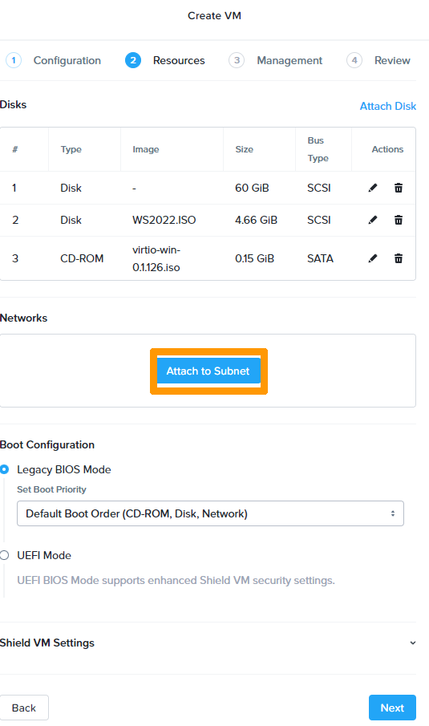
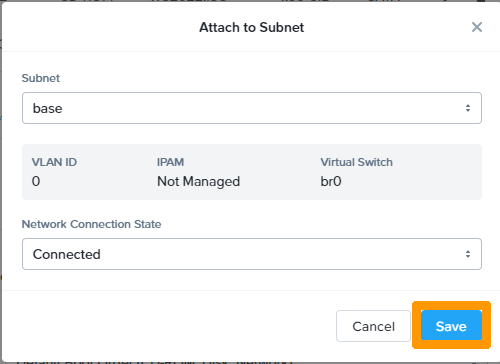
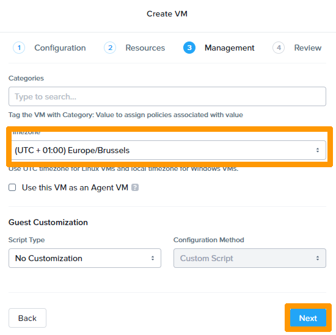
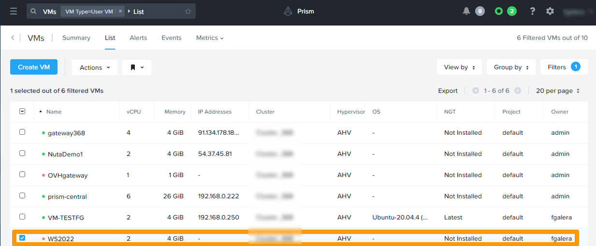
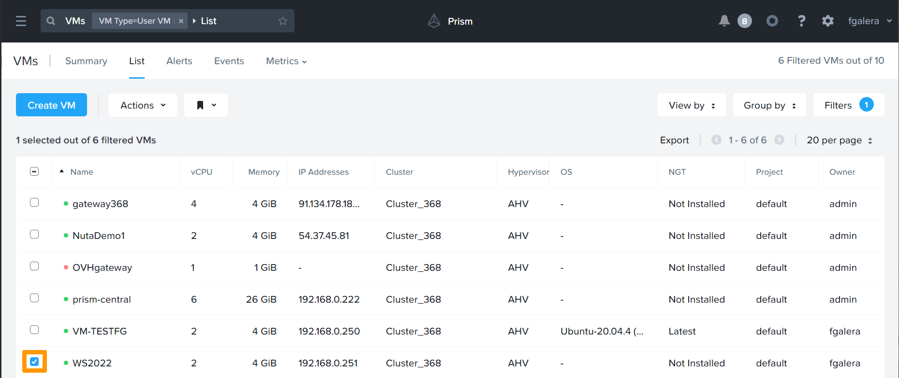

**Dernière mise à jour le 28/02/2022**

## Objectif

Connaitre la gestion des ordinateurs virtuels dans un cluster NUTANIX et être capable de créer, modifier et migrer un ordinateur virtuel.

> [!warning]
> OVHcloud vous met à disposition des services dont la configuration, la gestion et la responsabilité vous incombent. Il vous appartient donc de ce fait d’en assurer le bon fonctionnement.
>
> Ce guide a pour but de vous accompagner au mieux sur des tâches courantes. Néanmoins, nous vous recommandons de faire appel à un prestataire spécialisé si vous éprouvez des difficultés ou des doutes concernant l’administration, l’utilisation ou la mise en place d’un service sur un serveur.
>
> Certains logiciels nécessitent une licence comme les produits Microsoft il faudra alors s'assurer que tous les systèmes et logiciels installés possèdent ces licences.

## Prérequis

- Disposer d'un cluster Nutanix dans votre compte OVHcloud
- Être connecté à votre [espace client OVHcloud](https://www.ovh.com/auth/?action=gotomanager&from=https://www.ovh.com/fr/&ovhSubsidiary=fr)
- Être connecté à Prism Central sur le cluster

## Présentation de la gestion des ordinateurs virtuels dans Prism Central

Le système Nutanix utilise la même interface pour gérer le stockage et la virtualisation, il peut être installé avec plusieurs hyperviseurs (*HYPERV, VMWARE Esxi , Ahv*). *AHV* est fourni avec NUTANIX sans devoir acheter des licences supplémentaires pour l'hyperviseur. 

OVHCloud a fait le choix d'utiliser Nutanix avec l'hyperviseur *AHV*.

*AHV* permet :

* L'utilisation d'ordinateurs virtuels sous Windows et Linux.
* La migration d'ordinateurs virtuels d'un nœud à l'autre du cluster.
* La migro segmentation des VM au travers de **Flow**. 

L'outil **Move** permet de migrer facilement des VM existantes dans un autre environnement virtuel ou non vers Nutanix et son hyperviseur *AHV*.

Pour plus de détails sur *AHV* reportez-vous à la section « [Aller plus loin](#gofurther) » de ce guide.

Dans les cas pratiques nous allons voir coment créer un ordinateur virtuel pour Windows , modifier les ressources de cet ordinateur, installer le système d'exploitation WINDOWS, faire des snapshots et migrer la VM d'un nœud à l'autre du cluster.

## En pratique

Dans les cas pratiques nous allons voir coment créer un ordinateur virtuel pour Windows , modifier les ressources de cet ordinateur, installer le système d'exploitation WINDOWS, faire des snapshots et migrer la VM d'un nœud à l'autre du cluster.

`l'icone avec 3 traits`{.action} Pour copier si besoin

### Création d'une Ordinateur Virtuel

Nous allons créer une ordinateu virtuel pour installer Windows server 2022

Dans **Prism Central** dans le menu de gauche dépliez `Compute & Storage`{.action} et cliquez sur `VMs`{.action}

Cliquez sur `Create VM`{.action}

Saisissez un nom dans `Name`{.action}, Choisissez les options dans dans `VM Properties`{.action} et cliquez sur `Next`{.action}

Cliquez sur `Attach Disk`{.action}

Saisissez 60 `Capacity`{.action} et cliquez sur `Save`{.action} pour créer un disque de 60 Go

Cliquez sur `Attach Disk`{.action}

Rajoutez l'image ISO de l'installer de Windows Server 2022

Changez ces paramètres `Type`{.action} en **CD-ROM** `Operation`{.action} en **Clone from Image** , `Image`{.action} en **WS2022EN.ISO**

Cliquez sur `Save`{.action}

Cliquez `Attach Disk`{.action}

Rajoutez l'image ISO des pilotes spécifiques à *AHV* notamment le pilote contrôleur de disque.

Changez ces paramètres `Type`{.action} en **CD-ROM** `Operation`{.action} en **Clone from Image** , `Image`{.action} en **virtio-win-0.1.126.iso**

Cliquez sur `Save`{.action}

Cliquez sur `Attach Subnet`{.action}

Cliquez sur `Save`{.action}

Cliquez sur `Next`{.action}

dans timezone choisissez `zone`{.action} et cliquez sur `Next`{.action}

Cliquez sur `Create VM`{.action}

Dans le tableau de bord la nouvelle VM apparait 

 
L'ordinateur virtuel est maintenant créé l'étape suivante sera d'installer Windows

### Installation de Windows Server 2022

Sélectionnez la VM sur laquelle Windows Server 2022 sera installé en cliquant sur `Case à cocher VM à gauche`{.action}

 

### Création d'un SNAPSHOT

### Migration d'une VM

## Aller plus loin 

[Présentation d'un cluster Nutanix](https://docs.ovh.com/fr/nutanix/nutanix-hci/)

[Documentation Nutanix sur AHV]https://portal.nutanix.com/page/documents/details?targetId=AHV-Admin-Guide-v5_20:AHV-Admin-Guide-v5_20

[Les licences Nutanix](https://www.nutanix.com/products/software-options)

Échangez avec notre communauté d'utilisateurs sur <https://community.ovh.com/>.