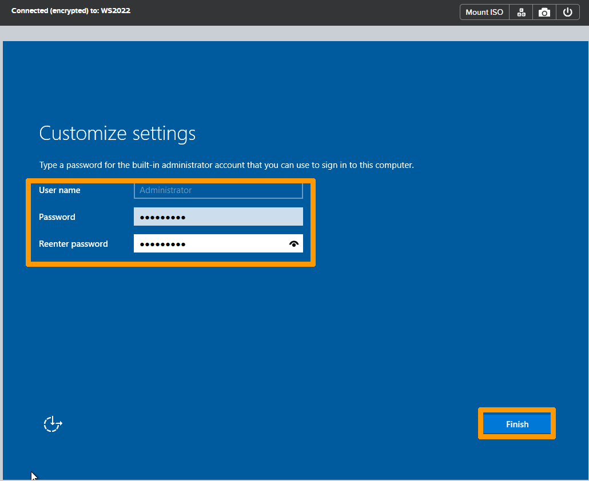
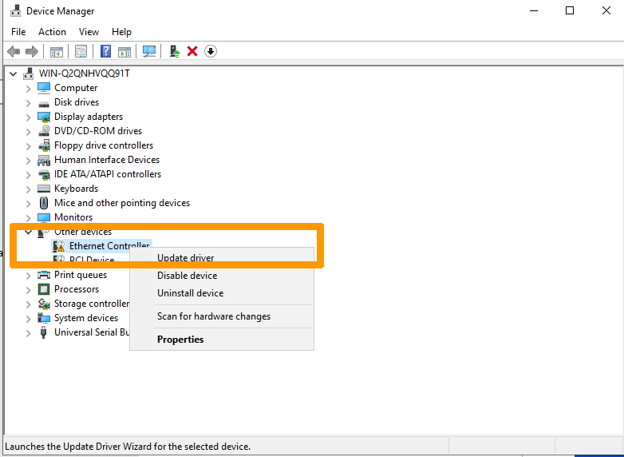
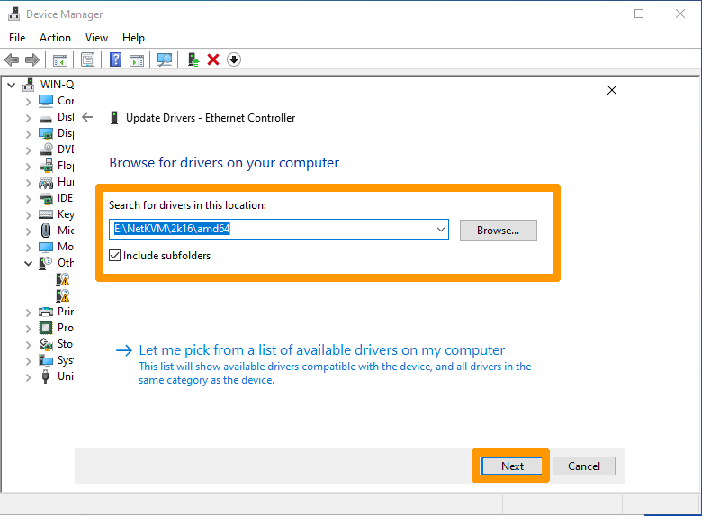
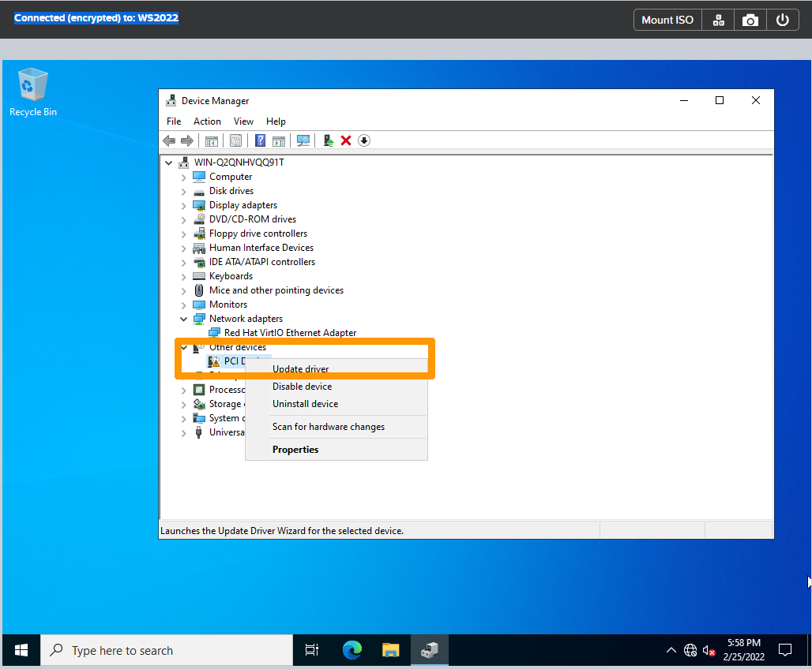

**Dernière mise à jour le 10/03/2022**

## Objectif

Découvrez comment gérer des machines virtuelles dans un cluster Nutanix et comment créer et migrer une machine virtuelle.

> [!warning]
> OVHcloud vous met à disposition des services dont la configuration, la gestion et la responsabilité vous incombent. Il vous appartient donc de ce fait d’en assurer le bon fonctionnement.
>
> Ce guide a pour but de vous accompagner au mieux sur des tâches courantes. Néanmoins, nous vous recommandons de faire appel à un prestataire spécialisé si vous éprouvez des difficultés ou des doutes concernant l’administration, l’utilisation ou la mise en place d’un service sur un serveur.
>
> Certains logiciels nécessitent une licence comme les produits Microsoft il faudra alors s'assurer que tous les systèmes et logiciels installés possèdent ces licences.

## Prérequis

- Disposer d'un cluster Nutanix dans votre compte OVHcloud
- Être connecté à votre [espace client OVHcloud](https://ca.ovh.com/auth/?action=gotomanager&from=https://www.ovh.com/ca/fr/&ovhSubsidiary=qc)
- Être connecté à Prism Central sur le cluster

## Présentation de la gestion des machines virtuelles dans Prism Central

Le système Nutanix utilise les mêmes interfaces pour gérer le stockage et la virtualisation, il peut être installé avec plusieurs hyperviseurs (**Hyper-V, VMware ESXi , AHV**). **AHV** est fourni avec Nutanix sans devoir acheter de licences supplémentaires pour l'hyperviseur. 

L'offre d'OVHcloud est fournie avec l'hyperviseur **AHV**.

**AHV** permet entre autres :

- L'utilisation de machines virtuelles sous Windows et Linux.
- La migration de machines virtuelles d'un nœud à l'autre d'un cluster.
- La micro-segmentation et la sécurisation du réseau entre machines virtuelles en utilisant le logiciel **Flow**. 

L'outil **Move** permet de migrer facilement des machines virtuelles existantes sur d'autres environnements (**ESXi, Hyper-V & AWS**) vers Nutanix et son hyperviseur **AHV**.

Pour plus de détails sur **AHV**, reportez-vous à la section « [Aller plus loin](#gofurther) » de ce guide.

## En pratique

Les cas pratiques ci-dessous montrent la création d'une machine virtuelle sous Windows Server 2022 et de la migration d'un machine virtuelle.

### Création d'une Ordinateur virtuel pour un système d'exploitation Windows 2022

L'installation d'une machine virtuelle sous Windows Server 2022 nécessite un paramétrage particulier car Microsoft ne fournit pas le pilote pour le contrôleur de disques de l'hyperviseur **AHV**.

#### Création d'une machine virtuelle Windows Server 2022
 
Dans le menu de gauche de **Prism Central**, dépliez `Compute & Storage`{.action} et cliquez sur `VMs`{.action}

{.thumbnail}

Cliquez sur le bouton `Create VM`{.action}.

{.thumbnail}

Saisissez un nom dans `Name`{.action}, choisissez les options dans `VM Properties`{.action} et cliquez sur `Next`{.action}

{.thumbnail}

##### **Ajout d'un disque système**

Cliquez sur le bouton`Attach Disk`{.action}.

{.thumbnail}

Saisissez **60** dans le champ `capacity` et cliquez sur `Save`{.action} pour créer un disque de 60 Go.

{.thumbnail}

##### **Ajout de l'image ISO de l'installation de Windows Server 2022**

L'image doit être importée avant d'être utilisable dans une nouvelle machine virtuelle.

Pour plus de détails sur l'importation d'images, reportez-vous à la section « [Aller plus loin](#gofurther) » de ce guide.

Cliquez sur `Attach Disk`{.action}.

{.thumbnail}

Modifiez les paramètres `Type`{.action} en **CD-ROM**, `Operation`{.action} en **Clone from Image** , `Image`{.action} en **WS2022EN.ISO**.

Cliquez sur `Save`{.action}.

{.thumbnail}

##### **Ajout de l'image ISO contenant les pilotes spécifiques à AHV** 

Cette image contient notamment le pilote du contrôleur de disques et doit aussi être importée. Elle est disponible sur le site Internet de Nutanix si vous disposez d'un compte client Nutanix.

Cliquez sur `Attach Disk`{.action}.

{.thumbnail}

Modifiez les paramètres `Type`{.action} en **CD-ROM** `Operation`{.action} en **Clone from Image** , `Image`{.action} en **virtio-win-0.1.126.iso**.

Cliquez sur `Save`{.action}.

{.thumbnail}

##### **Configuration du réseau**

Cliquez sur `Attach Subnet`{.action}.

{.thumbnail}

Laissez les champs par défaut et cliquez sur `Save`{.action}.

{.thumbnail}

Cliquez sur `Next`{.action}.

{.thumbnail}

Choisissez le fuseau horaire de votre pays dans le champ `Timezone`{.action} et cliquez sur `Next`{.action}.

{.thumbnail}

Cliquez sur `Create VM`{.action}.

{.thumbnail}

La machine virtuelle nouvellement créée apparaît alors dans le tableau de bord.

{.thumbnail}.
 
#### Installation de Windows Server 2022

Sélectionnez la machine virtuelle sur laquelle vous souhaitez installer Windows Server 2022, en cochant la case située à gauche de la VM

{.thumbnail}

##### **Démarrer la machine virtuelle**

Cliquez sur le menu `Actions`{.action} puis sur `Power ON`{.action}.

{.thumbnail}

##### **Lancer la console**

Cliquez sur le menu `Actions`{.action} puis sur `Launch Console`{.action}.

{.thumbnail}

##### **Commencer l'installation**

Choisissez vos paramètres régionaux et cliquez sur `Next`{.action}

{.thumbnail}

Cliquez sur `Install now`{.action}.

{.thumbnail}

Sélectionnez **Windows Server 2022 Standard (Desktop Experience)** et cliquez sur `Next`{.action}.

{.thumbnail}

Prenez connaissance des termes et conditions liés à la licence logicielle Microsoft, validez leur acceptation et cliquez sur `Next`{.action}.

{.thumbnail}

Cliquez sur `Load driver`{.action}.

{.thumbnail}

Cliquez sur `Browse`{.action}.

{.thumbnail}

Sélectionnez le bon dossier `e:\vioscsi\2k16\amd64` et cliquez sur `OK`{.action}.

{.thumbnail}

Sélectionnnez `Red Hat VirtIO SCSI etc..`{.action} et cliquez sur `Next`{.action}.

{.thumbnail}

Le disque de 60 GB apparaît, cliquez sur `Next`{.action}.

{.thumbnail}

Attendez la fin de l'installation.

{.thumbnail}

{.thumbnail}

{.thumbnail}

Saisissez et confirmez le mot de passe dans les deux champs prévus à cet effet et cliquez sur `Finish`{.action}.

{.thumbnail}

##### **Installer les pilotes**

Allez à présent dans le gestionnaire de périphériques de Windows pour installer le pilote de la carte réseau et un pilote système spécifique à **AHV**.

Faites un clic-droit sur **Ethernet Controller** et cliquez sur `Update Driver`{.action}.

{.thumbnail}

Selectionnez le dossier **E:\NetKVM\2k16\amd64** et cliquez sur `Next`{.action}.

{.thumbnail}

Cliquez sur `Install`{.action}.

{.thumbnail}

Faites clic-droit sur **PCI Device** dans **Other Devices** et cliquez sur `Update Driver`{.action}.

{.thumbnail}

Sélectionnez le dossier **E:\Balloon\2k16\amd64** et cliquez sur `Next`{.action}.

{.thumbnail}

Pour finir l'installation, cliquez sur `Close`{.action}.

{.thumbnail}

#### Installation des NGT (Nutanix Guest Tools)

Les NGT sont des outils qui permettent une meilleure interaction avec Nutanix, notamment au niveau des sauvegardes et des snapshots.

Lancez la console de la machine virtuelle, faites un clic-droit sur un lecteur de CDROM et cliquez sur `Eject`{.action}.

{.thumbnail}

Revenez dans Prism Central et sélectionnez la machine virtuelle.

{.thumbnail}

Dans le menu `Actions`{.action}, cliquez sur `Install NGT`{.action}.

{.thumbnail}

Cliquez sur `Confirm & Enter Password`{.action}. 

{.thumbnail}

Cliquez sur `Skip and Mount`{.action}.

{.thumbnail}

Revenez dans la console de la machine virtuelle et faites un clic-droit sur le lecteur de CDROM contenant les NGT.

Choisissez `Install Nutanix Guest Tools`{.action}.

{.thumbnail}

Prenez connaissance des termes et conditions, acceptez-les puis cliquez sur `Install`{.action}.

{.thumbnail}

L'installation se lance alors.

{.thumbnail}

Une fois l'installation terminée, fermez l'assistant d'installation via le bouton `Close`{.action}.

{.thumbnail}

L'installation d'une machine virtuelle sous Windows est alors entierement terminée.

### Migration d'une machine virtuelle

La migration d'une machine virtuelle consiste à déplacer une VM à chaud d'un nœud à l'autre d'un cluster. 

Si vous disposez de plusieurs clusters et des licences appropriées, vous pouvez également procéder à une migration d'une VM d'un cluster à l'autre. 

Cette documentation n'illustre que la migration d'une VM à l'intérieur d'un seul et même cluster.

Dans la gestion des machines virtuelles de Prism Central, cliquez sur `WS2022N`{.action}.

{.thumbnail}

Vérifiez sur quel nœud la VM fonctionne actuellement. Il est affiché à coté de **Host**.

{.thumbnail}

Cliquez sur le bouton `More`{.action} puis sur `Migrate`{.action}.

{.thumbnail}

Choisissez un nœud de destination.

{.thumbnail}

Le nom du nouveau nœud apparaîtra en face de **Host** si la  migration s'est bien terminée.

{.thumbnail}

## Aller plus loin 

[Présentation d'un cluster Nutanix](https://docs.ovh.com/ca/fr/nutanix/nutanix-hci/)

[Importation d'images dans Nutanix](https://docs.ovh.com/ca/fr/nutanix/image-import/)

[Documentation Nutanix sur AHV](https://portal.nutanix.com/page/documents/details?targetId=AHV-Admin-Guide-v5_20:AHV-Admin-Guide-v5_20)

[Les licences Nutanix](https://www.nutanix.com/products/software-options)

Échangez avec notre communauté d'utilisateurs sur <https://community.ovh.com/>.
