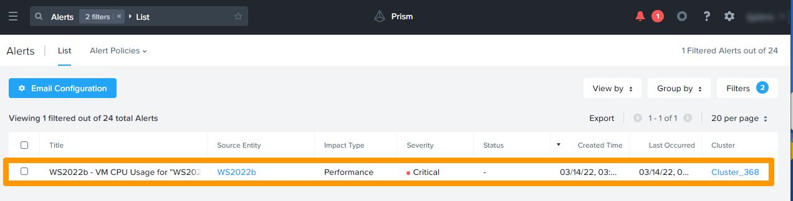
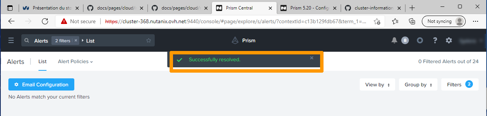
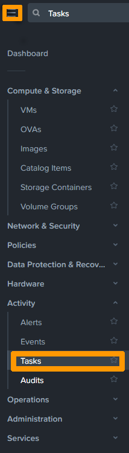

**Last updated 17th March 2022**

## Objective

This guide details how to view alerts and events, and create custom alerts.

> [!warning]
> OVHcloud provides services for which you are responsible, with regard to their configuration and management. It is therefore your responsibility to ensure that they work properly.
>
> This guide is designed to assist you as much as possible with common tasks. Nevertheless, we recommend contacting a specialist provider if you experience any difficulties or doubts when it comes to managing, using or setting up a service on a server.
>

## Requirements

- A Nutanix cluster in your OVHcloud account
- Access to the [OVHcloud Control Panel](https://www.ovh.com/auth/?action=gotomanager&from=https://www.ovh.ie/&ovhSubsidiary=ie)
- You must be connected to the cluster via Prism Central

## Defining alerts, events, and tasks in Prism Central

Everything that happens in a cluster associated with Prism Central is recorded in the **events**.

When an anomaly occurs, such as excessive CPU usage on a virtual machine, **alerts** are triggered automatically. 
Prism Central alerts are in addition to Prism Element alerts.

You can add custom alerts to increase sensitivity on an item in the cluster. 
Alerts can be sent to recipients through e-mail.

Each action that a Prism Central user performs appears as a **task** and is listed with a *complete*, *in progress*, or *in error* status.

## Instructions

### Configuring SMTP Server in Prism Central

In order for **Prism Central** to send alerts, you must configure an SMTP server.

Click the `Gear`{.action} icon in the top right of the **Prism Central** interface to configure it.

{.thumbnail}

In the right-hand menu, click `SMTP Server`{.action}.

Enter the SMTP server sending settings and click `Save`{.action}.

{.thumbnail}

### Managing alerts 

Open the main menu in the top left-hand corner.

Select `Alerts`{.action} from the Activity menu.

{.thumbnail}

The list of triggered alerts appears. Configure recipients by clicking `Email Configuration`{.action}.

{.thumbnail}

Enter recipient names in the "Email Recipients" input box and click `Save`{.action}.

{.thumbnail}

#### Creating a custom alert

To create a custom alert with different trigger thresholds, click `Alerts Policies`{.action} and select `User Defined`{.action}. 

{.thumbnail}

Then click `Create Alert Policy`{.action}.

On the left, select the settings you want to monitor, such as, in the example below, CPU usage on a single virtual machine.

Next, modify the Behavioral Anomaly settings by ticking `Every time there is an anomaly, alert`{.action} and choosing `Critical`{.action}.

Change the "Static Threshold" settings by ticking `Alert Critical if`{.action} and choosing a threshold higher than 60%.

Click `Save`{.action} to save the custom alert.

{.thumbnail}

The alert you have created will then appear in the list.

{.thumbnail}

#### Resolving an alarm

In **Prism Central**, when an alarm is triggered, a red circle appears in the top right next to a bell. This alert will disappear after 180 minutes if the threshold has returned to normal.

The trigger threshold may return to normal within 180 minutes. In this case, you can delete the alert manually.

To delete an alert manually, click the red numbered circle.

{.thumbnail}

The raised alarm appears.

{.thumbnail}

Select the alarm and click `Resolve`{.action}.

{.thumbnail}

The alarm is then resolved and no longer appears in the **Prism Central dashboard**.

{.thumbnail}

### Viewing Events

Click in the main menu in the top left-hand corner.

Select `Events`{.action} from the Activity menu.

{.thumbnail}

The list of events is displayed.

{.thumbnail}

### Viewing Tasks

Click in the main menu in the top left-hand corner.

Select `Tasks`{.action} from the Activity menu.

{.thumbnail}

The task list appears.

{.thumbnail}

## Go further 

[Alert and event management in Prism Central](https://portal.nutanix.com/page/documents/details?targetId=Prism-Central-Guide-Prism-v5_20:mul-alerts-management-pc-c.html)

Join our community of users on <https://community.ovh.com/en/>.
