**Last updated 16th May 2022**

## Objective

Once an upgrade of one Nutanix software component is needed, let's review all the main steps to apply it.

**This guide explain the steps to upgrade your Nutanix Cluster.**

## Requirements

- A Nutanix Cluster in your OVHcloud account
- Access to the [OVHcloud Control Panel](https://www.ovh.com/auth/?action=gotomanager&from=https://www.ovh.es/&ovhSubsidiary=es)

> [!warning]
> OVHcloud is providing you with services for which you are responsible, with regard to their configuration and management. You are therefore responsible for ensuring they function correctly.
>
> This guide is designed to assist you in common tasks as much as possible. Nevertheless, we recommend that you contact a specialist service provider if you have difficulties or doubts concerning the administration, usage or implementation of services on a server.
>

## Instructions

### Official documentation for upgrades

You can either look for this document: "The Nutanix upgrades: Life Cycle Manager" or visit the official Nutanix website for archived documents: [Software Documentation: Upgrade Guide](https://portal.nutanix.com/page/documents/details?targetId=Acropolis-Upgrade-Guide-v5_20:Acropolis-Upgrade-Guide-v5_20){.external}.

### Backup

As for any action on the configuration of the cluster system, it is strongly recommended to create a new backup or check the latest one.

### Items to update

Some updates are done from **Prism Central**. These are updates for:

- **Prism Central** itself
- **NCC*

Some other updated must be run from the **Prism Element**. These are updates for:

- **LCM**
- **AOS**
- **Foundation**
- **AHV**

> [!warning]
>
> Before performing an update, make sure that the versions of **Prim Element** are supported by OVHcloud and that the version of **Prism Central** to be updated is compatible with **Prism Element**
>
> Supported versions of **Prism Element** by OVHcloud are 5.20 LTS and 6.1 STS. You can update these subversions, but it is best to wait a month after a new subversion is released.
>
> The compatibility of the version of **Prism Central** with **Prism Element** can be checked on the [NUTANIX Interoperability](https://portal.nutanix.com/page/documents/compatibility-interoperability-matrix/interoperability) website if you have a customer account on the Nutanix website.
>

### Prism Central Upgrade

#### LCM Inventory

As documented in the official upgrade process, you should first launch a LCM Inventory to get a view of the software status of the Nutanix Cluster.

{.thumbnail}

Proceed to run the first or a new Inventory update:

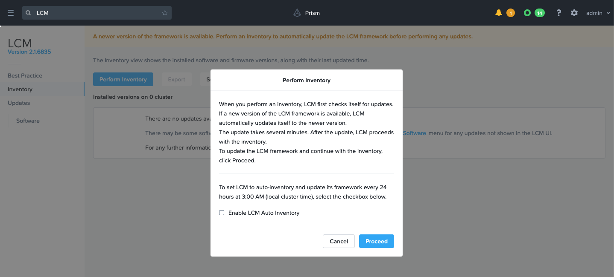{.thumbnail}

After a pre-check phase, you will receive the results as soon as the inventory is done. The available upgrades will be displayed:

{.thumbnail}

Select the upgrades you want or update all components. You can also decide to manage those upgrades directly as explained in the next two sections.

#### Performing the upgrade

Once you are certain that you can launch the upgrade, open the `Prism Central Settings`{.action}:

{.thumbnail}

If there are available upgrades, you can select the ones you need to apply, then choose to only do the pre-check or upgrade immediately:

{.thumbnail}

The pre-check will be executed in any case:

{.thumbnail}

If you have selected the upgrade process, the process itself will be initiated:

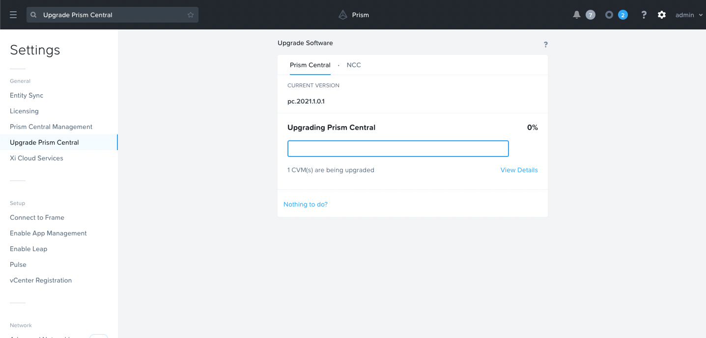{.thumbnail}

During the execution, you might lose the connection to Prism Central:

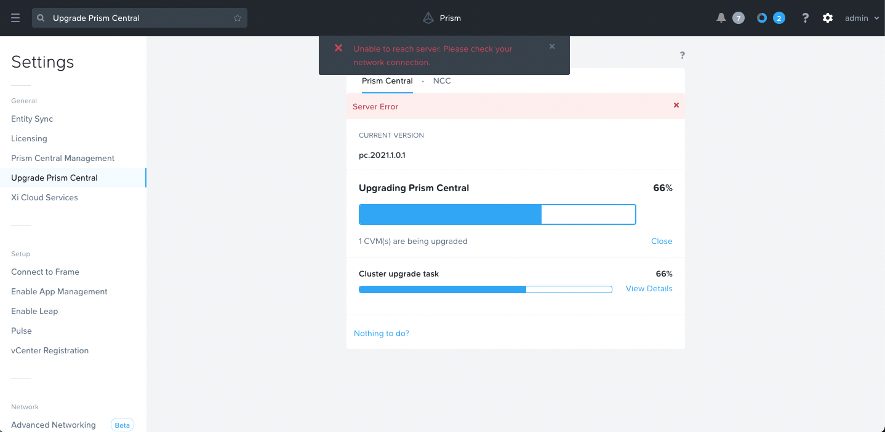{.thumbnail}

After a few minutes, you can connect back to the Prism Central interface, and you can then check or wait for the end of the upgrade process:

{.thumbnail}

#### NCC upgrade

If there is one or more NCC upgrades available, you can download the ones you need and then launch the upgrade:

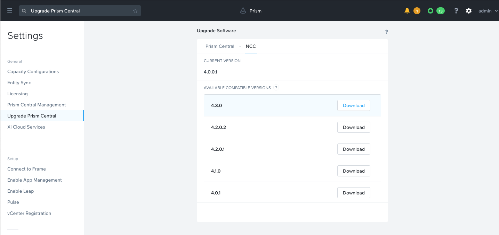{.thumbnail}

#### Validation

##### **LCM Inventory update**

Update the LCM inventory. If no upgrades are available anymore, then only the list of installed software components releases will be presented:

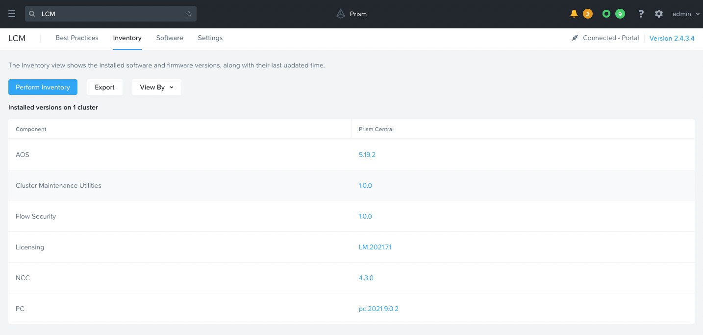{.thumbnail}

##### **Prism Central upgrade validation**

You can also check that the Nutanix Cluster Prism Central is up-to-date if there is no upgrade available for your cluster: Click on the `Prism Central Settings`{.action} and open `Upgrade Prism Central`{.action}. There should be no available versions:

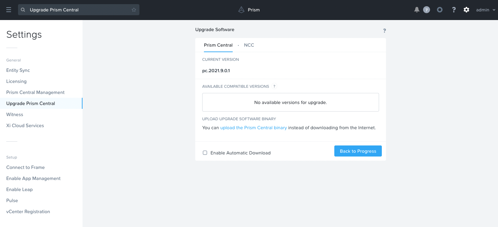{.thumbnail}

##### **NCC upgrade validation**

You can also check that the Nutanix Cluster NCC is up-to-date if there is no upgrade available for your cluster: Click on the `Prism Central Settings`{.action} and open `Upgrade Prism Central`{.action}. There should be no available versions in the NCC tab:

{.thumbnail}

### Updating Prism Element

From the **Prism Central** dashboard, in the **Cluster Quick Access** frame, click your cluster.

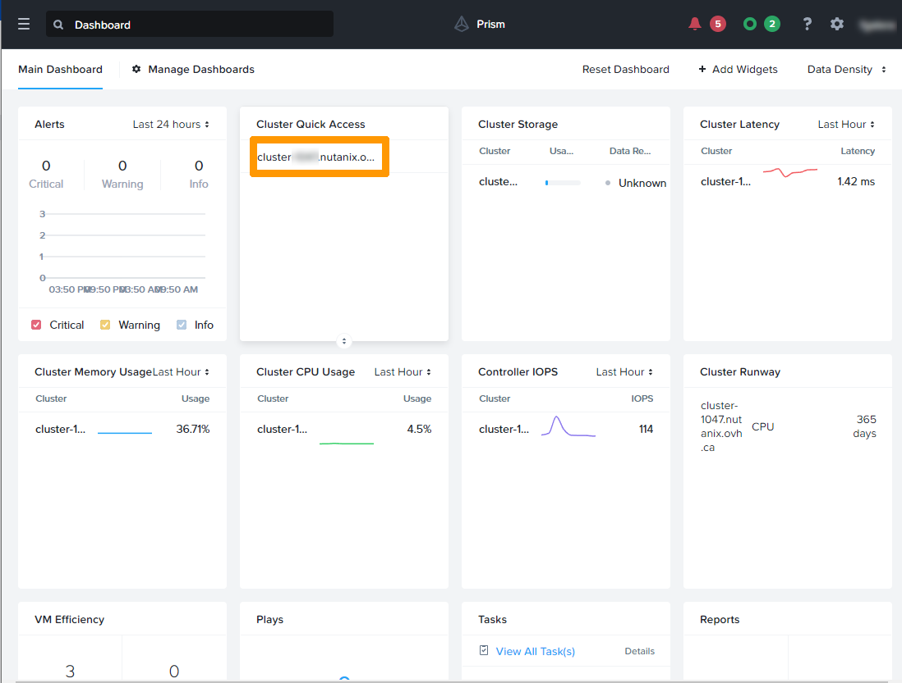{.thumbnail}

Open the Menu and click on `LCM`{.action}.

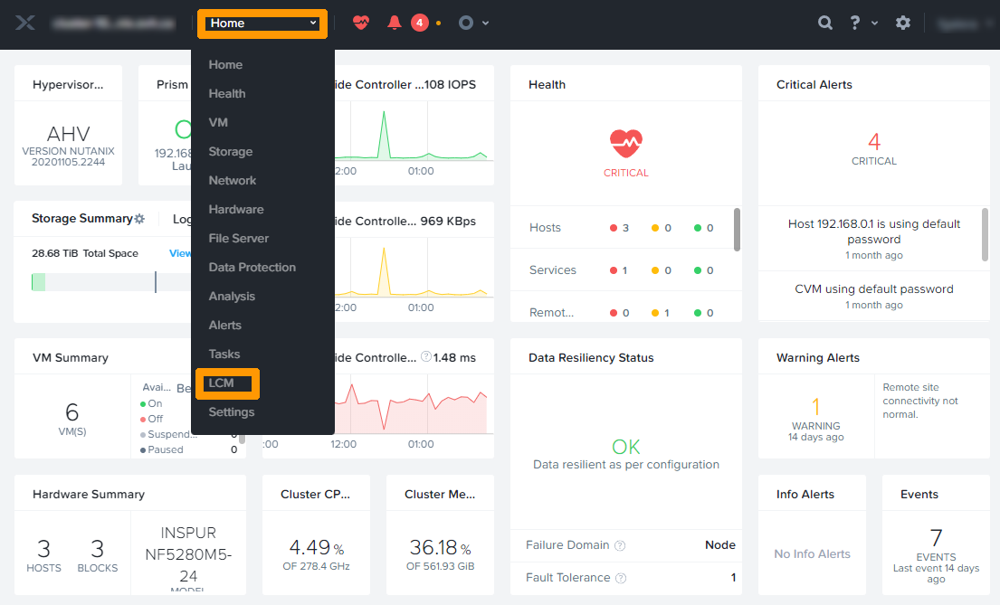{.thumbnail}

Click the `Perform Inventory`{.action} button.

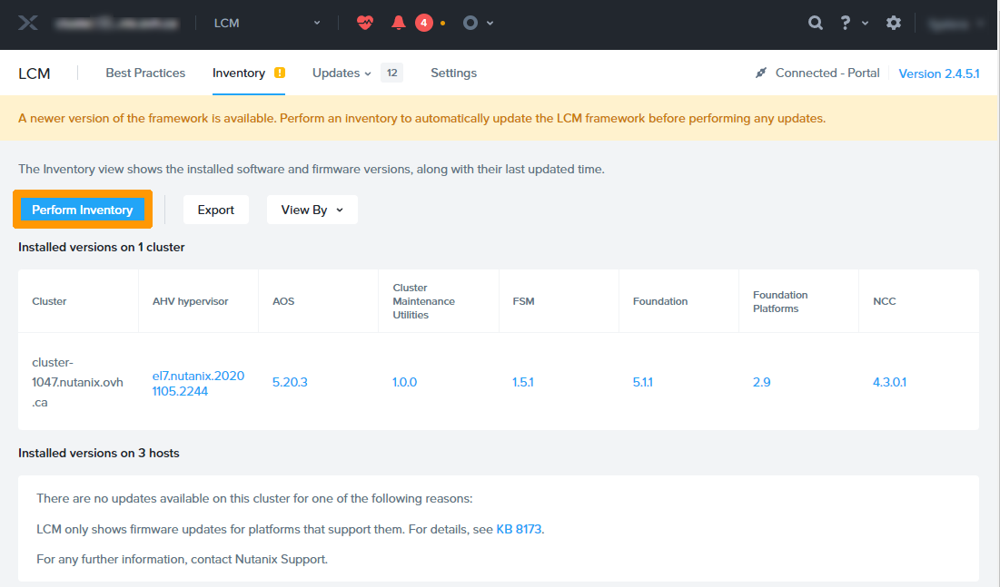{.thumbnail}

Click `Proceed`{.action}.

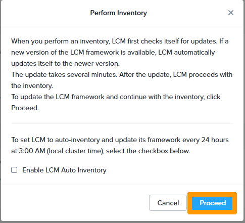{.thumbnail}

Click `Back to Inventory`{.action}.

{.thumbnail}

First, we will update **NCC**.

Check `NCC`{.action} and click `View Update Plan`{.action}.

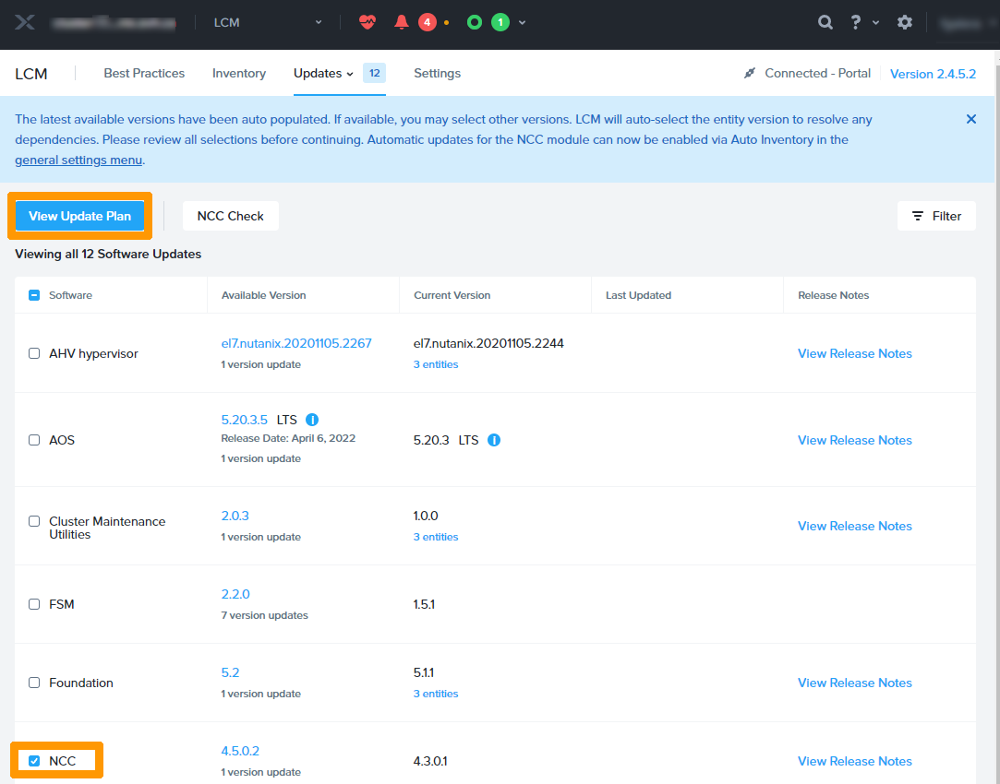{.thumbnail}

Click `Apply 1 Updates`{.action}.

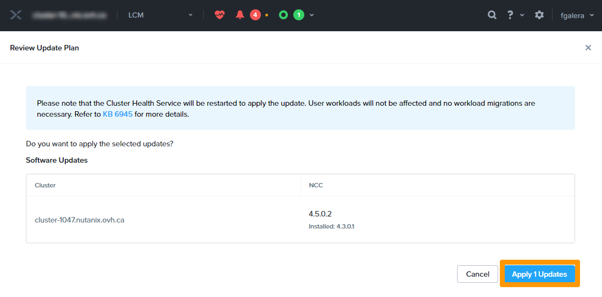{.thumbnail}

Click `Back to Software Updates`{.action}.

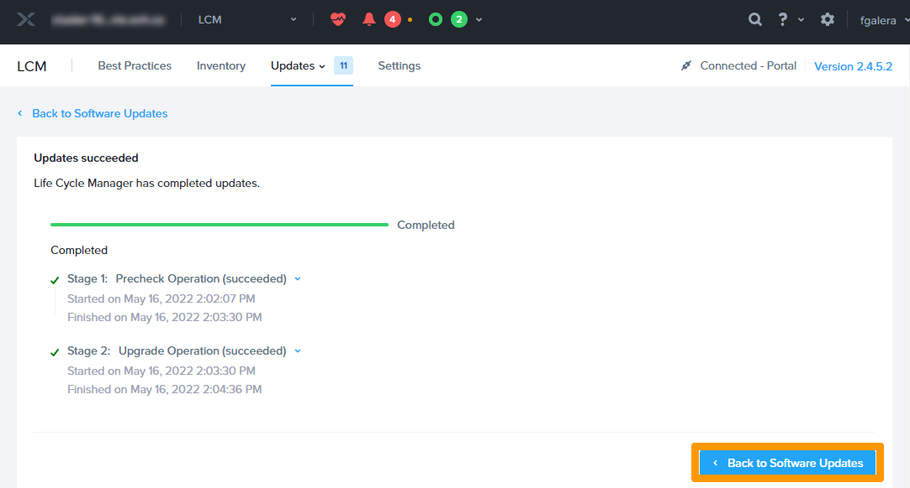{.thumbnail}

Click `NCC Check`{.action} to check the system before major updates.

{.thumbnail}

Leave `All Checks` and click `Run`{.action}.

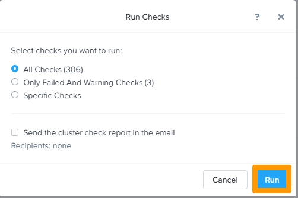{.thumbnail}

Wait for the `Health check` task to complete. You can view it in the `Tasks`{.action} menu.

{.thumbnail}

Select all available updates and click `View Update Plan`{.action}.

{.thumbnail}

Click `Next`{.action}.

{.thumbnail}

Click `Apply N Updates`{.action}.

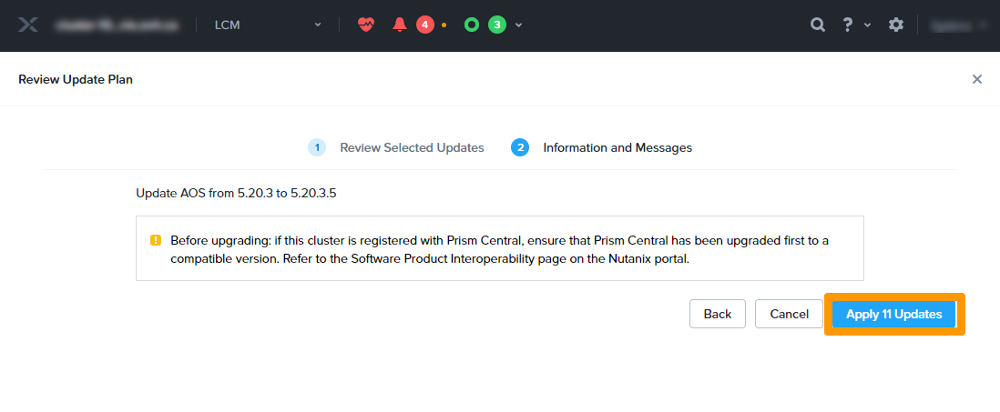{.thumbnail}

> [!warning]
> The update process can be very long, it is possible that some slowdowns occur but no downtime is to be expected.
>

## Go further

[OVHcloud documentation](https://docs.ovh.com/es/nutanix/)

[Nutanix official documentation](https://www.nutanix.com/){.external}

Join our community of users on <https://community.ovh.com/en/>.
