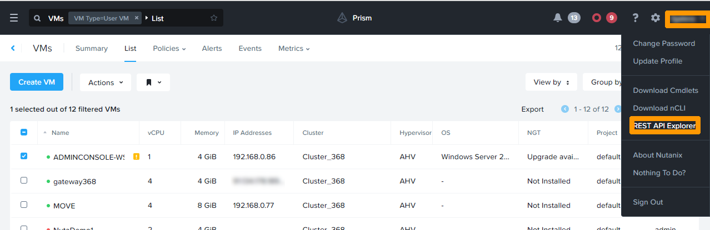
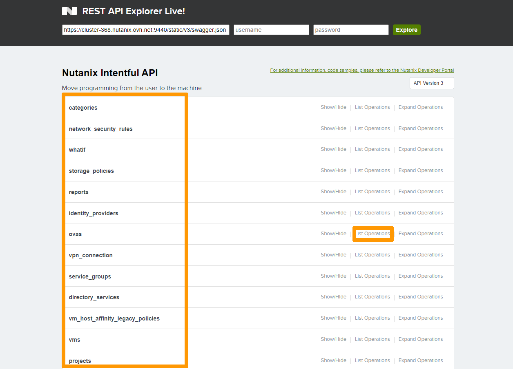
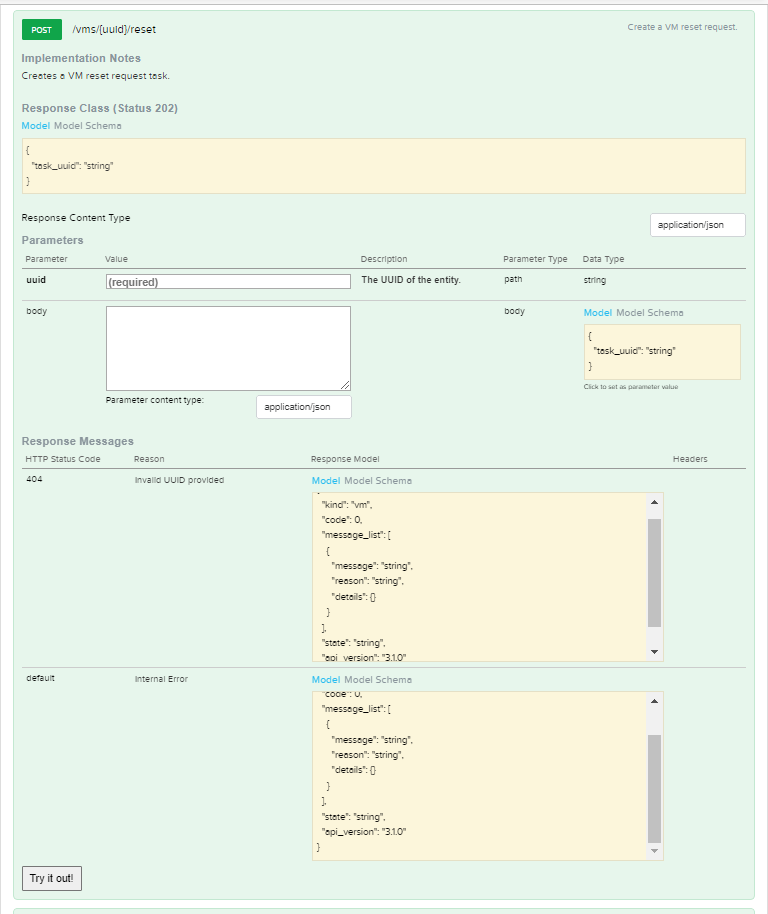

**Last updated 28th March 2022**

## Objective

This guide will show you all the administration tools, other than the **Prism Central** and **Prim Element** web interfaces, which are:

- ncli which can be accessed locally, via SSH on **Prism Central** and **Prism Element**.
- acli which can be used via SSH on **CVMs**.
- Cmdlets for **Powershell**.
- The **REST API** from the **Prism Central** or **Prism Element** URL.

> [!warning]
> OVHcloud provides services for which you are responsible, with regard to their configuration and management. It is therefore your responsibility to ensure that they work properly.
>
> This guide is designed to assist you as much as possible with common tasks. Nevertheless, we recommend contacting a specialist provider if you experience any difficulties or doubts when it comes to managing, using or setting up a service on a server.
>

## Requirements

- a Nutanix cluster in your OVHcloud account
- access to the [OVHcloud Control Panel](https://ca.ovh.com/auth/?action=gotomanager&from=https://www.ovh.com/world/&ovhSubsidiary=ws)
- For the **REST API**, you must have a virtual machine running Linux with a text editor to run the **curl** and **jq** commands.

> [!primary]
> Some commands can only be used if you have SSH access to **Prism Central** and **Prism Element**.
>

## Tools overview

### ncli command

**ncli** is located on **Prism Central** and all **CVMs** through an SSH connection. You can also install it locally on a Windows or Linux desktop from the **Prism Central** web interface.

**ncli** allows you to manage aspects of the Nutanix cluster such as storage, tasks and some actions on virtual machines within the cluster.

### acli tool

The acli command is only available on **CVMs**. It is used for managing VMs, network and snapshot hosts. 

### **Powershell** extensions

Powershell is a scripting language developed by Microsoft and based on **Net.Framework**. 

It works in **Microsoft**, **Linux** and **MacOS** environments but is mainly used in a **Microsoft** environment.<br>
All of the examples below have been run only on this environment.

Nutanix has added extensions that allow cluster and VM administration using Powershell scripts.

### **API REST** administration interface

Through the URL of **Prism Central** or **Prism Element**, you can use an **API** named **REST API** either in the command line with the **curl** tool, or through another programming language such as **python** or **php** or even with the standard commands of **Powershell**.

For more information on these commands, see the [Go further](#gofurther) section of this guide.

## Instructions

### Examples of **ncli** use

Connect via SSH with an SSH client on one of the **CVMs**:

```bash
ssh nutanix@oneofcvm
```

The ncli command is used followed by options, as in this example ```ncli entity action option1=`value` option2=`value2``` but it also can be used interactively by running only ```ncli```.

#### Creating a Storage Container named **newcontainer** in interactive mode

```bash
ncli
<ncli> 
<ncli> ctr create name="NewContainer" sp-name="default-storage-pool-10728992352041"

    Id                        : 0005ce15-3f3c-a8ce-3802-043f72bf18a6::2900908
    Uuid                      : c3db4020-2a98-4636-b9eb-8ebf10a1b351
    Name                      : Moncontainer
    Storage Pool Id           : 0005ce15-3f3c-a8ce-3802-043f72bf18a6::9
    Storage Pool Uuid         : 111d4e91-10df-4f6c-a774-b79b53077131
    Free Space (Logical)      : 37.69 TiB (41,445,056,716,652 bytes)
    Used Space (Logical)      : 0 bytes
    Allowed Max Capacity      : 37.69 TiB (41,445,056,716,652 bytes)
    Used by other Containers  : 260.86 GiB (280,096,141,312 bytes)
    Explicit Reservation      : 0 bytes
    Thick Provisioned         : 0 bytes
    Replication Factor        : 2
    Oplog Replication Factor  : 2
    NFS Whitelist Inherited   : true
    Container NFS Whitelist   : 192.168.0.77/255.255.255.255
    VStore Name(s)            : Moncontainer
    Random I/O Pri Order      : SSD-PCIe, SSD-SATA, DAS-SATA
    Sequential I/O Pri Order  : SSD-PCIe, SSD-SATA, DAS-SATA
    Compression               : off
    Fingerprint On Write      : off
    On-Disk Dedup             : off
    Erasure Code              : off
    Software Encryption       : off
<ncli> 
```

#### Deleting the **Storage Container**

Run the following command to delete the **Storage Container** without confirmation:

```bash
ncli ctr remove name="Newcontainer"
```

### Examples of using the **acli** command

Connect via SSH with an SSH client on one of the **CVMs**:

```bash
ssh nutanix@oneofcvmipaddress
```

The acli command is used followed by options, such as ```acli entities.action for-which option1="value1" option2="value2"```, but it also can be used interactively by running only ```acli``` from a **CVM**

If **acli** is used followed by a sequence of orders, a confirmation request will always be offered if a choice is made.

To automate the task and make a default choice, use this syntax instead ```acli -y entities.action for-which option1="value" option2="value2"```

#### Creating a **snapshot** in interactive mode

Run these commands from one of the **CVMs**:

```bash
acli 
<acropolis> vm.snapshot_create VM-TEST snapshot_name_list="Example"
<acropolis> exit
```

#### View and delete a **snapshot** without going through interactive mode

Run these commands to view and delete a snapshot with a confirmation request:

```bash
# Snapshot listing
acli snapshot.list
Snapshot Name  Snapshot ID                           Creation Time                         VM Name
Example2       fce5483f-5a9d-4b76-9ad7-48685fb4a638  Wednesday March 23 2022, 09:27:16 AM  VM-TEST
# Snapshot delete
acli snapshot.delete Example2
Delete 1 snapshots? (yes/no)
Delete 1 snapshots? (yes/no) yes
Example2: pending
Example2: complete
```

Use this syntax without prompting when deleting the snapshot:

```bash
# Snapshot delete
acli -y snapshot.delete Example2
Example2: pending
Example2: complete
```

### How to configure and use **Powershell** on Windows

#### Installing **Powershell** 7 and Nutanix modules

You need to install the latest version of **Powershell** from this [Powershell installation website](https://docs.microsoft.com/en-us/powershell/scripting/install/installing-powershell-on-windows?view=powershell-7.2#msi).

Download and install the installer that corresponds to your version of Windows, in 32 bits or more generally in 64 bits.<br>
Launch the Powershell 7 command prompt in administrator mode.

```powershell
PS C:\Users\Administrator> Install-Module Nutanix.Cli

Untrusted repository
You are installing the modules from an untrusted repository. If you trust this repository, change its
InstallationPolicy value by running the Set-PSRepository cmdlet. Are you sure you want to install the modules from
'PSGallery'?
[Y] Yes  [A] Yes to All  [N] No  [L] No to All  [S] Suspend  [?] Help (default is "N"):A
PS C:\Users\Administrator> Install-module Nutanix.Prism.PS.Cmds
PS C:\Users\Administrator> Install-module Nutanix.Prism.Common
```

#### Command examples with Powershell for Nutanix

Import modules for Powershell from the **PowerShell 7** console:

```powershell
PS C:\Users\Administrator> Import-Module Nutanix.Cli -Prefix NTNX
PS C:\Users\Administrator> Import-Module Nutanix.Prism.Common -Prefix NTNX
PS C:\Users\Administrator> Import-Module Nutanix.Prism.PS.Cmds -Prefix NTNX
```

Log in to Prism Central by executing the command below and edit these items:

- `< PRISM CENTRAL IP >` replace this item with the IP address or FQDN of **Prism Central**
- `< PRISM CENTRAL USERNAME >` replace this item with the **Prism Central** user name

```powershell
PS C:\Users\Administrator> Connect-NTNXPrismCentral <PRISM CENTRAL IP>  -UserName < PRISM CENTRAL USERNAME > -AcceptInvalidSSLCerts
Password: *****************
[Warning]: This Prism Central version[pc.2022.1] might not be compatible.This might cause some cmdlets to not function correctly.Please consider upgrading to pc.2020.7 or later Do you still want to continue [Y/N]?:Y

Server                : ipprismcentral
Version               : pc.2022.1
UserName              : < PRISM CENTRAL IP >
AcceptInvalidSSLCerts : True
ForcedConnection      : False
```

Run the command below to see a list of all virtual machines:

```powershell
PS C:\Users\Administrator> Get-NTNXvm

pcHostName                    : 192.168.0.222
vmId                          : 0005ce15-3f3c-a8ce-3802-043f72bf18a6::c8ef83db-a095-49f3-9bb8-cbcdc85c3ebf
uuid                          : c8ef83db-a095-49f3-9bb8-cbcdc85c3ebf
powerState                    : off
vmName                        : OVHgateway
guestOperatingSystem          :
ipAddresses                   : {}
hypervisorType                : kKvm
hostName                      :
hostId                        :
hostUuid                      :
containerIds                  : {0005ce15-3f3c-a8ce-3802-043f72bf18a6::728, 0005ce15-3f3c-a8ce-3802-043f72bf18a6::728}
containerUuids                : {98e67c38-77c4-4e05-bc20-b38bab5b28b2, 98e67c38-77c4-4e05-bc20-b38bab5b28b2}
nutanixVirtualDisks           : {/SelfServiceContainer/.acropolis/vmdisk/a7da0957-9f90-4c07-8d12-65f851350453,
                                /SelfServiceContainer/.acropolis/vmdisk/b308778d-594f-4903-bc30-c2a2fd45ed5d}
nutanixVirtualDiskIds         : {0005ce15-3f3c-a8ce-3802-043f72bf18a6::a7da0957-9f90-4c07-8d12-65f851350453,
                                0005ce15-3f3c-a8ce-3802-043f72bf18a6::b308778d-594f-4903-bc30-c2a2fd45ed5d}
nutanixVirtualDiskUuids       : {a7da0957-9f90-4c07-8d12-65f851350453, b308778d-594f-4903-bc30-c2a2fd45ed5d}
virtualNicIds                 : {0005ce15-3f3c-a8ce-3802-043f72bf18a6::c8ef83db-a095-49f3-9bb8-cbcdc85c3ebf:50:6b:8d:c5
                                :d4:8a, 0005ce15-3f3c-a8ce-3802-043f72bf18a6::c8ef83db-a095-49f3-9bb8-cbcdc85c3ebf:50:6
                                b:8d:e2:16:4e}
virtualNicUuids               : {1e8defc6-ea18-4d67-ba41-d3ae21047940, 537632dc-4db3-483e-a7bb-500d2c1e56ba}
clusterUuid                   : 0005ce15-3f3c-a8ce-3802-043f72bf18a6
virtualGpuUuids               :
memoryCapacityInBytes         : 1073741824
memoryReservedCapacityInBytes : 0
numVCpus                      : 1
cpuReservedInHz               :
numNetworkAdapters            : 2
controllerVm                  : False
controlDomain                 :
vdiskNames                    : {}
vdiskFilePaths                : {/SelfServiceContainer/.acropolis/vmdisk/a7da0957-9f90-4c07-8d12-65f851350453,
                                /SelfServiceContainer/.acropolis/vmdisk/b308778d-594f-4903-bc30-c2a2fd45ed5d}
diskCapacityInBytes           : 11811543040
displayable                   : False
acropolisVm                   : True
protectionDomainName          :
protectionType                :
consistencyGroupName          :
description                   :
runningOnNdfs                 : True
nonNdfsDetails                :
fingerPrintOnWrite            :
onDiskDedup                   :
gpusInUse                     : False
vmType                        :
```

Reuse the previous command followed by `|` and the `ft` command to display only the virtual machine name:

```powershell
PS C:\Users\Administrator> Get-NTNXvm | ft vmname

vmName
------
vmfromrestapimajhttpd3
WS2022TEMPLATE
vmfromrestapiws
NTNX-221060034-A-CVM
VM-WS2019
gateway368
PFSENSE-POUR-MOVE
VM-TESTFG
WS2022b
prism-central
NutaDemo1
NTNX-520001155-A-CVM
NTNX-520001158-A-CVM
MOVE
NTNX-520000892-A-CVM
VM-WS2022
OVHgateway
```

Use this command sequence to find and remove a virtual machine named VW-WS2022:

```powershell
PS C:\Users\Administrator> Get-NTNXVM | where-object {$_.Source.vmname -like "VM-WS2022" } | Remove-NTNXVM
```

### Using **REST API** commands

All of the examples shown below must be run on a virtual machine running Linux with the **curl** tool.<br>
Some commands need other tools that are available in most Linux distributions.

#### Display all **API** options from **Central Prism**

You can get the list of **REST API** options from **Prism Central**.

In the top right-hand corner of the **Prism Central** interface, click `Username`{.action}, then `REST API Explorer`{.action}.

{.thumbnail}

The list of command groups is displayed on the left.

Click `List operations`{.action} to the right of one of the command groups to display all possible commands in that group.

{.thumbnail}

Click `Expand operations`{.action} to list the syntax for a particular command.

{.thumbnail}

{.thumbnail}

#### Various simple examples

Connect via SSH to a Linux VM in the cluster that has the **curl** and **jq** commands installed.

For these examples to work, replace:

- `< PRISMCENTRAL IP >` by the IP address or FQDN of **Prism Central**.
- `< PRISM CENTRAL USER >` by the **Prism Central** user.
- `< PRISM CENTRAL PASSWORD >` by the **Prism Central** user password.

##### **View the list of ISO and QCOW2 images installed on Prism Central**

```bash
curl -k -X POST --header "Content-Type: application/json" --header "Accept: application/json" -u "< PRISM CENTRAL USER >:< PRISM CENTRAL PASSWORD >" -d {} "https://< PRISM CENTRAL IP >:9440/api/nutanix/v3/images/list" | jq
```

This command generated a file in a readable json format using the **jq** command, which contains the list of images and the information needed for other **REST API** commands.

```json
{
  "api_version": "3.1",
  "metadata": {
    "total_matches": 14,
    "kind": "image",
    "length": 14,
    "offset": 0
  },
  "entities": [
    {
      "status": {
        "state": "COMPLETE",
        "execution_context": {
          "task_uuid": [
            "3a4315c8-0f9e-4182-be89-9083371ef40e"
          ]
        },
        "name": "ubuntu-20.04.3-live-server-amd64.iso",
        "resources": {
          "retrieval_uri_list": [
            "https://127.0.0.1:9440/api/nutanix/v3/images/4a48f395-80f3-4afe-a3e4-91700db88901/file"
          ],
          "current_cluster_reference_list": [
            {
              "kind": "cluster",
              "uuid": "0005ce15-3f3c-a8ce-3802-043f72bf18a6"
            }
          ],
          "architecture": "X86_64",
          "size_bytes": 1261371392,
          "image_type": "ISO_IMAGE",
          "source_uri": "file://4a48f395-80f3-4afe-a3e4-91700db88901"
        },
        "description": "Ubuntu Server 20.04"
      },
      "spec": {
        "name": "ubuntu-20.04.3-live-server-amd64.iso",
        "resources": {
          "image_type": "ISO_IMAGE",
          "source_uri": "file://4a48f395-80f3-4afe-a3e4-91700db88901",
          "architecture": "X86_64"
        },
        "description": "Ubuntu Server 20.04"
      },
      "metadata": {
        "last_update_time": "2021-10-12T13:38:55Z",
        "kind": "image",
        "uuid": "4a48f395-80f3-4afe-a3e4-91700db88901",
        "creation_time": "2021-10-12T13:38:49Z",
        "spec_version": 2,
        "spec_hash": "00000000000000000000000000000000000000000000000000",
        "categories_mapping": {},
        "owner_reference": {
          "kind": "user",
          "uuid": "00000000-0000-0000-0000-000000000000",
          "name": "admin"
        },
        "categories": {}
      }
    },
```

##### **Viewing the list of virtual machines**

Run this command to display the list of virtual machines:

```bash
curl -k -X POST --header "Content-Type: application/json" --header "Accept: application/json" -u "< PRISM CENTRAL USER >:< PRISM CENTRAL PASSWORD >" -d {} "https://< PRISM CENTRAL IP >:9440/api/nutanix/v3/vms/list" | jq 
```

The result is always in **json** format.

Below is a part of the generated file, containing the virtual machine **UUID**. 

There is a UUID for each element of the Nutanix clusters (VM, Vdisks, images, etc..). This number is unique.

`"kind:" "vm"` corresponds to the type of the object.

```json
        "kind": "vm",
        "uuid": "46574b90-333b-4cd9-a737-3af0f8e242b7",
```

##### **Viewing VM Information from its uuid**

Run the following command by replacing `< VM UID >` with the UUID of a previously listed virtual machine:

```bash
curl -k -X GET --header "Accept: application/json" - u "< PRISM CENTRAL USER >:< PRISM CENTRAL PASSWORD >" "https://< PRISM CENTRAL IP >:9440/api/nutanix/v3/vms/< VM UUID >" | jq
```

##### **Viewing the Network List**

Run this command to display the list of networks in Nutanix:

```bash
 curl -k -X POST --header "Content-Type: application/json" --header "Accept: application/json" -u "< PRISM CENTRAL USER >:< PRISM CENTRAL PASSWORD >" -d {} "https://< PRISM CENTRAL IP >:9440/api/nutanix/v3/subnets/list" | jq
```
 
#### **Viewing Information about Administered Clusters in the Prism Central Console**

Run the following command to display information about the clusters administered by **Prism Central**:

```bash
curl -k --request POST --url "https://< PRISM CENTRAL IP >:9440/api/nutanix/v3/clusters/list" -u "< PRISM CENTRAL USER >:< PRISM CENTRAL PASSWORD >" --header 'Content-Type: application/json' --data '{ }' | jq
```

#### Advanced examples

In addition to displaying information, you can act on the Nutanix cluster to create or modify elements of a cluster. 
 
We will see how to create two virtual machines in an automated way, one in a Linux environment, the other on Windows.

##### **Creating a virtual machine on Linux**

You can install Linux from pre-installed images, and you can customise the configuration with cloud-init, which uses the yaml file format. To import images into a Nutanix cluster, you can refer to our guide on [importing ISO images](https://docs.ovh.com/us/es/nutanix/image-import/).

Follow these instructions to create a virtual machine from a Ubuntu cloud-init customisable image.

On Linux, create a password in SHA-512 format with the command ```mkpasswd```:

```bash
mkpasswd --method=SHA-512 -s
Password:
ExampleSHA512axUNIzgF$4R6hbeVF7Nqz3JMUSI47vINSmwt3XufAIC1lvu15twR/8HMkuRIGd7ZNNLMDGYYGyrgZXwgI7q2BP2rCAv9BU1
```

Edit the ```cloud-config.yaml``` file. Replace: 

- `< RSAKEYFORLOGIN >` by an RSA key that will connect via the SSH userlinux account. 
- `< PASSWORDGENERATEDBYMKPASSWORD >` by the password created in SHA-512 format.

```yaml
#cloud-config
hostname: vm-fromcloudinit
fqdn: vm-fromcloudinit.localdomain
users:
  - name: userlinux
    ssh-authorized-keys:
      - ssh-rsa < RSAKEYFORLOGIN >
    sudo: ['ALL=(ALL) NOPASSWD:ALL']
    groups: sudo
    shell: /bin/bash
    lock_passwd: false
    passwd: < PASSWORDGENERATEDBYMKPASSWD >

package_upgrade: true

packages:
  - nginx

runcmd:
  - sleep 60 & reboot
```

The file in **yaml** format is created with the possibility to install a virtual machine under LINUX with the **NGINX** WEB server.

Transform the **yaml** file into **mime64** format and store it in a variable so that it can be integrated into the virtual machine configuration file.

```bash
USERDATA=$(base64 -w 0 cloud-config.yaml)
echo $USERDATA
```

Edit the **vmlinux.json** file below by editing these elements to fit your environment:

- `< VMNAME >` must be replaced with the name of the virtual machine you want to give in the Nutanix console. 
- `< UUID-IMAGE-LINUX-CLOUD-INIT >` must be replaced with the UUID of the cloud-init-compatible Linux image.
- `< UID-NETWORK >` must be replaced with the UUID of the network on which the virtual machine will operate. 
- `< MIME64FORMATEDYAMLFILE >` must be replaced with the contents of the ```$USERDATA``` variable.
- `< CLUSTER-NAME >` must be replaced with the cluster name.
- `< CLUSTER-UUID >` must be replaced with the cluster UUID.  

All the necessary information is either accessible from the **Prism central** web interface or through the **REST API** access seen above. 

```json
{
	"spec":{
		"name":"< VMNAME >",
		"resources":{
			"power_state":"ON",
			"num_vcpus_per_socket":1,
			"num_sockets":1,
			"memory_size_mib":1024,
			"disk_list":[{
				"device_properties":{
					"device_type":"DISK",
					"disk_address": {
						"device_index": 0,
						"adapter_type": "SCSI"
					}
				},
				"data_source_reference": {
					"kind": "image",
					"uuid": "< UUID-IMAGE-LINUX-CLOUD-INIT >"
				}
			},
			{
				"device_properties":{
					"device_type":"CDROM",
					"disk_address": {
                                                "device_index": 0,
                                                "adapter_type": "IDE"
					}
				}
			}],
			"nic_list":[{
				"nic_type":"NORMAL_NIC",
				"is_connected":true,
				"ip_endpoint_list":[{
					"ip_type":"DHCP"
				}],
				"subnet_reference":{
					"kind":"subnet",
					"name":"base",
					"uuid":"< UUID-NETWORK >"
				}
			}],
			"guest_tools":{
				"nutanix_guest_tools":{
					"state":"ENABLED",
					"iso_mount_state":"MOUNTED"
				}
			},
			"guest_customization": {
				"cloud_init": {
					"user_data": "< MIME64FORMATEDYAMLFILE >"
				},
				"is_overridable": false
			}
		},
		"cluster_reference":{
			"kind":"cluster",
			"name":"Cluster_368",
			"uuid":"0005ce15-3f3c-a8ce-3802-043f72bf18a6"
		}
	},
	"api_version":"3.1.0",
	"metadata":{
		"kind":"vm"
	}
}
```

Run this command to install the virtual machine:

```bash
curl -k -H Accept:application/json -H Content-Type:application/json -u "< PRISM CENTRAL USER >:< PRISM CENTRAL PASSWORD >"  -X POST "https://< PRISM CENTRAL IP >:9440/api/nutanix/v3/vms" -d @vmlinux.json | jq .
```

The new virtual machine will then appear in **Prism Central** with **NGINX** installed and updates performed.

##### **Creating a virtual machine on Windows**

You can install virtual machines on Windows from a prepared image using the Windows-integrated **sysprep** command and apply a customisation file to it.<br>
The image can be imported directly from a virtual machine in the cluster.

The configuration file is an **XML** file. You can create this file using the **Windows ADK** tools that you can download from the **Microsoft** site via [this link](https://docs.microsoft.com/en-us/windows-hardware/get-started/adk-install#download-the-adk-for-windows-11) and use **Windows system image manager** to create a suitable **XML** file.

Below is an example **XML** file for Windows 2019 that creates an admin user and changes the password for the **admin** and **Administrator** account to P@ssw0rd:

```xml
<?xml version="1.0" encoding="utf-8"?>
<unattend xmlns="urn:schemas-microsoft-com:unattend">
    <settings pass="windowsPE">
        <component name="Microsoft-Windows-International-Core-WinPE" processorArchitecture="amd64" publicKeyToken="31bf3856ad364e35" language="neutral" versionScope="nonSxS" xmlns:wcm="http://schemas.microsoft.com/WMIConfig/2002/State" xmlns:xsi="http://www.w3.org/2001/XMLSchema-instance">
            <SetupUILanguage>
                <UILanguage>en-US</UILanguage>
                <WillShowUI>Never</WillShowUI>
            </SetupUILanguage>
            <InputLocale>0409:00000409</InputLocale>
            <SystemLocale>en-US</SystemLocale>
            <UILanguage>en-US</UILanguage>
            <UserLocale>en-US</UserLocale>
        </component>
        <component name="Microsoft-Windows-Setup" processorArchitecture="amd64" publicKeyToken="31bf3856ad364e35" language="neutral" versionScope="nonSxS" xmlns:wcm="http://schemas.microsoft.com/WMIConfig/2002/State" xmlns:xsi="http://www.w3.org/2001/XMLSchema-instance">
            <UserData>
                <AcceptEula>true</AcceptEula>
                <FullName>Nutanix Doc</FullName>
                <Organization>Nutanix Doc</Organization>
            </UserData>
            <EnableFirewall>true</EnableFirewall>
            <EnableNetwork>true</EnableNetwork>
        </component>
    </settings>
    <settings pass="specialize">
        <component name="Microsoft-Windows-Shell-Setup" processorArchitecture="amd64" publicKeyToken="31bf3856ad364e35" language="neutral" versionScope="nonSxS" xmlns:wcm="http://schemas.microsoft.com/WMIConfig/2002/State" xmlns:xsi="http://www.w3.org/2001/XMLSchema-instance">
            <TimeZone>Central Standard Time</TimeZone>
        </component>
    </settings>
    <settings pass="oobeSystem">
        <component name="Microsoft-Windows-Shell-Setup" processorArchitecture="amd64" publicKeyToken="31bf3856ad364e35" language="neutral" versionScope="nonSxS" xmlns:wcm="http://schemas.microsoft.com/WMIConfig/2002/State" xmlns:xsi="http://www.w3.org/2001/XMLSchema-instance">
            <UserAccounts>
                <AdministratorPassword>
                    <Value>UABAAHMAcwB3ADAAcgBkAEEAZABtAGkAbgBpAHMAdAByAGEAdABvAHIAUABhAHMAcwB3AG8AcgBkAA==</Value>
                    <PlainText>false</PlainText>
                </AdministratorPassword>
                <LocalAccounts>
                    <LocalAccount wcm:action="add">
                        <Password>
                            <Value>UABAAHMAcwB3ADAAcgBkAFAAYQBzAHMAdwBvAHIAZAA=</Value>
                            <PlainText>false</PlainText>
                        </Password>
                        <Group>Administrators</Group>
                        <Name>admin</Name>
                    </LocalAccount>
                </LocalAccounts>
            </UserAccounts>
            <OOBE>
                <HideEULAPage>true</HideEULAPage>
                <HideOEMRegistrationScreen>true</HideOEMRegistrationScreen>
                <HideOnlineAccountScreens>true</HideOnlineAccountScreens>
                <HideWirelessSetupInOOBE>true</HideWirelessSetupInOOBE>
                <ProtectYourPC>1</ProtectYourPC>
                <HideLocalAccountScreen>true</HideLocalAccountScreen>
            </OOBE>
        </component>
        <component name="Microsoft-Windows-International-Core" processorArchitecture="wow64" publicKeyToken="31bf3856ad364e35" language="neutral" versionScope="nonSxS" xmlns:wcm="http://schemas.microsoft.com/WMIConfig/2002/State" xmlns:xsi="http://www.w3.org/2001/XMLSchema-instance">
            <UILanguage>en-US</UILanguage>
            <UserLocale>en-US</UserLocale>
            <SystemLocale>en-US</SystemLocale>
            <InputLocale>0409:00000409</InputLocale>
        </component>
    </settings>
    <cpi:offlineImage cpi:source="wim:c:/sw2019/sources/install.wim#Windows Server 2019 SERVERSTANDARD" xmlns:cpi="urn:schemas-microsoft-com:cpi" />
</unattend>
```

Copy the **XML** file to a Linux VM in the cluster and transform it into MIME64 format, as below, to integrate it into the VM configuration file in **json** format:

```bash
USERDATA=$(base64 -w 0 answerfile.xml)
echo $USERDATA
```

Edit the *vmwindows.json* file below by editing these items to fit your environment:

- `< VMNAME >` must be replaced with the name of the VM you want to give in the Nutanix console.
- `< UID-IMAGE-WINDOWS2022SYSPREPED >` must be replaced with the UUID of the Windows SYSPREPED image that can be used with an XML file.
- `< UID-NETWORK >` must be replaced with the name of the network on which the virtual machine will operate. 
- `< MIME64FORMATEDYAMLFILE >` must be replaced with the contents of the ```$USERDATA``` variable.
- `< CLUSTER-NAME >` must be replaced with the cluster name.
- `< CLUSTER-UUID >` must be replaced with the cluster UUID.

All necessary information is either accessible from the **Prism Central** web interface or through **REST API** commands.

```json
{
	"spec":{
		"name":"< VMNAME >",
		"resources":{
			"power_state":"ON",
			"num_vcpus_per_socket":2,
			"num_sockets":2,
			"memory_size_mib":4096,
			"disk_list":[{
				"device_properties":{
					"device_type":"DISK",
					"disk_address": {
						"device_index": 0,
						"adapter_type": "SCSI"
					}
				},
				"data_source_reference": {
					"kind": "image",
					"uuid": "< UUID-IMAGE-WINDOWS2022SYSPREPED >"
				}
			},
			{
				"device_properties":{
					"device_type":"CDROM",
					"disk_address": {
                                                "device_index": 0,
                                                "adapter_type": "IDE"
					}
				}
			}],
			"nic_list":[{
				"nic_type":"NORMAL_NIC",
				"is_connected":true,
				"ip_endpoint_list":[{
					"ip_type":"DHCP"
				}],
				"subnet_reference":{
					"kind":"subnet",
					"name":"base",
					"uuid":"< UUID-NETWORK >"
				}
			}],
			"guest_tools":{
				"nutanix_guest_tools":{
					"state":"ENABLED",
					"iso_mount_state":"MOUNTED"
				}
			},
			"guest_customization": {
				"sysprep": {
					"unattend_xml": "< MIME64FORMATEDYAMLFILE >"


},
				"is_overridable": false
			}
		},
		"cluster_reference":{
			"kind":"cluster",
			"name":"< CLUSTER-NAME >",
			"uuid":"< CLUSTER-UUID >"
		}
	},
	"api_version":"3.1.0",
	"metadata":{
		"kind":"vm"
	}
}
```

```bash
curl -k -H Accept:application/json -H Content-Type:application/json -u "< PRISM CENTRAL USER >:< PRISM CENTRAL PASSWORD >"  -X POST "https://< PRISM CENTRAL IP >:9440/api/nutanix/v3/vms" -d @vmwindows.json | jq .
```

The new virtual machine will appear in **Prism Central**, it is then started with the response file options.

## Go further <a name="gofurther"></a>

[Nutanix NCLI references](https://portal.nutanix.com/page/documents/details?targetId=Command-Ref-AOS-v5_20:man-ncli-c.html)

[ACLI references of NUTANIX](https://portal.nutanix.com/page/documents/details?targetId=Command-Ref-AOS-v5_20:man-acli-c.html)

[Installing Nutanix CmdLets](https://portal.nutanix.com/page/documents/details?targetId=PS-Cmdlets-AOS-v6_0:ps-ps-cmdlets-installv2-r.html) 

[References to Nutanix development tools](https://www.nutanix.dev)

Join our community of users on <https://community.ovh.com/en/>.
