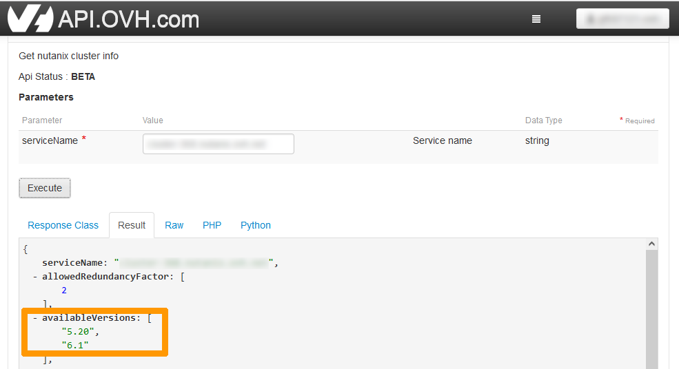

**Last updated 25th November 2022**

## Objective

**Find out which versions of Nutanix AOS are supported on OVHcloud Nutanix clusters.**

> [!warning]
> OVHcloud provides services for which you are responsible, with regard to their configuration and management. It is therefore your responsibility to ensure that they work properly.
>
> This guide is designed to assist you as much as possible with common tasks. However, we recommend contacting a [specialist provider](https://partner.ovhcloud.com/it/) if you experience any difficulties or doubts when it comes to managing, using or setting up a service on a server.
>

## Requirements

- a Nutanix Cluster in your OVHcloud account
- access to the [OVHcloud Control Panel](https://www.ovh.com/auth/?action=gotomanager&from=https://www.ovh.it/&ovhSubsidiary=it)
- access to the [OVHcloud API page](https://api.ovh.com/)

## Overview of versions supported on an OVHcloud Nutanix cluster

Nutanix offers two versions of AOS that are regularly updated:

- **An LTS (*Long Term Support*) version** updated 1 time per year. These versions are maintained for a longer period of time and provide bug fixes for an extended period of time.
- **An STS (*Short Term Support*) version** updated between 2 and 4 times a year. These versions offer new features and regular upgrades.

When a **LTS** or **STS** version is released, the previous version is supported for three months.

OVHcloud integrates LTS versions with the **Hosted Private Cloud powered by Nutanix** product on their release dates, once a year. For STS versions, OVHcloud includes a maximum of 3 STS versions per year in the **Hosted Private Cloud powered by Nutanix** product, on Nutanix release dates.

> [!warning]
>
> You can use **LCM** to make remedial updates to **LTS** and **STS** versions.
> 
> During these updates, **LCM** may offer a new version that is not yet qualified by OVHcloud. Please wait for OVHcloud to validate it to continue receiving support.
>

Qualified versions can be viewed through the OVHcloud API.

## Instructions

We will check the versions supported through the OVHcloud API.

Log in to the OVHcloud [API](https://api.ovh.com). For more details on how the OVHcloud API works, please refer to our guide on [Getting started with the OVHcloud APIs](https://docs.ovh.com/it/api/first-steps-with-ovh-api/.)

Use the following API call:

> [!api]
>
> @api {get} /nutanix/{serviceName}
>

Enter this data:

- **ServiceName:** `FQDN name of your Nutanix Cluster`.

Click `Execute`{.action} to retrieve version information.

The query result appears below `availableVersions` with both versions supported on an OVHcloud Nutanix cluster. The first is the LTS version, the one below is the STS version.

## Go further

[Nutanix AOS Update Plan](https://portal.nutanix.com/page/documents/kbs/details?targetId=kA00e000000LIi9CAG)

[Using the OVHcloud API](https://docs.ovh.com/it/api/)

Join our community of users on <https://community.ovh.com/en/>.
