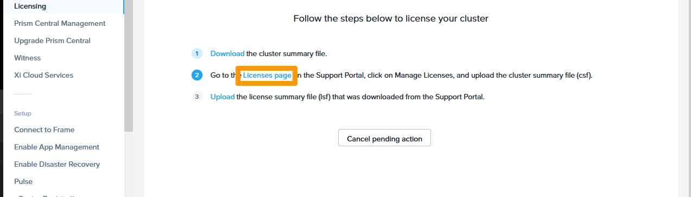
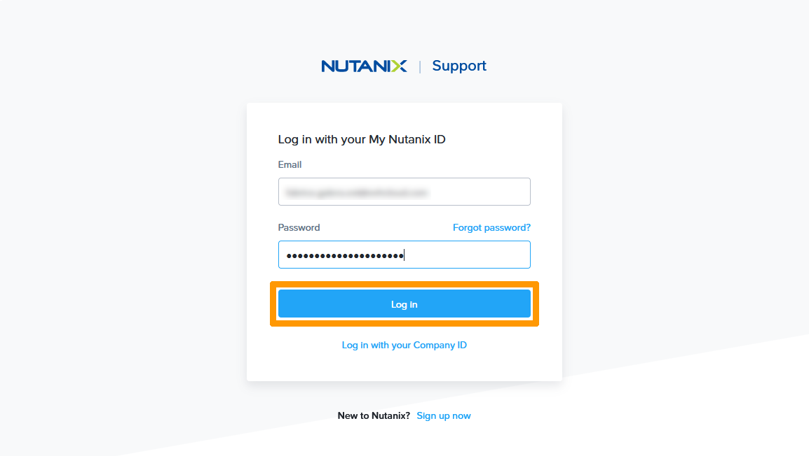
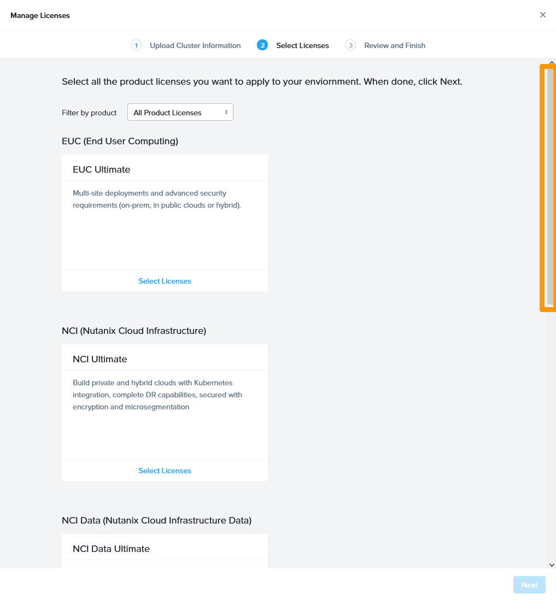
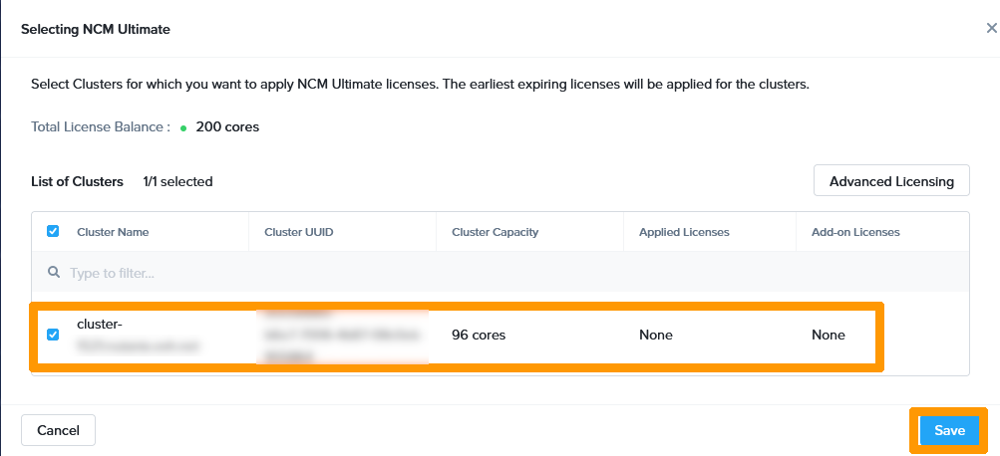
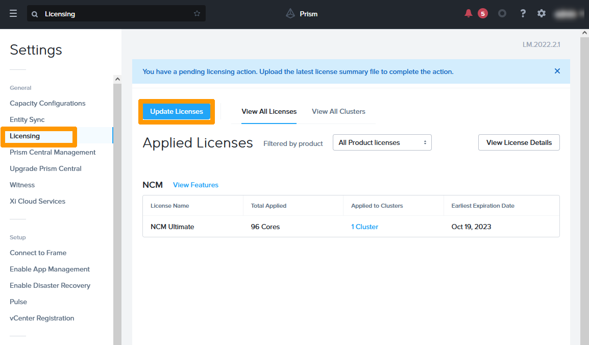
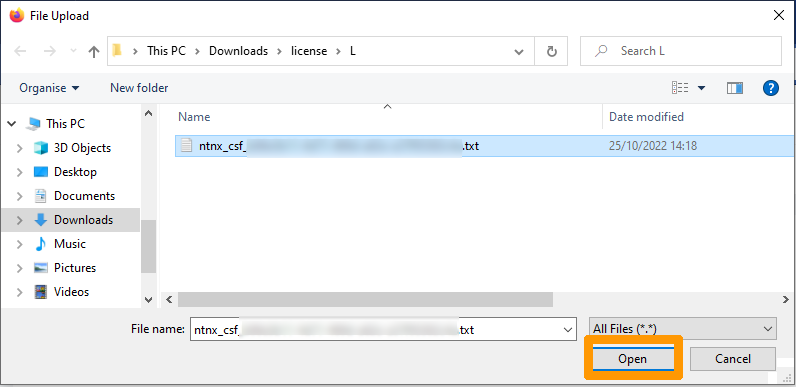
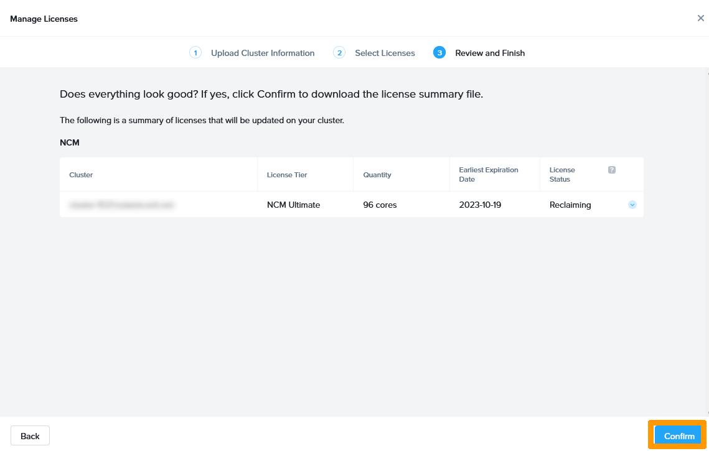
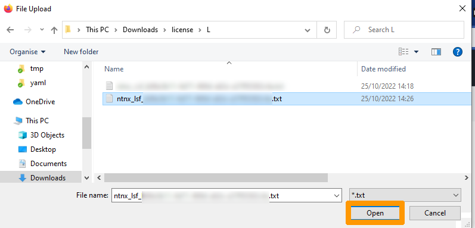

**Dernière mise à jour le 16/11/2022**

## Objectif

**Découvrez comment activer ou désactiver vos licences dans l'offre BYOL**

> [!warning]
> OVHcloud vous met à disposition des services dont la configuration, la gestion et la responsabilité vous incombent. Il vous appartient donc de ce fait d’en assurer le bon fonctionnement.
>
> Ce guide a pour but de vous accompagner au mieux sur des tâches courantes. Néanmoins, nous vous recommandons de faire appel à un [prestataire spécialisé](https://partner.ovhcloud.com/fr-ca/) si vous éprouvez des difficultés ou des doutes concernant l’administration, l’utilisation ou la mise en place d’un service sur un serveur.
>

## Prérequis

- Être connecté à votre [espace client OVHcloud](https://ca.ovh.com/auth/?action=gotomanager&from=https://www.ovh.com/ca/fr/&ovhSubsidiary=qc).
- Être connecté sur vos clusters via **Prism Central**.
- Disposer de vos identifiants Nutanix sur le [Site officiel Nutanix](https://www.nutanix.com).
- Avoir des licences valides avec votre identifiant Nutanix.

## En pratique

### Présentation

> [!warning]
>
> OVHcloud vous propose Nutanix avec l'offre *Bring Your Own Licence* (BYOL), ce qui signifie que vous devez, en tant que client OVHcloud, fournir les licences du cluster.
>
> Lorsque le cluster Nutanix est commandé avec l'offre BYOL, le cluster est livré avec une version d'essai de 90 jours. Vous devez donc, en tant que client, installer vos licences pendant cette période.
>
> Si vous souhaitez redéployer un cluster avec l'offre BYOL, vous devez au préalable avoir désinstallé les licences sur le cluster avant de lancer un redéploiement. Ce guide explique comme ajouter ou supprimer des licences.
>

Trois types de licences existent, pour :

- **Prism Element**. 
- **Prism Central**. 
- **Les add-ons**.

Vous pouvez installer toutes les licences à partir de **Prism Central**.

### Installation des licences

#### Récupération du résumé de votre configuration

Nous allons récupérer le fichier **CSF (Cluster Summary  File)** qui contient le résumé de la configuration du cluster.

Dans **Prism Central**, cliquez sur l'icône en forme d'`engrenage`{.action} pour aller dans les paramètres.

{.thumbnail}

Cliquez à gauche sur `Licensing`{.action}.

{.thumbnail}

Cliquez à gauche sur `Update Licenses`{.action}.

{.thumbnail}

Cliquez sur `Download`{.action} pour récupérer le fichier contenant les informations concernant votre cluster.

{.thumbnail}

Cliquez en haut à droite sur `Show all downloads`{.action}

{.thumbnail}

Le fichier **CSF** se trouve sur votre poste.

{.thumbnail}

#### Connexion au portail Nutanix 

Toujours dans **Prism Central**, rendez-vous sur la page des licences et cliquez sur `Licenses page`{.action}.

{.thumbnail}

Le navigateur web se lance et vous propose de vous connecter au portail Nutanix.

Saisissez vos informations d'identification pour vous connecter.

{.thumbnail}

#### Création de la licence pour votre cluster

Dans votre espace client **Nutanix**, cliquez sur `Manage Licenses`{.action}

{.thumbnail}

Ouvrez le fichier **CSF** généré par **Prism Central** et qui commence par `ntnx_csf...`.

{.thumbnail}

Faites défiler la fenêtre pour ajouter vos licences de clusters.

{.thumbnail}

Dans la rubrique **NCM Ultimate**, cliquez sur `Select Licences`{.action}.

{.thumbnail}

Enregistrez maintenant sur votre poste le fichier **LSF (License Summary File)** qui contient la licence.

Sélectionnez votre `votre cluster`{.action} et cliquez sur `Save`{.action}.

{.thumbnail}

Cliquez sur `Next`{.action}.

{.thumbnail}

Cliquez sur `Confirm`{.action}.

{.thumbnail}

Cliquez sur `Enregistrer`{.action} pour sauver le fichier de licence sur votre ordinateur.

{.thumbnail}

Revenez sur sur **Prism Central** dans la gestion des licences et cliquez sur `Upload`{.action} pour installer le fichier de licences.

{.thumbnail}

Sélectionnez le fichier généré et cliquez sur `Ouvrir`{.action}.

{.thumbnail}

Cliquez sur `Apply License`{.action}.

{.thumbnail}

La licence est installée sur votre cluster.

### Désinstallation des licences

Il est parfois nécessaire de désinstaller des licences pour les réinstaller sur un autre cluster. Si le cluster qui contient les licences est encore disponible, vous devez libérer vos licences à partir de **Prism Central**.

Via **Prism Central**, cliquez sur `l'engrenage`{.action} en haut à droite pour aller dans les paramètres.

{.thumbnail}

Choisissez `Licensing`{.action} à gauche et cliquez sur `Update Licences`{.action}.

{.thumbnail}

Cliquez sur `Download`{.action}.

{.thumbnail}

Cliquez sur `Enregistrer`{.action} pour sauvegarder le fichier **CSF** contenant le résumé de la configuration de votre cluster avec les licences installées.

{.thumbnail}

Cliquez sur `Licenses page`{.action} pour vous connecter à votre portail de licences **Nutanix**.

{.thumbnail}

Via le portail de licences **Nutanix**, cliquez sur `Manage Licenses`{.action}.

{.thumbnail}

Cliquez sur `Upload File`{.action}.

{.thumbnail}

Cliquez sur `Ouvrir`{.action}.

{.thumbnail}

Cliquez sur la barre de défilement pour aller au bas de la fenêtre.

{.thumbnail}

Cliquez sur `Unselect License`{.action} dans la rubrique **NCM (Nutanix Cloud Manager)**.

{.thumbnail}

Cliquez sur `Unlicense`{.action}.

{.thumbnail}

La demande de retrait de la licence est prise en charge, cliquez sur `Next`{.action}.

{.thumbnail}

CLiquez sur `Confirm`{.action}.

{.thumbnail}

Cliquez sur `Enregistrer`{.action} pour sauvegarder le fichier **LSF** contenant la licence mise à jour sur votre poste.

{.thumbnail}

Revenez dans la gestion des licences sur **Prism Central**.

Cliquez sur `Upload`{.action}.

{.thumbnail}

Cliquez sur `Ouvrir`{.action} après avoir séléctionné le fichier généré depuis le portail **Nutanix**.

{.thumbnail}

Cliquez sur `Apply License`{.action}.

{.thumbnail}

La suppression de la licence est effective.

## Aller plus loin

[Guide de gestion des licences Nutanix](https://portal.nutanix.com/page/documents/details?targetId=Licensing-Guide:lic-lic-manage-manual-c.html)

Échangez avec notre communauté d'utilisateurs sur <https://community.ovh.com/>.
