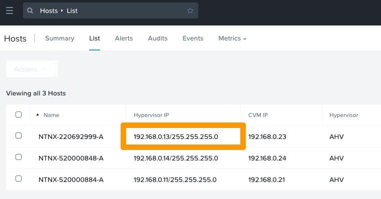
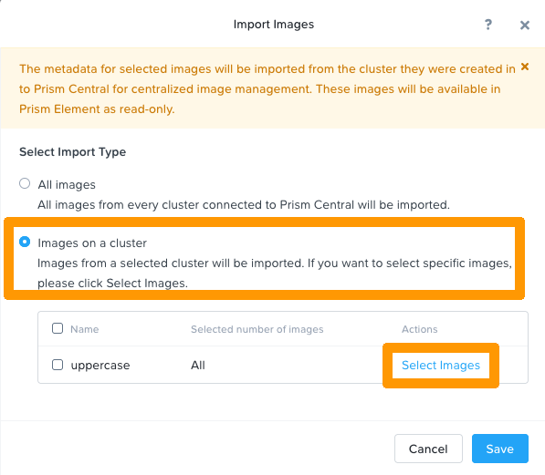

**Dernière mise à jour le 30/11/2022**

## Objectif

« OVHgateway » est le nom du point de sortie de votre cluster vers Internet.

**Ce guide vous décrit le fonctionnement de cette passerelle.**

## En pratique

### Détails techniques

#### Informations générales

La VM est basée sur Ubuntu 18.04.5 LTS (Bionic).
La passerelle OVHgateway a un design léger, avec 2 NICs, 1 vCPU, 1 GB de mémoire et 11 GiB d'espace-disque.

> [!primary]
> Cette machine virtuelle n'est pas administrable, mais vous pouvez la remplacer par un autre système d'exploitation réseau compatible avec AHV comme indiqué dans ce guide [Remplacement de l'OVHgateway](https://docs.ovh.com/fr/nutanix/software-gateway-replacement/).
>

`ens3` est l'interface pour le réseau externe et possède l'adresse IP Failover dans le sous-réseau **base** avec le VLAN 0. <br>
`ens4` est l'interface pour le réseau interne dans le sous-réseau **infra** avec le VLAN 1. 

Les équipes OVHcloud ont personnalisé la VM avec un script *IPTABLES*.

> [!primary]
>  Il n'y a aucun moyen de se connecter avec SSH ou tout autre protocole.
>

> [!primary]
> La VM est utilisée uniquement pour le trafic NAT entre les hosts, le CVM, la VM et Internet.
>


Les requêtes ICMP ne sont autorisées que dans le réseau privé.

#### Script de données utilisateur

La VM est déployée avec *cloud-init*, un outil qui applique automatiquement les données utilisateur à vos instances.

```yaml
#cloud-config
hostname: gw
fqdn: gw.ovh.cloud
users:
  - name: ovh
    sudo: ['ALL=(ALL) NOPASSWD:ALL']
    groups: sudo
    shell: /bin/bash
    lock_passwd: false
    passwd: <>
write_files:
  - path: /etc/netplan/50-cloud-init.yaml
    content: |
      network:
        version: 2
        renderer: networkd
        ethernets:
          ens3:
            addresses: [PUBLICIP]
            gateway4: PUBLICGW
            nameservers:
              addresses: [DNS]
          ens4:
            addresses: [PRIVATEIP]
runcmd:
  - netplan apply
```

### Comment redéployer la passerelle de la VM

#### Étape 1 : collecter les informations

Pour redéployer la VM de la passerelle, vous aurez besoin des éléments suivants :

- Adresse IP Failover
- Sous-réseau LAN (sous-réseau des hyperviseurs CVM, Prism Central, AHV)
- Nom du sous-réseau

##### **Vérifier l'adresse IP failover**

Connectez-vous à l'[espace client OVHcloud](https://www.ovh.com/auth/?action=gotomanager&from=https://www.ovh.com/fr/&ovhSubsidiary=fr) et accédez à la gestion de votre [vRack](https://www.ovh.com/fr/solutions/vrack/){.external}. Vérifiez l'adresse IP failover utilisée par le cluster Nutanix.

{.thumbnail}

> [!primary]
> Les instructions suivantes vont utiliser le bloc IP 198.51.100.0/30 à titre d'exemple.
>

Dans le cadre d'une utilisation du [vRack](https://www.ovh.com/fr/solutions/vrack/){.external}, la première adresse, l'avant-dernière et la dernière adresse d'un bloc IP donné sont toujours réservées respectivement à l'adresse réseau, à la passerelle réseau et au broadcast du réseau. Cela signifie que la première adresse utilisable est la seconde adresse du bloc, comme indiqué ci-dessous :

```console
198.51.100.0  Reserved: Network address
198.51.100.1  First usable IP
198.51.100.2  Reserved: Network gateway
198.51.100.3  Reserved: Network broadcast
```

##### **Vérifier l'adresse IP privée du sous-réseau ou de la passerelle privée**

Si la passerelle existe toujours, rendez-vous sur la VM de la section VM de l'interface web Prism Central.

L'IP de la passerelle est affichée ici.

{.thumbnail}

Cependant, si la passerelle n'est pas présente, vérifiez le sous-réseau en vous rendant dans les menus « Hardware » puis « Hosts » de  l'interface web Prism Central.

{.thumbnail}

Dans ce cas, le sous-réseau est 192.168.0.0/24. Dans la configuration par défaut, l'adresse IP de la passerelle est donc 192.168.0.254.

##### **Récupérer les nom des sous-réseau**

Si la passerelle existe toujours, rendez-vous sur la VM de la section VM de l'interface web Prism Central.

Cliquez sur la VM OVHgateway et ouvrez l'onglet « NICs ».

{.thumbnail}

#### Étape 2 : importer une image sur le cluster

Connectez-vous à Prism Central et rendez vous dans dans `Compute & Storage`{.action}, puis dans `Images`{.action}.

Cliquez sur le bouton `Impor Images`{.action}.

{.thumbnail}

Cliquez sur le bouton `Images on a cluster`{.action}, puis sur `Select Images`{.action}.

{.thumbnail}

Cochez « ovh_gateway » et cliquez sur `Next`{.action}.

{.thumbnail}

Une fois la tâche effectuée, l’image « ovh_gateway » sera disponible sur le cluster.

{.thumbnail}

##### **Récupérer les informations nécessaires grâce à l’API Nutanix**

Pour déployer la VM, il vous faut l'UUID de l' « image » et du réseau.

Ouvrez un terminal et exécutez la commande suivante :

```bash
curl -k -H Accept:application/json -H Content-Type:application/json -u "admin:PRISMADMINPASSWORD" -X POST https://fqdn-cluster:9440/api/nutanix/v3/images/list -d{} | jq .
```

> [!primary]
> Prenez soin de renseigner votre mot de passe réel et votre nom de domaine complet dans les paramètres.
>

> [!primary]
> Le « jq . » permettra d'obtenir un json lisible.
>

```json
{
  "api_version": "3.1",
  "metadata": {
    "total_matches": 1,
    "kind": "image",
    "length": 1,
    "offset": 0
  },
  "entities": [
    {
      "status": {
        "state": "COMPLETE",
        "name": "ovh_gateway",
        "resources": {
          "retrieval_uri_list": [
            "https://127.0.0.1:9440/api/nutanix/v3/images/54b919e1-b1e5-4d4a-b055-47ff298bf7d7/file"
          ],
          "current_cluster_reference_list": [
            {
              "kind": "cluster",
              "uuid": "0005d309-53ab-cfbb-6330-0c42a114b058"
            }
          ],
          "architecture": "X86_64",
          "size_bytes": 3221225472,
          "image_type": "DISK_IMAGE",
          "source_uri": "http://192.168.0.11:49200/ovhgateway.qcow2"
        },
        "description": "OVHGatewayVM"
      },
      "spec": {
        "name": "ovh_gateway",
        "resources": {
          "image_type": "DISK_IMAGE",
          "source_uri": "http://192.168.0.11:49200/ovhgateway.qcow2",
          "architecture": "X86_64"
        },
        "description": "OVHGatewayVM"
      },
      "metadata": {
        "last_update_time": "2021-12-15T09:30:34Z",
        "kind": "image",
        "uuid": "54b919e1-b1e5-4d4a-b055-47ff298bf7d7",
        "spec_version": 0,
        "creation_time": "2021-12-15T09:30:34Z",
        "categories_mapping": {},
        "categories": {}
      }
    }
  ]
}
```

Dans les métadonnées, vous retrouvez l'UUID, ici : `54b919e1-b1e5-4d4a-b055-47ff298bf7d7`.

Vous devez ensuite trouver les bons UUID de sous-réseaux. Exécutez la commande ci-dessous :

```bash
curl -k -H Accept:application/json -H Content-Type:application/json -u "admin:PRISMADMINPASSWORD" -X POST https://fqdn-cluster:9440/api/nutanix/v3/subnets/list -d{} | jq .
```

> [!primary]
> Prenez soin de renseigner votre mot de passe réel et votre nom de domaine complet dans les paramètres.
>


```json
{
  "api_version": "3.1",
  "metadata": {
    "total_matches": 3,
    "kind": "subnet",
    "length": 3,
    "offset": 0
  },
  "entities": [
    {
      "status": {
        "state": "COMPLETE",
        "name": "base",
        "resources": {
          "vswitch_name": "br0",
          "subnet_type": "VLAN",
          "virtual_switch_uuid": "3dba2120-9467-4c57-8781-2b21b40485c1",
          "vlan_id": 0,
          "ip_usage_stats": {
            "num_macs": 2
          }
        },
        "cluster_reference": {
          "kind": "cluster",
          "name": "cluster-xxxx.nutanix.ovh.net",
          "uuid": "0005ee26-4f51-e468-2a6a-043f72b50ef0"
        }
      },
      "spec": {
        "name": "base",
        "resources": {
          "vswitch_name": "br0",
          "subnet_type": "VLAN",
          "virtual_switch_uuid": "3dba2120-9467-4c57-8781-2b21b40485c1",
          "vlan_id": 0
        },
        "cluster_reference": {
          "kind": "cluster",
          "name": "cluster-xxxx.nutanix.ovh.net",
          "uuid": "0005ee26-4f51-e468-2a6a-043f72b50ef0"
        }
      },
      "metadata": {
        "last_update_time": "2022-11-25T13:09:43Z",
        "kind": "subnet",
        "uuid": "3652d420-9f94-4350-8af7-b921d0761781",
        "spec_version": 0,
        "creation_time": "2022-11-25T13:09:43Z",
        "spec_hash": "00000000000000000000000000000000000000000000000000",
        "categories_mapping": {},
        "categories": {}
      }
    },
    {
      "status": {
        "state": "COMPLETE",
        "name": "infra",
        "resources": {
          "vswitch_name": "br0",
          "subnet_type": "VLAN",
          "virtual_switch_uuid": "3dba2120-9467-4c57-8781-2b21b40485c1",
          "vlan_id": 1,
          "ip_usage_stats": {
            "num_macs": 4
          }
        },
        "cluster_reference": {
          "kind": "cluster",
          "name": "cluster-xxxx.nutanix.ovh.net",
          "uuid": "0005ee26-4f51-e468-2a6a-043f72b50ef0"
        }
      },
      "spec": {
        "name": "infra",
        "resources": {
          "vswitch_name": "br0",
          "subnet_type": "VLAN",
          "virtual_switch_uuid": "3dba2120-9467-4c57-8781-2b21b40485c1",
          "vlan_id": 1
        },
        "cluster_reference": {
          "kind": "cluster",
          "name": "cluster-xxxx.nutanix.ovh.net",
          "uuid": "0005ee26-4f51-e468-2a6a-043f72b50ef0"
        }
      },
      "metadata": {
        "last_update_time": "2022-11-25T13:09:43Z",
        "kind": "subnet",
        "uuid": "e60826da-4aab-4810-b7d3-0604a3e16719",
        "spec_version": 0,
        "creation_time": "2022-11-25T13:09:43Z",
        "spec_hash": "00000000000000000000000000000000000000000000000000",
        "categories_mapping": {},
        "categories": {}
      }
    },
   ]
}
```

le résultat de la requette vous renvoie la configuration des sous-réseaux il faut relevez les UUID de ces sous réseaux qui se trouvent en dessous de `"kind": "subnet"` dans la variable "uuid" comme ici par exemple : 

 * `3652d420-9f94-4350-8af7-b921d0761781` pour le VLAN **base** sur le VLAN 0  
 * `e60826da-4aab-4810-b7d3-0604a3e16719` pour le VLAN **infra** sur le VLAN 1

#### Étape 3 : créer les fichiers nécessaires

Pour déployer la VM, vous avez besoin de deux fichiers : `vm.json`, décrivant la machine virtuelle et le fichier de configuration `cloud-init.yaml` qui contient les données utilisateur telles que mot de passe, réseau, etc.

Créez le fichier `vm.json` :

```json
{
  "spec": {
    "name": "YOURVMNAME",
    "resources": {
      "power_state": "ON",
      "num_vcpus_per_socket": 4,
      "num_sockets": 1,
      "memory_size_mib": 4096,
      "disk_list": [
        {
          "disk_size_mib": 41264,
          "device_properties": {
            "device_type": "DISK",
            "disk_address": {
              "device_index": 0,
              "adapter_type": "SATA"
            }
          },
          "data_source_reference": {
            "kind": "image",
            "uuid": "54b919e1-b1e5-4d4a-b055-47ff298bf7d7"
          }
        }
      ],
      "nic_list": [
        {
          "nic_type": "NORMAL_NIC",
          "ip_endpoint_list": [
            {
              "ip_type": "DHCP"
            }
          ],
          "subnet_reference": {
            "kind": "subnet",
            "name": "base",
            "uuid": "3652d420-9f94-4350-8af7-b921d0761781"
          },
          "is_connected": true
        },
        {
          "nic_type": "NORMAL_NIC",
          "ip_endpoint_list": [
            {
              "ip_type": "DHCP"
            }
          ],
          "subnet_reference": {
            "kind": "subnet",
            "name": "infra",
            "uuid": "e60826da-4aab-4810-b7d3-0604a3e16719"
          },
          "is_connected": true
        }
      ],
      "guest_customization": {
        "cloud_init": {
          "user_data": "USERDATA"
        },
        "is_overridable": false
      }
    }
  },
  "api_version": "3.1.0",
  "metadata": {
    "kind": "vm"
  }
}
```

> [!primary]
> Vous pouvez ajuster les paramètres en fonction de vos valeurs, selon vos besoins : nom de la VM, nombre de VCPU, taille de la RAM, taille du disque, etc.
>

Cochez `data_source_reference` pour vous assurer que l'UUID est bien l'UUID de votre image système :

```json
"data_source_reference": {
            "kind": "image",
            "uuid": "54b919e1-b1e5-4d4a-b055-47ff298bf7d7"
                         }
```

Vérifiez également l'UUID de vos sous-réseaux :

```json
          "subnet_reference": {
            "kind": "subnet",
            "name": "base",
            "uuid": "3652d420-9f94-4350-8af7-b921d0761781"
                              }
```

```json
          "subnet_reference": {
            "kind": "subnet",
            "name": "infra",
            "uuid": "e60826da-4aab-4810-b7d3-0604a3e16719"
                              }
```


Il faut maintenant créer le fichier `cloud-init.yaml`. Ce fichier contient les données utilisateur. Au démarrage du système, ces paramètres tels que les utilisateurs, les paquets, les fichiers, etc, seront appliqués à la VM.

Vous trouverez ci-dessous un template que vous pourrez modifier avec vos valeurs pour créer votre VM individuelle.

> [!primary]
>
> - Remplacez les valeurs « hostname », « fqdn », « name », « passwd », « ssh-autorized-keys » et les adresses IP par les valeurs souhaitées.
> - Ce fichier crée le fichier pour netplan, applique la configuration et initialise un redémarrage.
> - Le mot de passe doit être une valeur de hash. Vous pouvez le générer avec la commande ci-dessous.
>

```bash
mkpasswd --method=SHA-512 --rounds=4096
```


```yaml
#cloud-config
hostname: <yourhostname>
fqdn: <yourhostname.ovh.cloud>
users:
  - name: <yourusername>
    sudo: ['ALL=(ALL) NOPASSWD:ALL']
    groups: sudo
    shell: /bin/bash
    lock_passwd: false
    passwd: <yourhashpass>
    ssh-authorized-keys: <your public ssh key>
write_files: 
   - path: /etc/netplan/50-cloud-init.yaml
     content: |
        network:
           version: 2
           renderer: networkd
           ethernets:
              ens3:
                addresses: [198.51.100.1/30]
                gateway4: 198.51.100.2
                nameservers:
                  addresses: [213.186.33.99]
              ens4:
                addresses: [192.168.0.254/30]


runcmd:
   - netplan generate
```

#### Étape 4 : créer la VM 

Transformez le `cloud-init.yaml` en « base64 » et placez-le dans une variable :

```bash
USERDATA=$(base64 -w 0 cloud-init.yaml)
```

Remplacez ensuite la chaîne « USERDATA » dans `vm.json` par la valeur de la variable `USERDATA` dans le fichier `vm.json` :

```bash
sed -i s/USERDATA/${USERDATA}/g vm.json
```

Enfin, utilisez une requête cURL pour enregistrer et mettre sous tension la VM :

```bash
curl -k -H Accept:application/json -H Content-Type:application/json -u "admin:PRISMADMINPASSWORD" -X POST https://fqdn:9440/api/nutanix/v3/vms -d @vm.json | jq .
```

## Aller plus loin

Échangez avec notre communauté d'utilisateurs sur <https://community.ovh.com/>.
