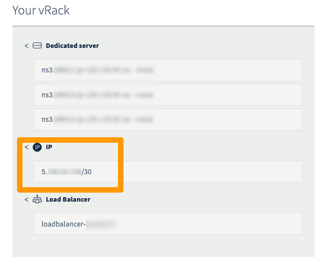
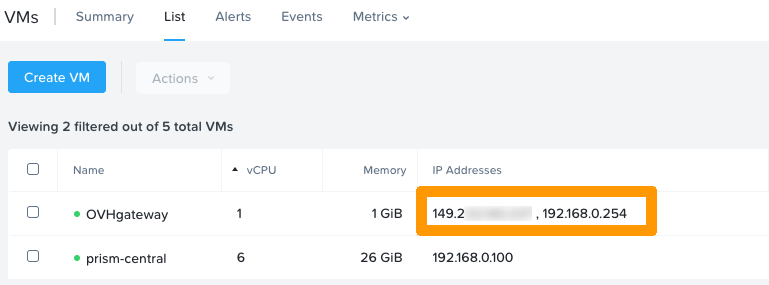
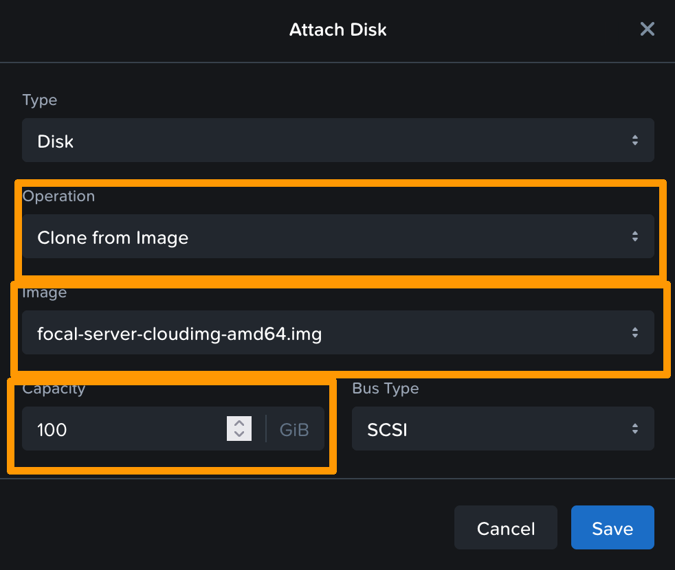
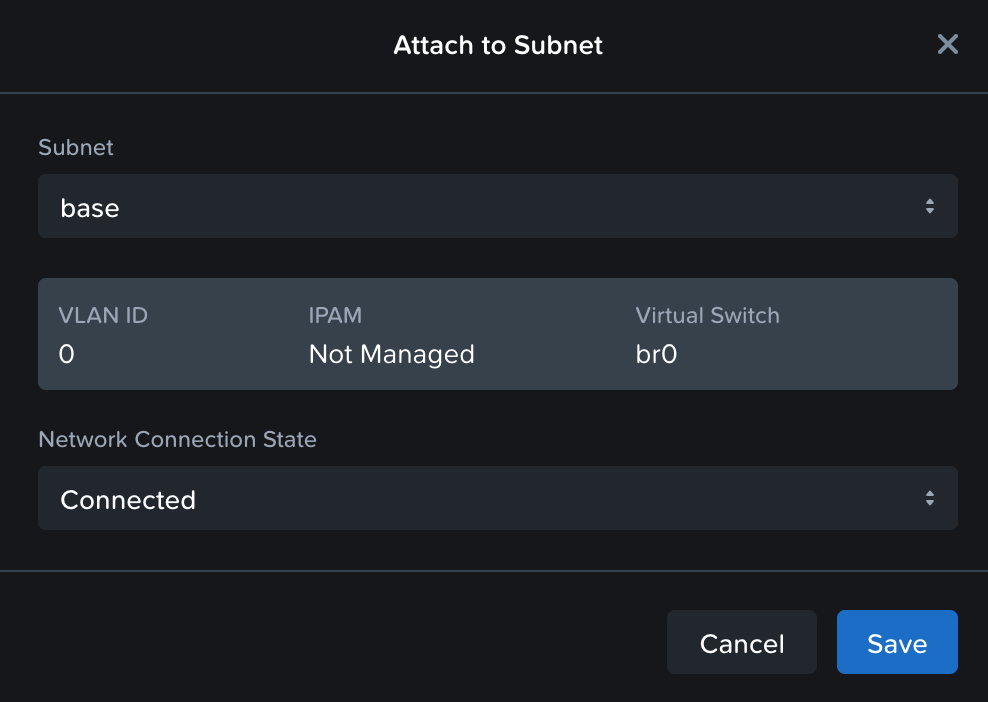

**Last updated 2nd May 2022**

## Objective

“OVHgateway” is the name of the outgoing point of your cluster to the internet.

**This guide will explain how this gateway works, and how to redeploy it.**

## Instructions

### Technical details

#### General information

The VM is based on Ubuntu 20.04 LTS (“ The Focal Fossa ”).

> [!primary]
> The gateway is built on the basis of *Daily Build* cloud images of Ubuntu.
> The file used is downloaded directly from the Ubuntu servers: <https://cloud-images.ubuntu.com/focal/current/focal-server-cloudimg-amd64.img> then customised using cloud-init.

> [!primary]
> OVHcloud recommends that you replace this gateway with one of your choice.

The OVHgateway has a lightweight design, with 2 NICs, 1 vCPU, 1 GB of memory and 20 GiB of disk space.

`ens3` is the interface for the external network and owns the Additional IP address.<br>
`ens4` is the interface for the internal network.

OVHcloud teams have customised the VM with an *IPTABLES* script.

> [!primary]
> There is no way to connect with SSH or any other protocol.
> It is also not possible to log from the console via Prism Central.
>

> [!primary]
> The VM is used only to NAT traffic between hosts, CVM, VM and Internet.
>

ICMP requests are only allowed in the private network.

#### User data script

The VM is deployed with *cloud-init*, a tool that applies user data to your instances automatically.

```yaml
#cloud-config
---
hostname: gw
fqdn: gw.ovh.cloud
users:
  - name: ovh
    shell: /bin/nologin
disable_root: true
write_files:
  - path: /etc/netplan/50-cloud-init.yaml
    content: |
      network:
        version: 2
        renderer: networkd
        ethernets:
          ens3:
            addresses: [PUBLICIP]
            gateway4: PUBLICGW
            nameservers:
              addresses: [DNS]
          ens4:
            addresses: [PRIVATEIP]
  - path: /etc/systemd/system/firegateway.service
    content: |
      [Unit]
      Description=GatewayFirewall
      Wants=network.target network-online.target
      After=network.target network-online.target
      [Service]
      Type=simple
      ExecStart=/root/firegateway
      Restart=always
      TimeoutStartSec=0
      [Install]
      WantedBy=multi-user.target
  - path: /root/firegateway
    content: |
      #!/bin/bash
      iptables -F
      iptables -X
      iptables -t nat -F
      iptables -t nat -X
      iptables -t mangle -F
      iptables -t mangle -X
      iptables -P INPUT DROP
      iptables -P OUTPUT DROP
      iptables -P FORWARD ACCEPT
      iptables -A INPUT -i ens4 -p ICMP -j ACCEPT
      iptables -A OUTPUT -p ICMP -j ACCEPT
      iptables -A INPUT -i ens3 -m state --state ESTABLISHED,RELATED -j ACCEPT
      iptables -A INPUT -i ens4 -j ACCEPT      
      iptables -t nat -A POSTROUTING -o ens3 -j MASQUERADE
 
runcmd:
  - netplan generate
  - netplan apply
  - /sbin/sysctl -w net.ipv4.conf.default.rp_filter=1
  - /sbin/sysctl -w net.ipv4.tcp_syncookies=1
  - /sbin/sysctl -w net.ipv4.conf.all.accept_redirects=0
  - /sbin/sysctl -w net.ipv4.conf.all.secure_redirects=0
  - /sbin/sysctl -w net.ipv4.conf.default.accept_source_route=0
  - sed -i s/#net.ipv4.ip_forward/net.ipv4.ip_forward/g /etc/sysctl.conf
  - /sbin/sysctl -w net.ipv4.ip_forward=1
  - iptables -t nat -A POSTROUTING -o ens3 -j MASQUERADE
  - chmod +x /root/firegateway
  - systemctl enable firegateway.service
  - systemctl disable ssh.service
  - apt remove -y wget curl ftp git htop mtr-tiny open-vm-tools tcpdump telnet tmux snapd openssh-server
  - apt update && apt upgrade -y
  - apt-get clean -y
  - apt autoremove -y
final_message: "The system is finally up, after $UPTIME seconds"
```

### How to redeploy the VM gateway with the central Prism interface

#### Step 1: Collect information

To redeploy the gateway VM you will need:

- Additional IP address
- LAN subnet (subnet of CVM, Prism Central, AHV hypervisors)
- Subnet name

##### **Check the Additional IP address**

Log in to the [OVHcloud Control Panel](https://www.ovh.com/auth/?action=gotomanager&from=https://www.ovh.es/&ovhSubsidiary=es) and open the management section of your [vRack](https://www.ovh.es/soluciones/vrack/){.external}. Verify the Additional IP address used by the Nutanix Cluster.

{.thumbnail}

> [!primary]
> The following instructions will use the IP block 123.45.6.78/30 for example purposes.
>

For [vRack](https://www.ovh.es/soluciones/vrack/){.external} purposes, the first, penultimate, and last addresses in any given IP block are always reserved for the network address, network gateway, and network broadcast respectively. This means that the first usable address is the second address in the block, as shown below:

```console
123.45.6.76   Reserved: Network address
123.45.6.77   First usable IP
123.45.6.78   Reserved: Network gateway
123.45.6.79   Reserved: Network broadcast
```

##### **Check the private subnet or gateway private IP address**

If the gateway still exists, go to the VM in the VM section of your Prism Central WebUI.

The gateway IP is displayed here.

{.thumbnail}

However, if the gateway is not present, check the subnet by going to `Hardware` then `Hosts` in the Prism Central WebUI.

{.thumbnail}

In this case the subnet is 192.168.0.0/24. In the default configuration, the gateway IP address is therefore 192.168.0.254.

##### **Retrieve the subnet name**

If the gateway still exists, go to the VM in the VM section of your Prism Central WebUI.

Click on the OVHgateway VM and open the `NICs` tab.

{.thumbnail}

#### Step 2: create the VM 

Log in to Prism Central and create a VM.

Customise the VM name and characteristics.

{.thumbnail}

Click `Next`{.action}

You then need to attach a disk. To do this, you can select the image used to create the original gateway.

{.thumbnail}

{.thumbnail}

Then add **two nics** to the “base” network:

{.thumbnail}

{.thumbnail}

Click `Next`{.action}.

In the management interface, choose `cloud-init` in the “Guest customisation” section.

{.thumbnail}

You now need to create a yaml script to define the parameters. This script contains the user data. When the system boots, these settings such as users, packets, files, etc. will be applied to the VM.

Below, you will find a template that you can modify with your values to create your VM.

> [!primary]
> You can use the original VM creation file or use a custom file to create your own gateway. This is what we will see in this example.
>

> [!primary]
>
> - Replace the `hostname`, `fqdn`, `name`, `passwd`, `ssh-autorized-keys` and IP addresses with the values you want.
> - This file creates the file for netplan, applies the configuration, and initializes a reboot.
> - The password must be a hash value. You can generate it with the command below.
>

```bash
mkpasswd --method=SHA-512 --rounds=4096
```

```yaml
#cloud-config
hostname: <yourhostname>
fqdn: <yourhostname.ovh.cloud>
users:
  - name: <yourusername>
    sudo: ['ALL=(ALL) NOPASSWD:ALL']
    groups: sudo
    shell: /bin/bash
    lock_passwd: false
    passwd: <yourhashpass>
    ssh-authorized-keys: <your public ssh key>
write_files: 
   - path: /etc/netplan/50-cloud-init.yaml
     content: |
        network:
           version: 2
           renderer: networkd
           ethernets:
              ens3:
                addresses: [123.45.6.77/30]
                gateway4: 123.45.6.78
                nameservers:
                  addresses: [213.186.33.99]
              ens4:
                addresses: [192.168.0.254]


runcmd:
   - netplan generate
```

Paste this script into the box provided.

{.thumbnail}

Click `Next`{.action}, then `Create VM`{.action}.

> [!primary]
> Wait a few minutes for the VM to take into account all settings.

### How to redeploy the VM gateway in the command line

#### Step 1: collect information

To redeploy the gateway VM, you will need the following:

- Additional IP address
- LAN subnet (CVM hypervisor subnet, Prism Central, AHV)
- Subnet name

##### **Check the Additional IP address**

Log in to the [OVHcloud Control Panel](https://www.ovh.com/auth/?action=gotomanager&from=https://www.ovh.es/&ovhSubsidiary=es)  and access your [vRack](https://www.ovh.es/soluciones/vrack/){.external} management. Check the Additional IP address used by the Nutanix cluster.

{.thumbnail}

> [!primary]
> The following instructions will use the IP block 123.45.6.78/30 as an example.
>

When using the [vRack](https://www.ovh.es/soluciones/vrack/){.external}, the first, penultimate, and last addresses in a given IP block are always reserved for the network address, network gateway, and network broadcast respectively. This means that the first usable address is the second address in the block, as shown below:

```console
123.45.6.76   Reserved: Network address
123.45.6.77   First usable IP
123.45.6.78   Reserved: Network gateway
123.45.6.79   Reserved: Network broadcast
```

##### **Verify the private IP address of the subnet or private gateway**

If the gateway still exists, go to the VM section of the Prism Central web interface.

The gateway IP is displayed here.

{.thumbnail}

However, if the gateway is not present, check the subnet by going to the `Hardware` menu then `Hosts` in the Prism Central web interface.

{.thumbnail}

In this case, the subnet is 192.168.0.0/24. In the default configuration, the gateway IP address is 192.168.0.254.

##### **Retrieve Subnet Name**

If the gateway still exists, go to the VM section of the Prism Central web interface.

Click on the OVHgateway VM and open the `NICs` tab.

{.thumbnail}

##### **Retrieve the necessary information using the Nutanix API**

To deploy the VM, you need the UUID of the image and the network.

Open a terminal and run the following command:

```bash
curl -k -H Accept:application/json -H Content-Type:application/json -u "admin:PRISMADMINPASSWORD" -X POST https://fqdn-cluster:9440/api/nutanix/v3/images/list -d{} | jq .
```

> [!primary]
> Please ensure that you enter your real password and FQDN in the settings.
>

> [!primary]
> The “ jq . ” will provide a readable json.
>

```json
{
  "api_version": "3.1",
  "metadata": {
    "total_matches": 1,
    "kind": "image",
    "length": 1,
    "offset": 0
  },
  "entities": [
    {
      "status": {
        "state": "COMPLETE",
        "name": "focal-server-cloudimg-amd64.img",
        "resources": {
          "retrieval_uri_list": [
            "https://127.0.0.1:9440/api/nutanix/v3/images/22c00053-a23e-4dae-a9a9-de0d60ce29ce/file"
          ],
          "current_cluster_reference_list": [
            {
              "kind": "cluster",
              "uuid": "0005dda3-c2a2-6485-5399-043f72b508a0"
            }
          ],
          "architecture": "X86_64",
          "size_bytes": 2361393152,
          "image_type": "DISK_IMAGE",
          "source_uri": "http://192.168.0.1:49200/focal-server-cloudimg-amd64.img"
        },
        `description`: `ubuntu-focal`
      },
      "spec": {
        "name": "focal-server-cloudimg-amd64.img",
        "resources": {
          "image_type": "DISK_IMAGE",
          "source_uri": "http://192.168.0.1:49200/focal-server-cloudimg-amd64.img",
          "architecture": "X86_64"
        },
        `description`: `ubuntu-focal`
      },
      "metadata": {
        "last_update_time": "2022-05-02T08:49:21Z",
        "kind": "image",
        "uuid": "54b919e1-b1e5-4d4a-b055-47ff298bf7d7",
        "spec_version": 0,
        "creation_time": "2022-05-02T08:49:21Z",
        "spec_hash": "00000000000000000000000000000000000000000000000000",
        "categories_mapping": {},
        "categories": {}
      }
    }
  ]
}
```

In the metadata, you will find the UUID, here: `54b919e1-b1e5-4d4a-b055-47ff298bf7d7`, for the image named focal-server-cloudimg-amd64.img.

You then need to find the correct subnet UUID. Run the command below:

```bash
curl -k -H Accept:application/json -H Content-Type:application/json -u `admin:PRISMADMINPASSWORD` -X POST https://fqdn-cluster:9440/api/nutanix/v3/subnets/list -d{} | jq.
```

> [!primary]
> Please ensure that you enter your real password and FQDN in the settings.
>

```json
{
  "api_version": "3.1",
  "metadata": {
    "total_matches": 1,
    "kind": "subnet",
    "length": 1,
    "offset": 0
  },
  "entities": [
    {
      "status": {
        "state": "COMPLETE",
        "name": "base",
        "resources": {
          "vswitch_name": "br0",
          "subnet_type": "VLAN",
          "virtual_switch_uuid": "1e9520a5-1d04-4857-8a32-4a09e923a688",
          "vlan_id": 0
        },
        "cluster_reference": {
          "kind": "cluster",
          "name": "uppercase",
          "uuid": "0005d309-53ab-cfbb-6330-0c42a114b058"
        }
      },
      "spec": {
        "name": "base",
        "resources": {
          "vswitch_name": "br0",
          "subnet_type": "VLAN",
          "virtual_switch_uuid": "1e9520a5-1d04-4857-8a32-4a09e923a688",
          "vlan_id": 0
        },
        "cluster_reference": {
          "kind": "cluster",
          "name": "uppercase",
          "uuid": "0005d309-53ab-cfbb-6330-0c42a114b058"
        }
      },
      "metadata": {
        "last_update_time": "2021-12-13T18:00:22Z",
        "kind": "subnet",
        "uuid": "4676d823-82dd-4c71-a95d-847e7cdc3a3e",
        "spec_version": 0,
        "creation_time": "2021-12-13T18:00:22Z",
        "categories_mapping": {},
        "categories": {}
      }
    }
  ]
}
```

In the metadata, you will find the UUID, here: `4676d823-82dd-4c71-a95d-847e7cdc3a3e`. 

#### Step 2: Create files needed for CLI deployment

To deploy the VM, you need two files: `vm.json`, describing the virtual machine and the `cloud-init.yaml` configuration file that contains user data such as password, network, etc.

Create the `vm.json` file:

```json
{
  "spec": {
    "name": "YOURVMNAME",
    "resources": {
      "power_state": "ON",
      "num_vcpus_per_socket": 4,
      "num_sockets": 1,
      "memory_size_mib": 4096,
      "disk_list": [
        {
          "disk_size_mib": 41264,
          "device_properties": {
            "device_type": "DISK",
            "disk_address": {
              "device_index": 0,
              "adapter_type": "SATA"
            }
          },
          "data_source_reference": {
            "kind": "image",
            "uuid": "54b919e1-b1e5-4d4a-b055-47ff298bf7d7"
          }
        }
      ],
      "nic_list": [
        {
          "nic_type": "NORMAL_NIC",
          "ip_endpoint_list": [
            {
              "ip_type": "DHCP"
            }
          ],
          "subnet_reference": {
            "kind": "subnet",
            "name": "base",
            "uuid": "4676d823-82dd-4c71-a95d-847e7cdc3a3e"
          },
          "is_connected": true
        },
        {
          "nic_type": "NORMAL_NIC",
          "ip_endpoint_list": [
            {
              "ip_type": "DHCP"
            }
          ],
          "subnet_reference": {
            "kind": "subnet",
            "name": "base",
            "uuid": "4676d823-82dd-4c71-a95d-847e7cdc3a3e"
          },
          "is_connected": true
        }
      ],
      "guest_customization": {
        "cloud_init": {
          "user_data": "USERDATA"
        },
        "is_overridable": false
      }
    }
  },
  "api_version": "3.1.0",
  "metadata": {
    "kind": "vm"
  }
}
```

> [!primary]
> You can adjust the parameters with your values, according to your needs: VM name, number of VCPU, RAM size, disk size, etc.
>

Check `data_source_reference` to ensure that the UUID is the UUID of your system image:

```json
"data_source_reference": {
            "kind": "image",
            "uuid": "54b919e1-b1e5-4d4a-b055-47ff298bf7d7"
                         }
```

Also check your subnet's UUID:

```json
          "subnet_reference": {
            "kind": "subnet",
            "name": "base",
            "uuid": "4676d823-82dd-4c71-a95d-847e7cdc3a3e"
                              }
```

You now need to create the `cloud-init.yaml` file. This file contains user data. When the system boots, these settings such as users, packets, files, etc. will be applied to the VM.

Below, you will find a template that you can modify with your values to create your individual VM.

> [!primary]
> You can use the original creation file or use a custom file to create your own gateway. This is what we will see in this example.
>

> [!primary]
>
> - Replace the `hostname`, `fqdn`, `name`, `passwd`, `ssh-autorized-keys` and IP addresses with the values you want.
> - This file creates the file for netplan, applies the configuration, and initializes a reboot.
> - The password must be a hash value. You can generate it with the command below.
>

```bash
mkpasswd --method=SHA-512 --rounds=4096
```

```yaml
#cloud-config
hostname: <yourhostname>
fqdn: <yourhostname.ovh.cloud>
users:
  - name: <yourusername>
    sudo: ['ALL=(ALL) NOPASSWD:ALL']
    groups: sudo
    shell: /bin/bash
    lock_passwd: false
    passwd: <yourhashpass>
    ssh-authorized-keys: <your public ssh key>
write_files: 
   - path: /etc/netplan/50-cloud-init.yaml
     content: |
        network:
           version: 2
           renderer: networkd
           ethernets:
              ens3:
                addresses: [123.45.6.77/30]
                gateway4: 123.45.6.78
                nameservers:
                  addresses: [213.186.33.99]
              ens4:
                addresses: [192.168.0.254]


runcmd:
   - netplan generate
```

#### Step 3: create the VM 

Transform the `cloud-init.yaml` into “base64” and place it in a variable:

```bash
USERDATA=$(base64 -w 0 cloud-init.yaml)
```

Then replace the string “USERDATA” in `vm.json` with the value of the variable `USERDATA` in the `vm.json` file:

```bash
sed -i s/USERDATA/${USERDATA}/g vm.json
```

Finally, use a cURL query to save and power on the VM:

```bash
curl -k -H Accept:application/json -H Content-Type:application/json -u "admin:PRISMADMINPASSWORD" -X POST https://fqdn:9440/api/nutanix/v3/vms -d @vm.json | jq .
```

> [!primary]
> Wait a few minutes for the VM to take into account all settings.

## Go further

Join our community of users on <https://community.ovh.com/en/>.
