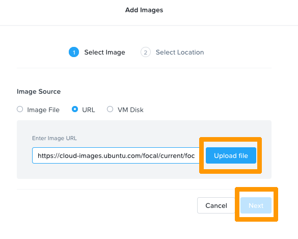

**Last updated 11th January 2022**

## Objective

If you want to create a web front-end or a reverse proxy to create a stack of VMs (web server, database), you will need to add a public IP address to create en entry point.

**This guide explains how to use the Nutanix API to deploy a Ubuntu VM with a public IP address.**

> [!warning]
> OVHcloud is providing you with services for which you are responsible, with regard to their configuration and management. You are therefore responsible for ensuring they function correctly.
>
> This guide is designed to assist you in common tasks as much as possible. Nevertheless, we recommend that you contact a [specialist service provider](https://partner.ovhcloud.com/en/directory/) if you have difficulties or doubts concerning the administration, usage or implementation of services on a server.
>

## Requirements

- A Nutanix cluster in your OVHcloud account
- Login credentials and URL for Prism Central, received via email after the installation
- Access to the [OVHcloud Control Panel](https://www.ovh.com/auth/?action=gotomanager&from=https://www.ovh.es/&ovhSubsidiary=es)
- An available failover IP address

## Instructions

### Adding a new failover IP to your vRack

Log in to the [OVHcloud Control Panel](https://www.ovh.com/auth/?action=gotomanager&from=https://www.ovh.es/&ovhSubsidiary=es) and add a failover IP address to your [vRack](https://www.ovh.es/soluciones/vrack/){.external}.

> [!primary]
> The following instructions will use the IP block 123.45.6.78/30 for example purposes.
>

For [vRack](https://www.ovh.es/soluciones/vrack/){.external} purposes, the first, penultimate, and last addresses in any given IP block are always reserved for the network address, network gateway, and network broadcast respectively. This means that the first usable address is the second address in the block, as shown below:

```console
123.45.6.76   Reserved: Network address
123.45.6.77   First usable IP
123.45.6.78   Reserved: Network gateway
123.45.6.79   Reserved: Network broadcast
```

To configure the first usable IP address, you need to edit the network configuration file.

> [!primary]
> In this example, the subnet mask (255.255.255.252) is appropriate for the IP address range used. Your subnet mask may differ, depending on the size of your block. When you purchase your IP block, you will receive an email notifying you of the subnet mask to use. 
>

On Ubuntu 20.04 LTS (Focal Fossa) with "netplan", the configuration should be as follows:

```yaml
network:
      version: 2
      renderer: networkd
      ethernets:
           ens3:
               addresses: [123.45.6.77/30]
               gateway4: 123.45.6.78
               nameservers:
                   addresses: [213.186.33.99]
```

### Deploying a Ubuntu VM via Nutanix API

#### Step 1: Upload the OS image

Connect to Prism Central and go to `Compute & Storage`{.action}, then `Images`{.action}.

Click on the `Add Image`{.action} button.

{.thumbnail}

Paste the URL of a compatible cloud image, for example:

`https://cloud-images.ubuntu.com/focal/current/focal-server-cloudimg-amd64.img`

Click on `Upload file`{.action} then `Next`{.action}.

{.thumbnail}

Select `Place image directly on clusters`{.action}, then select your cluster and `Save`{.action}.

{.thumbnail}

#### Step 2: Retrieve the necessary information with the Nutanix API

To deploy the VM, you need the UUID of the "image" and the network.

Open a terminal and execute the following command:

```bash
curl -k -H Accept:application/json -H Content-Type:application/json -u "admin:PRISMADMINPASSWORD" -X POST https://fqdn-cluster:9440/api/nutanix/v3/images/list -d{} | jq .
```

> [!primary]
> Remember to enter your actual password and FQDN as parameters.
>

> [!primary]
> The "jq ." command will provide a readable json.
>

```json
{
  "api_version": "3.1",
  "metadata": {
    "total_matches": 2,
    "kind": "image",
    "length": 2,
    "offset": 0
  },
  "entities": [
    {
      "status": {
        "state": "COMPLETE",
        "execution_context": {
          "task_uuids": [
            "4a7d3ce8-8127-4556-b30e-cf7013e74c81"
          ]
        },
        "name": "ubuntu-focal",
        "resources": {
          "retrieval_uri_list": [
            "https://127.0.0.1:9440/api/nutanix/v3/images/3cd498a2-99da-49a2-bbdf-14c349036019/file"
          ],
          "current_cluster_reference_list": [
            {
              "kind": "cluster",
              "uuid": "0005cfe0-d7b6-81c8-6173-0c42a12333ee"
            }
          ],
          "architecture": "X86_64",
          "size_bytes": 2361393152,
          "image_type": "DISK_IMAGE",
          "source_uri": "https://cloud-images.ubuntu.com/focal/current/focal-server-cloudimg-amd64.img"
        }
      },
      "spec": {
        "name": "ubuntu-focal",
        "resources": {
          "image_type": "DISK_IMAGE",
          "source_uri": "https://cloud-images.ubuntu.com/focal/current/focal-server-cloudimg-amd64.img",
          "architecture": "X86_64"
        }
      },
      "metadata": {
        "last_update_time": "2021-11-08T15:12:31Z",
        "kind": "image",
        "uuid": "3cd498a2-99da-49a2-bbdf-14c349036019",
        "spec_version": 0,
        "creation_time": "2021-11-08T15:12:06Z",
        "categories_mapping": {},
        "owner_reference": {
          "kind": "user",
          "uuid": "00000000-0000-0000-0000-000000000000",
          "name": "admin"
        },
        "categories": {}
      }
    }
```

In the metadata you can find the UUID, in this case: 3cd498a2-99da-49a2-bbdf-14c349036019.

Next you need to find the correct subnet UUID. Execute the command below:

```bash
curl -k -H Accept:application/json -H Content-Type:application/json -u "admin:PRISMADMINPASSWORD" -X POST https://fqdn-cluster:9440/api/nutanix/v3/subnets/list -d{} | jq .
```

> [!primary]
> Remember to use your actual password and FQDN as parameters.
>


```json
{
  "api_version": "3.1",
  "metadata": {
    "total_matches": 2,
    "kind": "subnet",
    "length": 2,
    "offset": 0
  },
  "entities": [
    {
      "status": {
        "state": "COMPLETE",
        "name": "base",
        "resources": {
          "vswitch_name": "br0",
          "subnet_type": "VLAN",
          "virtual_switch_uuid": "4a18b6dd-be0a-4c05-bd81-59229e67ac46",
          "vlan_id": 0
        },
        "cluster_reference": {
          "kind": "cluster",
          "name": "cluster-36",
          "uuid": "0005cfe0-d7b6-81c8-6173-0c42a12333ee"
        }
      },
      "spec": {
        "name": "base",
        "resources": {
          "vswitch_name": "br0",
          "subnet_type": "VLAN",
          "virtual_switch_uuid": "4a18b6dd-be0a-4c05-bd81-59229e67ac46",
          "vlan_id": 0
        },
        "cluster_reference": {
          "kind": "cluster",
          "name": "cluster-36",
          "uuid": "0005cfe0-d7b6-81c8-6173-0c42a12333ee"
        }
      },
      "metadata": {
        "last_update_time": "2021-11-04T08:25:18Z",
        "kind": "subnet",
        "uuid": "ed156bb0-a838-4596-b427-4bbed1968864",
        "spec_version": 0,
        "creation_time": "2021-11-04T08:25:18Z",
        "categories_mapping": {},
        "categories": {}
      }
    }
```

In the metadata you can find the UUID, in this case: ed156bb0-a838-4596-b427-4bbed1968864.

#### Step 3: Create the necessary files

To deploy the VM you need two files: `vm.json`, describing the VM and the `cloud-init.yaml` configuration file which contains the user data such as password, network etc.

Create the `vm.json` file:

```json
{
  "spec": {
    "name": "YOURVMNAME",
    "resources": {
      "power_state": "ON",
      "num_vcpus_per_socket": 4,
      "num_sockets": 1,
      "memory_size_mib": 4096,
      "disk_list": [
        {
          "disk_size_mib": 41264,
          "device_properties": {
            "device_type": "DISK",
            "disk_address": {
              "device_index": 0,
              "adapter_type": "SATA"
            }
          },
          "data_source_reference": {
            "kind": "image",
            "uuid": "3cd498a2-99da-49a2-bbdf-14c349036019"
          }
        }
      ],
      "nic_list": [
        {
          "nic_type": "NORMAL_NIC",
          "ip_endpoint_list": [
            {
              "ip_type": "DHCP"
            }
          ],
          "subnet_reference": {
            "kind": "subnet",
            "name": "base",
            "uuid": "d1117d0b-015b-4007-a84b-37f196f1af4d"
          },
          "is_connected": true
        },
        {
          "nic_type": "NORMAL_NIC",
          "ip_endpoint_list": [
            {
              "ip_type": "DHCP"
            }
          ],
          "subnet_reference": {
            "kind": "subnet",
            "name": "base",
            "uuid": "ed156bb0-a838-4596-b427-4bbed1968864"
          },
          "is_connected": true
        }
      ],
      "guest_customization": {
        "cloud_init": {
          "user_data": "USERDATA"
        },
        "is_overridable": false
      }
    }
  },
  "api_version": "3.1.0",
  "metadata": {
    "kind": "vm"
  }
}
```

> [!primary]
> You can adjust the settings with your values as needed: VM name, number of VCPUs, RAM size, disk size, etc.
>

Check `data_source_reference` to ensure the UUID is the actual UUID of your OS image:

```json
"data_source_reference": {
            "kind": "image",
            "uuid": "3cd498a2-99da-49a2-bbdf-14c349036019"
                         }
```

Verify as well for your subnet UUID:

```json
          "subnet_reference": {
            "kind": "subnet",
            "name": "base",
            "uuid": "ed156bb0-a838-4596-b427-4bbed1968864"
                              }
```

Now you have to create the `cloud-init.yaml` file. This file contains the "user data". When the system boots, these parameters such as users, package, files etc. will be applied to the VM.

Below, find a template that you can amend with your values to create your individual VM.

> [!primary]
>
> - Change "hostname", "fqdn", "name", "passwd", "ssh-autorized-keys" and ip addresses with the desired values.
> - This file will create the file for netplan, apply the configuration, and initiate a reboot.
> - The password must be a hash value. You can generate it with the command below.
>

```bash
mkpasswd --method=SHA-512 --rounds=4096
```


```yaml
#cloud-config
hostname: <yourhostname>
fqdn: <yourhostname.ovh.cloud>
users:
  - name: <yourusername>
    sudo: ['ALL=(ALL) NOPASSWD:ALL']
    groups: sudo
    shell: /bin/bash
    lock_passwd: false
    passwd: <yourhashpass>
    ssh-authorized-keys: <your public ssh key>
write_files: 
   - path: /etc/netplan/50-cloud-init.yaml
     content: |
        network:
           version: 2
           renderer: networkd
           ethernets:
              ens3:
                addresses: [123.45.6.77/30]
                gateway4: 123.45.6.78
                nameservers:
                  addresses: [213.186.33.99]


runcmd:
   - netplan generate
   - netplan apply
# Optional: if you want to use access via password instead of SSH key, uncomment the next line
#  - sed -i s/PasswordAuthentication/#PasswordAuthentication/g /etc/ssh/sshd_config 
   - reboot
```

#### Step 4: Create the VM 

Transform the `cloud-init.yaml` into "base64" and put it into a variable:

```bash
USERDATA=$(base64 -w 0 cloud-init.yaml)
```

Then replace the chain "USERDATA" in `vm.json` with the value of the `USERDATA` variable in the `vm.json` file:

```bash
sed -i s/USERDATA/${USERDATA}/g vm.json
```

Finally, use a cURL request to register and power on the VM:

```bash
curl -k -H Accept:application/json -H Content-Type:application/json -u "admin:PRISMADMINPASSWORD" -X POST https://fqdn:9440/api/nutanix/v3/vms -d @vm.json | jq .
```

> [!primary]
> You can now connect to your VM with SSH through the public IP address.
>

## Go further

[Cloud Init Documentation](https://cloudinit.readthedocs.io/en/latest/topics/examples.html){.external}

[Nutanix: API v3 reference](https://www.nutanix.dev/api-reference-v3/){.external}

[Nutanix API: How to create a Linux VM](https://www.nutanix.dev/2020/06/16/nutanix-api-v3-creating-a-linux-vm-with-cloud-init/){.external}

Join our community of users on <https://community.ovh.com/en/>.
