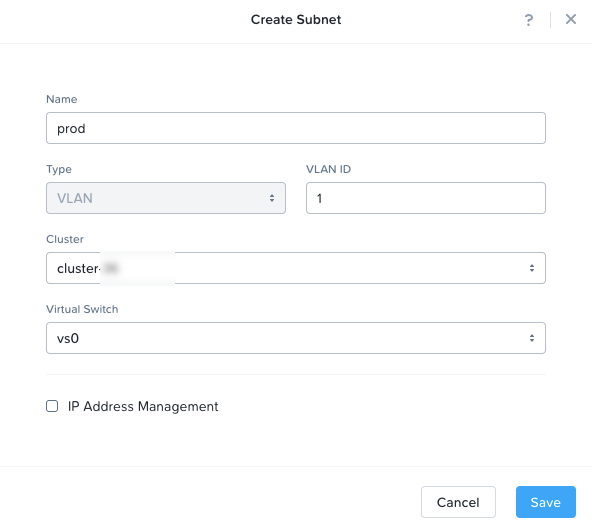

**Last updated 11th January 2022**

## Objective

A Nutanix cluster contains two different types of management machines after delivery:

- VM, 1 CVM per node plus Prism Central
- Physical servers (nodes)

In order to increase the security of management machines, it is recommended to isolate them from the production environment.

**This guide explains how to isolate management machines to improve security.**

> [!warning]
> OVHcloud is providing you with services for which you are responsible, with regard to their configuration and management. You are therefore responsible for ensuring they function correctly.
>
> This guide is designed to assist you in common tasks as much as possible. Nevertheless, we recommend that you contact a [specialist service provider](https://partner.ovhcloud.com/en/directory/) if you have difficulties or doubts concerning the administration, usage or implementation of services on a server.
>

## Requirements

- A Nutanix cluster in your OVHcloud account

## Instructions

### Step 1

Connect to the Prism Central Web interface.

Go to `Network & Security`{.action} and open `Subnets`{.action}.

{.thumbnail}

### Step 2

In this example, VLAN 0 is associated with the "base" subnet on the "vs0" virtual switch.

In order to isolate the management network, you can use a new subnet in VLAN 1 for example.

To do this, click on `Create Subnet`{.action}.

{.thumbnail}

Enter a name for your network, then select a VLAN ID, cluster and the "vs0" virtual switch.

{.thumbnail}

## Go further

Join our community of users on <https://community.ovh.com/en/>.