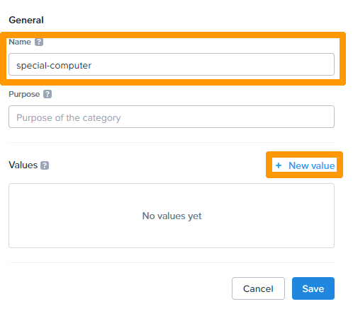
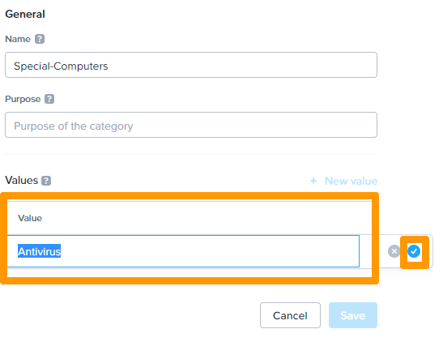

**Dernière mise à jour le 01/03/2022**

## Objectif

Connaitre et utiliser Nutanix Flow pour la sécurisation du réseau à l'intérieur d'un cluster Nutanix.

> [!warning]
> OVHcloud vous met à disposition des services dont la configuration, la gestion et la responsabilité vous incombent. Il vous appartient donc de ce fait d’en assurer le bon fonctionnement.
>
> Ce guide a pour but de vous accompagner au mieux sur des tâches courantes. Néanmoins, nous vous recommandons de faire appel à un prestataire spécialisé si vous éprouvez des difficultés ou des doutes concernant l’administration, l’utilisation ou la mise en place d’un service sur un serveur.
>

## Présention de de **Nutanix Flow**

Cette option est disponible dans toutes les offres **Hosted Private Cloud Powered by Nutanix**. Elle permet de protéger le réseau à l'interieur d'un ou plusieurs clusters Nutanix gérés par **Prism Central**.

Il est possible :

* de mettre en quarantaine des machines virtuelles de manière stricte sans laisser la possibilité d'avoir accès au réseau ou d'une manière moins stricte en permettant l'accès à des outils de diagnostics disponibles sur d'autres machines virtuelles.
* D'isoler des machines virtuelles entre elles.
* D'autoriser l'accès partiel à certaines machines virtuelles au travers de règles d'applications.
* De bloquer l'accès à certaines machines virtuels pour du **VDI** avec des comptes ou des groupes d'un annuaire **Active directory**. 

## En pratique

Nous allons configurez **Nutanix Flow**.

Connectez-vous à **Prism Central**.

Pour plus d'informations sur la connexion au cluster reportez-vous à la section « [Aller plus loin](#gofurther) » de ce guide. 

### Activation de **Nutanix Flow**

Cliquez sur l'icôe `engrenage`{.action} en haut à droite pour modifier les paramètres.

{.thumbnail}

Faites défiler la `barre de défilement`{.action} à gauche et cliquez sur `Microsegementation`{.action}.

{.thumbnail}

Cliquez sur la `case à cocher`{.action} à coté à gauche de **Enable Microsegmentation** et cliquez sur `Save`{.action}.

{.thumbnail}

La microsegmentation est activée . Il est possible de la désactiver.

{.thumbnail}

### Configuration des catégories

Une catégorie est un objet qui peut contenir une ou plusieurs valeurs, certaines catégories sont présentes lors de l'installation de **Prism Central** et il est possible de créer des nouvelles catégories.

Les catégories permettent de faciliter la gestion d'un cluster Nutanix, il est possible de les affecter à des entités comme des VM, des sous réseaux ou des images pour ensuite les utiliser dans des outils comme **Flow** par exemple.

# Création d'une catégorie

Nous allons créer une Catégories **Special Computers** avec une valeur nommée **Antirus**.

Au travers du menu principal cliquez sur `Categories`{.action} dans le sous menu `Administration`.

{.thumbnail}

Cliquez sur `New Category`{.action}.

{.thumbnail}

Saisir le nom de la catégorie dans `Name`{.action} ensuite cliquez sur `New value`{.action}.

{.thumbnail}

Saisir un nom dans `Value`{.action} et cliquez sur le `bouton bleu`{.action} à droite. 

{.thumbnail}

Cliquez sur `Save`{.action} 

{.thumbnail}

La nouvelle catégorie apparait dans la liste des catégories

{.thumbnail}

#### Affectation d'une catégorie à une machine virtuelle

Allez dans le `Menu Principal`{.action} et cliquez sur `VMs`{.action} sous `Compute & Storage.`

{.thumbnail}

`Sélectionnez`{.action} la machine virtuelle à gauche, cliquez sur `Actions`{.action} et choisissez `Manage Categories`{.action}.

{.thumbnail}

Saisisissez `le nom de la catégorie et de sa valeur` ensuite cliquez sur le bouton `+`{.action}

{.thumbnail}

Cliquez sur `Save`{.action} pour enregistrer la machine virtuelle dans une catégorie.

### Gestion de la quarantaine réseau.

#### Mise en quarantaine d'une VM

La quarataine est utilisable avec les options par défaut si la micro-segmentation ast active. Elle peut s'appliquer à une ou plusieurs machine virtuelles.

Allez dans le `Menu Principal`{.action} et cliquez sur `VMs`{.action} sous `Compute & Storage.`

{.thumbnail}

`Sélectionnez`{.action} la machine virtuelle à gauche, cliquez sur `Actons`{.action} et choisissez `Quarantine VMs`{.action}.

{.thumbnail}

Choisissez `Forensic`{.action} dans `quarantine Method` et cliquez sur `Quarantine`{.action}.

{.thumbnail}

La machine virtuelle est en quarantaine.

#### Personalisation de la quarantaine réseau.

Pour l'instant la machine virtuelle mise en quarantaine n'est pas bloquée nous allons configurer l'unique règle existante dans la sécurité réseau.

### Création d'une règle d'isolation du réseau.

### Création d'un règle d'application.

## Aller plus loin

[Hyper-convergence Nutanix](https://docs.ovh.com/fr/nutanix/nutanix-hci/)

[Présentation de Nutanix FLOW](https://portal.nutanix.com/page/documents/solutions/details?targetId=TN-2094-Flow:TN-2094-Flow)

[Régles de sécurité de Nutanix FLOW](https://portal.nutanix.com/page/documents/details?)

[Catégories dans Nutanix](https://portal.nutanix.com/page/documents/details?targetId=Prism-Central-Guide-Prism-vpc_2022_1:ssp-ssp-categories-manage-pc-c.html)

Échangez avec notre communauté d'utilisateurs sur <https://community.ovh.com/>.
