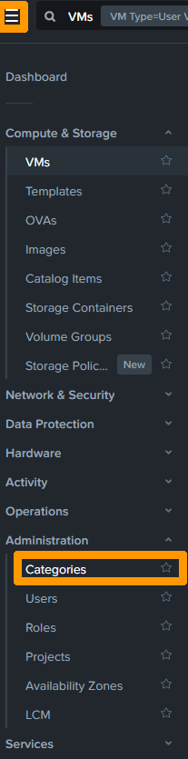
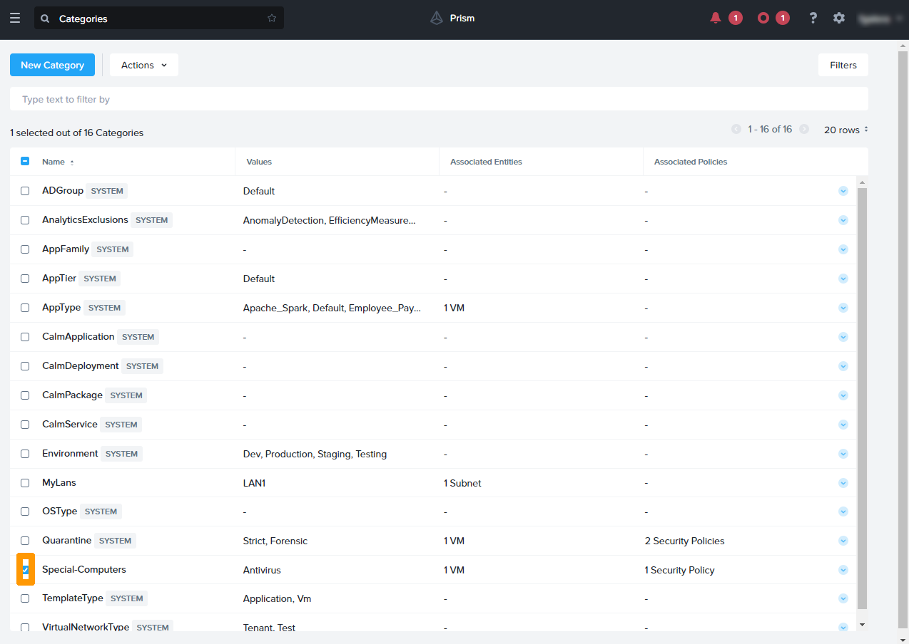

**Dernière mise à jour le 08/04/2022**

## Objectif

Nutanix Flow est disponible dans toutes les offres **Hosted Private Cloud Powered by Nutanix**. Cette option permet de sécuriser le réseau à l'intérieur d'un ou plusieurs clusters gérés par **Prism Central**

**Apprenez à utiliser Nutanix Flow pour la sécurisation du réseau au sein d'un cluster Nutanix.**

> [!warning]
> OVHcloud vous met à disposition des services dont la configuration, la gestion et la responsabilité vous incombent. Il vous appartient donc de ce fait d’en assurer le bon fonctionnement.
>
> Ce guide a pour but de vous accompagner au mieux sur des tâches courantes. Néanmoins, nous vous recommandons de faire appel à un prestataire spécialisé si vous éprouvez des difficultés ou des doutes concernant l’administration, l’utilisation ou la mise en place d’un service sur un serveur.
>

## En pratique

Connectez-vous à **Prism Central**.

Pour plus d'informations sur la connexion au cluster reportez-vous à la section « [Aller plus loin](#gofurther) » de ce guide. 

### Activation de **Nutanix Flow**

Cliquez sur l'icône `engrenage`{.action} en haut à droite pour modifier les paramètres.

{.thumbnail}

Faites défiler la `barre de défilement`{.action} à gauche et cliquez sur `Microsegmentation`{.action}.

{.thumbnail}

Cliquez sur la `case à cocher`{.action} à gauche de **Enable Microsegmentation** et cliquez sur `Save`{.action}.

{.thumbnail}

La micro-segmentation est activée. Il est possible de la désactiver.

{.thumbnail}

### Configuration des catégories 

Une catégorie est un objet qui peut contenir une ou plusieurs valeurs

Lors de l'installation d'un cluster certaines catégories existent déjà, il est possible de les modifier.

Il est possible de rajouter des catégories supplémentaires.

Il est possible de les affecter à des entités comme des machines virtuelles, des sous réseaux ou des images pour ensuite les utiliser dans des outils comme **Flow** par exemple.

#### Création d'une catégorie

Nous allons créer une Catégories **Special-Computers** avec une valeur nommée **Antivirus**.

Au travers du menu principal cliquez sur `Categories`{.action} dans le sous menu `Administration`.

{.thumbnail}

Cliquez sur `New Category`{.action}.

{.thumbnail}

Saisissez le nom de la catégorie dans `Name`{.action} ensuite cliquez sur `New value`{.action}.

{.thumbnail}

Saisissez un nom dans `Value`{.action} et cliquez sur le `bouton bleu`{.action} à droite. 

{.thumbnail}

Cliquez sur `Save`{.action}.

{.thumbnail}

La nouvelle catégorie apparait dans la liste des catégories.

{.thumbnail}

#### Modification d'une catégorie

Sélectionnez la catégorie `Special-Computers`{.action}

{.thumbnail}

Cliquez sur `Update`{.action} dans le menu `Actions`{.action}

{.thumbnail}

Cliquez sur `New value`{.action}

{.thumbnail}

Saisissez une valeur dans la `colonne Values`{.action} ensuite cliquez sur l'icône de validation.

{.thumbnail}

Cliquez sur `New value`{.action}.

{.thumbnail}

Saisissez une autre valeur dans la `colonne Values`{.action} ensuite cliquez sur l'icône de validation.

{.thumbnail}

Cliquez sur `Save`{.action} pour valider la modification de la catégorie.

{.thumbnail}

La catégorie est visible dans le tableau de bord des catégories avec ces deux nouvelles valeurs.

{.thumbnail}

#### Affectation d'une catégorie à une machine virtuelle

Allez dans le `Menu Principal`{.action} et cliquez sur `VMs`{.action} sous `Compute & Storage.`

{.thumbnail}

`Sélectionnez`{.action} la machine virtuelle à gauche.

{.thumbnail}

Cliquez sur `Actions`{.action} et choisissez `Manage Categories`{.action}. 

{.thumbnail}

Saisissez `le nom de la catégorie et de sa valeur` ensuite cliquez sur le bouton `+`{.action}.

{.thumbnail}

Cliquez sur `Save`{.action} pour enregistrer la machine virtuelle dans une catégorie.

{.thumbnail} pour que la machine virtuelle soit membre de cette catégorie.

#### Affectation d'une catégorie à plusieurs machines virtuelles

Sélectionnez trois machines virtuelles en utilisant les `cases à cocher à leurs gauches`{.action}.

{.thumbnail}

Cliquez sur le menu `Actions`{.action} et sélectionnez `Manage Categories`{.action}.

{.thumbnail}

Saisissez le nom de votre valeur dans la `zone de saisie`{.action} et cliquez sur le bouton `+`{.action}.

{.thumbnail}

Cliquez sur `Save`{.action}

{.thumbnail}

#### Affectation d'une catégorie à des sous réseaux

Nous allons voir comment affecter une catégorie à un ou plusieurs sous réseaux.

Allez dans le `Menu Principal`{.action} et cliquez sur `Subnets`{.action} sous `Network & Security`.

{.thumbnail}

Sélectionnez les `sous réseaux`{.action} en cliquant sur les case à cocher à gauche 

{.thumbnail}

Cliquez sur le menu `Actions`{.action} et sélectionnez `Manage Categories`{.action}.

{.thumbnail}

Saisissez `NOMCATEGORIE:VALEUR`{.action} et cliquez sur le signe `+`{.action}.

{.thumbnail}

Cliquez sur `Save`{.action}.

{.thumbnail}

### Gestion de la quarantaine réseau.

La quarantaine réseau permet à partir de la gestion de VM d'isoler une machine virtuelle de l'ensemble du réseau ou de lui permettre un accès restreint à certains outils de réparations sur le réseau.

#### Mise en quarantaine d'une VM

La quarantaine est utilisable avec les options par défaut si la micro-segmentation est active. Elle peut s'appliquer à une ou plusieurs machines virtuelles.

Allez dans le `Menu Principal`{.action} et cliquez sur `VMs`{.action} sous `Compute & Storage.`

{.thumbnail}

`Sélectionnez`{.action} la machine virtuelle à gauche. 

{.thumbnail}

Cliquez sur `Actions`{.action} et choisissez `Quarantine VMs`{.action} dans le menu.

{.thumbnail}

Choisissez `Forensic`{.action} dans `quarantine Method` et cliquez sur `Quarantine`{.action}.

{.thumbnail}

La machine virtuelle est en quarantaine.

#### Personnalisation de la quarantaine réseau.

Pour l'instant la machine virtuelle mise en quarantaine n'est pas bloquée, suivez ces instructions pour configurer la quarantaine.

A partir du menu principal cliquez sur `Security Policies`{.action} dans le sous menu `Network & Security`.

{.thumbnail}

Cliquez sur le `numéro`{.action} à coté de `Quarantined` pour voir les machines virtuelles en quarantaine.

{.thumbnail}

La liste des machines virtuelles en quarantaine apparait dans `Name` cliquez sur `Close`{.action} pour revenir au menu précèdent.

{.thumbnail}

Cliquez sur `Quarantine`{.action} en dessous de Name à gauche pour modifier la règle.

{.thumbnail}

Le statut de la règle est en mode `Monitoring ` comme indiqué en haut à gauche. 

Le trafic n'est pas bloqué mais surveillé. Les connexions entre les machines virtuelles mises en quarantaines et le reste du réseau sont représentées par des traits de couleurs orange reliés à des rectangles représentant l'adresse IP de la source ou de la destination.

Cliquez sur `Enforce`{.action} en haut à droite pour passer du mode **Monitoring** au mode **Enforcing** avec blocage du trafic.

{.thumbnail}

Saisissez `ENFORCE`{.action} et cliquez sur `Confirm`{.action}.

{.thumbnail}

Le statut de la règle est maintenant sur `Enforced` 

Le trafic est bloqué nous voyons les tentatives d'accès aux machines virtuelles en quarantaines via des traits de couleurs rouges vers des rectangles contenant l'adresse IP de la machine virtuelle.

Cliquez sur Cliquez sur `Update`{.action} en haut à droite pour modifier la règle afin d'autoriser certains flux réseaux.

{.thumbnail}

Cliquez sur `Next`{.action}

{.thumbnail}

Positionnez la souris sur une règle de blocage entrante et cliquez sur `Allow Traffic`{.action}

{.thumbnail}

Cliquez sur la `case à cocher`{.action} à gauche de la règle pour Sélectionner le trafic découvert entrant ensuite cliquez sur `Allow 1 Discovered Traffic`{.action} pour n'autoriser que le trafic spécifique découvert comme par exemple le protocole ICMP.

{.thumbnail}

Positionez la souris sur une règle de blocage sortante et cliquez sur `Allow Traffic`{.action}

{.thumbnail}

Cliquez sur la `case à cocher`{.action} à gauche de la règle pour Sélectionner le trafic découvert sortant. Ensuite cliquez sur `Allow 1 Discovered Traffic`{.action} pour n'autoriser que le trafic spécifique découvert.

{.thumbnail}

Le trafic autorisé est maintenant visible avec des traits de couleurs grises alors que le trafic bloqué est en rouge.

Pour créer une règle manuellement sans passer par la découverte du réseau, cliquez à gauche sur `Add Source`{.action} pour autoriser une règle entrante vers la quarantaine.

{.thumbnail}

Saisissez le nom de la catégorie ainsi que sa valeur dans `Add source by: category` ensuite cliquez sur `Add`{.action}.

{.thumbnail}

La source apparait dans `Configured`

Cliquez sur le signe `+`{.action} à coté de **Quarantine: Forensics**

{.thumbnail}

Cliquez sur `Save`{.action}

{.thumbnail}

Cliquez à gauche sur `Add Destination`{.action} à droite pour autoriser une règle sortante depuis la quarantaine

{.thumbnail}

Saisissez le nom de la catégorie ainsi que sa valeur dans `Add source by: category` ensuite cliquez sur `Add`{.action}.

{.thumbnail}

Cliquez sur `Next`{.action}.

{.thumbnail}

Cliquez sur `Save and Enforce`{.action} pour appliquer les changements sur la règle de quarantaine.

{.thumbnail}

Cliquez sur `Quarantine`{.action} pour voir le détail de de la règle de quarantaine.

{.thumbnail}

Le statut de de la règle est sur `Enforced` , le mode **forensic** a été personnalisé.

Une machine virtuelle placée en mode **Strict** sera totalement isolée du réseau alors qu'en mode **Forensic** elle aura accès aux machines virtuelles définies dans la règle de quarantaine.

{.thumbnail}

### Création d'une règle d'isolation

Un règle d'isolations permet le blocage de communication entre deux types de catégories (machines virtuelles ou sous réseaux)

Au travers du menu principal cliquez sur `Categories`{.action} dans le sous menu `Administration`.

{.thumbnail}

Assurez-vous d'avoir correctement configuré les valeurs dans la catégorie avant de continuer le paramètrage.

Pour plus d'informations sur la gestion des catégories reportez-vous à la section « [Configuration des catégories](#gocategoriesemanage) » de ce guide. 

{.thumbnail}

Cliquez sur `Securities Policies`{.action} se trouvant dans la catégorie `Network & Security` du menu principal.

{.thumbnail}

Cliquez sur `Create Security Policy`{.action}.

{.thumbnail}

Sélectionnez `Isolate Environments (Isolation Policy)`{.action} ensuite cliquez sur `Create`{.action}.

{.thumbnail}

Saisissez le nom de la règle dans `Name`{.action} ensuite mettez un commentaire dans `Purpose`{.action}, Choisissez une catégorie dans `Isolate this category`{.action} suivi d'une autre catégorie dans `From this category`{.action}.

Sélectionnez Enforce dans `Select a Policy mode`{.action} et cliquez sur `Save and Enforce`{.action}. 

{.thumbnail}

La règle est active dans la liste des règles de sécurité.

Cliquez sur `Le nom de la règle`{.action} en dessous de `Name` pour voir le détail.

{.thumbnail}

Le statut de la règle est `Enforced` et l'on peut voir qu'aucune tentative de connexion entre les deux zones est détectée comme indiquée sur ce message. **No Traffic between them has been discovered**

{.thumbnail}

Si une tentative de connexion réseau est détectée entre ces deux zones le message a changé en **Traffic between them has been discovered**

### Mise en place d'une règle d'application.

Une règle d'application permet de limiter l'accès à une catégorie d'applications à certains port protocoles ou services.

La catégorie d'applications est deja existante dans les catégories avec des valeurs prédéfinies mais il est possible d'ajouter d'autres valeurs.

Pour plus d'informations sur la gestion des catégories reportez-vous à la section « [Configuration des catégories](#gocategoriesemanage) » de ce guide.

A partir du menu principal cliquez sur `Security Policies`{.action} dans le sous menu `Network & Security`.

{.thumbnail}

Cliquez sur `Create Security Policy`{.action}.

{.thumbnail}

Sélectionnez `Secure Application (App Policy)`{.action} et cliquez sur `Create`{.action}.

{.thumbnail}

Saisissez ces champs `Name` par un nom de règle, `Purpose` avec un commentaire , `Secure this App` en choisissant une catégorie existante d'applications et cliquez sur `Next`{.action}.

{.thumbnail}

Cliquez sur `Add Source`{.action} à gauche

{.thumbnail}

Choisissez la `catégorie` concernant le VLAN et cliquez sur `Add`{.action}

{.thumbnail}

Cliquez sur le signe `+`{.action} pour relier à l'application à la source.

{.thumbnail}

Sélectionnez `Select a Service`{.action} , choisir la catégorie dans `Protocol/Service`{.action}, recherchez le nom du service dans `Port/Service Details`{.action} et cliquez sur `Save`{.action}.

{.thumbnail}

Cliquez sur `Next`{.action} pour finaliser la création de la règle.

{.thumbnail}

## Aller plus loin 

[Hyper-convergence Nutanix](https://docs.ovh.com/fr/nutanix/nutanix-hci/)

[Présentation de Nutanix FLOW](https://portal.nutanix.com/page/documents/solutions/details?targetId=TN-2094-Flow:TN-2094-Flow)

[Règles de sécurité de Nutanix FLOW](https://portal.nutanix.com/page/documents/details?)

[Catégories dans Nutanix](https://portal.nutanix.com/page/documents/details?targetId=Prism-Central-Guide-Prism-vpc_2022_1:ssp-ssp-categories-manage-pc-c.html)

Échangez avec notre communauté d'utilisateurs sur <https://community.ovh.com/>.
