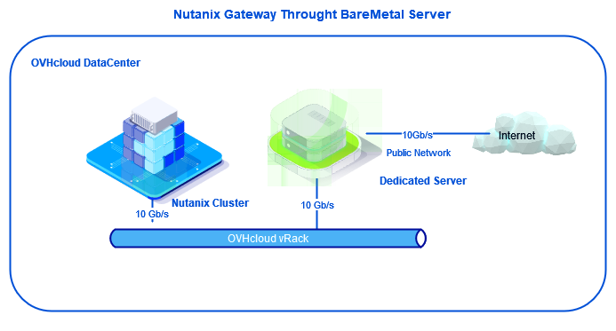
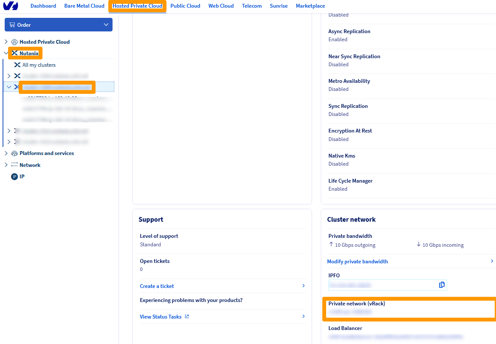
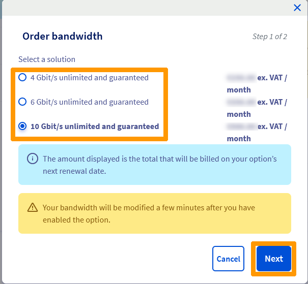
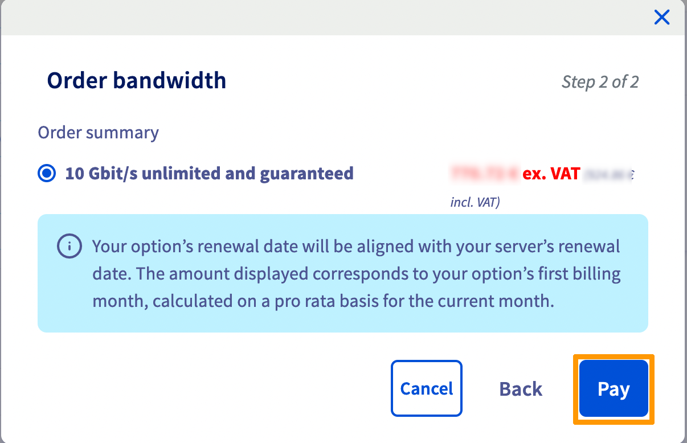
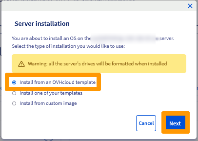
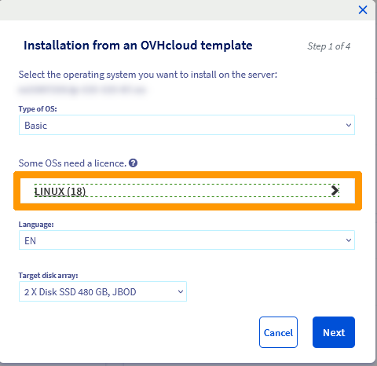
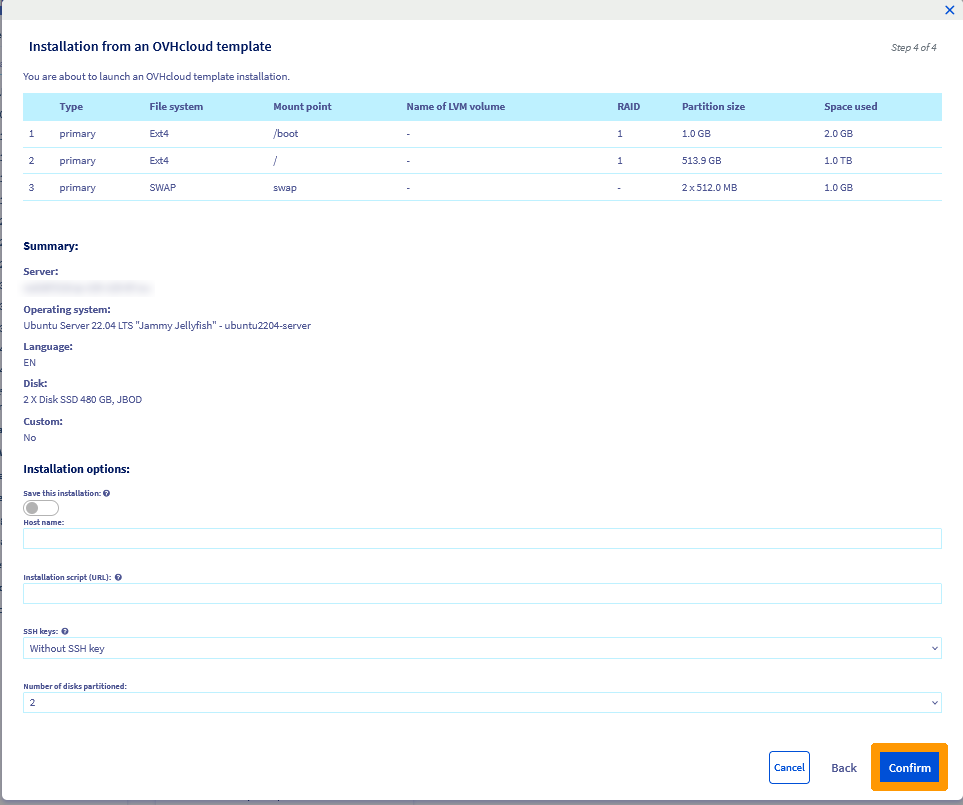

**Dernière mise à jour le 28/01/2022**

## Présentation

Une machine virtuelle **OVHgateway** est installée lors d'un déploiement d'un cluster **Nutanix on OVHcloud**, cette machine virtuelle sert de passerelle Internet Sortante pour le cluster le débit maximal est de 1gb/s.

Si vous avez besoin d'une bande passante plus importante il faut remplacer cette passerelle par un serveur dédié et choisir une offre qui vous permettra d'aller entre 1 gb/s et 10 gb/s sur le réseau public comme indiqué sur ce lien [Serveurs dédiés OVHcloud](https://www.ovhcloud.com/fr/bare-metal/). Contactez le service commercial OVHcloud pour vous aider à choisir le bon serveur. 

**Nous allons voir comment remplacer la passerelle par défaut par un serveur dédié OVHcloud pour augmenter la bande passante.**


> [!warning]
> OVHcloud vous met à disposition des services dont la configuration, la gestion et la responsabilité vous incombent. Il vous appartient donc de ce fait d’en assurer le bon fonctionnement.
>
> Ce guide a pour but de vous accompagner au mieux sur des tâches courantes. Néanmoins, nous vous recommandons de faire appel à un prestataire spécialisé si vous éprouvez des difficultés ou des doutes concernant l’administration, l’utilisation ou la mise en place d’un service sur un serveur.
>

## Prérequis

- Disposer d'un cluster Nutanix dans votre compte OVHcloud.
- Être connecté à votre [espace client OVHcloud](https://www.ovh.com/auth/?action=gotomanager&from=https://www.ovh.com/fr/&ovhSubsidiary=fr).
- Être connecté sur le cluster via Prism Central. 
- Disposer d'un serveur dédié dans votre compte OVHcloud avec plusieurs cartes réseaux, certaines sur le réseau public d'autres sur le réseau privé. Ce serveur doit être sur le même Data Center que le cluster Nutanix.

## En pratique

Nous allons déployer un serveur dédié sous Linux qui utilise 4 cartes réseaux (2 sur le réseau public, 2 sur le réseau privé) pour remplacer la machine virtuelle OVHgateway.

Pour remplacer l'OVHgateway nous allons utiliser ces paramètres :

- Lan public en DHCP qui fournit une adresse publique sur une seule carte réseau.
- Lan privé sur une équipe de deux cartes et des adresses privées paramétrées sur un VLAN.
    - VLAN 1 : adresse IP privée et masque de l'OVHgateway (Dans notre exemple 172.16.3.254/22)

{.thumbnail}    
    
### Récupération des informations nécessaires au déploiement de votre serveur

Allez dans votre espace client OVHcloud cliquez sur `Hosted Private Cloud`{.action} dans la barre d'onglets, sélectionnez votre cluster Nutanix à gauche et notez le nom du vRack associé à votre cluster Nutanix dans `Réseau privé (vRack)`.

{.thumbnail}

Toujours dans votre espace client OVHcloud allez sur l'onglet `Bare Metal Cloud`{.action}. Sélectionnez dans la barre de menu à gauche votre serveur dédié et cliquez sur `Interfaces réseau`{.action}.

{.thumbnail}

Positionnez-vous en bas à droite dans **Interfaces réseau** et notez les adresses MAC associées au réseau public et au réseau privé (deux adresses MAC par réseau).

{.thumbnail}

Au travers de l'encadrement **Bande passante** cliquez sur `Modifier la bande passante publique`{.action} pour changer le débit de votre réseau public.

> [!warning]
> En fonction du débit que vous souhaitez le prix de l'abonnement à votre serveur augmentera et il faudra valider ce changement par une commande dans votre espace client OVHcloud.
>

{.thumbnail}

Sélectionnez la bande passante désirée et cliquez sur `Suivant`{.action}.

{.thumbnail}

Cliquez sur `Régler`{.action}.

{.thumbnail}

Cliquez sur `Voir le bon de commande`{.action} pour afficher le bon de commande.

{.thumbnail}

Dès que la commande sera validée votre débit sur la bande passante publique sera changé.

{.thumbnail}

### Connexion au vRack du serveur dédié

Restez sur la configuration, cliquez en bas de la page sur `Le bouton de configuration`{.action} des cartes du réseau privé, et cliquez sur `Attacher un réseau privé vRack`{.action}.

{.thumbnail}

Sélectionnez le vRack dans **Sélectionnez votre réseau privé** qui correspond à votre serveur Nutanix et cliquez sur `Attacher`{.action}.

{.thumbnail}

Le vRack est affiché dans la colonne **Réseau privé**.

{.thumbnail}

### Installation du système d'exploitation

Nous allons maintenant installer un système d'exploitation Linux Ubuntu 22 à partir de l'espace client.

Au travers des onglets du serveur dédié allez sur `Informations générales`{.action}, cliquez sur le bouton à droite de `Dernier système d'exploitation (OS) installé par OVHcloud`{.action}. et cliquez sur `Installer`{.action}

{.thumbnail}

Laissez la sélection sur `Installer à partir d'un template OVH`{.action} et cliquez sur `Suivant`{.action}.

{.thumbnail}

Cliquez sur la `liste des serveurs`{.action}. en dessous de **Certains OS nécessitent une licence**.

{.thumbnail}

Sélectionnez `Ubuntu Server 22.04 LTS`{.action} et cliquez sur `Suivant`{.action}.

{.thumbnail}

Cliquez sur `Valider`{.action}.

{.thumbnail}

L'installation du système d'exploitation se lance une fenêtre de l'état d'avancement apparait et disparaitra quand l'installation sera terminée.

Un message vous sera envoyé dans la boite aux lettres du compte client, il contiendra le compte utilisateur administrateur (le compte se nomme ubuntu) ainsi qu'un lien vers son mot de passe.  

{.thumbnail}

### Arrêt de la machine virtuelle OVHgateway sur Prism Central

Nous allons arrêter la machine virtuelle **OVHgateway** avant de configurer le serveur dédié.

Allez dans **Prism Central** dans la gestion des machines virtuelles sélectionnez la machine virtuelle `OVHgateway` allez dans le menu `Actions`{.action} et choisissez `Guest Shutdown`{.action}.

{.thumbnail}

La machine virtuelle est éteinte. 

{.thumbnail}

### Configuration réseau en tant que passerelle Linux

Lorsque l'on déploie un serveur Linux à partir de l'interface client OVHcloud une seule carte réseau est configurée avec l'adresse publique attribuée à votre serveur. Cette adresse vous servira pour vous connecter en SSH.

Connectez-vous en SSH au serveur dédié avec cette commande :

```bash
ssh ubuntu@dedicated-server-public-ip-address
```

Saisissez cette commande pour faire apparaitre les cartes qui ne sont pas connectées.
```bash
ip a | grep -C1 DOWN
```

Trois cartes réseaux sont affichées avec l'état **DOWN**, reprenez la liste des adresses MAC et récupérer le nom des deux cartes privées comme dans l'exemple ci-dessous :

> [!warning]
> Ne vous basez pas sur l'ordre des cartes pour trouver le nom des cartes du réseau privé mais plutôt sur les adresses MAC noté à partir du Manager.
>

```bash
3: "publiccardname2": <BROADCAST,MULTICAST> mtu 1500 qdisc noop state DOWN group default qlen 1000
    link/ether "mac-address-public-card2" brd ff:ff:ff:ff:ff:ff
4: "privatecardname1": <BROADCAST,MULTICAST> mtu 1500 qdisc noop state DOWN group default qlen 1000
    link/ether "mac-address-private-card1" brd ff:ff:ff:ff:ff:ff
5: "privatecardname2": <BROADCAST,MULTICAST> mtu 1500 qdisc noop state DOWN group default qlen 1000
    link/ether "mac-address-private-card1" brd ff:ff:ff:ff:ff:ff
```

Lancer cette commande :

```bash
ip a | grep -C1 UP
```

Vous voyez deux cartes réseau avec l'état **UP**, la carte loopback et une carte physique dont l'adresse MAC doit correspondre à une des adresses publiques notées dans l'espace client OVHcloud. Récuperez le nom de cette carte réseau :

```bash
1: "lo": <LOOPBACK,UP,LOWER_UP> mtu 65536 qdisc noqueue state UNKNOWN group default qlen 1000
    link/loopback 00:00:00:00:00:00 brd 00:00:00:00:00:00
--
       valid_lft forever preferred_lft forever
2: "publiccardname1": <BROADCAST,MULTICAST,UP,LOWER_UP> mtu 1500 qdisc mq state UP group default qlen 1000
    link/ether "mac-address-public-card1" brd ff:ff:ff:ff:ff:ff
```

Après avoir exécuter ces commandes vous devez avoir noté ces informatations :

* `"publiccardname1"` : Le nom de la première carte réseau publique. 
* `"mac-address-public-card1"` : L'addresse MAC de la première carte réseau publique.

* `"privatecardname1"` : le nom de la première carte réseau privée.
* `"mac-address-private-card1"` : L'addresse MAC de la première carte réseau privée.

* `"privatecardname2"` : le nom de la deuxième carte réseau privée.
* `"mac-address-private-card2"` : L'addresse MAC de la deuxième carte réseau privée

Exécutez cette commande pour éditer le fichier `/etc/nftables.conf`

```bash
sudo nano /etc/nftables.conf
```

Modifiez le contenu du fichier en remplaçant `"publiccardname1"` par ce que vous avez noté.

```conf
flush ruleset

define DEV_VLAN1 = bond0.1
define DEV_VLAN2 = bond0.2
define DEV_WORLD = "publiccardname1"
define NET_VLAN1 = 172.16.0.0/22

table ip global {
    chain inbound_world {
        # accepting ping (icmp-echo-request) for diagnostic purposes.
        # However, it also lets probes discover this host is alive.
        # This sample accepts them within a certain rate limit:
        #
        # icmp type echo-request limit rate 5/second accept

        # allow SSH connections from anywhere
        ip saddr 0.0.0.0/0 tcp dport 22 accept
    }

    chain inbound_private_vlan1 {
        # accepting ping (icmp-echo-request) for diagnostic purposes.
        icmp type echo-request limit rate 5/second accept

        # allow SSH from the VLAN1 network
        ip protocol . th dport vmap { tcp . 22 : accept}
    }

    
    chain inbound {
        type filter hook input priority 0; policy drop;

        # Allow traffic from established and related packets, drop invalid
        ct state vmap { established : accept, related : accept, invalid : drop }

        # allow loopback traffic, anything else jump to chain for further evaluation
        iifname vmap { lo : accept, $DEV_WORLD : jump inbound_world, $DEV_VLAN1 : jump inbound_private_vlan1 }

        # the rest is dropped by the above policy
    }

    chain forward {
        type filter hook forward priority 0; policy drop;

        # Allow traffic from established and related packets, drop invalid
        ct state vmap { established : accept, related : accept, invalid : drop }

        # connections from the internal net to the internet: vlan2 to vlan1 and vlan2 to vlan1 not allowed
        meta iifname . meta oifname { $DEV_VLAN1 . $DEV_WORLD, $DEV_WORLD . $DEV_VLAN1 } accept

        # the rest is dropped by the above policy
    }

    chain postrouting {
        type nat hook postrouting priority 100; policy accept;

        # masquerade private IP addresses
        ip saddr $NET_VLAN1 meta oifname $DEV_WORLD counter masquerade
    }
}
```

Exécuter cette commande pour éditer le fichier `/etc/netplan/50-cloud-init.yaml` 

```bash
sudo nano /etc/netplan/50-cloud-init.yaml
```

```yaml
# This file is generated from information provided by the datasource.  Changes
# to it will not persist across an instance reboot.  To disable cloud-init's
# network configuration capabilities, write a file
# /etc/cloud/cloud.cfg.d/99-disable-network-config.cfg with the following:
# network: {config: disabled}
network:
    version: 2
    ethernets:
        "publiccardname1":
            accept-ra: false
            addresses:
            - 2001:41d0:20b:4500::/56
            dhcp4: true
            gateway6: fe80::1
            match:
                macaddress: "mac-address-public-card1"
            nameservers:
                addresses:
                - 2001:41d0:3:163::1
            set-name: "publiccardname1"
        #vRack interface
        "privatecardname1":
            match:
                macaddress: "mac-address-private-card1"
            optional: true
        "privatecardname2":
            match:
                macaddress: "mac-address-private-card2"
            optional: true
    bonds:
        bond0:
            dhcp4: no
            addresses: [192.168.254.2/24]
            interfaces: ["privatecardname1", "privatecardname2"]
            parameters:
                mode: 802.3ad
                transmit-hash-policy: layer3+4
                mii-monitor-interval: 100
    vlans:
        bond0.1:
            dhcp4: no
            dhcp6: no
            id: 1
            addresses: [172.16.3.254/22]
            link: bond0
```

Modifiez le contenu du fichier `/etc/netplan/50-cloud-init.yaml` en remplaçant les noms ci-dessous : 

* `"publiccardname1"` par le nom de votre carte réseau publique.
* `"mac-address-public-card1"` par l'adresse MAC de votre carte réseau publique.
* `"privatecardname1"` par le nom de votre première carte réseau privée.
* `"mac-address-private-card1"` par l'adresse MAC de votre première carte réseau privée.
* `"privatecardname2"` par le nom de votre deuxième carte réseau privée.
* `"mac-address-private-card2"` par l'adresse MAC de votre deuxième carte réseau privée.

Exécutez ces commandes :

```bash
#!/bin/bash
set -eux

apt update && apt upgrade -y

# Disable cloud-init networking
touch /etc/cloud/cloud.cfg.d/99-disable-network-config.cfg
echo "network: {config: disabled}">> /etc/cloud/cloud.cfg.d/99-disable-network-config.cfg

# Enable forwarding
sed -i s/#net.ipv4.ip_forward/net.ipv4.ip_forward/g /etc/sysctl.conf
sysctl net.ipv4.ip_forward

# Ufw disabling
sudo systemctl disable ufw
sudo systemctl stop ufw

# Appling network configuration
sudo netplan apply

# Nftables enabling
sudo systemctl enable nftables
sudo systemctl start nftables

# system reboot
sudo reboot
```

La passerelle est disponible pour le Cluster Nutanix dans le VLAN 1.

### Test de la bande passante

Vous pouvez contrôler la bande passante de votre serveur avec un outil nommé Iperf que vous pouvez trouver sur le site officiel [Site WEB Iperf](https://iperf.fr/)

Pour faire un test complet, utilisez créer une machine virtuelle sous Linux, installer le logiciel iperf3 et lancer cette commande :

```bash
perf3 -c proof.ovh.net -p 5202 --logfile iperf2.log
```

Le test dure 10 secondes et vous aurez la bande passante de votre cluster au travers de votre serveur dédié.

```console
[  6] 1796.00-1797.00 sec  1.08 GBytes  9.28 Gbits/sec    0   3.02 MBytes
[  6] 1797.00-1798.00 sec  1.08 GBytes  9.28 Gbits/sec    0   3.02 MBytes
[  6] 1798.00-1799.00 sec  1.08 GBytes  9.28 Gbits/sec    0   3.02 MBytes
[  6] 1799.00-1800.00 sec  1.08 GBytes  9.28 Gbits/sec    0   3.02 MBytes
```


## Aller plus loin <a name="gofurther"></a>

Échangez avec notre communauté d'utilisateurs sur <https://community.ovh.com/>.
