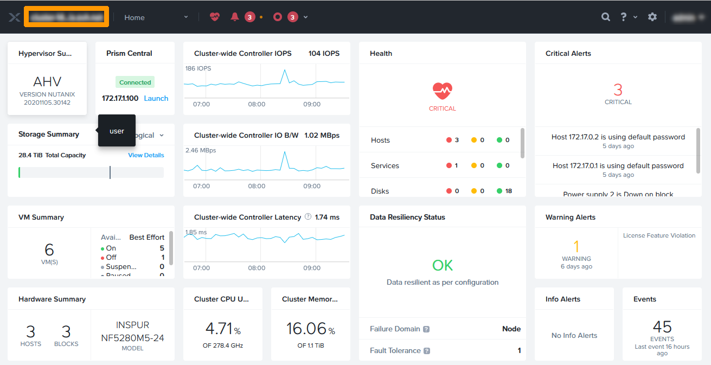
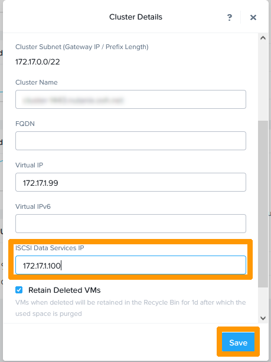

**Dernière mise à jour le 15/07/2022**

## Présentation

Virtual Private Cloud est disponible sur toutes les offres **Hosted Private Cloud Powered by Nutanix**. Il est possible de créer des réseaux séparés sans avoir besoin de VLAN au travers de la technologie VTEP , de mutualiser l'accès INTERNET pour ces réseaux et de proposer une connexion VPN vers un autre cluster et etendre ces réseaux sur un autre cluster

**Mettez en service Nutanix Virtual Private Cloud  pour créer des réseaux privés virtuel et mutualiser un accès Internet.**

> [!warning]
> OVHcloud vous met à disposition des services dont la configuration, la gestion et la responsabilité vous incombent. Il vous appartient donc de ce fait d’en assurer le bon fonctionnement.
>
> Ce guide a pour but de vous accompagner au mieux sur des tâches courantes. Néanmoins, nous vous recommandons de faire appel à un prestataire spécialisé si vous éprouvez des difficultés ou des doutes concernant l’administration, l’utilisation ou la mise en place d’un service sur un serveur.
>

## En pratique

Nous allons activer **Nutanix Virtual Private Cloud sur un cluster Nutanix** et créer un réseau privé virtuel.

### Configuration de l'adresse iSCSI

Connectez-vous à **Prism Element** depuis **Prism Central**

Au travers du tableau de bord de **Prism Element** cliquez en haut à gauche sur le `nom du cluster`{.action}.

{.thumbnail}

Saisissez une `adresse IP` sur du réseau privé d'administration non utilisée dans **iSCSI Data Service IP**.

{.thumbnail}

### Activation NTP

### Activation DNS

### Configuration du MTU

### Activation du microservice

### Activation de virtual Private CLoud

### Configuration d'une passerelle

## Aller plus loin 

[Hyper-convergence Nutanix](https://docs.ovh.com/fr/nutanix/nutanix-hci/)

[Présentation de Nutanix Virtual Private Cloud](https://portal.nutanix.com/page/documents/details?targetId=Nutanix-Flow-Networking-Guide:ear-flow-nw-vpc-pc-c.html)

[Catégories dans Nutanix](https://portal.nutanix.com/page/documents/details?targetId=Prism-Central-Guide-Prism-vpc_2022_1:ssp-ssp-categories-manage-pc-c.html)

Échangez avec notre communauté d'utilisateurs sur <https://community.ovh.com/>.
