**Last updated 28th November 2022**

## Objective

This guide will show you how to interconnect two Nutanix clusters, provided by OVHcloud through an IPsec VPN. To do this, we will replace the **OVHgateway** virtual machines that provide internet access with a gateway under the **pfSense** operating system.

> [!warning]
> OVHcloud provides services for which you are responsible, with regard to their configuration and management. It is therefore your responsibility to ensure that they they function correctly.
>
> This guide is designed to assist you in common tasks as much as possible. Nevertheless, we recommend contacting a [specialist service provider](https://partner.ovhcloud.com/en-gb/directory/) or reaching out to [our community](https://community.ovh.com/en/) if you experience any issues.
>


## Requirements

- One Nutanix cluster provided by OVHcloud
- Access to the [OVHcloud Control Panel](https://www.ovh.com/auth/?action=gotomanager&from=https://www.ovh.co.uk/&ovhSubsidiary=GB)
- Access to your clusters via Prism Central

## Instructions

In this guide, we will carry out part of the installation on the cluster in Canada, and another part in France. Below is the list of tasks to be performed in stages on each cluster:

[Step 1 Solution Overview](#presentation)<br /> 
[Step 2 Gateway Replacement in Canada](#configurecanada)<br />
&ensp;[Step 2.1 Downloading sources for pfSense installation](#downloadsources)<br />
&ensp;[Step 2.2 Creating the virtual machine **GW-PFSENSE**](#createvmpfsense)<br />
&ensp;[Step 2.3 Shutting down the virtual machine **OVH-GATEWAY**](#shutdownovhgateway)<br />
&ensp;[Step 2.4 Retrieving the public address in the OVHcloud Control Panel](#getpublicaddress)<br />
&ensp;[Step 2.5 Starting the virtual machine **GW-PFSENSE**](#poweronvmpfsense)<br />
&ensp;[Step 2.6 Installing **pfSense**](#pfsenseinstall)<br />
&ensp;[Step 2.7 Ejecting pfSense CDROM from virtual machine **GW-PFSENSE**](#pfsenseremovecdrom)<br />
&ensp;[Step 2.8 Configuring pfSense IP addresses through the console](#configureippfsense)<br />
&ensp;&ensp;[Step 2.9 Configuring certain options through the Web interface](#configurepfsenseoptions)<br />
&emsp;&emsp;[Step 2.9.1 Changing the default password for **pfSense**](#changepassword)<br />
&emsp;&emsp;[Step 2.9.2 Adding a rule to allow remote administration from a public address](#addadminrule)<br />
[Step 3 Gateway configuration in France](#configuregatewayfrance)<br />
&ensp;&ensp;[Step 3.1 Downloading sources for pfsense installation](#downloadsources)<br />
&ensp;[Step 3.2 Creating the virtual machine **GW-PFSENSE**](#createvmpfsensefr)<br />
&ensp;[Step 3.3 Shutting down the virtual machine **OVH-GATEWAY**](#shutdownovhgatewayfr)<br />
&ensp;[Step 3.4 Retrieving the public address on the OVHcloud Control Panel](#getpublicaddressfr)<br />
&ensp;[Step 3.5 Starting the virtual machine **GW-PFSENSE**](#poweronvmpfsensefr)<br />
&ensp;[Step 3.6 Installing **pfSense**](#pfsenseinstallfr)<br />
&ensp;[Step 3.7 Ejecting pfSense CDROM from virtual machine **GW-PFSENSE**](#pfsenseremovecdromfr)<br />
&ensp;[Step 3.8 Configure pfSense IP addresses through the console](#configureippfsensefr)<br />
&ensp;&ensp;[Step 3.9 Configuring certain options through the Web interface](#configurepfsenseoptionsfr)<br />
&emsp;&emsp;[Step 3.9.1 Changing the default password for **pfSense**](#changepassworden)<br />
&emsp;&emsp;[Step 3.9.2 Adding a rule to allow remote administration from a public address](#addadminruleen)<br />
[Step 4 Setting up IPsec VPN](#configurevpnipsec)<br />
&ensp;[Step 4.1 Setting Up the site in Canada](#ipseccanada)<br />
&emsp;&emsp;[Step 4.1.1 Setting up IPsec VPN in France](#paramipsectofrance)<br />
&emsp;&emsp;[Step 4.1.2 Adding a firewall rule to allow network flow through IPsec VPN between Canada and France](#addfwruletofrance)<br />
&ensp;[Step 4.2 Setting up your website in France](#ipsecfrance)<br />
&emsp;&emsp;[Step 4.2.1 Setting up IPsec VPN to Canada](#paramipsectocanada)<br />
&emsp;&emsp;[Step 4.2.2 Adding a firewall rule to allow network flow through IPsec VPN between Canada and France](#addruletocanada)<br />

<a name="presentation"></a>
### Step 1 Solution Overview

We will interconnect two Nutanix clusters, one in Canada and the other in France, both in OVHcloud data centres.<br>
They each use a different IP address scheme, as follows:

- **Cluster in Canada**: 192.168.10.0/24
- **Cluster in France**: 192.168.0.0/24

To allow this configuration, we will replace the **OVHgateway** virtual machine on each site with a virtual machine with the **pfSense** operating system, which will continue to provide outbound internet access and manage the VPN tunnel using IPsec.

<a name="configurecanada"></a>
### Step 2 Bridge replacement in Canada 

<a name="downloadsources"></a>
#### Step 2.1 Downloading sources for pfSense installation

Download an ISO image for the **pfSense** installation from this link: [Downloading pfSense](https://www.pfsense.org/download/){.external}.

Using [this documentation](https://docs.ovh.com/gb/en/nutanix/image-import/), add the **pfSense ISO** image to your Nutanix cluster.

<a name="createvmpfsense"></a>
#### Step 2.2 Creating the **GW-PFSENSE virtual machine**

Create a virtual machine with these settings:

- **Name**: `GW-PFSENSE`
- **Storage1**: `60 GB HDD` 
- **Storage2**: `DVD drive connected to the pfSense ISO file`
- **RAM**: `4 GB` 
- **CPU**: `2 vCPU`
- **Network**: `two network cards on the AHV network: **Base**`

You can use [our guide on virtual machine management](https://docs.ovh.com/gb/en/nutanix/virtual-machine-management/) to create this virtual machine.

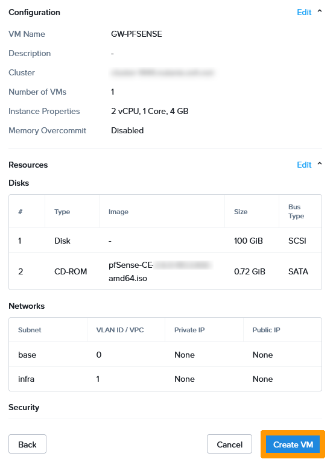{.thumbnail}

<a name="shutdownovhgateway"></a>
#### Step 2.3 Shutting down the **OVH-GATEWAY virtual machine**

To avoid duplicate IP addresses on the network, stop the **OVHgateway** virtual machine before starting the new virtual machine on **pfSense**.

Via **Prism Central**, click in the top left on the `main menu`{.action}.

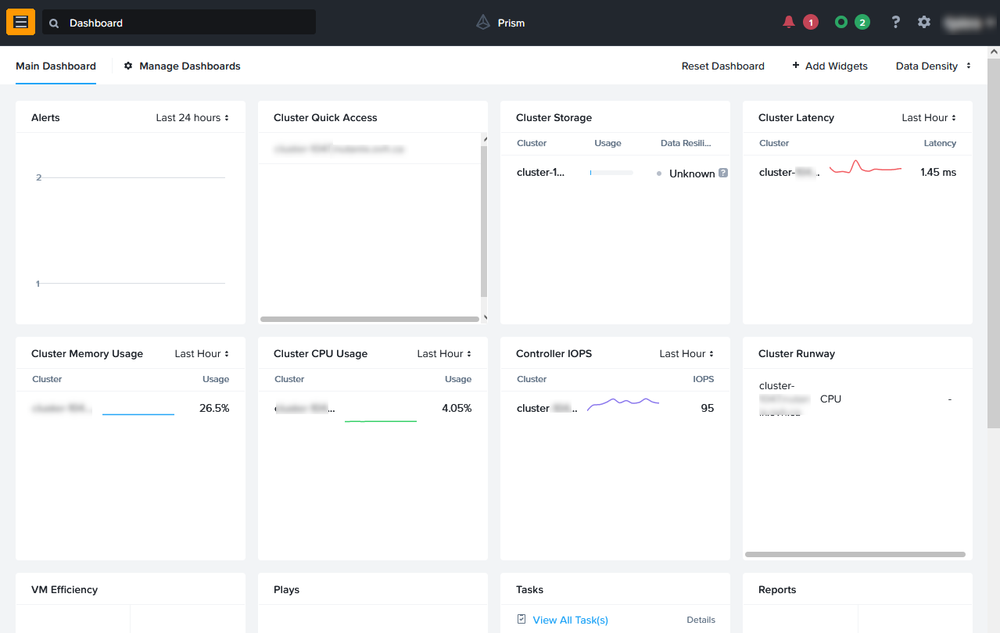{.thumbnail}

Click `VMs`{.action}.

{.thumbnail}

Click on the `OVHgateway`{.action} virtual machine.

{.thumbnail}

From the `More` menu at the top, click `Soft Shutdown`{.action}.

{.thumbnail}

<a name="getpublicaddress"></a>
#### Step 2.4 Retrieving the public address in the OVHcloud Control Panel 

Retrieve information about the OVHcloud gateway network settings.

Log in to the [OVHcloud Control Panel](https://www.ovh.com/auth/?action=gotomanager&from=https://www.ovh.co.uk/&ovhSubsidiary=GB), select your Nutanix cluster, and find the information in the `IPFO` field.

{.thumbnail}

What is called **IPFO** is a range of 4 addresses. The first and last are reserved, the third is on OVHcloud hardware and serves as an **internet** gateway. The only usable IP address is the second address in the range. 

During installation, we will reuse this information to assign it to the new **GW-PFSENSE virtual machine**

```console
XX.XX.XX.N Reserved network address that appears on the OVHcloud client site
XX.XX.XX.N+1 IP address to be assigned to the GW-PFSENSE virtual machine WAN interface
XX.XX.XX.N+2 Address to be used as a gateway on the GW-PFSENSE VM WAN interface
XX.XX.XX.N+3 Reserved broadcast IP address
```

For example, if the **IPFO** address displayed on the client site is 123.123.123.4/30, use:

- **123.123.123.5** for the **WAN** interface address.
- **123.123.123.6** for the gateway on the **WAN** interface.

<a name="poweronvmpfsense"></a>
#### Step 2.5 Start the **GW-PFSENSE virtual machine**

Go back to virtual machine management in **Prism Central** and click on `GW-PFSENSE`{.action}.

{.thumbnail}

Select `Power On`{.action} from the `More` menu.

{.thumbnail}

Click `Launch console`{.action}.

{.thumbnail}

<a name="pfsenseinstall"></a>
#### Step 2.6 Installing **pfSense**

Review the pfSense licence information and press the `Enter`{.action} key to accept it.

{.thumbnail}

Choose `Install`, switch to `OK` with the `Tab`{.action} key and press `Enter`{.action}.

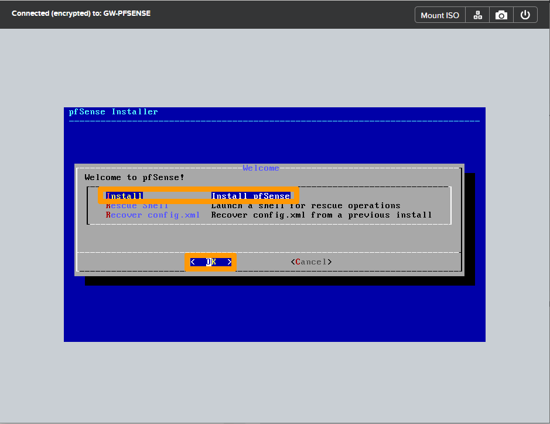{.thumbnail}

Select `Continue with default keymap`, go to `Select` with the `Tab`{.action} key and press the `Enter`{.action} key.

{.thumbnail}

Select `Auto (ZFS)`, switch to `OK` with the `Tab`{.action} key, and then press the `Enter`{.action} key.

{.thumbnail}

Go to `Select` with the `Tab`{.action} key and press `Enter`{.action}.

{.thumbnail}

Select `Stripe`, switch to `OK` with the `Tab`{.action} key, and then press `Enter`{.action}.

{.thumbnail}

Select `NUTANIX VDISK` with the `Space`{.action} bar. Then go to `OK` with the `Tab`{.action} key and press `Enter`{.action}.

{.thumbnail}

Go to `YES` with the `Tab`{.action} key and press the `Enter`{.action} key.

{.thumbnail}

Choose `NO` with the `Tab`{.action} key and press the `Enter`{.action} key.

{.thumbnail}

Select `Reboot` and press the `Enter`{.action} key.

{.thumbnail}

<a name="pfsenseremovecdrom"></a>
#### Step 2.7 Eject the pfSense CDROM from the GW-PFSENSE virtual machine

From **Prism Central**, go back to **GW-PFSENSE** virtual machine management and perform the following steps to eject the **CDROM**.

Click on `Soft Shutdown`{.action} in the `More` menu on the **GW-PFSENSE** virtual machine to stop this virtual machine.

{.thumbnail}

Click `Update`{.action}.

{.thumbnail}

Click `Next`{.action}.

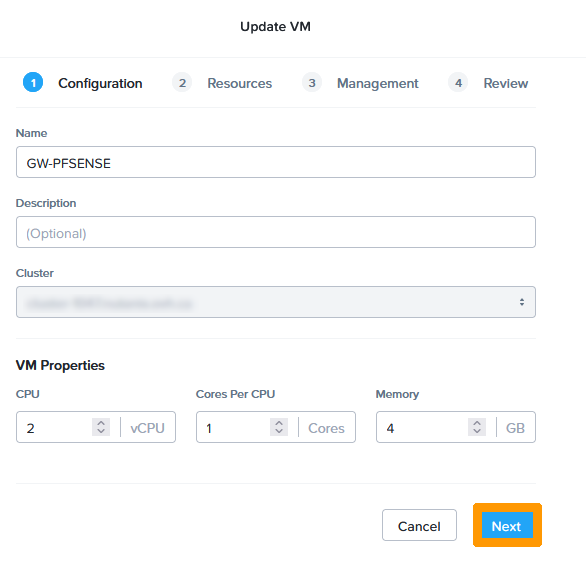{.thumbnail}

Click the `Eject`{.action} icon next to the CDROM.

{.thumbnail}

Click `Next`{.action}.

{.thumbnail}

Click `Next`{.action}.

{.thumbnail}

Click `Save`{.action}.

{.thumbnail}

Click `Power On`{.action} in the `More` menu.

{.thumbnail}

Click `Launch Console`{.action} to continue the installation after startup. 

{.thumbnail}

<a name="configureippfsense"></a>
#### Step 2.8 Configure pfSense IP Addresses Through the Console

We will configure the **pfSense** gateway IP addresses as follows:

- WAN interface: Use this part of the guide “[Retrieving a public address in the OVHcloud Control Panel](#getpublicaddress)” to assign the IP address and gateway on this interface.
- LAN Interface: 192.168.10.254/24 which is the gateway address of the Nutanix cluster private network followed by the subnet mask. 

Accept the licence by pressing the `Enter`{.action} key.

{.thumbnail}

Type `n` and press the `Enter`{.action} key when asked if you need **VLANs**.

{.thumbnail}

Type `vtnet0` as the interface name for the **WAN** and press `Enter`{.action}.

{.thumbnail}

Type `vtnet1` as the interface name for the **LAN** and press `Enter`{.action}.

{.thumbnail}

Confirm the changes by entering `y`, then press the `Enter`{.action} key.

{.thumbnail}

Type `2` to choose `Set interface(s) IP address` and press `Enter`{.action}.

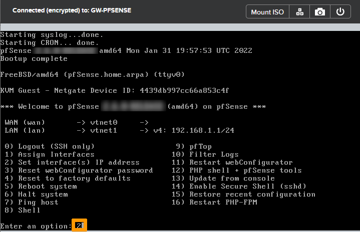{.thumbnail}

Select the **WAN** interface by typing `1` and pressing `Enter`{.action}.

{.thumbnail}

Type `n` and press `Enter`{.action} when prompted to configure the address by DHCP.

{.thumbnail}

Type **the public IP address with the mask** and press the `Enter`{.action} key, for example: **123.123.123.5/30**.

Then enter **the public** gateway IP address and press the `Enter`{.action} key, for example: **123.123.123.6**.

{.thumbnail}

Type `n` and press the `Enter`{.action} key when the wizard offers you the configuration of the **IPv6 address WAN interface via DHCP6**.

{.thumbnail}

When requested to **revert to HTTP as the webConfigurator protocol**, type `n` and press `Enter`{.action}.

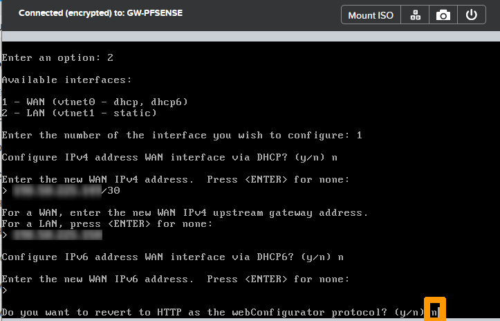{.thumbnail}

Press `Enter`{.action} to validate the registration of the IP address of the **WAN**.

{.thumbnail}

Type `2` and press the `Enter`{.action} key to configure IP addresses.

{.thumbnail}

Take option `2` and press the `Enter`{.action} key to change the LAN IP address.

{.thumbnail}

Type the private IP address followed by the mask `192.168.10.254/24` and press the `Enter`{.action} key.

{.thumbnail}

Press the `Enter`{.action} key to not put a gateway on the **LAN interface**.

{.thumbnail}

Press the `Enter`{.action} key to disable IPv6 usage.

{.thumbnail}

Type `n` and press the `Enter`{.action} key on the DHCP server activation request.

{.thumbnail}

Answer `n` and press the `Enter`{.action} key when prompted to **revert to HTTP as the webConfigurator protocol**.

{.thumbnail}

You can now manage the HTTPS gateway on the private network of the **Nutanix** cluster.

Press the `Enter`{.action} key to complete the command line configuration.

{.thumbnail}

<a name="configurepfsenseoptions"></a>
#### Step 2.9 Configure some options through the web interface

Connect to the pfSense Web Console with the URL <https://192.168.10.254> from a cluster virtual machine on the **AHV LAN: Base**.

Enter the following information:

- **User account**: admin
- **Default password**: pfsense

Then click on `SIGN IN`{.action}.

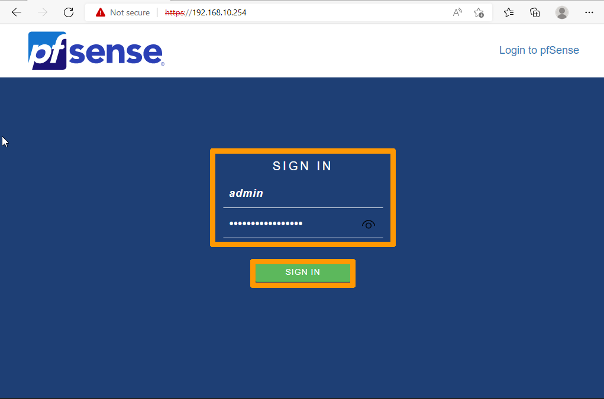{.thumbnail}

<a name="changepassword"></a>
##### **Step 2.9.1 Change the pfSense default password**

From the `System`{.action} menu, choose `User Manager`{.action}.

{.thumbnail}

Click the `Pen`{.action} icon.

{.thumbnail}

Enter and confirm the password to the right of `Password`.

{.thumbnail}

Confirm the changes by clicking `Save`{.action} at the bottom of the menu.

{.thumbnail}.

<a name="addadminrule"></a>
##### **Step 2.9.2 Add a rule to allow remote administration from a public address**

Go to the `Firewall`{.action} menu and choose `Rules`{.action}.

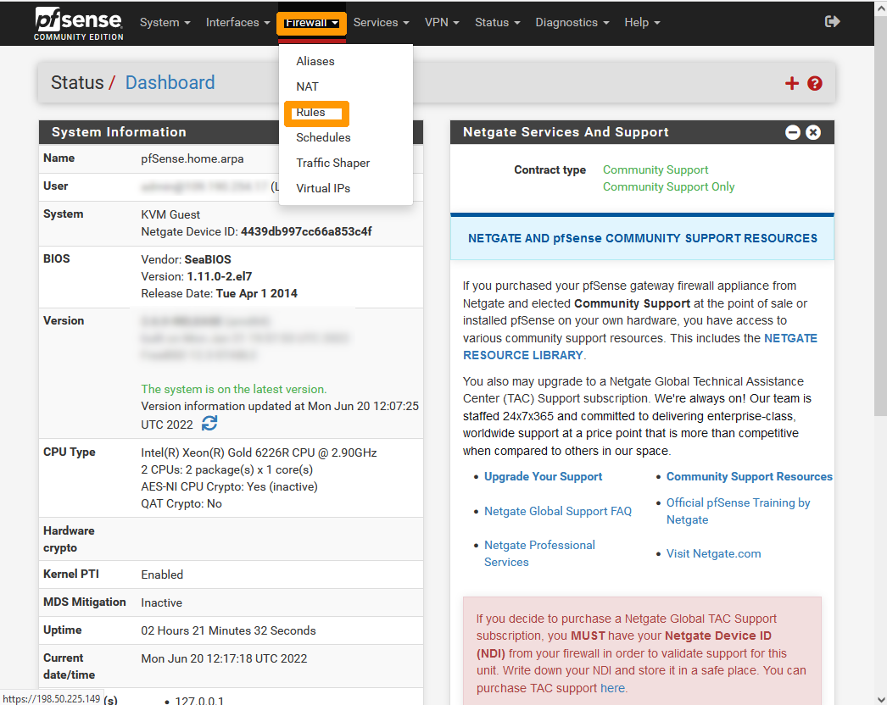{.thumbnail}

Check that you are on the `WAN` tab, then click the `Add`{.action} button (at the bottom with the up arrow) to create a firewall rule.

{.thumbnail}

Set these options in the **Edit Firewall Rule** section:

- **Action**: `Pass`
- **Interface**: `WAN`
- **Address Family**: `IPv4`
- **Protocol**: `TCP`

Select `Single host or alias` from the **Source** drop-down menu and enter the `public address` that can connect to the **pfSense** firewall.

{.thumbnail}

Then set these options in the **Destination** section:

- **Destination**: `WAN address`
- **Destination Port Range From**: `HTTPS`
- **Destination Port Range To**: `HTTPS`

Click `Save`{.action}.

{.thumbnail}

Click `Apply Changes`{.action} to activate the rule.

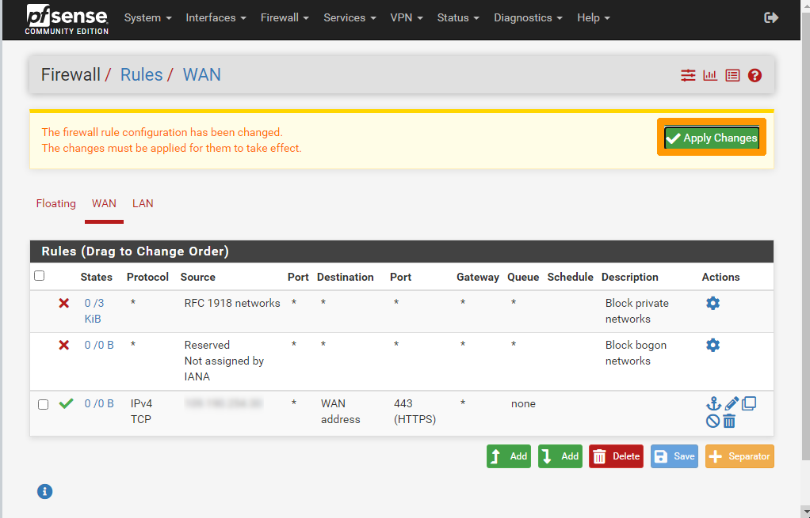{.thumbnail}

The **pfSense** administration interface is then accessible from the Internet, only from the authorised network in HTTPS, here `https://123.123.123.5`.

<a name="configuregatewayfrance"></a>
### Step 3 Configuring the gateway in France

We will install the **GW-PFSENSE** gateway in France on the IP plan **192.168.0.0/24**.

<a name="downloadsourcesfr"></a>
#### Step 3.1 Downloading sources for pfSense installation

Download the ISO image of **pfSense** installation from this link: [Downloading pfSense](https://www.pfsense.org/download/){.external}.

Using [this documentation](https://docs.ovh.com/gb/en/nutanix/image-import/), add the pfSense **ISO image** to your Nutanix cluster.

<a name="createvmpfsensefr"></a>
#### Step 3.2 Creating the **GW-PFSENSE virtual machine**

Create a virtual machine with these settings:

- **Name**: `GW-PFSENSE`
- **Storage1**: `60 Go HDD` 
- **Storage2**: `DVD drive connected to pfSense ISO image`
- **RAM**: `4 GB` 
- **CPU**: `2 vCPU`
- **Network**: `two network cards on the AHV network: **Base**`

You can use [our guide on virtual machine management](https://docs.ovh.com/gb/en/nutanix/virtual-machine-management/) to create this virtual machine.

{.thumbnail}

<a name="shutdownovhgatewayfr"></a>
#### Step 3.3 Shutting down the **OVH-GATEWAY virtual machine**

To avoid duplicate IP addresses on the network, stop the **OVHgateway** virtual machine before starting the new virtual machine on **pfSense**.

Via **Prism Central**, click in the top left on the `main menu`{.action}.

{.thumbnail}

Click `VMs`{.action}.

{.thumbnail}

Click the `OVHgateway`{.action} virtual machine.

{.thumbnail}

From the `More` menu at the top, click `Soft Shutdown`{.action}.

{.thumbnail}

<a name="getpublicaddressfr"></a>
#### Step 3.4 Retrieving the public address in the OVHcloud Control Panel

Retrieve information about the OVHcloud gateway network settings.

Log in to the [OVHcloud Control Panel](https://www.ovh.com/auth/?action=gotomanager&from=https://www.ovh.co.uk/&ovhSubsidiary=GB), select your Nutanix cluster, and find the information in the `IPFO` field.

{.thumbnail}

What is called **IPFO** is a range of 4 addresses. The first and last are reserved, the third is on OVHcloud hardware and serves as an **Internet** gateway. The only usable IP address is the second address in the range. 

During installation, we will reuse this information to assign it to the new **GW-PFSENSE virtual machine**

```console
XX.XX.XX.N Reserved network address that appears on the OVHcloud client site.
XX.XX.XX.N+1 IP address to be assigned to the GW-PFSENSE virtual machine WAN interface.
XX.XX.XX.N+2 Address to be used as a gateway on the GW-PFSENSE virtual machine WAN interface. 
XX.XX.XX.N+3 Reserved broadcast IP address.
```

For example, if the **IPFO** address displayed on the client site is 123.123.123.4/30, use:

- **123.123.123.5** for the **WAN** interface address;
- **123.123.123.6** for the gateway on the **WAN** interface.

<a name="poweronvmpfsensefr"></a>
#### Step 3.5 Start the **GW-PFSENSE virtual machine**

Go back to virtual machine management in **Prism Central** and click on `GW-PFSENSE`{.action}.

{.thumbnail}

From the `More` menu, click `Power On`{.action}.

{.thumbnail}

Click `Launch console`{.action}.

{.thumbnail}

<a name="pfsenseinstallfr"></a>
#### Step 3.6 Installing pfSense

Review the pfSense licence information and press the `Enter`{.action} key to accept it.

{.thumbnail}

Choose `Install`, click `OK` with the `Tab`{.action} key, and then press `Enter`{.action}.

{.thumbnail}

Select `Continue with default keymap`, go to `Select` with the `Tab`{.action} key and press the `Enter`{.action} key.

{.thumbnail}

Select `Auto (ZFS)`, click `OK` with the `Tab`{.action} key, and then press the `Enter`{.action} key.

{.thumbnail}

Press `Select` with the `Tab`{.action} key and press `Enter`{.action}.

{.thumbnail}

Select `Stripe`, press `OK` with the `Tab`{.action} key, and then press `Enter`{.action}.

{.thumbnail}

Select `NUTANIX VDISK` with the `Space`{.action} bar. Then click `OK` with the `Tab`{.action} key and press `Enter`{.action}.

{.thumbnail}

Go to `YES` with the `Tab`{.action} key and press the `Enter`{.action} key.

{.thumbnail}

Choose `NO` with the `Tab`{.action} key and press the `Enter`{.action} key.

{.thumbnail}

Select `Reboot` and press the `Enter`{.action} key.

{.thumbnail}

<a name="pfsenseremovecdromfr"></a>
#### Step 3.7 Eject the pfSense CDROM from the GW-PFSENSE virtual machine

From **Prism Central**, go back to **GW-PFSENSE** virtual machine management and perform the following steps to eject the **CDROM**.

Click `Soft Shutdown`{.action} via the `More` menu on the **GW-PFSENSE** virtual machine to stop this virtual machine.

{.thumbnail}

Click `Update`{.action}.

{.thumbnail}

Click `Next`{.action}.

{.thumbnail}

Click the `Eject`{.action} icon next to the CDROM.

{.thumbnail}

Click `Next`{.action}.

{.thumbnail}

Click `Next`{.action}.

{.thumbnail}

Click `Save`{.action}.

{.thumbnail}

Click `Power On`{.action} in the `More` menu.

{.thumbnail}

Click `Launch Console`{.action} to continue the installation after startup. 

{.thumbnail}

<a name="configureippfsensefr"></a>
#### Step 3.8 Configure pfSense IP Addresses Through the Console

We will configure the **pfSense** gateway IP addresses as follows:

- WAN interface: Use this part of the guide “[Retrieving a public address in the OVHcloud Control Panel](#getpublicaddressfr)” to assign the IP address and gateway on this interface.
- LAN interface: 192.168.0.254/24 which is the gateway address of the Nutanix private network followed by the subnet mask. 

Accept the licence by pressing the `Enter`{.action} key.

{.thumbnail}

Type `n`{.action} and press the `Enter`{.action} key when querying for **VLANs**.

{.thumbnail}

Type `vtnet0` as the interface name for the **WAN** and press `Enter`{.action}.

{.thumbnail}

Type `vtnet1` as the interface name for the **LAN** and press `Enter`{.action}.

{.thumbnail}

Confirm the changes by entering `y` and press the `Enter`{.action} key.

{.thumbnail}

Type `2` to choose `Set interface(s) IP address` and press `Enter`{.action}.

{.thumbnail}

Select the **WAN** interface by typing `1` and press `Enter`{.action}.

{.thumbnail}

Type `n`{.action} and press `Enter`{.action} when prompted to configure the address by DHCP.

{.thumbnail}

Type **the public IP address with the mask** and press the `Enter`{.action} key. For example, **123.123.123.5/30**.

Then enter **the public gateway IP address** and press the `Enter`{.action} key. For example, **123.123.123.6**.

{.thumbnail}

Answer `n` and press the `Enter`{.action} key when prompted to configure the **IPv6 address WAN interface via DHCP6**.

{.thumbnail}

When prompted to **revert to HTTP as the webConfigurator protocol**, type `n` and press `Enter`{.action}.

{.thumbnail}

Press `Enter`{.action} to validate the registration of the IP address of the **WAN**.

{.thumbnail}

Type `2` and press the `Enter`{.action} key to configure IP addresses.

{.thumbnail}

Take option `2` and press the `Enter`{.action} key to change the LAN IP address.

{.thumbnail}

Type the private IP address followed by the mask `192.168.0.254/24` and press the `Enter`{.action} key.

{.thumbnail}

Press the `Enter`{.action} key to avoid putting a gateway on the **LAN interface**.

{.thumbnail}

Press the `Enter`{.action} key to disable IPv6 on the **LAN** interface.

{.thumbnail}

Type `n` and press the `Enter`{.action} key on the DHCP server activation request.

{.thumbnail}

Answer `n` and press the `Enter`{.action} key when prompted to **revert to HTTP as the webConfigurator protocol**.

{.thumbnail}

You can now manage the gateway in HTTPS on the private network.

Press the `Enter`{.action} key to complete the command line configuration.

{.thumbnail}

<a name="configurepfsenseoptionsfr"></a>
#### Step 3.9 Configure some options through the web interface

Connect to the pfSense Web Console with this URL `https://192.168.0.254` from a virtual machine on the **AHV LAN: Base**.

Enter this information:

- **User account**: admin
- **Default password**: pfsense

Then click `SIGN IN`{.action}.

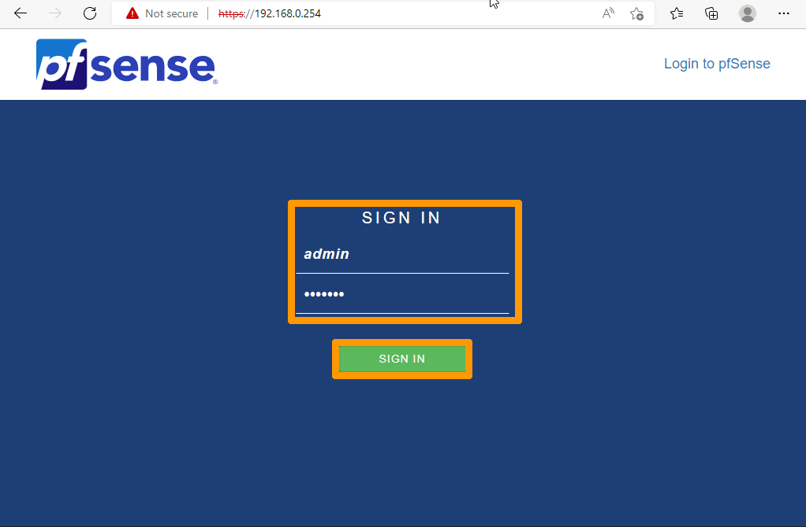{.thumbnail}

<a name="changepasswordfr"></a>
##### **Step 3.9.1 Change the pfSense default password**

From the `System`{.action} menu, choose `User Manager`{.action}.

{.thumbnail}

Click the `Pen`{.action} icon.

{.thumbnail}

Enter and confirm the password to the right of `Password`.

{.thumbnail}

Confirm the changes by clicking `Save`{.action} at the bottom of the menu.

{.thumbnail}.

<a name="addadminrulefr"></a>
##### **Step 3.9.2 Add a rule to allow remote administration from a public address.**

Go to the `Firewall`{.action} menu and choose `Rules`{.action}.

{.thumbnail}

Check that you are on the `WAN` tab, then click the `Add`{.action} button (at the bottom with the up arrow) to create a firewall rule.

{.thumbnail}

Choose these options from **Edit Firewall Rule**:

- **Action**: `Pass`
- **Interface**: `WAN`
- **Address Family**: `IPv4`
- **Protocol**: `TCP`

Select `Single host or alias` from the **Source** drop-down menu and enter the `public address` that can connect to the **pfSense** firewall.

{.thumbnail}

Add these options in **Destination**:

- **Destination**: `WAN address`
- **Destination Port Range From**: `HTTPS`
- **Destination Port Range To**: `HTTPS`

Click `Save`{.action}.

{.thumbnail}

Click `Apply Changes`{.action} to activate the rule.

{.thumbnail}

The administration interface of **pfSense** is then accessible from the Internet, on the authorised network via this URL `https://WANaddress`, here `https://123.123.123.5`.

<a name="configurevpnipsec"></a>
### Step 4 Setting up the IPsec VPN

Now that the two gateways have been replaced, we will configure the IPsec VPN to allow communication between the two clusters.

<a name="ipseccanada"></a>
#### Step 4.1 Setting Up the Site in Canada

<a name="paramipsectofrance"></a>
##### **Step 4.1.1 Set up IPsec VPN in France**

Connect from an authorised network to Canada's public address in HTTPS with this URL `https://publicaddress-pfsense-canada`. 

Go to the `VPN`{.action} menu and choose `IPsec`{.action}.

{.thumbnail}

Click `Add P1`{.action} to create IPsec VPN Phase 1.

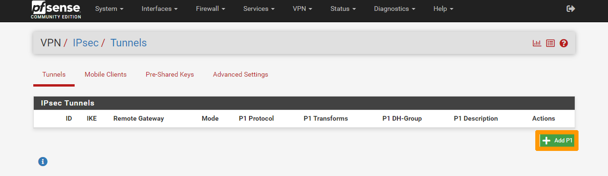{.thumbnail}

Enter this information:

- **Description**: `VPN TO FRANCE`
- **Key Exchange version**: `IKEv2`
- **Internet Protocol**: `IPv4`
- **Interface**: `WAN`
- **Remote Gateway**: `Public address of the pfSense virtual machine in France`

{.thumbnail}

Click `Generate new Pre-Shared Key`{.action} to generate a pre-shared key in the `Pre-Share Key` field.

> [!primary]
> 
> Write down or copy the key, it will be used for the VPN configuration on the gateway in France.
> 
> Keep the information in `Encryption Algorithm`.
>

{.thumbnail}

Click `Save`{.action} at the bottom of the menu.

{.thumbnail}

Click `Apply Changes`{.action}.

{.thumbnail}

Click `Show Phase 2 Entries`{.action}.

{.thumbnail}

Click `Add P2`{.action} to add IPsec VPN Phase 2.

{.thumbnail}

Enter this information:

- **Description**: `TO LAN 192.168.0.0/24 France`
- **Local Network**: `Subnet LAN`
- **Remote Network**: Type `Network`, Address `192.168.0.0/24`


{.thumbnail}

> [!primary]
> 
> Take note of the encryption settings.
>

{.thumbnail}

Click `Save`{.action}.

{.thumbnail}

Click `Apply Changes`{.action} to complete the creation of the IPsec VPN on Canada's **pfSense** virtual machine.

{.thumbnail}

<a name="addfwruletofrance"></a>
##### **Step 4.1.2 Adding a firewall rule to allow network flow through the IPsec VPN between Canada and France**

Click `Rules`{.action} in the `Firewall`{.action} menu.

{.thumbnail}

Go to the `IPsec`{.action} tab and click the `Add`{.action} button (at the bottom with the up arrow).

{.thumbnail}

Modify these options:

- **Source**: `Net LAN`
- **Destination**: `Network` and `192.168.0.0/24` 

Then click `Save`{.action}.

{.thumbnail}

Click the same `Add`{.action} button again (at the bottom with the up arrow) to add a second rule.

{.thumbnail}

Modify these options: 

- **Source**: `Network` et `192.168.0.0/24` 
- **Destination**: `Net LAN`

Click `Save`{.action}.

{.thumbnail}

Click `Apply Changes`{.action}.

{.thumbnail}

The setting on the bridge in Canada is then completed.

<a name="ipsecfrance"></a>
#### Step 4.2 Website configuration in France

<a name="paramipsectocanada"></a>
##### **Step 4.2.1 Set up IPsec VPN to Canada**

Log in to the public address of the France gateway in HTTPS via: `https://publicaddress-pfsense-france`

Go to the `VPN`{.action} menu and choose `IPsec`{.action}.

{.thumbnail}

Click `Add P1`{.action} to create IPsec VPN Phase 1.

{.thumbnail}

Choose this information:

- **Description**: `VPN TO CANADA`
- **Key Exchange version**: `IKEv2`
- **Internet Protocol**: `IPv4`
- **Interface**: `WAN`
- **Remote Gateway**: `Public address of the pfSense virtual machine in Canada`

{.thumbnail}

Paste the pre-shared key that was generated on the gateway in Canada into **Pre-shared Key**.

Compare and match the parameters in `Encryption Algorithm` with the gateway of Canada.

{.thumbnail}

Click `Save`{.action}.

{.thumbnail}

Click `Apply Changes`{.action}.

{.thumbnail}

Click `Show Phase 2 Entries`{.action}.

{.thumbnail}

Click `Add P2`{.action} to add IPsec VPN Phase 2.

{.thumbnail}

Enter the following information:

- **Description**: `TO LAN 192.168.10.0/24 CANADA`
- **Local Network**: `Subnet LAN`
- **Remote Network**: Type `Network`, Address `192.168.10.0/24`

{.thumbnail}

Check the encryption settings and make them identical with the ones set on the Canada gateway.

{.thumbnail}

Click `Save`{.action}.

{.thumbnail}

Click `Apply Changes`{.action} to finish creating the IPsec VPN.

{.thumbnail}

<a name="addruletocanada"></a>
##### **Step 4.2.2 Adding a firewall rule to allow network flow through IPsec VPN between Canada and France**

Click `Rules`{.action} in the `Firewall`{.action} menu.

{.thumbnail}

Go to the `IPsec`{.action} tab and click the `Add`{.action} button (at the bottom with the up arrow).

{.thumbnail}

Modify these options:

- **Source**: `Net LAN`
- **Destination**: `Network` and `192.168.10.0/24` 

Then click `Save`{.action}.

{.thumbnail}

Click `Add`{.action} again (at the bottom with the up arrow) to add a second rule.

{.thumbnail}

Modify these options: 

- **Source**: `Network` with this network `192.168.10.0/24` which corresponds to the private network of Canada
- **Destination**: `Net LAN`

Click `Save`{.action}.

{.thumbnail}

Click `Apply Changes`{.action}. 

{.thumbnail}

VPN setup is complete on both clusters. It is now possible to set up replicas through the secure VPN tunnel.

<a name="gofurther"></a>
## Go further

[Disaster Recovery Plan on Nutanix](https://docs.ovh.com/gb/en/nutanix/disaster-recovery-plan-overview/)

[Asynchronous or *NearSync* replication through Prism Element](https://docs.ovh.com/gb/en/nutanix/prism-element-nutanix-replication/)

Join our community of users on <https://community.ovh.com/en/>.
