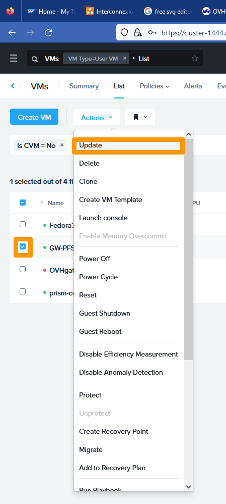
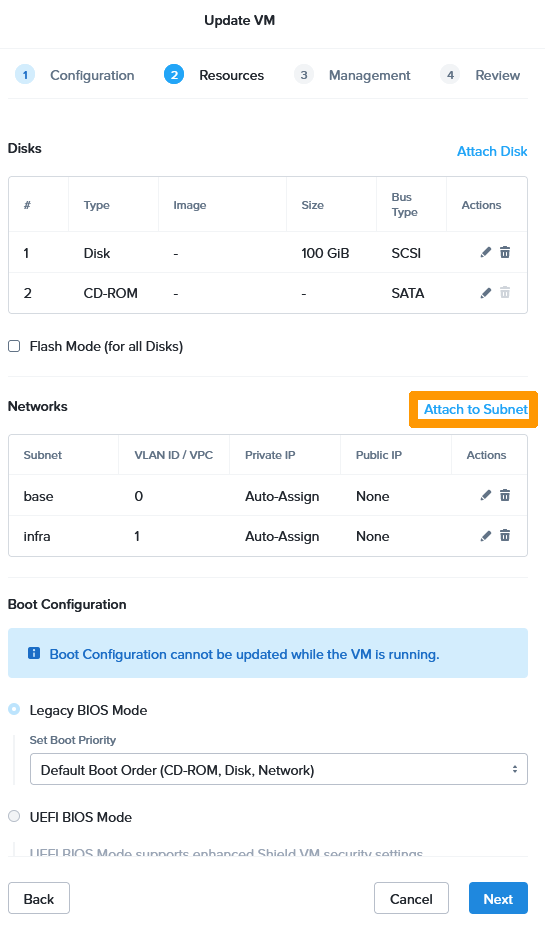
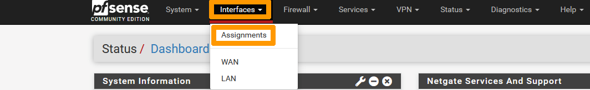
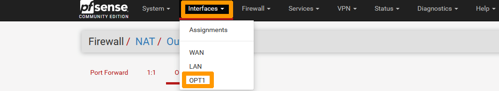
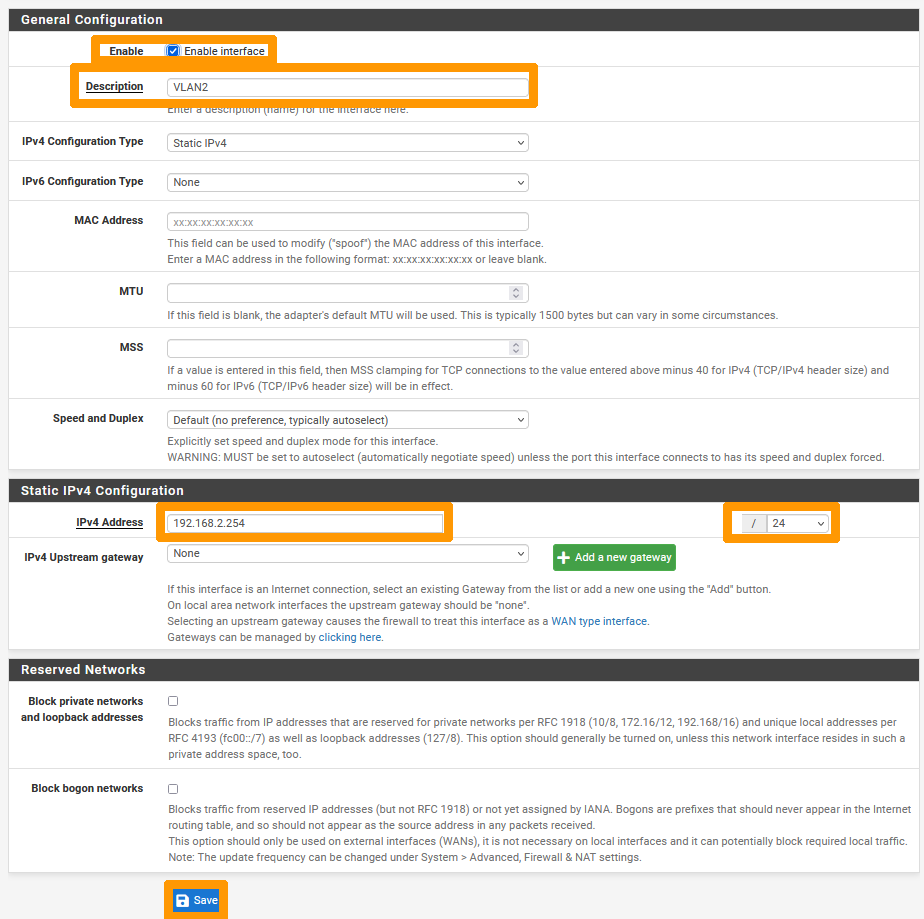
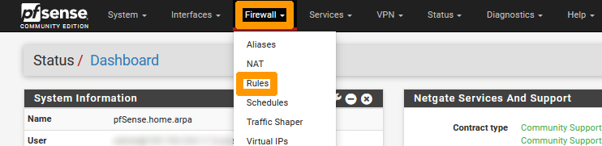

**Dernière mise à jour le 28/11/2022**

## Objectif

Ce guide vous explique comment remplacer la passerelle Internet sortante (OVHgateway) par un autre système d'exploitation réseau qui vous donnera en plus de l'accès Internet la possibilité de configurer NAT et VPN (Ipsec ou SSL VPN).

> [!warning]
> OVHcloud vous met à disposition des services dont la configuration, la gestion et la responsabilité vous incombent. Il vous appartient donc de ce fait d’en assurer le bon fonctionnement.
>
> Ce guide a pour but de vous accompagner au mieux sur des tâches courantes. Néanmoins, nous vous recommandons de faire appel à un prestataire spécialisé si vous éprouvez des difficultés ou des doutes concernant l’administration, l’utilisation ou la mise en place d’un service sur un serveur.
>

## Prérequis

- Disposer d'un cluster Nutanix fournis par OVHcloud.
- Être connecté à votre [espace client OVHcloud](https://www.ovh.com/auth/?action=gotomanager&from=https://www.ovh.com/fr/&ovhSubsidiary=fr).
- Être connecté sur votre cluster via Prism Central.

## En pratique

La passerelle OVHGateway utilise par défaut deux carte réseaux :


- Une sur le VLAN 0 (base)  connectée à Internet avec une adresse IP supplémentaire OVHcloud.
- Une sur le VLAN 1 (infra) connectée au réseau local d'administration.

Dans notre guide, nous allons remplacer cette passerelle par le système d'exploitation réseau **pfSense Community edition** sans support.

Il est tout fait possible de s'appuyer sur ce guide pour installer d'autre systèmes d'exploitations réseaux comptatibles avec AHV.

<a name="downloadsources"></a>
### Téléchargement des sources pour l'installation de pfSense

Téléchargez l'image ISO de l'installation de **pfSense** à partir de ce lien : [Téléchargement de pfSense](https://www.pfsense.org/download/){.external}.

A l'aide de [cette documentation](https://docs.ovh.com/fr/nutanix/image-import/), ajoutez l'image **ISO pfSense** dans votre cluster Nutanix.

<a name="createvmpfsense"></a>
### Création de la machine virtuelle **GW-PFSENSE**

Créez une machine virtuelle avec ces paramètres :

- **Nom** : `GW-PFSENSE`
- **Stockage1** : `100 Go HDD` 
- **Stockage2** : `Un lecteur DVD connecté à l'image ISO de pfSense`
- **RAM** : `4 Go` 
- **CPU** : `2 vCPU`
- **Réseau** : `2 cartes réseaux, une sur le VLAN 0(base) et l'autre sur le VLAN 1(infra)`

Vous pouvez vous aider de [notre guide sur la gestion des machines virtuelles](https://docs.ovh.com/fr/nutanix/virtual-machine-management/) pour créer cette machine virtuelle.

{.thumbnail}

<a name="shutdownovhgateway"></a>
### Arrêt de la machine virtuelle **OVHGateway**

Pour éviter des doublons d'adresses IP sur le réseau, il faut arrêter la machine virtuelle **OVHgateway** avant de démarrer la nouvelle machine virtuelle sous **pfSense**.

Via **Prism Central**, cliquez en haut à gauche sur le `menu principal`{.action}.

{.thumbnail}

Cliquez sur `VMs`{.action}.

{.thumbnail}

Cliquez sur la machine virtuelle `OVHgateway`{.action}.

{.thumbnail}

Depuis le menu `More` en haut, cliquez sur `Soft Shutdown`{.action}.

{.thumbnail}

<a name="getpublicaddress"></a>
### Récupération de l'adresse publique sur l'espace client OVHcloud 

Récupérez les informations concernant les paramètres réseau de la passerelle OVHcloud.

Connectez-vous à [l'espace client OVHcloud](https://www.ovh.com/auth/?action=gotomanager&from=https://www.ovh.com/fr/&ovhSubsidiary=fr), sélectionnez votre cluster Nutanix et relevez l'information se trouvant dans le champ `IPFO`.

{.thumbnail}

**IPFO** est une plage de 4 adresses. La première et la dernière sont réservées, la troisième se trouve sur un équipement OVHcloud et sert de passerelle **Internet**. La seule adresse IP utilisable est la seconde adresse de la plage. 

Lors de l'installation, nous allons réutiliser ces informations pour les affecter à la nouvelle machine virtuelle **GW-PFSENSE**

```console
XX.XX.XX.N      Adresse de réseau réservée qui apparait sur le site client OVHcloud
XX.XX.XX.N+1    Adresse IP qui doit être affectée à l'interface WAN de la machine virtuelle GW-PFSENSE
XX.XX.XX.N+2    Adresse à utiliser en tant que passerelle sur l'interface WAN de la machine virtuelle GW-PFSENSE
XX.XX.XX.N+3    Adresse IP de broadcast réservée
```

Par exemple, si l'adresse **IPFO** affichée sur le site client est 198.51.100.0/30, il faut utiliser :

- **198.51.100.1** pour l'adresse de l'interface **WAN** ;
- **198.51.100.2** pour la passerelle sur l'interface **WAN**.

<a name="poweronvmpfsense"></a>
### Démarrage de la machine virtuelle **GW-PFSENSE**

Revenez dans la gestion des machines virtuelles sur **Prism Central** et cliquez sur `GW-PFSENSE`{.action}.

{.thumbnail}

Via le menu `More`, cliquez sur `Power On`{.action}.

{.thumbnail}

Cliquez sur `Launch console`{.action}.

{.thumbnail}

<a name="pfsenseinstall"></a>
### Installation de **pfSense**

Prenez connaissance des informations liées à la licence pfSense et appuyez sur la touche `Entrée`{.action} pour les accepter.

{.thumbnail}

Choisissez `Install`, positionnez-vous sur `OK` avec la touche `Tabulation`{.action} et appuyez sur la touche `Entrée`{.action}.

{.thumbnail}

Sélectionnez `Continue with default keymap`, allez sur `Select` avec la touche `Tabulation`{.action} et appuyez sur la touche `Entrée`{.action}.

{.thumbnail}

Sélectionnez `Auto (ZFS)`, allez sur `OK` avec la touche `Tabulation`{.action} et tapez sur la touche `Entrée`{.action}.

{.thumbnail}

Positionnez-vous sur `Select` avec la touche `Tabulation`{.action} et appuyez sur la touche `Entrée`{.action}.

{.thumbnail}

Sélectionnez `Stripe`, positionnez-vous sur `OK` avec la touche `Tabulation`{.action} et appuyez sur la touche `Entrée`{.action}.

{.thumbnail}

Sélectionnez `NUTANIX VDISK` avec la barre `Espace`{.action}. Allez ensuite sur `OK` avec la touche `Tabulation`{.action} et appuyez sur la touche `Entrée`{.action}.

{.thumbnail}

Allez sur `YES` avec la touche `Tabulation`{.action} et appuyez sur la touche `Entrée`{.action}.

{.thumbnail}

Choisissez `NO` avec la touche `Tabulation`{.action} et appuyez sur la touche `Entrée`{.action}.

{.thumbnail}

Sélectionnez `Reboot` et appuyez sur la touche `Entrée`{.action}.

{.thumbnail}

<a name="pfsenseremovecdrom"></a>
### Ejection du CDROM pfSense de la machine virtuelle GW-PFSENSE

Depuis **Prism central**, revenez sur la gestion de la machine virtuelle **GW-PFSENSE** et effectuez les opérations suivantes pour éjecter le **CDROM**.

Cliquez sur `Soft Shutdown`{.action} via le menu `More` de la machine virtuelle **GW-PFSENSE** pour arrêter cette machine virtuelle.

{.thumbnail}

Cliquez sur `Update`{.action}.

{.thumbnail}

Cliquez sur `Next`{.action}.

{.thumbnail}

Cliquez sur l'icone `Eject`{.action} au niveau du CDROM.

{.thumbnail}

Cliquez sur `Next`{.action}.

{.thumbnail}

CLiquez sur `Next`{.action}.

{.thumbnail}

CLiquez sur `Save`{.action}.

{.thumbnail}

Cliquez sur `Power On`{.action} dans le menu `More`.

{.thumbnail}

Cliquez sur `Launch Console`{.action} pour continuer l'installation après le démarrage. 

{.thumbnail}

<a name="configureippfsense"></a>
### Configuration des adresses IP de pfSense au travers de la console

Nous allons configurer les adresses IP de passerelle **pfSense** comme ceci :

- Interface WAN : Utilisez cette partie du guide « [Récupération de l'adresse publique sur l'espace client OVHcloud](#getpublicaddress) » pour affecter l'adresse IP et la passerelle sur cette interface.
- Interface LAN: 192.168.10.254/24 qui correspond à l'adresse de passerelle du réseau privé du cluster Nutanix suivi du masque de sous réseau. 

Acceptez la licence en appuyant sur la touche `Entrée`{.action}.

{.thumbnail}

Saisissez `n` et appuyez sur la touche `Entrée`{.action} lorsque l'on vous demande s'il faut des **VLAN**.

{.thumbnail}

Saisissez `vtnet0` comme nom d'interface pour le **WAN** et appuyez sur la touche `Entrée`{.action}.

{.thumbnail}

Saisissez `vtnet1` comme nom d'interface pour le **LAN**  et appuyez sur la touche `Entrée`{.action}.

{.thumbnail}

Validez les changements en saisissant `y` et appuyez sur la touche `Entrée`{.action}.

{.thumbnail}

Saisissez `2` pour choisir `Set interface(s) IP address` et appuyez sur la touche `Entrée`{.action}.

{.thumbnail}

Sélectionnez l'interface **WAN** en saisissant `1` et appuyez sur la touche `Entrée`{.action}.

{.thumbnail}

Saisissez `n` et appuyez sur la touche `Entrée`{.action} à la demande de la configuration de l'adresse par DHCP.

{.thumbnail}

Saisissez **l'adresse IP publique avec le masque** et appuyez sur la touche `Entrée`{.action}. Par exemple **198.51.100.1**.

Saisissez ensuite **l'adresse IP de la passerelle publique** et appuyez sur la touche `Entrée`{.action}. Par exemple **198.51.100.2**.

{.thumbnail}

Répondez `n` et appuyez sur la touche `Entrée`{.action} lorsque l'assistant vous propose la configuration de l'**IPv6 address WAN interface via DHCP6**.

{.thumbnail}

A la demande **revert to HTTP as the webConfigurator protocol**, saisissez `n` et appuyez sur la touche `Entrée`{.action}.

{.thumbnail}

Appuyez sur `Entrée`{.action} pour valider l'enregistrement de l'adresse IP du **WAN**.

{.thumbnail}

Saisissez `2` et appuyez sur la touche `Entrée`{.action} pour configurer les adresses IP.

{.thumbnail}

Prenez l'option `2` et appuyez sur la touche `Entrée`{.action} pour modifier l'adresse IP du LAN.

{.thumbnail}

Saisissez l'adresse IP privée suivie du masque `192.168.10.254/24` et appuyez sur la touche `Entrée`{.action}.

{.thumbnail}

Appuyez sur la touche `Entrée`{.action} pour ne pas mettre de passerelle sur l'interface **LAN**

{.thumbnail}

Appuyez sur la touche `Entrée`{.action} afin de désactiver l'usage d'IPv6.

{.thumbnail}

Saisissez `n` et appuyez sur la touche `Entrée`{.action} à la demande d'activation du serveur DHCP.

{.thumbnail}

Répondez `n` et appuyez sur la touche `Entrée`{.action} à la demande **revert to HTTP as the webConfigurator protocol**.

{.thumbnail}

Il est maintenant possible d'administrer la passerelle en HTTPS sur le réseau privé du cluster **Nutanix**.

Appuyez sur la touche `Entrée`{.action} pour terminer la configuration en ligne de commande.

{.thumbnail}

<a name="configurepfsenseoptions"></a>
### Configuration de certaines options au travers de l'interface WEB

Connectez-vous sur la console Web de pfSense avec cette URL `https://192.168.10.254` à partir d'une machine virtuelle du cluster se trouvant sur le réseau local **AHV : infra**.

Saisissez ces informations :

- **Compte utilisateur** : admin
- **Default password** : pfsense

Cliquez ensuite sur `SIGN IN`{.action}.

{.thumbnail}

<a name="changepassword"></a>
#### Changement du mot de passe par défaut de pfSense**

Dans le menu `System`{.action}, choisissez `User Manager`{.action}.

{.thumbnail}

Cliquez sur l'icône en forme de `Stylo`{.action}.

{.thumbnail}

Saisissez et confirmez le mot de passe  à droite de `Password`.

{.thumbnail}

Validez les changements en cliquant sur `Save`{.action} en bas du menu.

{.thumbnail}.

<a name="addadminrule"></a>
#### Ajout d'une règle pour autoriser l'administration à distance à partir d'une adresse publique**

Allez dans le menu `Firewall`{.action} et choisissez `Rules`{.action}.

{.thumbnail}

Vérifiez que vous êtes sur l'onglet `WAN` puis cliquez sur le bouton `Add`{.action} (en bas avec la flèche pointant vers le haut) pour créer une règle de pare-feu.

{.thumbnail}

Définissez ces options dans la partie **Edit Firewall Rule** :

- **Action** : `Pass`
- **Interface** : `WAN`
- **Address Family** : `IPv4`
- **Protocol** : `TCP`

Sélectionnez `Single host or alias` dans le mendu déroulant **Source**  et saisissez `l'adresse publique` autorisée à se connecter au pare-feu **pfSense**.

{.thumbnail}

Définissez ensuite ces options dans la partie **Destination** :

- **Destination** : `WAN address`
- **Destination Port Range From** : `HTTPS`
- **Destination Port Range To** : `HTTPS`

Cliquez sur `Save`{.action}.

{.thumbnail}

Cliquez sur `Apply Changes`{.action} pour activer la règle.

{.thumbnail}

L'interface d'administration de **pfSense** est alors accessible depuis Internet, uniquement à partir du réseau autorisé en HTTPS, ici `https://198.51.100.1` .

### Configuration d'un accès Internet sur un nouveau VLAN

#### Modification de la machine virtuelle pfSense

Connectez-vous à Prism Central pour effectuer ces modifications :

Nous allons créer un nouveau VLAN avec ces paramètres :

- **Nom du VLAN** : `Production`
- **Numéro du VLAN** : 2

Aidez-vous de ce guide pour créer un nouveau VLAN sur votre cluster Nutanix [Isoler les machines de gestion de la production]
(https://docs.ovh.com/fr/nutanix/nutanix-isolate-management-machines/).

Votre nouveau réseau doit apparaitre dans **Subnets**

{.thumbnail}

Maintenant que le nouveau sous-réseau est créé nous allons rajouter une carte dans  la configuration de votre machine virtuelle **GW-PFSENSE**.

Au travers de la gestion des machines virtuelles sélectionnez votre machine virtuelle **GW-PFSENSE** allez dans le menu `Actions`{.action} et choisissez `Update`{.action}.

{.thumbnail}

Cliquez sur `Next`{.action}.

{.thumbnail}

Cliquez sur `Attach to Subnet`{.action}.

{.thumbnail}

Choisissez le subnet `Production`{.action} et cliquez sur `Save`{.action}.

{.thumbnail}

Cliquez sur `Next`{.action}.

{.thumbnail}

Cliquez sur `Next`{.action}.

{.thumbnail}

Cliquez sur `Save`{.action}.

{.thumbnail}

#### Activation et configuration de la nouvelle carte réseau sur pfSense

Connectez-vous en https sur l'interface pfSense avec l'adresse publique par exemple **https://198.51.100.1** sur votre interface d'administration pfSense et suivez ces instructions :

Allez dans le menu `Interfaces`{.action} et cliquez sur `Assignments`{.action}.

{.thumbnail}

Cliquez sur `+ Add`{.action} en face de **Available network ports:**.

{.thumbnail}

Cliquez sur `Save`{.action}.

{.thumbnail}

Au travers du menu `Interfaces`{.action} et cliquez sur `OPT1`{.action}

{.thumbnail}

Modifiez ces paramètres :

* **Description** : `VLAN 2`
* **IPv4 Address** : `192.168.2.254/24`

Ensuite cliquez sur `Save`{.action}.

{.thumbnail}

Cliquez sur `Apply Changes`{.action}.

{.thumbnail}

Cliquez sur `Rules`{.action} dans le menu `Firewall`.

{.thumbnail}

Allez dans l'onglet `VLAN2`{.action} et cliquez sur `Add`{.action} en bas dans les boutons à gauche.

{.thumbnail}

Changez ces valeurs :

* **Protocol** : `Any`
* **Source** : `VLAN2 net`
* **Destination** : `any`

Et cliquez sur `Save`{.action}.

{.thumbnail}

Cliquez sur `Apply Changes`{.action}.

{.thumbnail}

Votre VLAN2 peut utiliser cette passerelle pour se connecter à Internet.

<a name="gofurther"></a>
## Aller plus loin

Échangez avec notre communauté d'utilisateurs sur <https://community.ovh.com/>.
