**Dernière mise à jour le 28/03/2022**

## Objectif

Ce guide à pour but de connaitre **Nutanix MOVE** de le configurer et de l'utiliser pour effectuer une migration. 

> [!warning]
> OVHcloud vous met à disposition des services dont la configuration, la gestion et la responsabilité vous incombent. Il vous appartient donc de ce fait d’en assurer le bon fonctionnement.
>
> Ce guide a pour but de vous accompagner au mieux sur des tâches courantes. Néanmoins, nous vous recommandons de faire appel à un prestataire spécialisé si vous éprouvez des difficultés ou des doutes concernant l’administration, l’utilisation ou la mise en place d’un service sur un serveur.
>
> Certaines options comme l'utilisation de la compression ou de la déduplication nécessitent des licences particulières fournies par Nutanix au travers d'OVHcloud, nous vous invitons à vous renseigner auprès du service commercial OVHcloud pour plus d'informations.

## Prérequis

- Disposer d'un cluster Nutanix dans votre compte OVHcloud
- Être connecté à votre [espace client OVHcloud](https://www.ovh.com/auth/?action=gotomanager&from=https://www.ovh.com/fr/&ovhSubsidiary=fr)
- Être connecté sur le cluster via Prism Central
- Avoir une connexion à un environnement autre que Nutanix

## Présentation de **Nutanix MOVE**

**Nutanix Move** est un outil qui permet d'effectuer des migration de machines virtuelles depuis **VMware ESXI**, **Hyper**, **Azure** et **AWS** vers **AHV** il peut aussi être utilisé pour faire des migration de Nutanix **AHV** vers **AWS**

Ce logiciel se présente comme une machine virtuelle dont les sources sont disponibles sur le site de Nutanix avec un compte client.

Pour une meilleure utilisation il est conseillé d'installer **Nutanix Move** au plus près de la destination.

le logiciel **Nutanix Move** est le seul à communiquer entre la source et la destination.

## En pratique

Nous allons voir comment éffectuer une migration entre un environnement distant sur HYPERV et un environnement NUTANIX OVHCloud.

La source et la destination sont sur deux réseaux privés interconnectés au travers d'un VPN **IPSEC**.

La source ou se trouve le serveur HYPERV est sur le LAN 192.168.68.0/24.

La destination où se trouve un cluster Nutanix est sur le LAN 192.168.0.0/24.

Le VPN IPSEC a été établi avec le système pfsense au travers de deux connexion publiques

### Installation de MOVE sur le Cluster NUTANIX

#### Téléchargement et importation des sources 

Récupérez le fichier QCOW2 sur ce site [Téléchargement MOVE](https://portal.nutanix.com/page/downloads?product=move)

Connectez vous avec un compte enregistré chez Nutanix

cliquez sur `Downloads`{.action} à droite de Move QCOW2 file for AHV

Importez l'image téléchargée de Move dans Nutanix. Pour plus d'information sur l'importation d'image cliquez sur ce lien [Importation d'images](https://docs.ovh.com/fr/nutanix/image-import/).

#### Installation de la machine virtuelle **Move**

Créez une machine virtuelle à partir de de l'image Move

Depuis Prism Central, ouvrez le menu principal via le bouton en haut à gauche.

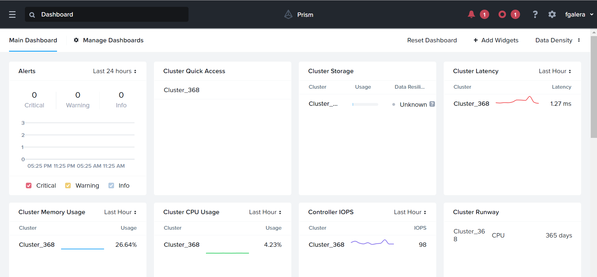

Cliquez dans le menu sur `VMs`{.action}

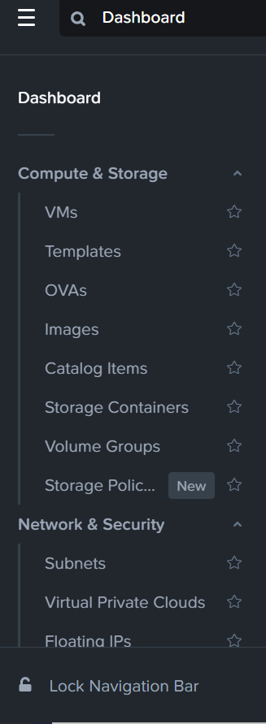

Cliquez sur `Create VM`{.action}

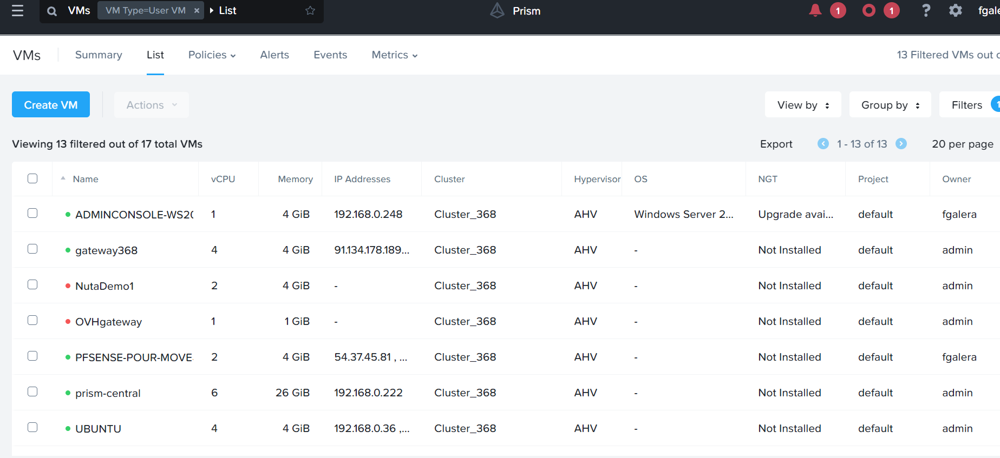

Saisissez **Nutanix MOVE** dans `Name`{.action}  

Choisissez ces options **2 vCPU**  , **2 Cores** et **8 GB** dans `VM Properties`{.action} et Cliquez sur `Next`{.action}

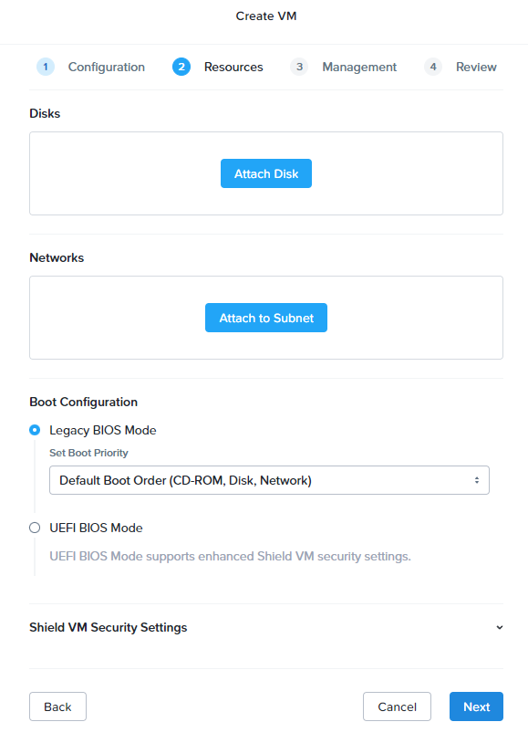

Cliquez sur `Attach Disk`{.action}

Cliquez sur `Attach Disk`{.action}

Choississez ces options **Disk** , **Clone from Image** et **move-4.3.0.qcow2**  ensuite cliquez sur `Save`{.action}

Cliquez sur `Attach to Subnet`{.action}

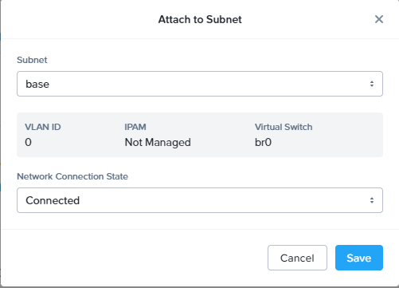

Choisissez le réseau dans `Subnet` , verifiez qu'il soit bien connecté dans `Network Connection State` et cliquez sur `Save`{.action}

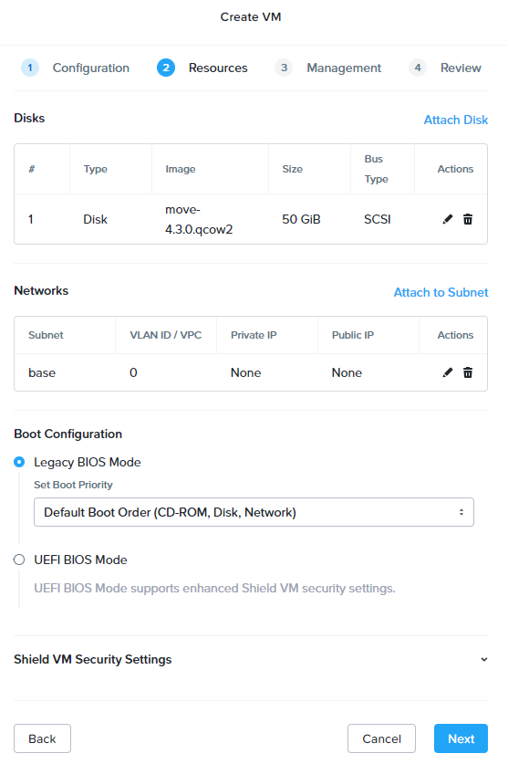

Cliquez sur `Next`{.action} 

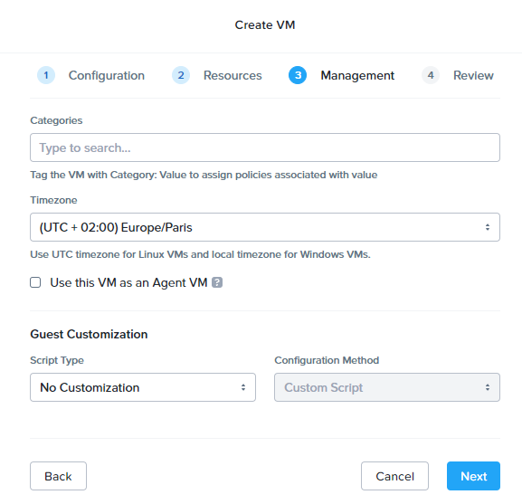

Laissez les options de timezone par défaut et cliquez sur sur `Next`{.action}

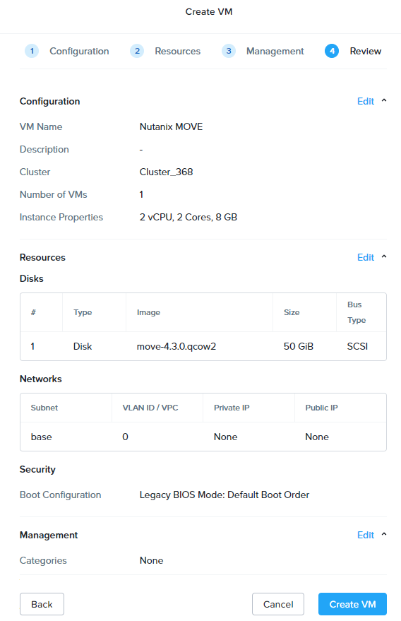

Cliquez sur sur `Create VM`{.action} pour finaliser l'installation de la machine virtuelle Move

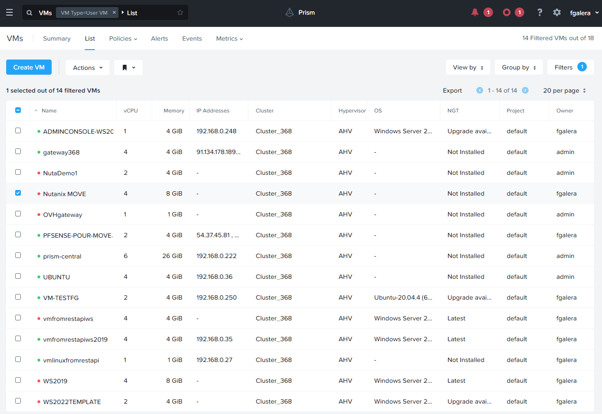

Selectionnez la machine virtuelle **Nutanix Move** et cliquez sur le menu `Actions`{.action}

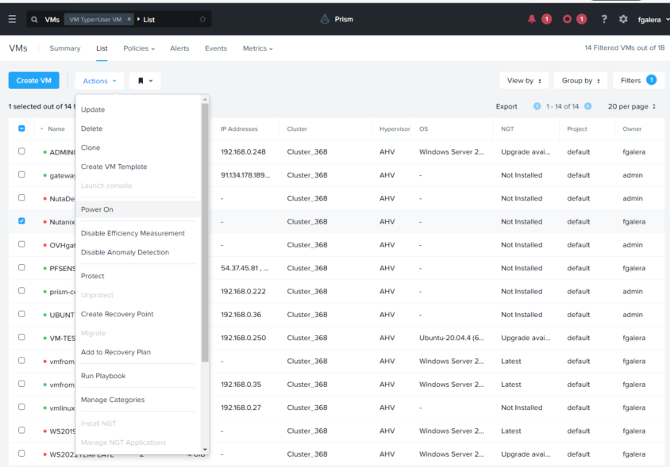

Cliquez sur `Power On`{.action} dans le menu action pour démarrer la machine virtuelle.

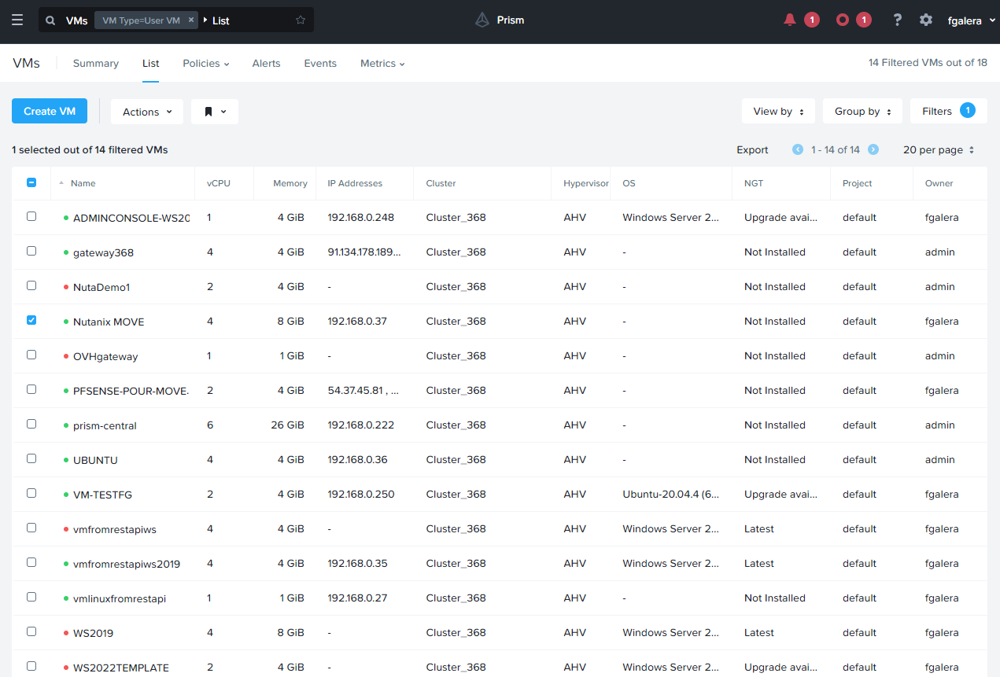

La machine virtuelle est démarrée si l'on a un serveur DHCP sur le réseau ou se trouve cette machine elle obtiendra une adresse dans la colonne `IP adresses`  

Cette installation de Nutanix Move se fait sur un réseau ou il y'a un serveur DHCP , il est possible de l'installer sur un réseau où le serveur DHCP n'est pas disponible. 

Pour plus de détails sur **Nutanix MOVE**, reportez-vous à la section « [Aller plus loin](#gofurther) » de ce guide.

### Configuration de **Move** 

Avant de configurer Move il est important d'avoir un compte d'administration sur **Prism Element** et non **Prism Central**

#### Création d'un compte dans **Prism Element**

A partir de **Prism Central**

#### Paramétrage des environnements

Connectez vous à la VM au travers de l'interface WEB de la machine virtuelle MOVE

!!!! A documenter

#### Migration de machines virtuelles depuis un environnement **HyperV*** vers **AHV**

Avant de migrer une machine virtuelle existante il faudra s'assurer que la version du système d'exploitation 

## Aller plus loin 

[Installation et configuration de Move](https://portal.nutanix.com/page/documents/details?targetId=Nutanix-Move-v4_3:Nutanix-Move-v4_3)

Échangez avec notre communauté d'utilisateurs sur <https://community.ovh.com/>.
