**Last updated 11th April 2022**

## Objective

Nutanix provides a tool called **Nutanix Move** that allows migrations from other environments to **AHV**.

**This guide explains how to perform a migration with the Move software.**

> [!warning]
> OVHcloud provides services for which you are responsible, with regard to their configuration and management. It is therefore your responsibility to ensure that they work properly.
>
> This guide is designed to assist you as much as possible with common tasks. Nevertheless, we recommend contacting a specialist provider if you experience any difficulties or doubts when it comes to managing, using or setting up a service on a server.
>
> Some options, such as the use of compression or deduplication, require specific licences provided by Nutanix through OVHcloud. Please contact OVHcloud Sales for more information.

## Requirements

- A Nutanix cluster in your OVHcloud account
- Access to the [OVHcloud Control Panel](https://www.ovh.com/auth/?action=gotomanager&from=https://www.ovh.pt/&ovhSubsidiary=pt)
- You must be connected to the cluster via Prism Central
- A connection to an environment other than Nutanix 

## Nutanix Move Overview

**Nutanix Move** is a tool that allows virtual machine migrations from **VMware ESXI**, **Hyper-V**, **Azure** and **AWS** to **AHV**.

It can also be used to migrate from Nutanix **AHV** to **AWS**.

This software works on a virtual machine whose sources are available on the Nutanix website with a customer account.

For optimal use, we recommend installing **Nutanix Move** as close as possible to the destination.

The **Nutanix Move** software is the only software that communicates between the source and the destination.

> [!warning]
> It is strongly discouraged to use **Nutanix Move** with virtual machines on a Windows Server running **Active Directory** or **Microsoft Exchange**. It is best to migrate as recommended by Microsoft.
>
> For VMs that use databases in **Microsoft SQL**, it is best to stop the database service when completing a migration.
>
> Ensure that the original virtual machine is compatible with the destination Nutanix environment.

## Instructions

We will look at how to migrate between a remote environment on Hyper-V to an OVHcloud Nutanix environment.

The source and the destination are on two interconnected private networks through an **IPSEC VPN**.

### Preparing the original virtual machines before migration

The virtual machine must be in the list of supported virtual machines in the compatibility matrix for the migration to work.

Log in to the site below to verify the compatibility of the source machines with the destination environment on Nutanix:

[Nutanix Accounting Matrix](https://portal.nutanix.com/page/documents/compatibility-interoperability-matrix/guestos)

#### Specificity of virtual machines on LINUX

Some virtual machines will not start correctly after migration via **Nutanix Move**. 
Check the compatibility list as it is likely that the SCSI driver is not supported and needs to be changed with the PCI driver.
 
In this case, you will need to follow this procedure to [change the disk controller of a Virtual Machine](#changediskcontroller) after the virtual machine is migrated.

#### Specificity of the Microsoft environment

Microsoft does not provide the SCSI adapter and network card **Virtio** drivers. These drivers must be installed prior to a migration. These drivers are available on the Nutanix website with a customer account.

> [!primary]
> Microsoft Windows 2008 is no longer supported by Microsoft or Nutanix. However, you can install older **Virtio** drivers and attempt a migration.
>

Login to the Nutanix website with a customer account to download the VIRTIO drivers.

[VIRTIO driver download link](https://portal.nutanix.com/page/downloads?product=ahv&bit=VirtIO).

Enter your user name in `Emails`{.action}, your password in `Password`{.action} and click `Log In`{.action}.

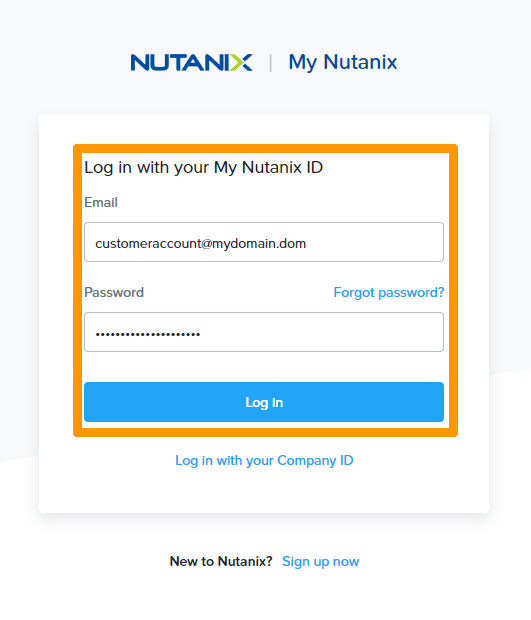{.thumbnail}

Click the `Download`{.action} link that suits you.

For our example, we will download the driver for **amd64**.

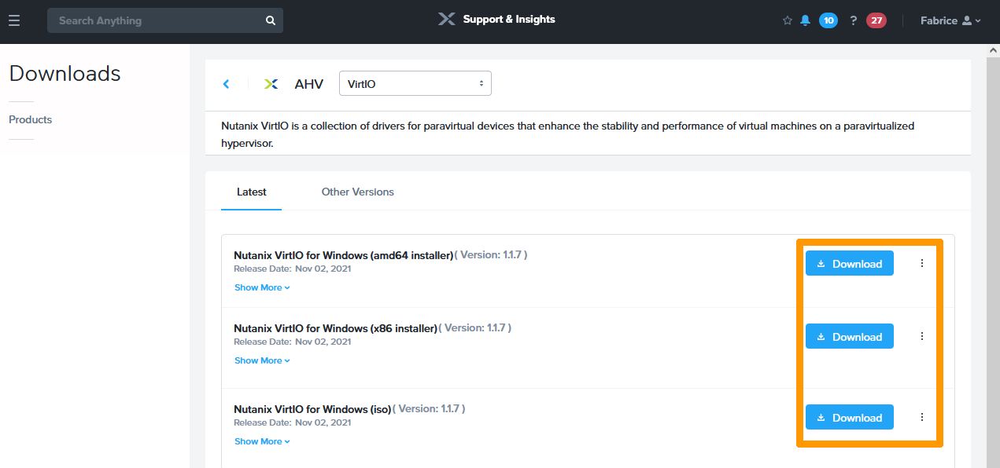{.thumbnail}

From a Windows virtual machine in the Hyper-V environment, double-click `Nutanix-VirtIO-1.1.7-amd64`{.action}.

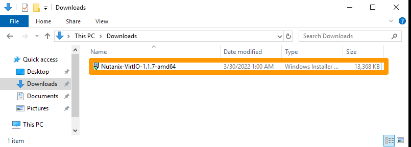{.thumbnail}

Read the licence terms and conditions, accept them by ticking the box and then click `Install`{.action}.

{.thumbnail}

Click `Finish`{.action} to complete the installation without having to restart the virtual machine.

{.thumbnail}

### Installing Move on the Nutanix Cluster.

#### Downloading and importing sources. 

Retrieve the file in **qcow2** format from this site: [Download link for Nutanix Move](https://portal.nutanix.com/page/downloads?product=move).

Sign in with an account registered with Nutanix.

{.thumbnail}

Click `Download`{.action} to the right of `Move QCOW2 file for AHV`.

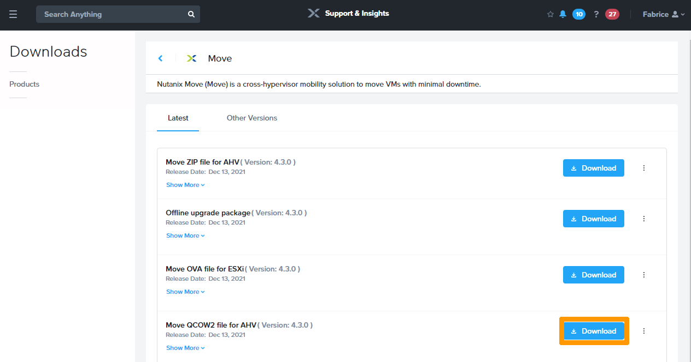{.thumbnail}

Import the downloaded image from **Nutanix Move** into the cluster. For more information on importing images, see our guide on [importing images](https://docs.ovh.com/gb/en/nutanix/image-import/).

#### Installing the **Move** virtual machine

Create a virtual machine from the Move image.

From **Prism Central**, open the main menu by clicking on the button in the top left-hand corner.

{.thumbnail}

Click `VMs`{.action} in the menu.

{.thumbnail}

Click `Create VM`{.action}.

{.thumbnail}

Type **Nutanix Move** in the `Name` field.

Choose the **2 vCPU**, **2 Cores** and **8 GB** options in the `VM Properties` fields and click `Next`{.action}.

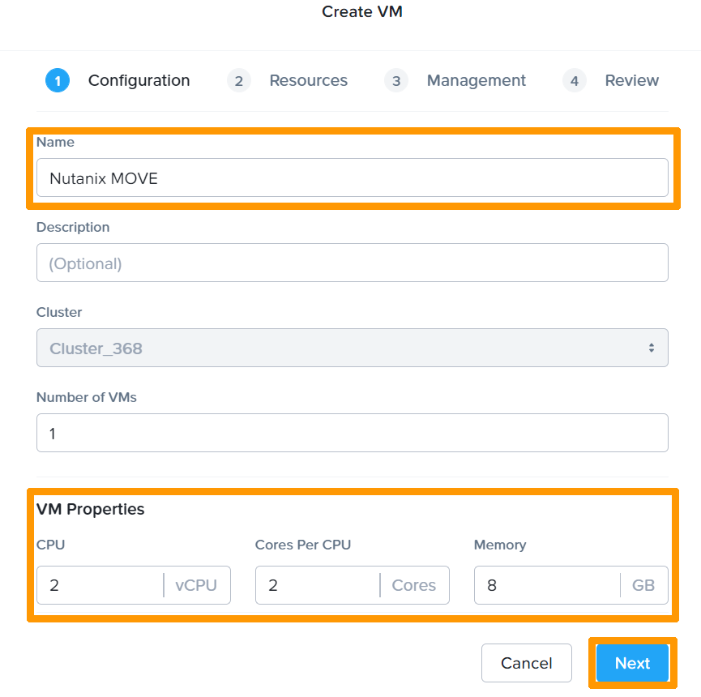{.thumbnail}

Click `Attach Disk`{.action}.

{.thumbnail}

Choose the **Disk**, **Clone from Image** and **move-4.3.0.qcow2** options and click `Save`{.action}.

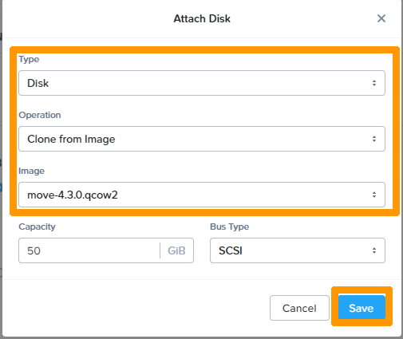{.thumbnail}

Click on `Attach to Subnet`{.action}.

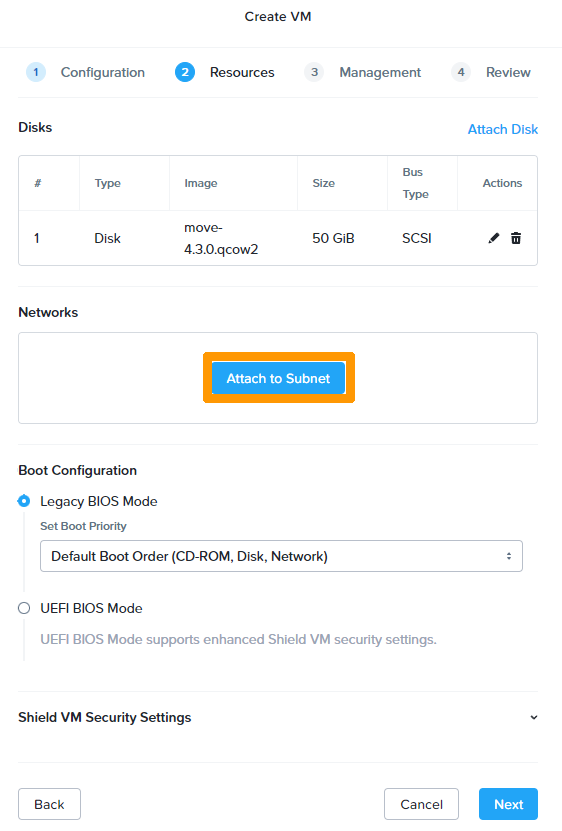{.thumbnail}

Choose the network in `Subnet`, make sure it is connected in `Network Connection State`, and click `Save`{.action}.

{.thumbnail}

Click `Next`{.action}.

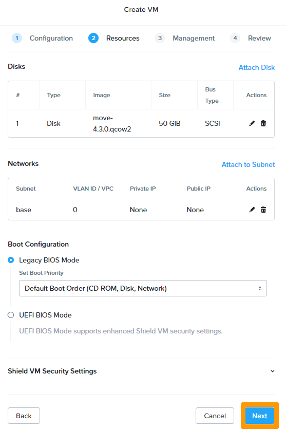{.thumbnail}

Leave the default time zone options and click `Next`{.action}.

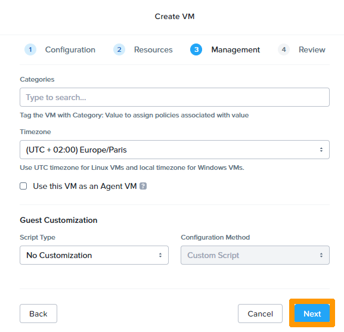{.thumbnail}

Click `Create VM`{.action} to complete the installation of the **Nutanix Move** virtual machine.

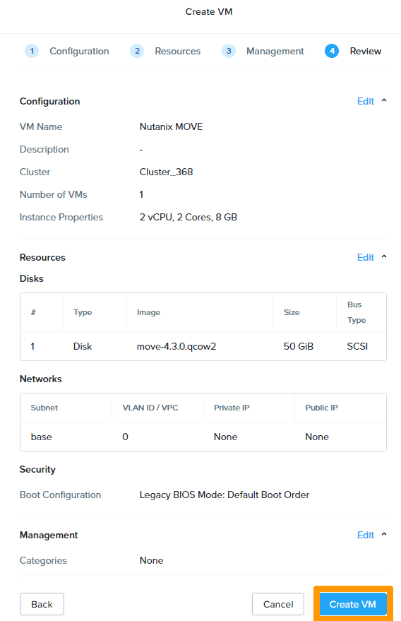{.thumbnail}

Select the **Nutanix Move** virtual machine and click the `Actions`{.action} menu.

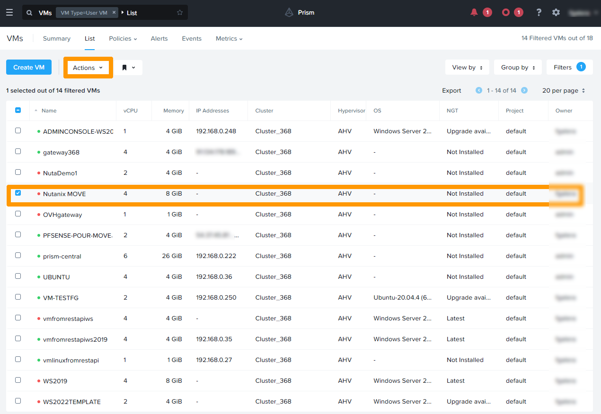{.thumbnail}

Click `Power On`{.action} in the `Actions`{.action} menu to start the virtual machine.

{.thumbnail}

The virtual machine is started and an IP address is obtained if a **DHCP** server is operational on that network.

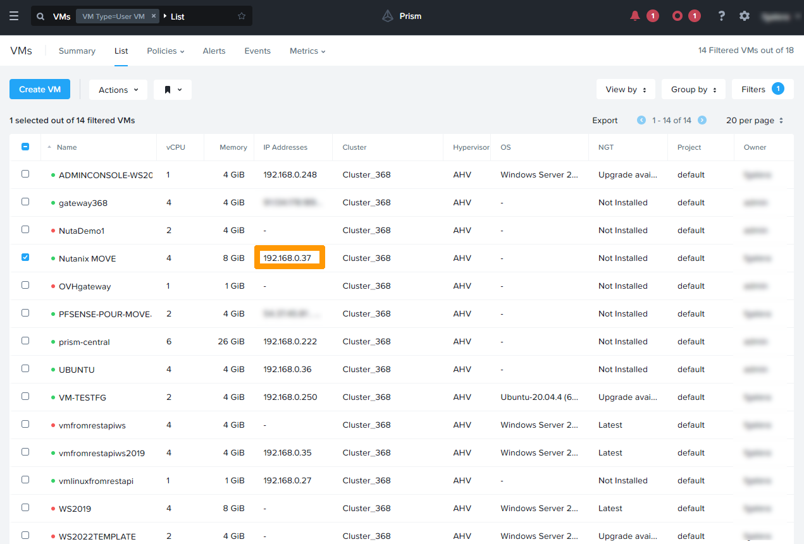{.thumbnail}

This installation of **Nutanix Move** is done on a network that has a DHCP server, but it is possible to configure the virtual machine on a network without a **DHCP server**. 

For more information about **Nutanix Move**, see the [Go further](#gofurther) section of this guide.

### Configuring **Nutanix Move** 

#### Logging in to the web interface and creating environments for migration

Connect to the IP address of the **Nutanix Move** virtual machine through a web browser in HTTPS, as follows: `https://IPaddressNutanixMove/`.

Read the licence conditions, accept them and click `Continue`{.action}.

{.thumbnail}

Click `OK`{.action} to continue.

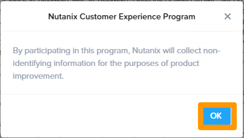{.thumbnail}

Select and confirm a password in the fields provided, then click `Set Password`{.action} to validate the creation of the Nutanix Move password.

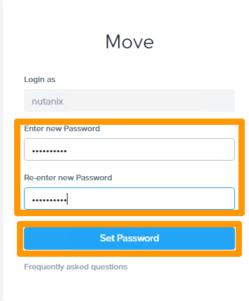{.thumbnail}

Type the password in `Password`{.action} and click `Log In`{.action} to log into the **Nutanix Move** web interface.

{.thumbnail}

Click `+ Add Environment`{.action}.

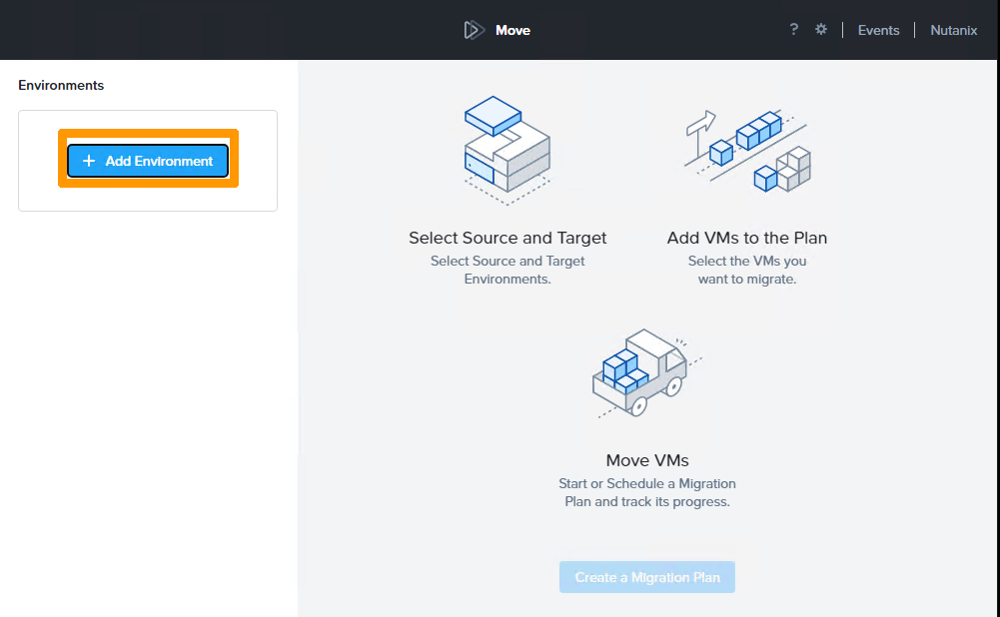{.thumbnail}

Choose `Nutanix AOS`{.action}.

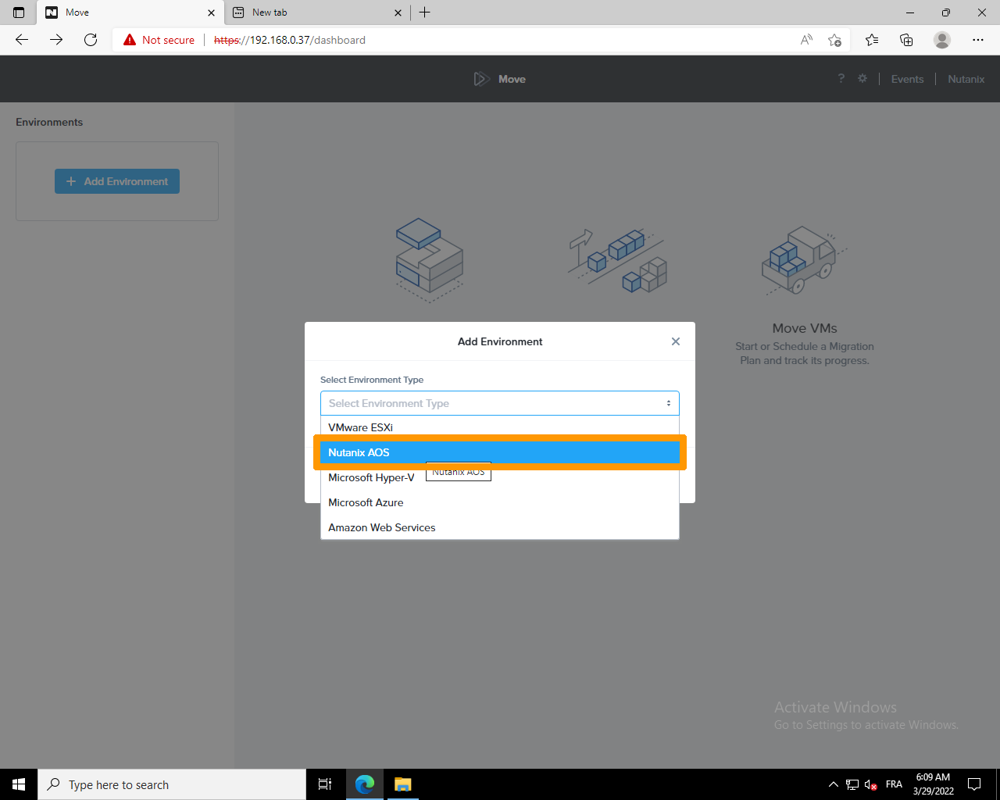{.thumbnail}

Enter the following information:

- **PRISM-CENTRAL-DESTINATION** in the `Environment Name` field 
- the private IP address of **Prism Central** in the `Nutanix Environment` field 
- a **Prism Central** administration account in the `Username` field
- the account password in the `Password`{.action} field 

Click `ADD`{.action} to add the **Prism Central** environment. 

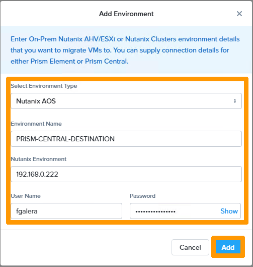{.thumbnail}

Click `Add Environment`{.action}.

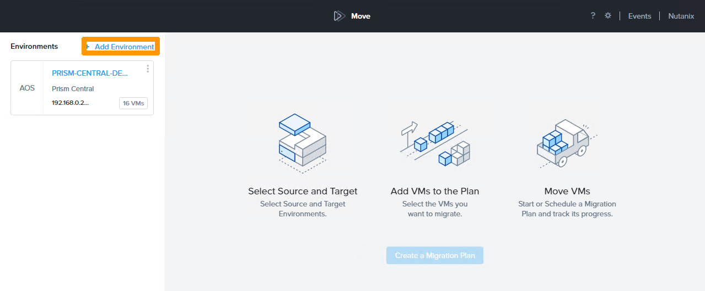{.thumbnail}

Choose `Microsoft Hyper-V`{.action}.

{.thumbnail}

Enter the following information:

- **HyperV-SOURCE** in the `Environment Name` field
- the private IP address of the **Hyper-V** server in the `Hyper-V Server/Cluster` field
- a **Hyper-V** administration account in the `Username` field
- the password for this account in the `Password` field

Click `ADD`{.action} to add the **Hyper-V** environment. 

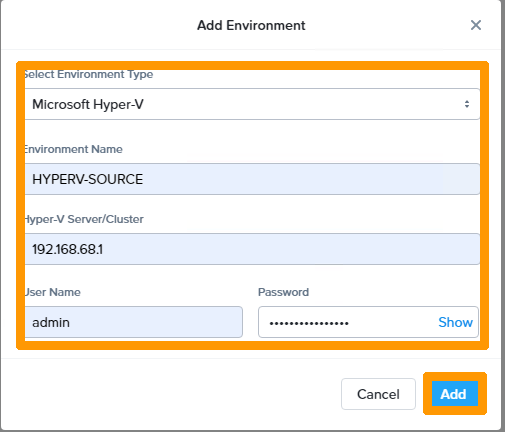{.thumbnail}

Both migration environments appear in the top left-hand corner.

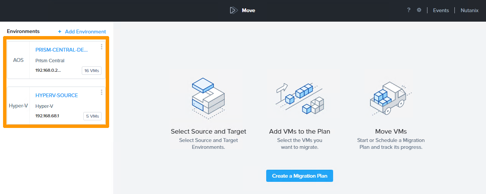{.thumbnail}

#### Creating a migration plan

We will create a migration plan from the two environments created previously.

The source will be the **Hyper-V** server, and the destination will be the **Nutanix** cluster.

Click `Create a Migration Plan`{.action}.

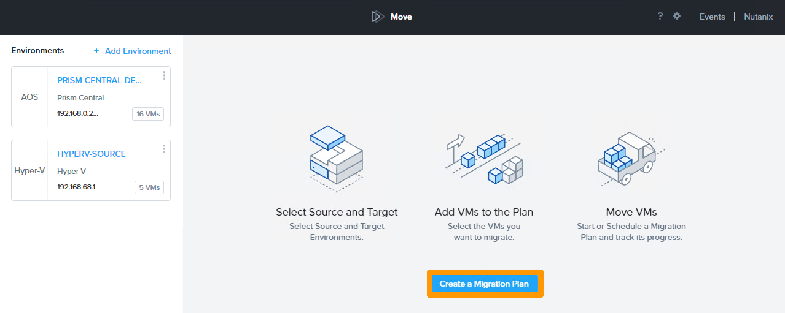{.thumbnail}

Choose a name in the `Plan Name` field and click `Proceed`{.action}.

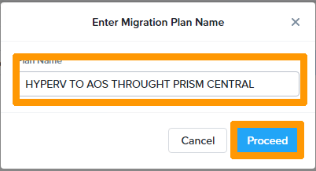{.thumbnail}

Enter the following information:

- **HyperV-SOURCE** in the `Select a Source` field
- **PRISM-CENTRAL-DESTINATION** in the `Hyper-V Server/Cluster` field
- the CLUSTER name in the `Target Cluster` field
- the name of the destination container in the `Target Container` field

Then click `Next`{.action} to continue to the next step.

{.thumbnail}

Select the virtual machines you want to migrate from the **Hyper-V** environment to **AOS** by clicking on the `+`{.action} icon to the left of the VM. 
Click `Next`{.action} to continue creating the migration plan.

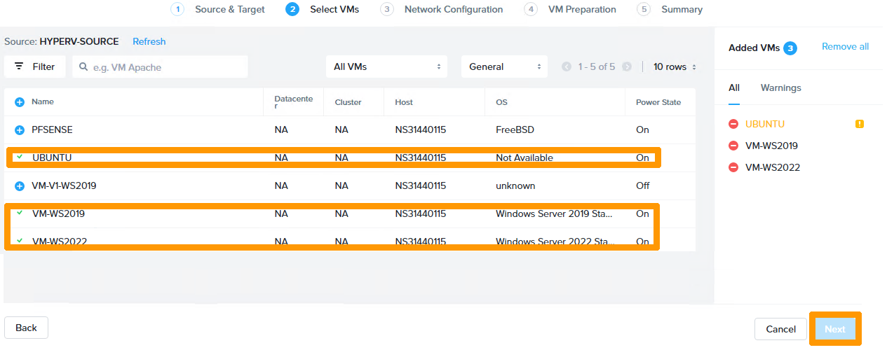{.thumbnail}

Choose the network in `Target Network` and click `Next`{.action}.

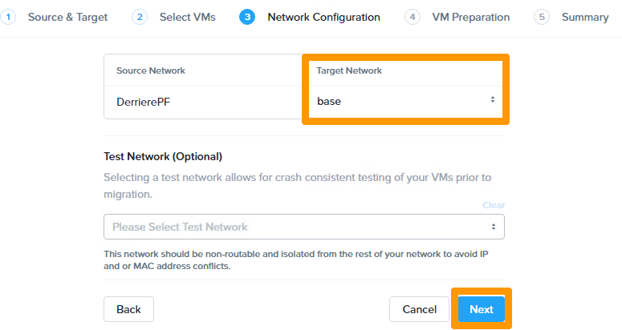{.thumbnail}

Click `Next`{.action} to confirm the migration.

{.thumbnail}

Click `Save`{.action} to save the migration plan without running it.

{.thumbnail}

#### Launching the migration

After the migration plan is created, you can manually launch it.

Check the box next to the desired migration plan.

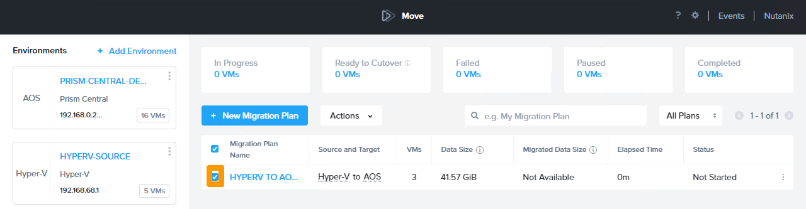{.thumbnail}

On the `Actions` menu, click `Start`{.action}.

{.thumbnail}

The migration is in progress. The `Status` column gives you information on the status of the migration.

{.thumbnail}

#### Finalising the migration

Check the status of the migration by hovering over the `In Progress` status. 
A window with the information **Ready to Cutover N** should appear, listing the number of VMs that can be migrated.

Click `In Progress`{.action} to start the completion process.

{.thumbnail}

Select all the VMs by ticking the `VM Name`{.action} box and click `Cutover`{.action}.

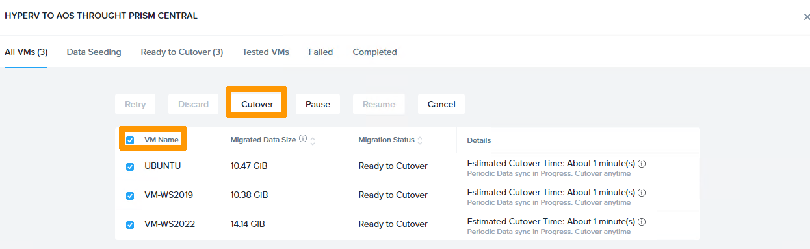{.thumbnail}

Click `Continue`{.action}. 

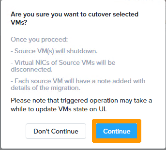{.thumbnail}

Wait a few moments while it completes.

{.thumbnail}

The migration is complete when **Completed** appears in the `Migration Status` column.

{.thumbnail}

Log into **Prism Central** to view the 3 migrated VMs that are present and running.

{.thumbnail}

#### Changing the Disk Controller on a Linux Virtual Machine 

If the virtual machine does not start properly after the migration, it may be due to a bad disk controller in the virtual machine configuration. In this case, it should be changed by following this procedure: 

Go to the main menu of **Prism Central** and click on `VMs`{.action}.

{.thumbnail}

Make sure the virtual machine is turned off.

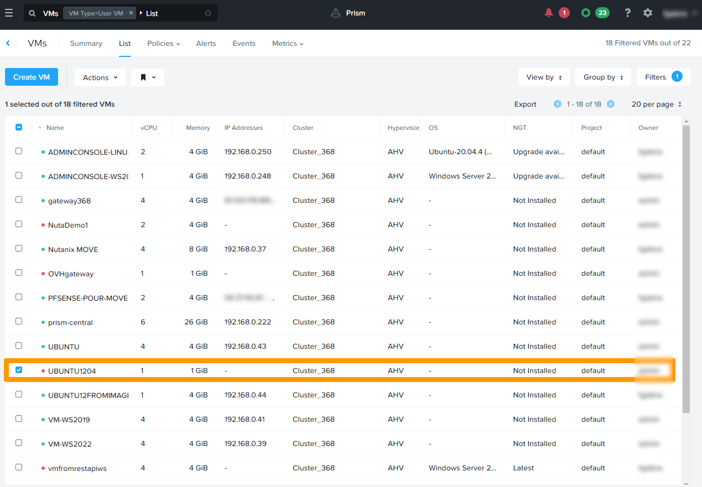{.thumbnail}

Return to the main menu and click `Images`{.action}.

{.thumbnail}

Click `Add Image`{.action}.

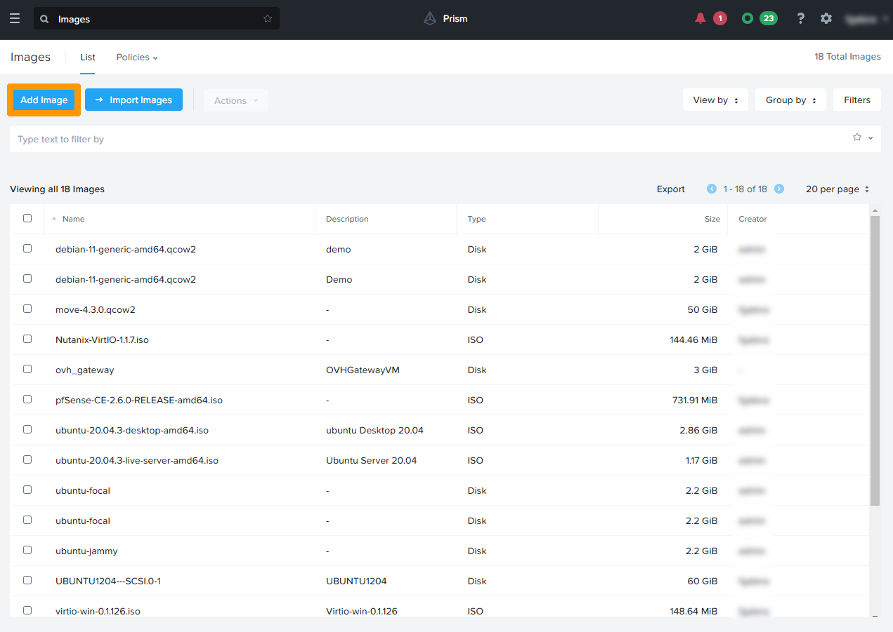{.thumbnail}

Select **VM Disk** as the `Image Source`. Type a name in `Search by VM Name`{.action} and click `+`{.action}.

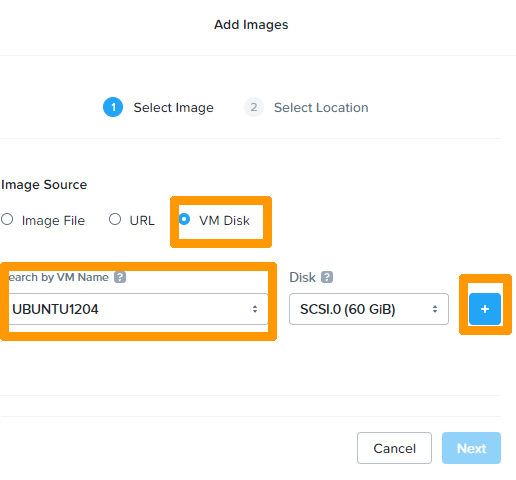{.thumbnail}

Type a name in the `Image Name` field and click `Next`{.action}.

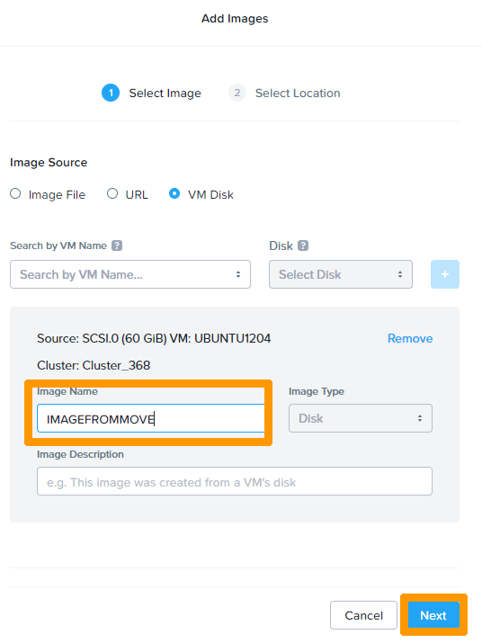{.thumbnail}

Select `Place image on source VM's cluster`{.action} and click `Save`{.action}.

{.thumbnail}

The image created from the virtual machine appears after a few moments.

{.thumbnail}

Open the main menu and click `VMs`{.action}.

{.thumbnail}

Check the box to the left of the virtual machine.

{.thumbnail}

Open the `Actions`{.action} menu and choose `Update`{.action}.

{.thumbnail}

Click on the `trash can`{.action} icon next to the CDROM drive.

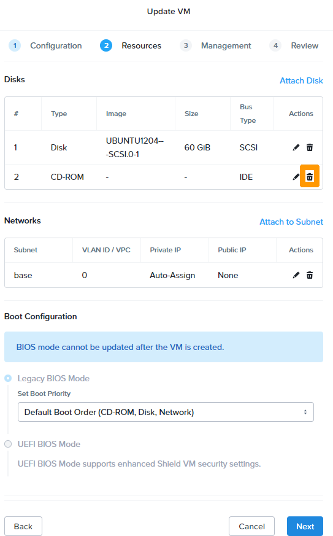{.thumbnail}

Click on the `trash can`{.action} icon next to the disk drive.

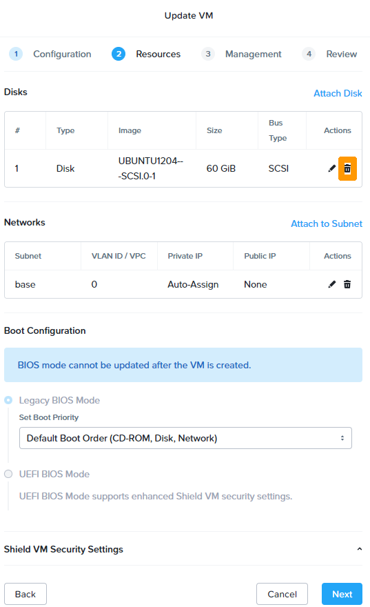{.thumbnail}

Click `Attach Disk`{.action}.

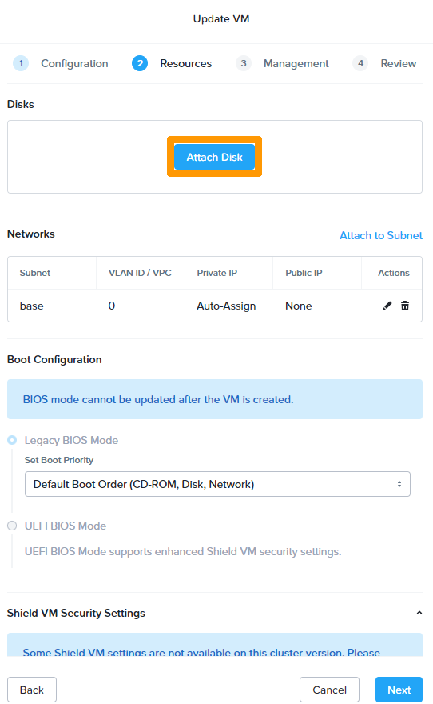{.thumbnail}

Select:

- **Disk** In `Type`;
- Select **Clone from image**;
- Enter the **name of the image created** in `Image`; 
- Select PCI as the `Bus type`{.action} and click `Save`{.action}

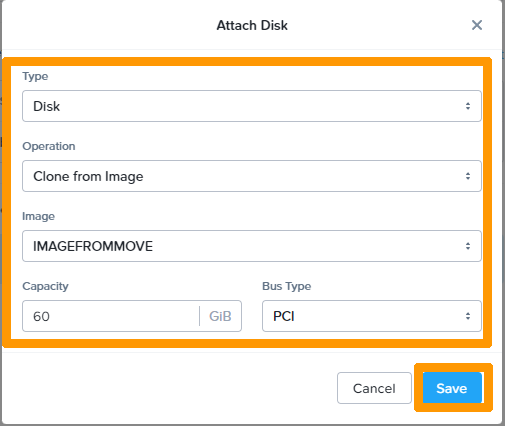{.thumbnail}

Click `Next`{.action}.

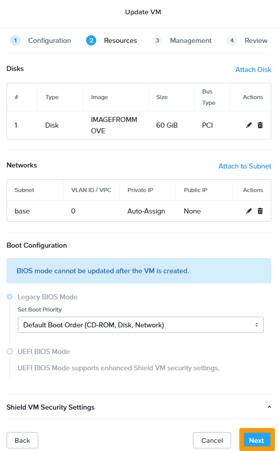{.thumbnail}

Click `Next`{.action}.

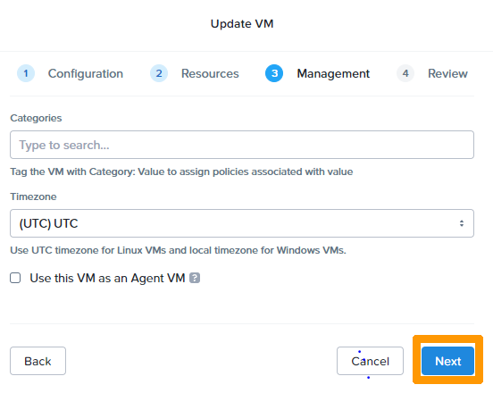{.thumbnail}

Click `Save`{.action}.

{.thumbnail}

The disk controller has been modified and the virtual machine boots properly.

## Go further 

[Installation and configuration of Move](https://portal.nutanix.com/page/documents/details?targetId=Nutanix-Move-v4_3:Nutanix-Move-v4_3)

Join our community of users on <https://community.ovh.com/en/>.