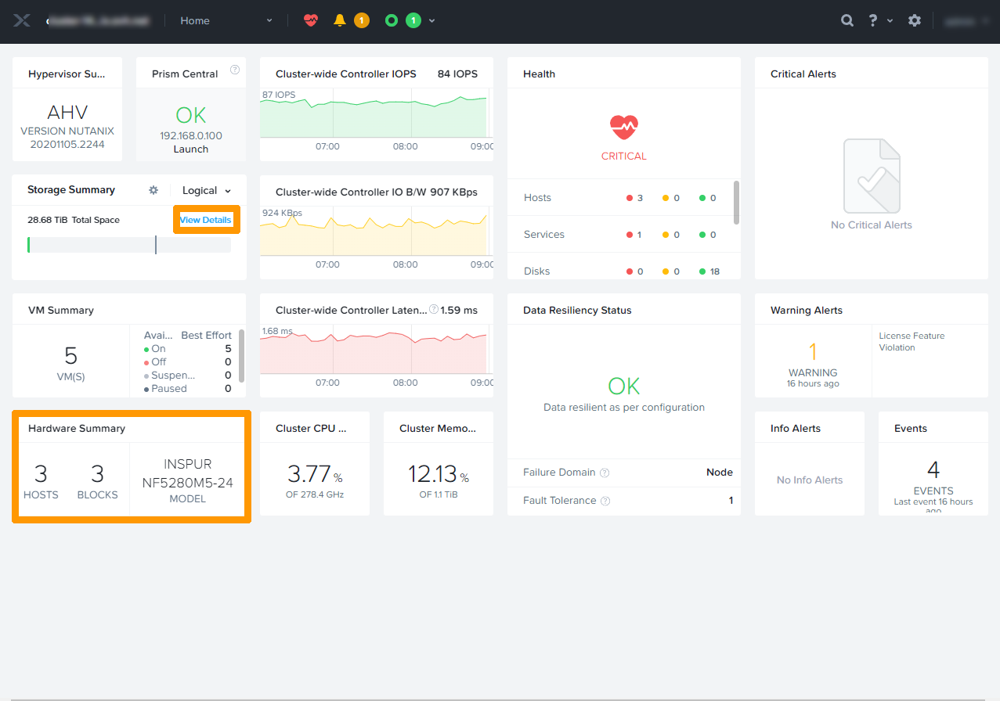
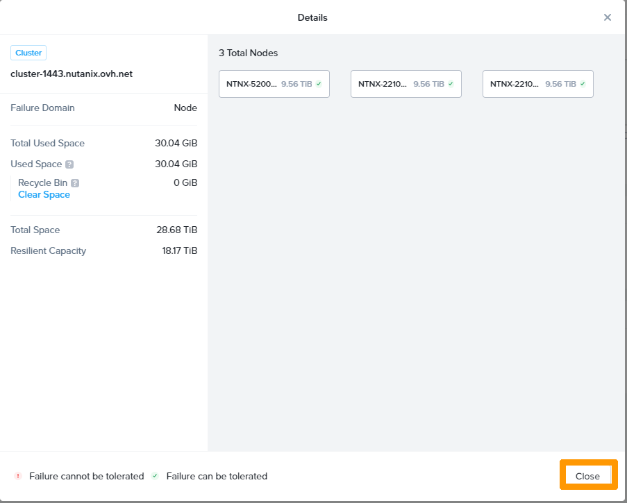
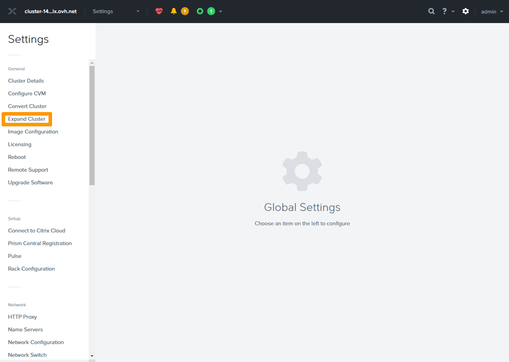
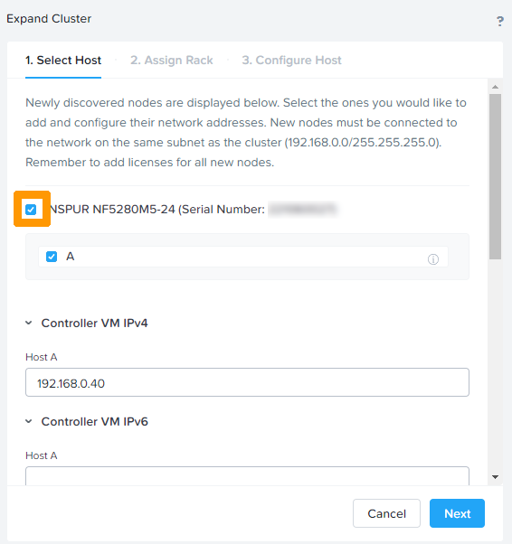
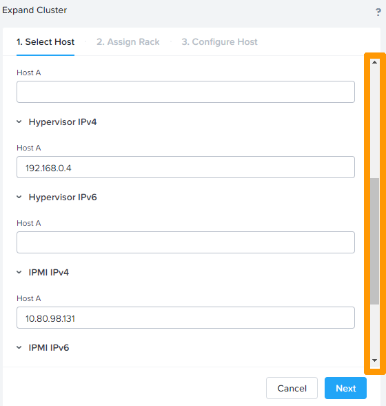
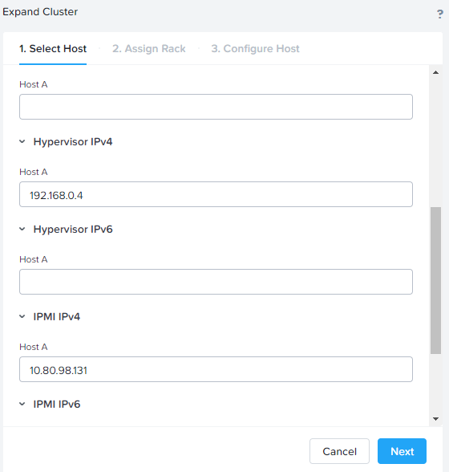
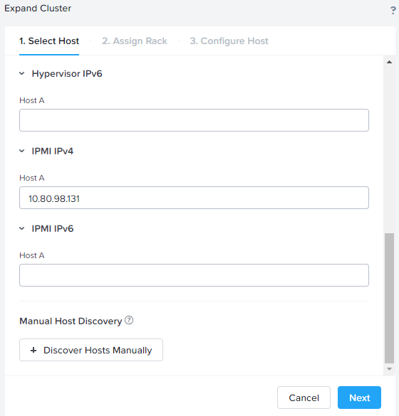
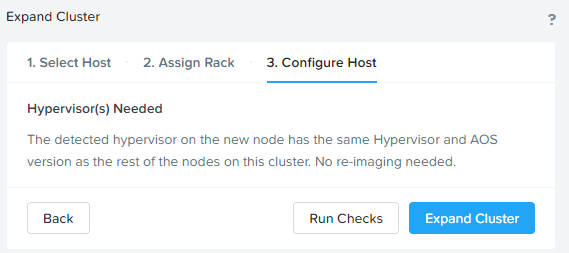
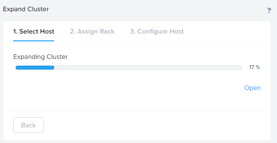
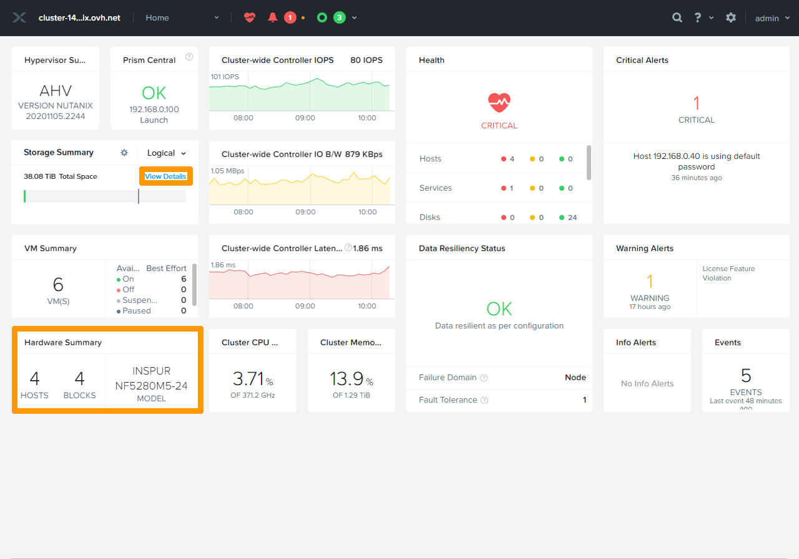

**Dernière mise à jour le 07/04/2022**

## Objectif

Les clusters Nutanix sont évolutifs. Il est possible de rajouter des nœuds dans un cluster existant.

**Ce guide vous explique comment ajouter un nœud et valider son bon fonctionnement.**

> [!warning]
> OVHcloud vous met à disposition des services dont la configuration, la gestion et la responsabilité vous incombent. Il vous appartient donc de ce fait d’en assurer le bon fonctionnement.
>
> Ce guide a pour but de vous accompagner au mieux sur des tâches courantes. Néanmoins, nous vous recommandons de faire appel à un [prestataire spécialisé](https://partner.ovhcloud.com/fr-ca/) si vous éprouvez des difficultés ou des doutes concernant l’administration, l’utilisation ou la mise en place d’un service sur un serveur.

## Prérequis

- Disposer d'un cluster Nutanix dans votre compte OVHcloud
- Être connecté à votre [espace client OVHcloud](https://ca.ovh.com/auth/?action=gotomanager&from=https://www.ovh.com/ca/fr/&ovhSubsidiary=qc)
- Être connecté sur le cluster via Prism Central.
- Un serveur physique prêt à être configuré ajouté dans l'espace client OVHCloud.

## Informations techniques

La solution **Nutanix on OVHcloud** permet d'avoir entre 3 et 18 nœuds sur le même cluster.

Il est possible d'ajouter plusieurs nœuds lors de l'expansion du cluster.

Les nœuds à rajouter doivent avoir la même version d'**AOS** que ceux du cluster existant.

## En pratique

### Ajout d'un nœud dans un cluster Nutanix.

Connectez-vous à **Prism Element** au travers de **Prism Central**.

Pour plus d'informations sur la connexion au cluster; reportez-vous à la section « [Aller plus loin](#gofurther) » de ce guide. 

Sur le tableau de bord, les 3 nœuds sont visibles dans `Hardware Summary`. Cliquez sur `View Details`{.action} au milieu à gauche pour faire apparaître plus de détails.

{.thumbnail}

Une vue plus détaillée est affichée avec des informations comme l'espace total et la capacité de résilience du stockage. 
Cliquez sur `Close`{.action} pour fermer cette fenêtre.

{.thumbnail}

Ouvrez le menu `Home`{.action} et choisissez `Health`{.action} pour faire une analyse du cluster avant le rajout du nœud.

{.thumbnail}

Cliquez en haut à droite sur `Actions`{.action} et choisissez `Run NCC Check`{.action}.

{.thumbnail}

Cliquez sur `Run`{.action} pour lancer un contrôle et attendez que l'opération soit terminée.

{.thumbnail}

Après le contrôle, cliquez sur l'icône `Engrenage`{.action} en haut à droite pour modifier les paramètres.

{.thumbnail}

Cliquez sur `Expand Cluster`{.action}.

{.thumbnail}

Cochez la case à coté de l'hôte découvert afin de faire apparaître les détails du nœud.

{.thumbnail}

Faites défiler la barre de défilement pour voir les options.

{.thumbnail}

Continuez le défilement jusqu'en bas de la fenêtre et cliquez sur `Next`{.action}.

{.thumbnail}

Choisissez le Rack dans `Assign to Rack` et cliquez sur `Next`{.action}.

{.thumbnail}

Cliquez sur `Expand Cluster`{.action}.

{.thumbnail}

Cliquez sur `Open`{.action} pour voir le détail de l'expansion du cluster.

{.thumbnail}

{.thumbnail}

L'ajout du nœud est terminée lorsque la progression de *Expanding Cluster* est à 100%.

{.thumbnail}

Quatre nœuds sont visibles dans `Hardware Summary`, cliquez sur `View Details`{.action} pour afficher plus d'informations.

{.thumbnail}

Cliquez sur `Close`{.action} pour revenir au tableau de bord.

{.thumbnail}

## Aller plus loin 

[Hyper-convergence Nutanix](https://docs.ovh.com/ca/fr/nutanix/nutanix-hci/)

[Guide Nutanix d'ajout de nœuds](https://portal.nutanix.com/page/documents/details?targetId=Web-Console-Guide-Prism-v5_20:wc-cluster-expand-wc-t.html)

Échangez avec notre communauté d'utilisateurs sur <https://community.ovh.com/>.