**Last updated 16th December 2022**

## Objective

HYCU for Nutanix is a backup software available for Nutanix. 

**Find out how to install, configure and use HYCU on a Nutanix cluster with Object Storage storage provided by OVHcloud.**

> [!warning]
> OVHcloud provides services for which you are responsible, with regard to their configuration and management. It is therefore your responsibility to ensure that they work properly.
>
> This guide is designed to assist you as much as possible with common tasks. Nevertheless, we recommend contacting a specialist provider if you experience any difficulties or doubts when it comes to managing, using or setting up a service on a server.
>
> The HYCU licence is not provided by OVHcloud. For more information, contact HYCU or OVHcloud commercial teams.

## Requirements

- A Nutanix cluster in your OVHcloud account
- Access to the [OVHcloud Control Panel](https://ca.ovh.com/auth/?action=gotomanager&from=https://www.ovh.com/world/&ovhSubsidiary=ws)
- You must be connected to the cluster via Prism Central. 
- A Public Cloud project with a High Performance Object Storage type storage bucket, with a user with read and write permissions for this bucket. You can find more information on how to create a Public Cloud project and how to use the High Performance Object Storage service on the following pages:
    - [Creating your first OVHcloud Public Cloud project](https://docs.ovh.com/us/es/public-cloud/crear_su_primer_proyecto_de_public_cloud/)
    - [Getting started with S3 High Performance](https://docs.ovh.com/us/es/storage/object-storage/s3/getting-started-with-object-storage/).
- 60 GB of storage, 8 GB of memory and 8 cores on your Nutanix Cluster.

## Instructions

Log in to **Prism Central**.

For more information on connecting to the cluster, see the [Go further](#gofurther) section in this guide. 

### Installing and configuring HYCU software

#### Adding HYCU installation image

From the main menu, click `Images`{.action} from the `Compute & Storage menu`{.action}.

{.thumbnail}

Click `Add Image`{.action}.

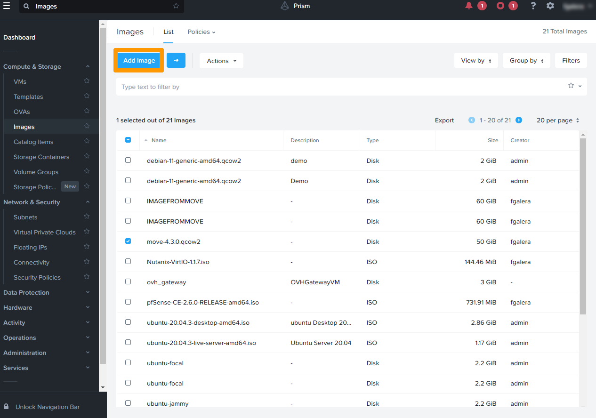{.thumbnail}

Choose `URL`{.action} as the source type, enter the URL `https://download.hycu.com/ec/v4.X.X/hycu-4.X.X-XXXX.qcow2` in **Enter Image URL**, and click `Upload file`{.action}. 

> [!primary]
> 
> The URL used for the download is the latest version available on the HYCU website.

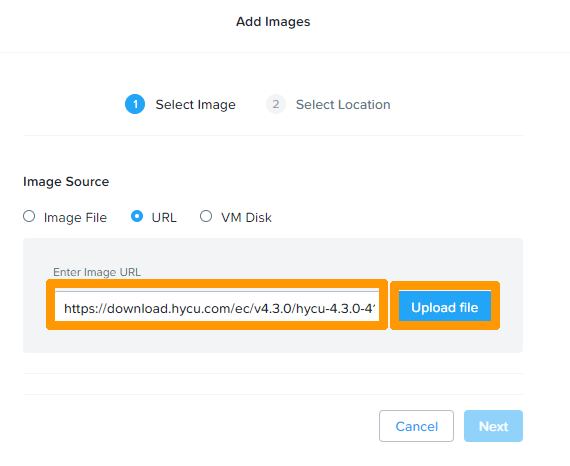{.thumbnail}

Remove the **.qcow2** extension behind the name and leave `hycu-4.X.X-XXXX`. Enter a description and click `Next`{.action}.

> [!warning]
> It is important to remove the extension in the name to facilitate the HYCU configuration process.

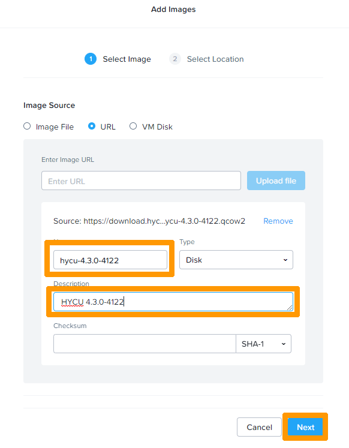{.thumbnail}

Click `Save`{.action} to import the image.

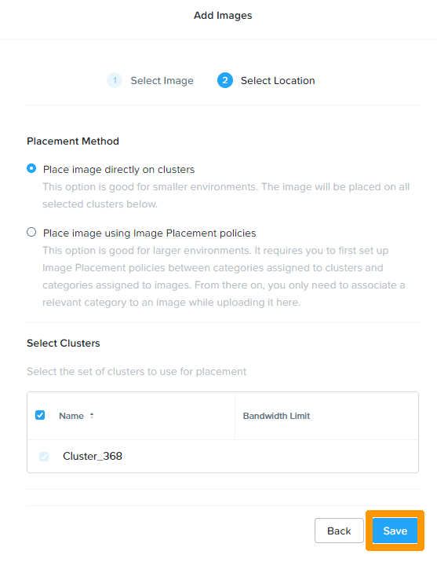{.thumbnail}

On the **Prism Central** dashboard, click the `cluster name`{.action} in the **Cluster Quick Access** section to go to the **Prism Element**.

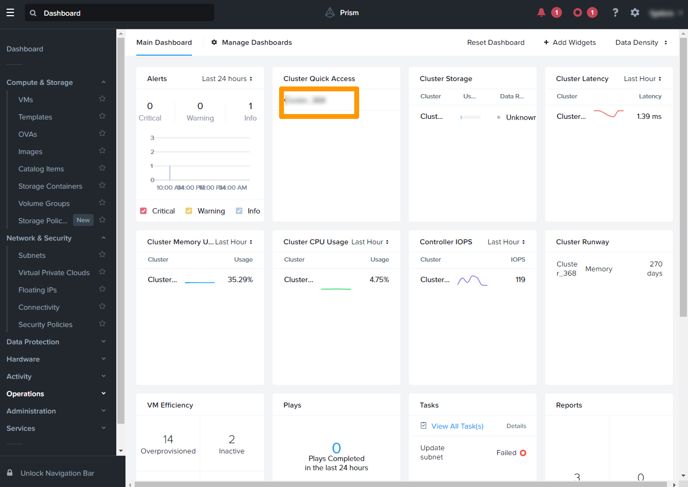{.thumbnail}

#### Configuring the IP address for ISCSI

Go to the settings by clicking on the `gear icon`{.action}.

{.thumbnail}

Click `Cluster Details`{.action}.

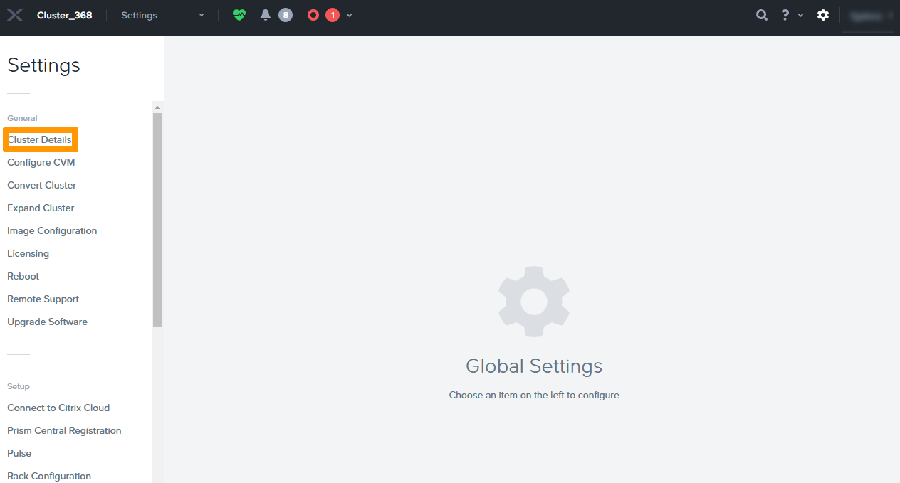{.thumbnail}

Enter an unused local IP address in **Virtual IP** and click `Save`{.action}.

{.thumbnail}

Check your choice and click `Yes`{.action}.

{.thumbnail}

The IP address is displayed in **virtual IP**.

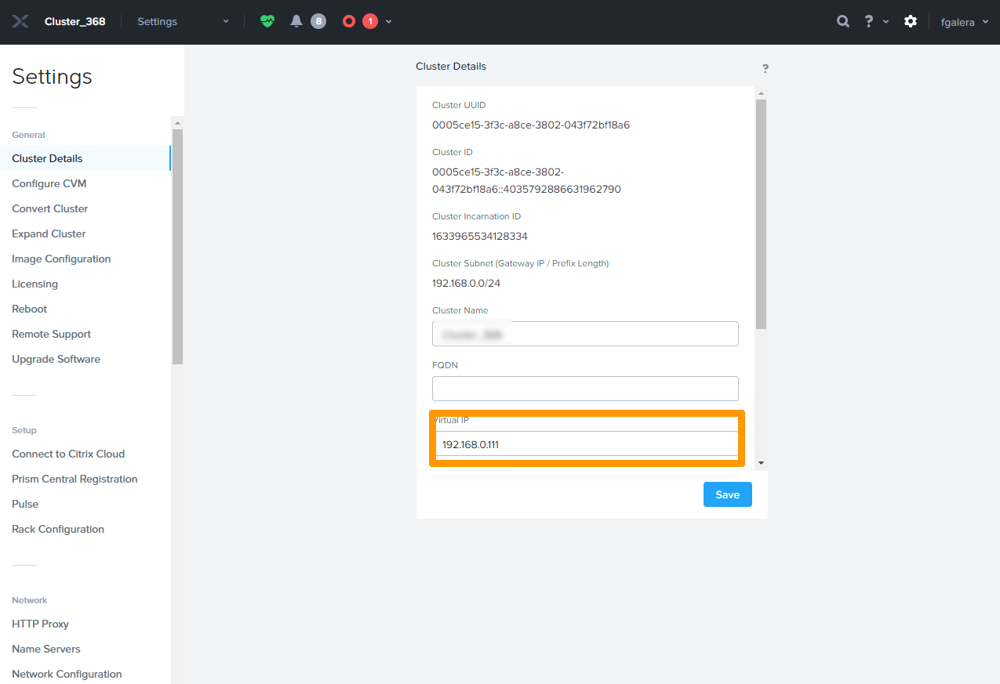{.thumbnail}

#### Adding a user account in **Prism Element** for HYCU

Click the gear to go to the **Prism Element configuration**.

{.thumbnail}

Scroll down the menu and click `Local User Management`{.action}.

{.thumbnail}

Click `New User`{.action}.

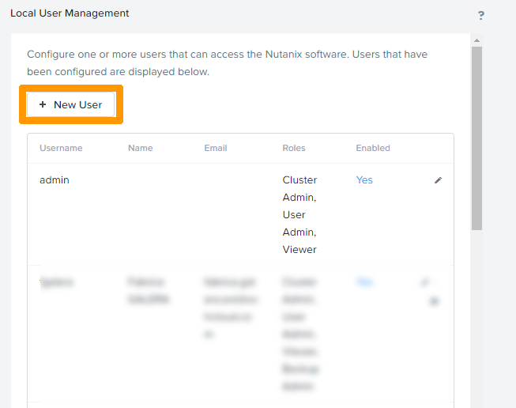{.thumbnail}

Enter these values:

- **Username**: `svc_hycu`
- **First Name**: `HYCU`
- **Last Name**: `HYCU`
- **Email**: `hycu@example.com`
- **Password**: `password`

> [!primary]
> This information is provided as an example, the email address is mandatory but is not used.

Select the `Cluster Admin`{.action} checkbox and click `Save`{.action}.

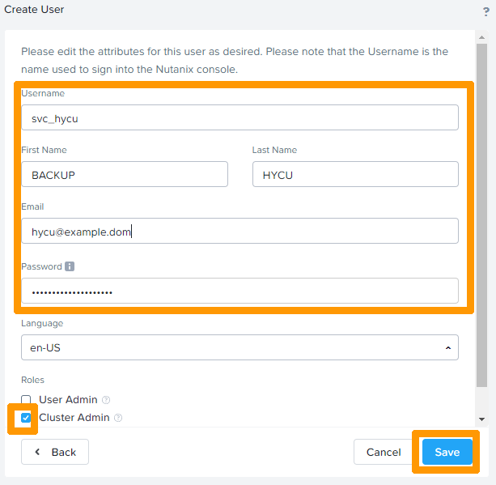{.thumbnail}

The user is then created.

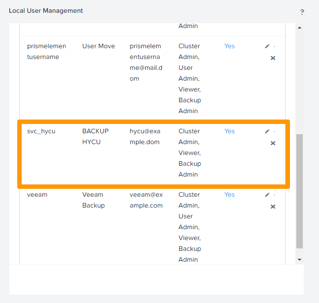{.thumbnail}

#### Creating the virtual machine for HYCU

Go to **Prism Central**.

In the main menu, click `VMs`{.action} from the `Compute & Storage`{.action} menu.

{.thumbnail}

Click `Create VM`{.action}.

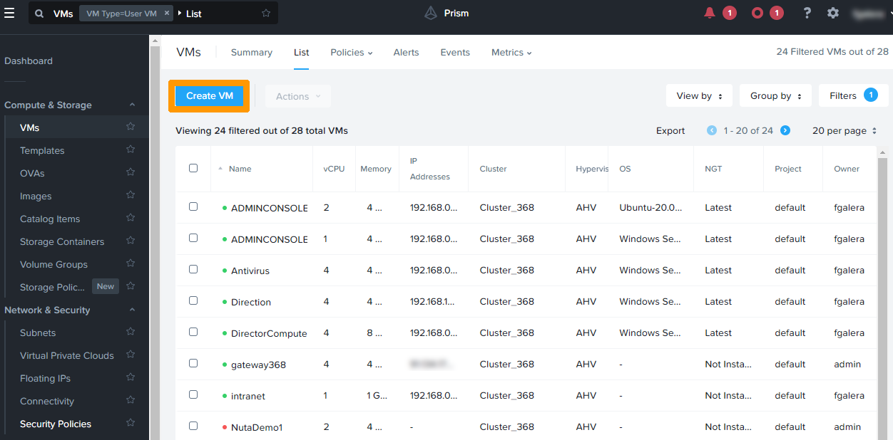{.thumbnail}

Name the virtual machine and change the properties of the virtual machine with these settings:

- **CPU**: `4 vCPU`
- **Cores Per CPU**: `2 Cores`
- **Memory**: `8GB`

Click `Next`{.action}.

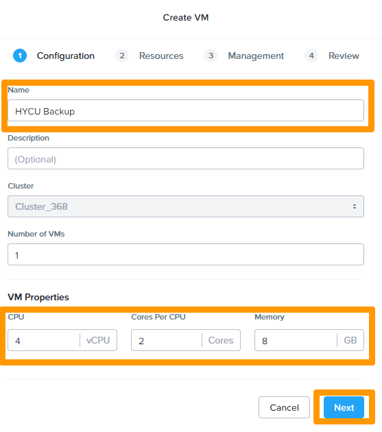{.thumbnail}

Click `Attach Disk`{.action}.

{.thumbnail}

Enter these values:

- **Type**: `Disk`
- **Operation**: `Clone from Image`
- **Image**: `hycu-4.X.X-XXXX`

Click `Save`{.action}.

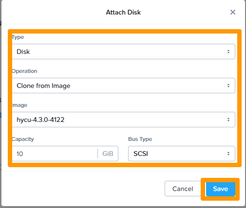{.thumbnail}

Click `Attach Disk`{.action}.

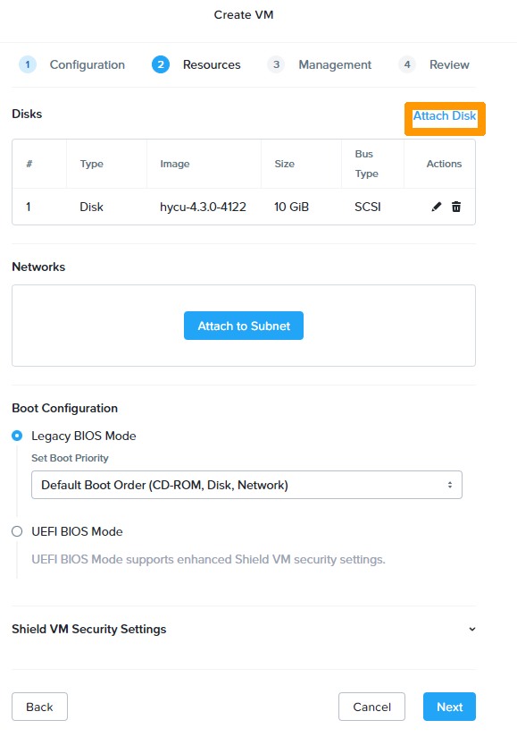{.thumbnail}

Choose these options:

- **Type**: `Disk`
- **Operation**: `Allocate on Storage Container`
- **Image**: `default-container`
- **Capacity**: `32Gib`

Click `Save`{.action}.

{.thumbnail}

Click `Attach to Subnet`{.action}.

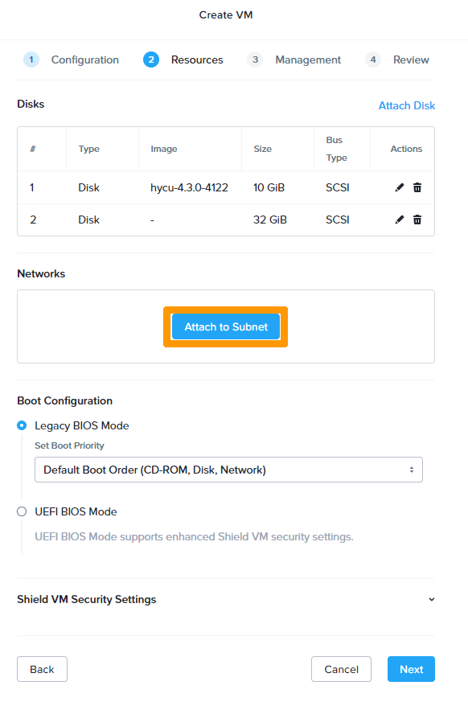{.thumbnail}

Select the `infra`{.action} network from the **Subnet** drop-down menu, select `Connected`{.action} in the **Network Connection State** drop-down menu. Then click `Save`{.action}.

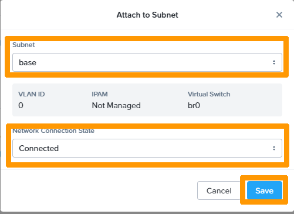{.thumbnail}

Click `Next`{.action}.

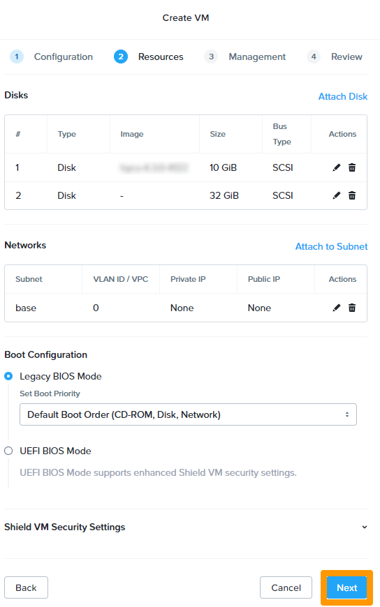{.thumbnail}

Create a **yaml** file by editing these values:

- **< IP address >**: Local IP address of the cluster.
- **< GATEWAY >**: Local gateway for the cluster to access the Internet.
- **< DNS >**: DNS used on the Internet.

```yaml
#cloud-config
bootcmd:
- /opt/grizzly/bin/cloud_init_setup.sh hycubc < IP address > < GATEWAY > < DNS > `hycu.local,ntnx.local`
```

Modify **Guest Customisation** options by selecting `Cloud-init (Linux)`{.action} in the **Script Type** drop-down menu. Select `Custom Script`{.action} in the **Configuration Method** drop-down menu.

Copy the contents of the yaml script and paste it to the field below **Clear Script**. Then click `Next`{.action}.

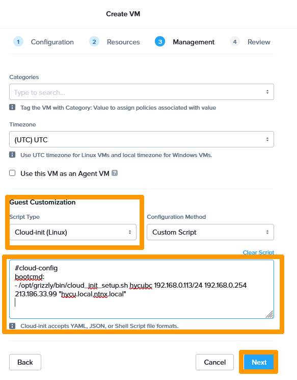{.thumbnail}

Click `Create VM`{.action}.

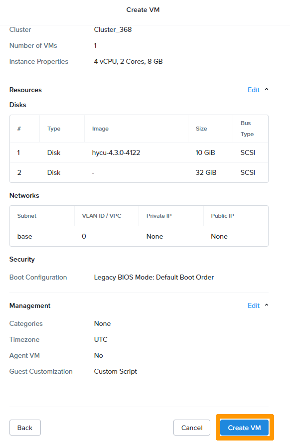{.thumbnail}

Select the virtual machine created by using the `checkbox`{.action} to the right of the virtual machine.

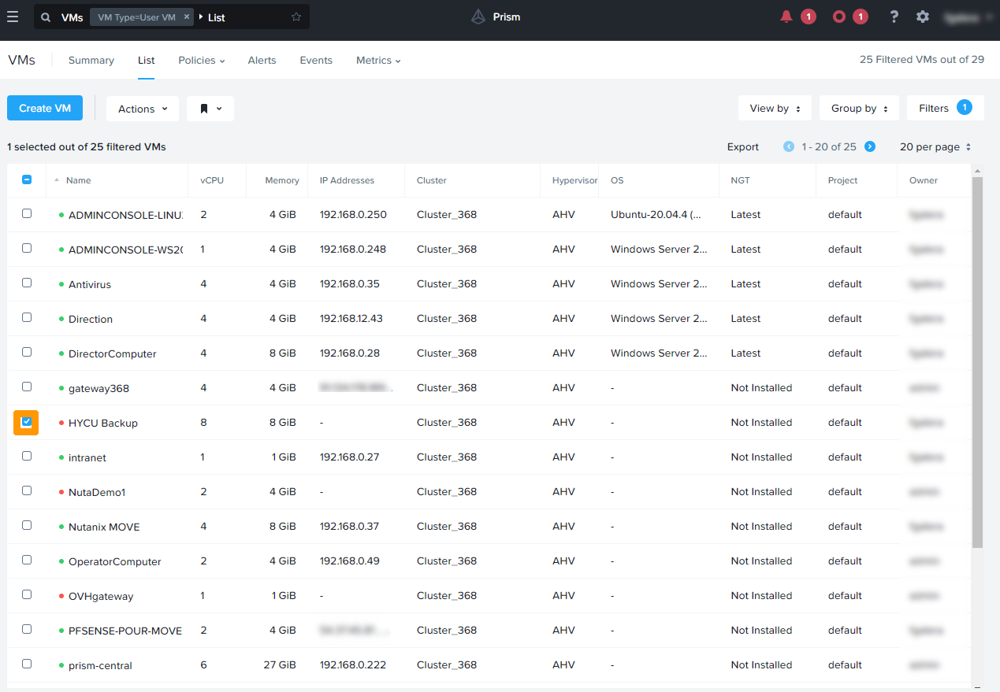{.thumbnail}

Click `Power On`{.action} in the `Actions` menu.

{.thumbnail}.

The virtual machine is started and has the IP address defined in **cloud-init**.

{.thumbnail}

#### Configuring HYCU URL redirection to public network

In this section, we will configure a redirection so that you can configure HYCU using the web interface from outside your cluster.

In the OVHcloud Control Panel, select `Bare Metal Cloud`{.action}, then click on your `Load Balancer`{.action} in the menu bar on the left-hand side.

In the `Server clusters`{.action} tab, click `Add a server cluster`{.action}.

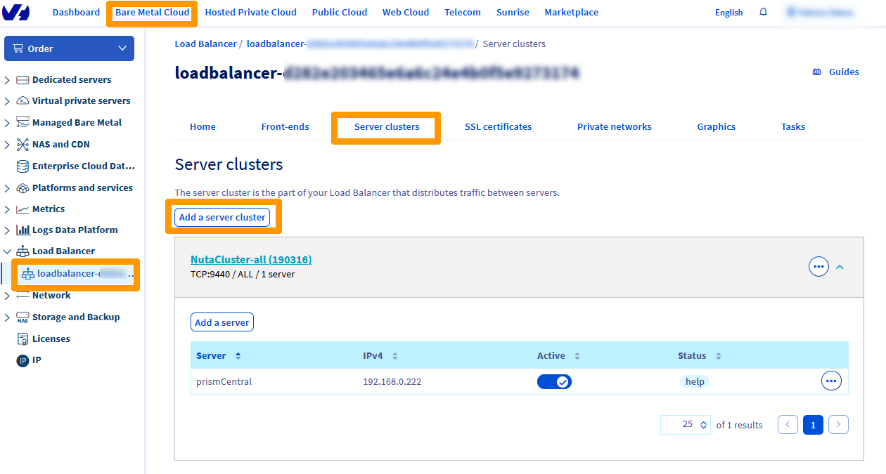{.thumbnail}

Name your server cluster, then select `TCP`{.action} and enter this information:

- **Port**: `8443`
- **Datacenter**: `ALL`
- **Private network**: `nutanix`

Click `Add`{.action} to confirm the server farm creation.

{.thumbnail}

Click `Add a server`{.action}.

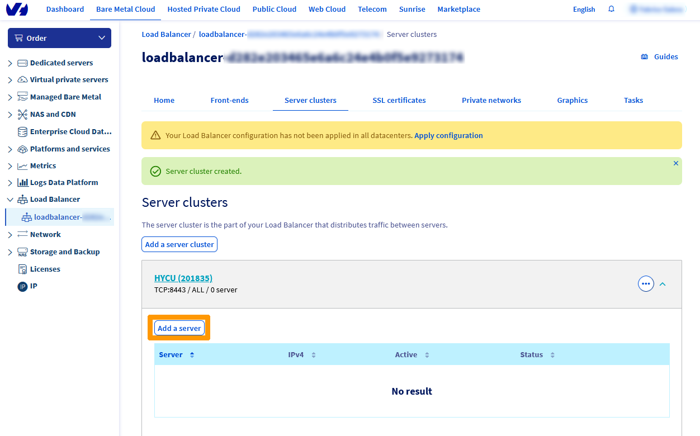{.thumbnail}

Enter these values:

- **Name (optional)**: `VM-HYCU`
- **IPv4** address: `ipaddresshycu`
- **Port**: `8443`

Click `Add`{.action} to confirm the cluster creation.

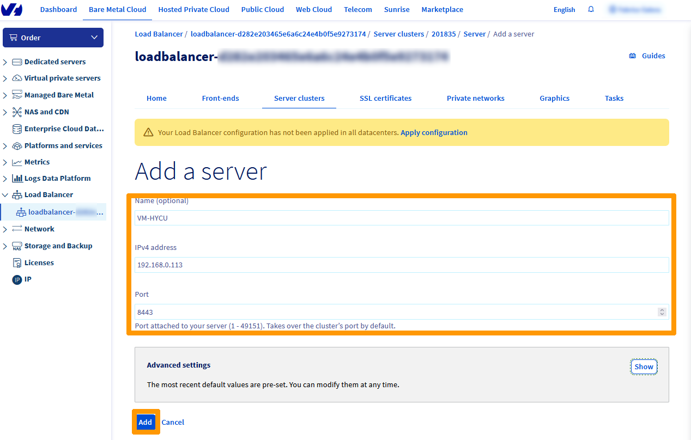{.thumbnail}

Next, click on the `Front-ends`{.action} tab, and `Add a front-end`{.action}.

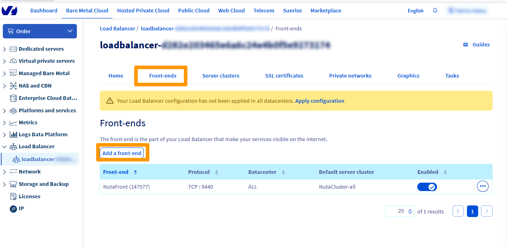{.thumbnail}

Name your front-end, choose the `TCP`{.action} protocol, and modify these values:

- **Port**: `8443`
- **Datacenter**: `ALL`
- **Default server cluster**: `HYCU (TCP)`

Click `Add`{.action}.

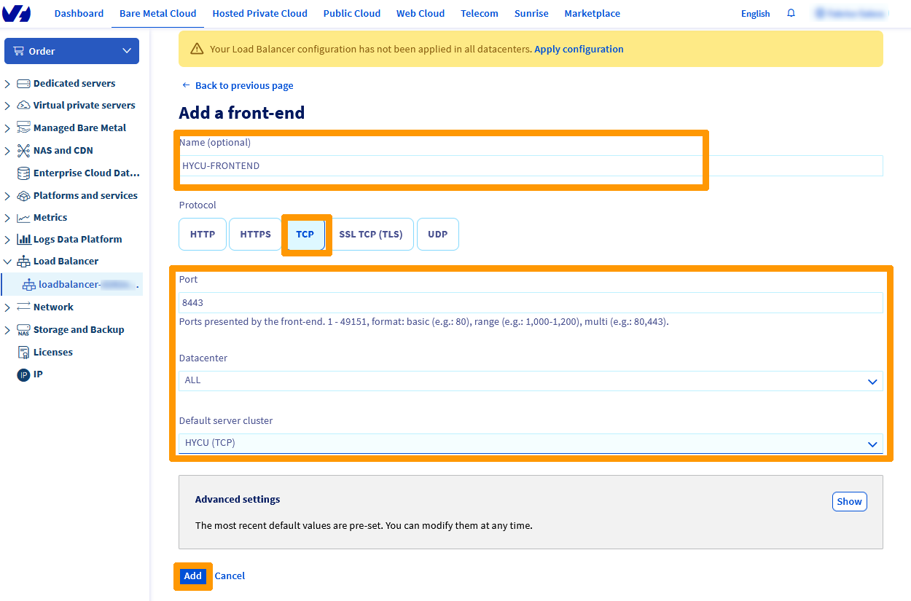{.thumbnail}

Click `Apply configuration`{.action}.

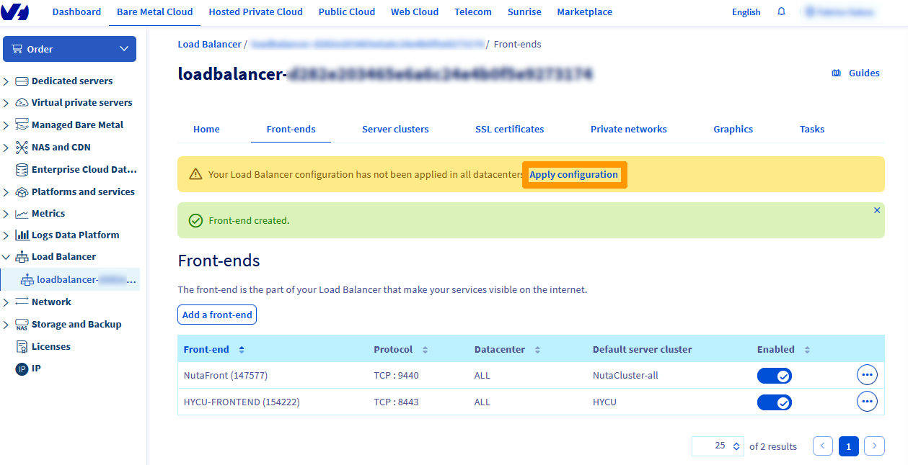{.thumbnail}

Select the `Datacenter`{.action} and click `Apply configuration`{.action}.

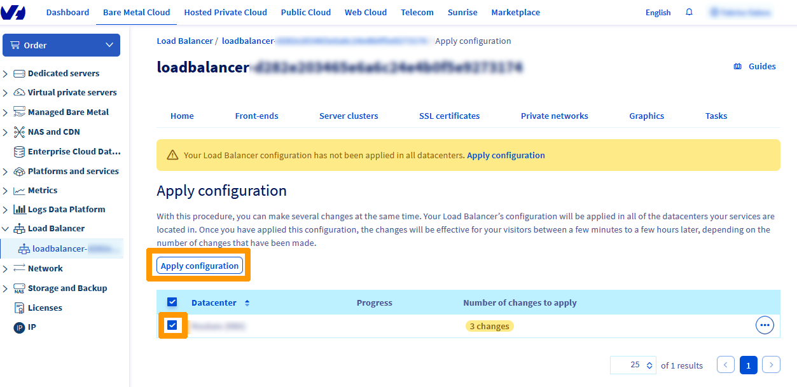{.thumbnail}

In the `Tasks`{.action} tab, you can track the progress of applying the changes.

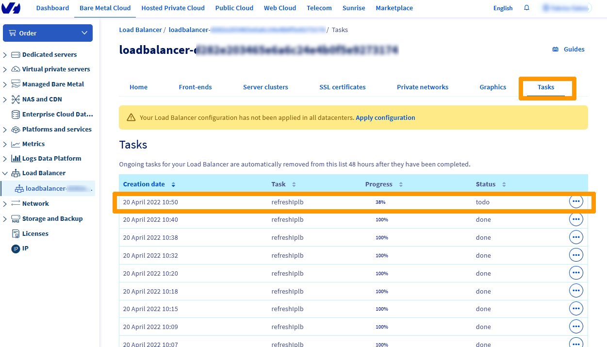{.thumbnail}

For more information on the OVHcloud Load Balancer, please refer to the [Go further](#gofurther) section of this guide. 

#### Configuring HYCU

Connect with a web browser to the HYCU administration interface, which should be similar to **https://nutanixfqdncluster:8443**. The `fqdn` variable corresponds to the URL provided when the Nutanix cluster was created.

Enter the default password and click `Sign In`{.action}.

{.thumbnail}

Change the login password for more security.

Click `Change Password`{.action} in the `admin`{.action} menu in the top right-hand corner of the interface.

{.thumbnail}

Enter the default password in the **OLD PASSWORD** field, the new password in the **PASSWORD** and **CONFIRM PASSWORD** fields.

Then click `Save`{.action}.

{.thumbnail}

We will now connect HYCU to the Nutanix cluster.

Click the `Administration`{.action} gear icon in the top right corner and choose `Sources`{.action}

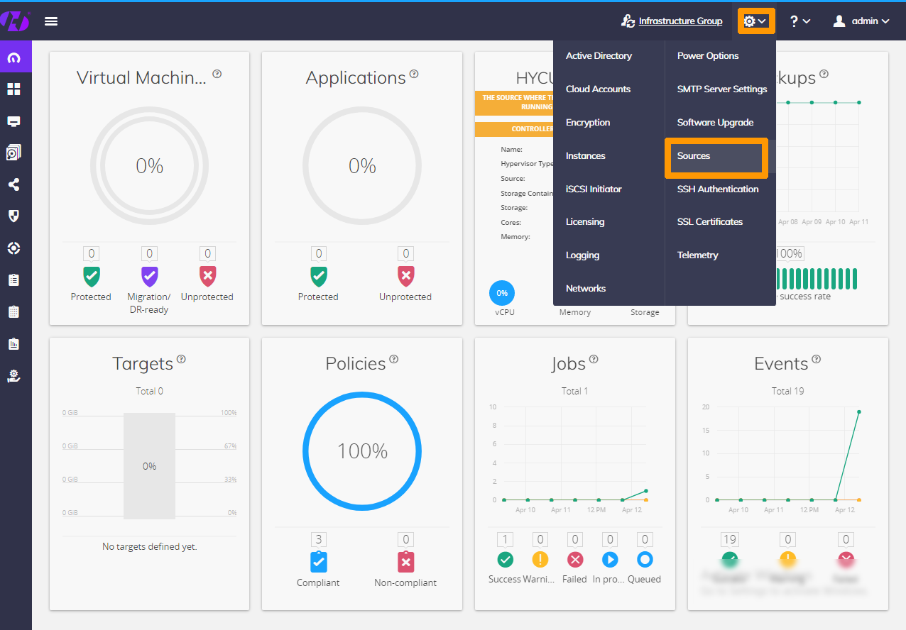{.thumbnail}

Enter information about **Prism Element**:

- **URL**: `https://url_prism_element_local:9440`
- **USERNAME**: `Prism Element user`
- **PASSWORD**: `Prism Element user password`

Click `Next`{.action}.

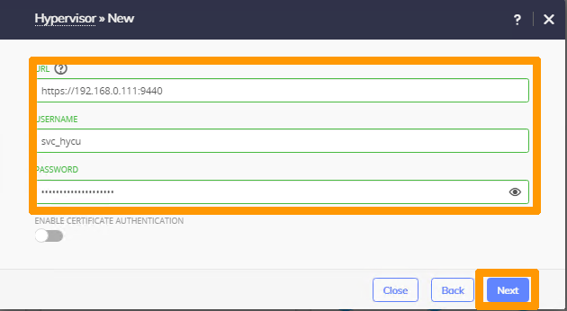{.thumbnail}

Enter this information about **Prism Central**:

- **URL**: `https://url_prism_central_local:9440`
- **USERNAME**: `Prism Central user`
- **PASSWORD**: `Prism Central password`

Click `Next`{.action}.

{.thumbnail}

The `VALIDATION SUCCESSFUL` information appears to indicate that the entered information is correct. Click `Save`{.action}.

{.thumbnail}

Click `Close`{.action}.

{.thumbnail}

Select `Targets`{.action} in the menu on the left and click `+ Add`{.action} in the top right of the interface.

{.thumbnail}

Enter the configuration settings and authentication keys for your S3 user with read/write access to the S3 bucket used as explained below:

- **name** Name
- **Size**: Storage size
- **Type**: `AWS S3/Compatible`

> [!warning]
> OVHcloud **High Performance Object Storage** service has no storage limits and is billed on a per-use basis.
> In the HYCU software configuration, it is necessary to set a size as in the example below. You can of course choose another value.
>

Enable `ENABLE COMPRESSION`{.action} and scroll down through the window. 

{.thumbnail}.

Complete the information:

- SERVICE ENDPOINT: `S3 Storage URL`
- BUCKET NAME: `Bucket name`
- ACCESS KEY ID: `S3 User Access Key`
- SECRET ACCESS KEY: `S3 User Secret Key`

Enable `TARGET ENCRYPTION`{.action} and click `Save`{.action}.

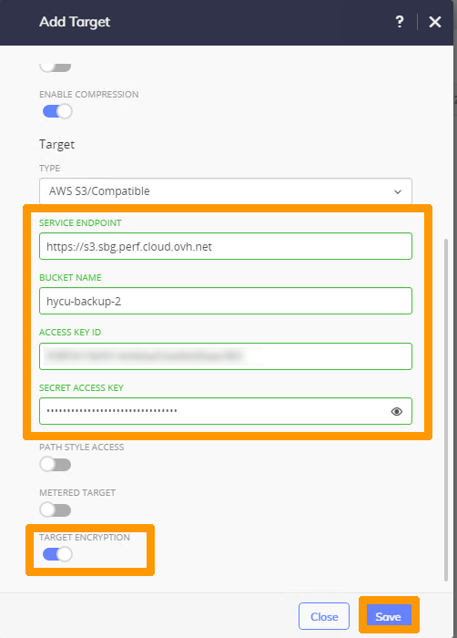{.thumbnail}.

The target is enabled for Nutanix cluster backups.

{.thumbnail}.

### Updating HYCU

HYCU regularly provides updates for which we detail the process below.

#### Adding sources for a new version of HYCU

From the **Prism Central** main menu, click `Images`{.action} from the `Compute & Storage`{.action} menu.

{.thumbnail}

Click `Add Image`{.action}.

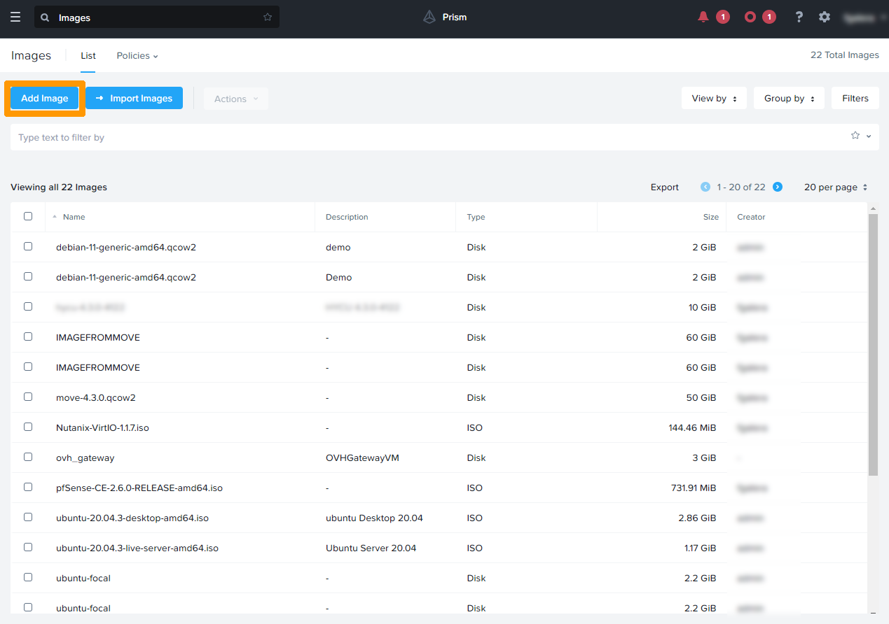{.thumbnail}

Select `URL`{.action}. 

Enter the URL for the qcow2 image of the latest version of HYCU, such as: 

- `https://download.hycu.com/ec/v4.X.X/hotfixes/4.X.X-XXXX/hycu-4.X.X-XXXX.qcow2`

> [!primary]
> 
> The URL used for the download is the latest version available on the HYCU website. 

Click `Upload file`{.action}.

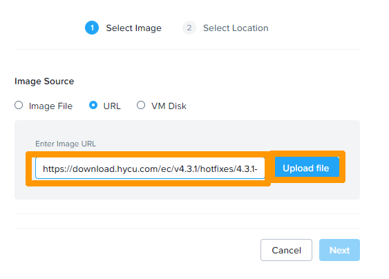{.thumbnail}

Remove the extension **.qcow2** behind the name `hycu-'4.X.X-XXXX`, enter a description and click `Next`{.action}.

> [!warning]
> It is important to remove the extension in the name to facilitate the HYCU update process.

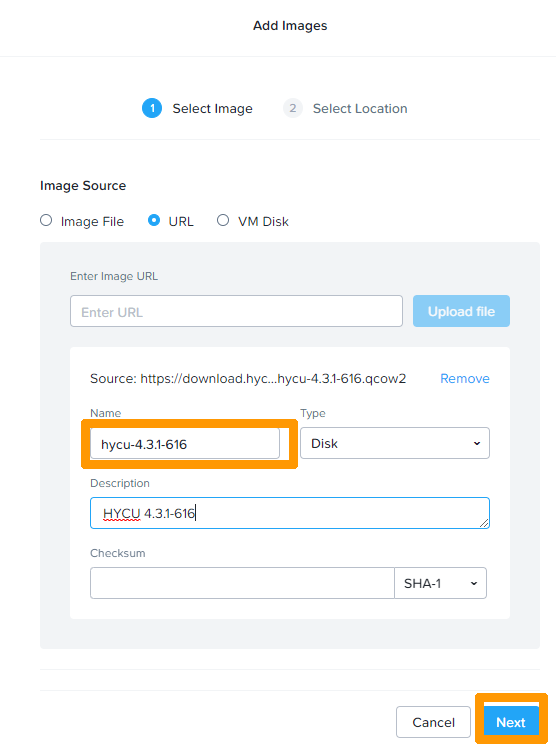{.thumbnail}

Click `Save`{.action} to import the image. 

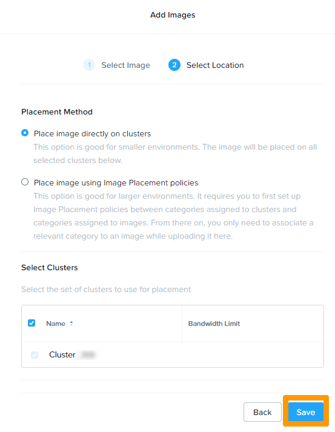{.thumbnail}

#### Runing the update from HYCU

Log in via the URL provided when you created the Nutanix cluster, replacing the port **https://fqdnclusternutanix:8443**.

Go to the HYCU configuration by clicking the `Administration`{.action} gear icon and choose `Power Options`{.action}.

{.thumbnail}
 
Select `Suspend All`{.action}, check `AUTO RESUME AFTER`{.action} and leave the **Hours** field at `1`{.action}, then click `Save`{.action}.

{.thumbnail}

Click `Software Upgrade`{.action} from the `Administration`{.action} gear menu. 

{.thumbnail}

Choose the latest version from the **AVAILABLE VERSIONS** drop-down menu and click `Software Upgrade`{.action}.

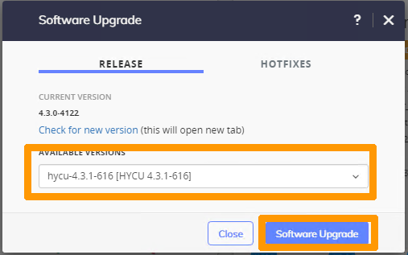{.thumbnail}

Click `Yes`{.action} to start the update process.

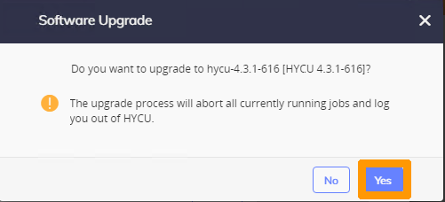{.thumbnail}

A backup copy is made during the update process so that it can be restored if there are any issues.

{.thumbnail}

Log in to the HYCU administration interface. 

Click the gear icon and click `Power Options`{.action}.

{.thumbnail}

Uncheck `Suspend All`{.action} and click `Save`{.action}.

{.thumbnail}

### Configuring backup in HYCU

#### Setting up VM login passwords

Virtual machine login passwords enable backup of applications such as a Microsoft SQL database or Exchange server.

Log in via the `Virtual Machines`{.action} menu on the left and click the key-shaped `Credentials`{.action} button at the top right of the interface.

{.thumbnail}

Click the `+`{.action} sign.

{.thumbnail}

Enter these values:

- **NAME**: password storage name
- **PROTOCOL**: `AUTOMATIC`
- **USERNAME**: virtual machine user account
- **PASSWORD**: password

Click `Save`{.action}.

{.thumbnail}

Click the `+`{.action} sign to add another account.

{.thumbnail}

Enter these values:

- **NAME**: password storage name
- **PROTOCOL**: `AUTOMATIC`
- **USERNAME**: virtual machine user account
- **PASSWORD**: password

Click `Save`{.action}.

{.thumbnail}

Click `Close`{.action}.

{.thumbnail}

Select the virtual machines that will use a password by ticking the box to the right of the virtual machine, then click the `credentials`{.action} key button.

{.thumbnail}

Select the password you want to use and click `Assign`{.action}.

{.thumbnail}

Select another virtual machine that will use a password by ticking the box to the right of the virtual machine, then click the `credentials`{.action} key button.

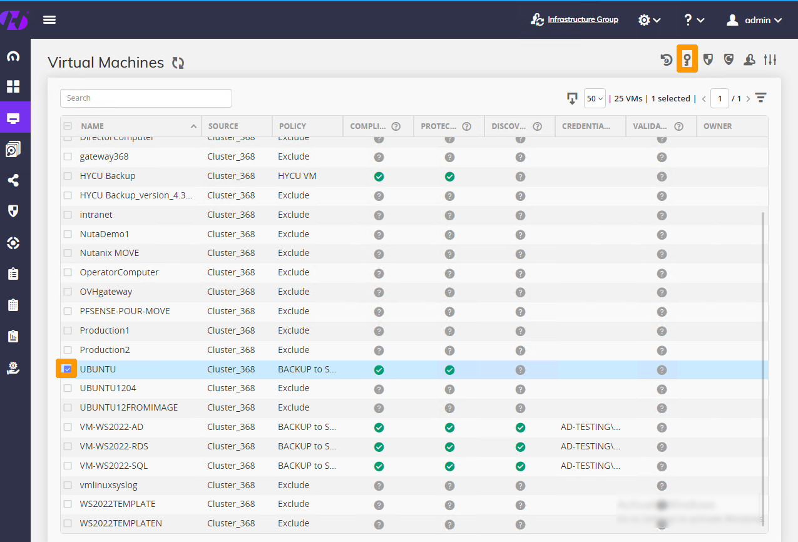{.thumbnail}

Select the password you want to use and click `Assign`{.action}.

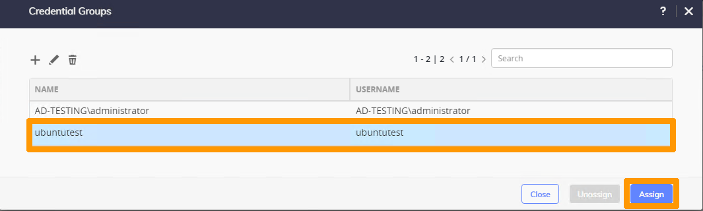{.thumbnail}

#### Creating backup policies

Go to the `policies`{.action} menu on the left and click the `+`{.action} button in the top right corner.

{.thumbnail}

Enter this information:

- **NAME**: `HYCU VM`
- **BACKUP EVERY**: `4 hours`
- **BACKUP THRESHOLD**: `42`

Leave the `BACKUP`{.action} option checked and use the scroll bar on the right.

{.thumbnail}

Click `Save`{.action}.

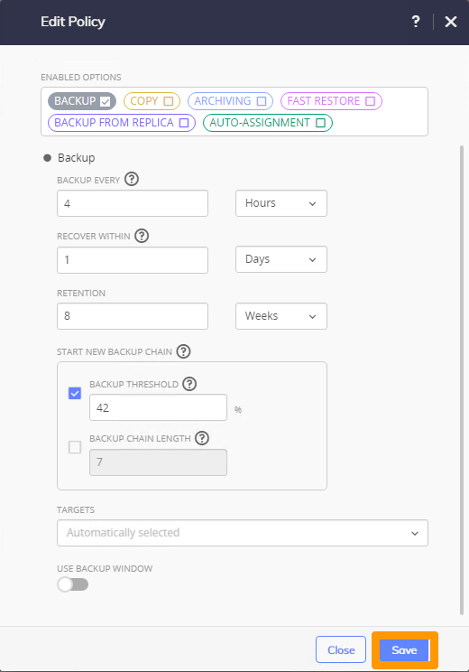{.thumbnail}

This policy is created for the HYCU virtual machine. 

In the `policies` menu, click the `+`{.action} button in the top right corner.

{.thumbnail}

Set the policy name `BACKUP to S3 OVHcloud and local SNAPSHOTS`{.action} in the **NAME** field.

Check the `FAST RESTORE`{.action} option, leave the `BACKUP`{.action} option checked.

Change the backup options in **Backup** and change the **BACKUP THREESHOLD** value to `25`{.action}. Then scroll down the page.

{.thumbnail}

Edit the **Fast restore** option with your settings and click `Save`{.action}.

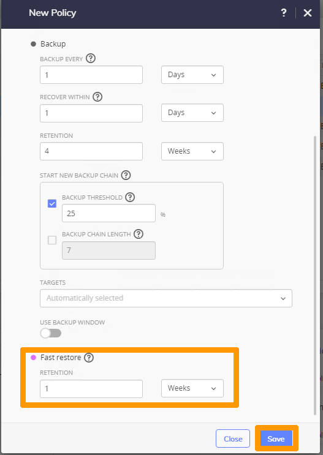{.thumbnail}

This strategy makes a backup on OVHcloud S3 storage and also takes **snapshots** inside the Nutanix cluster, allowing for faster recovery.

#### Assigning backup policies

Select all VMs via the check box next to **NAME**, then click the shield-shaped `Policies`{.action} button in the top right to assign a policy to all VMs.

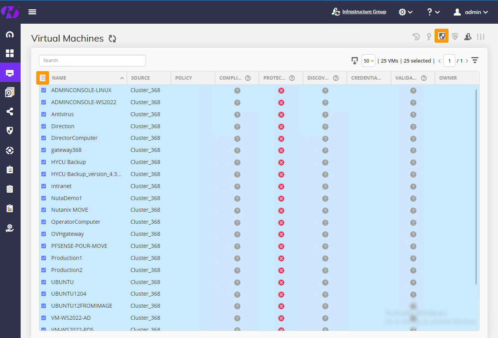{.thumbnail}

Choose the `Exclude`{.action} policy and click `Assign`{.action}.

{.thumbnail}

Select the HYCU virtual machine by selecting the check box next to it, then click the `Policies`{.action} button to assign a policy to this virtual machine.

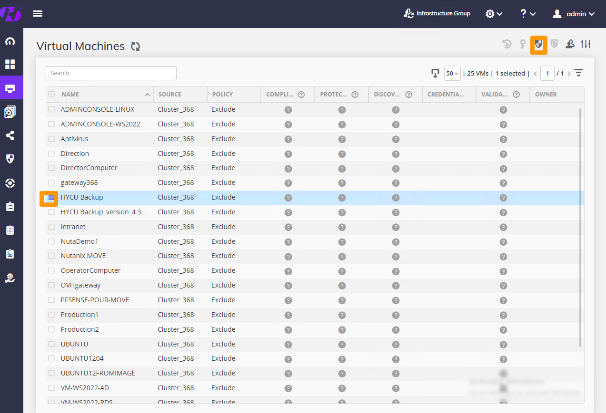{.thumbnail}

Choose the `HYCU VM`{.action} policy and click `Assign`{.action}.

{.thumbnail}

Select four virtual machines and click the `Policies`{.action} button to assign a policy.

{.thumbnail}

Choose the `BACKUP to S3 OVHcloud and local SNAPSHOTS`{.action} policy and click `Assign`{.action}.

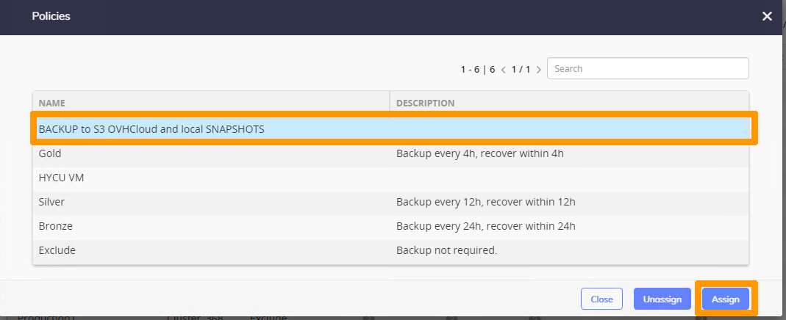{.thumbnail}

### Monitoring backup status

Go to the `Dashboard`{.action} menu on the left to view the dashboard and view the backup status.

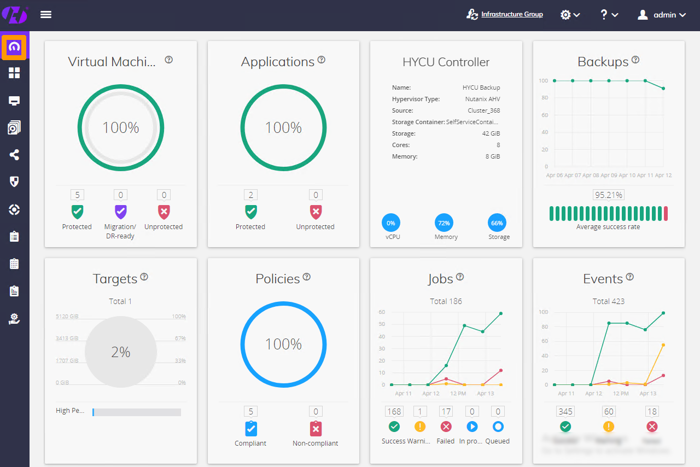{.thumbnail}

Open the `Jobs`{.action} menu on the left to view the job status.

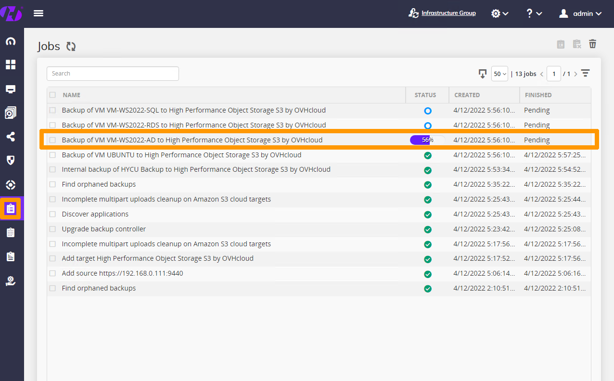{.thumbnail}

### Restoring from HYCU

Use the `Virtual Machines`{.action} menu and click a backed up virtual machine.

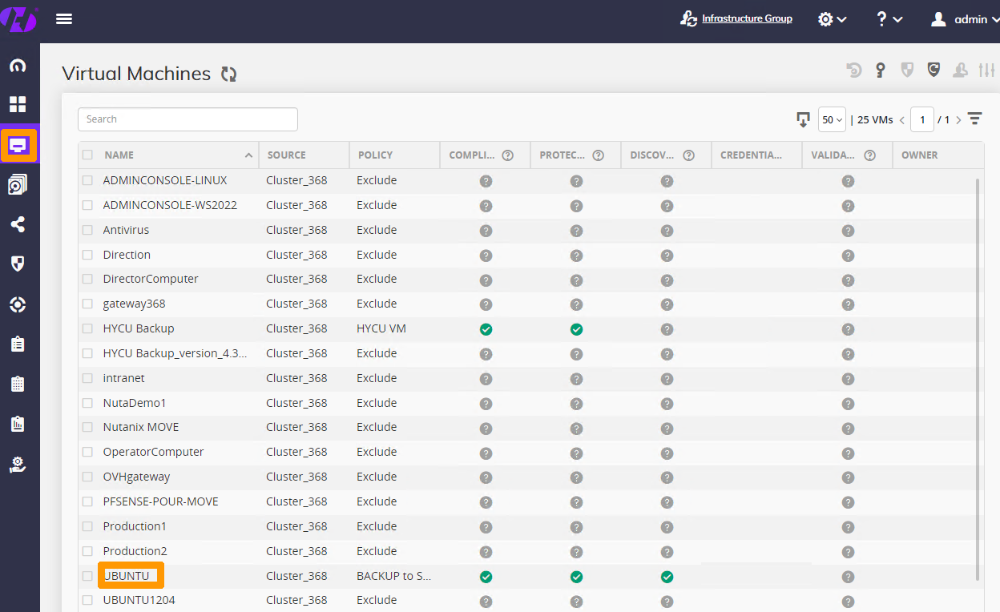{.thumbnail}

#### Restoring a virtual machine

Click the `Restore VM`{.action} button in the bottom right-hand corner.

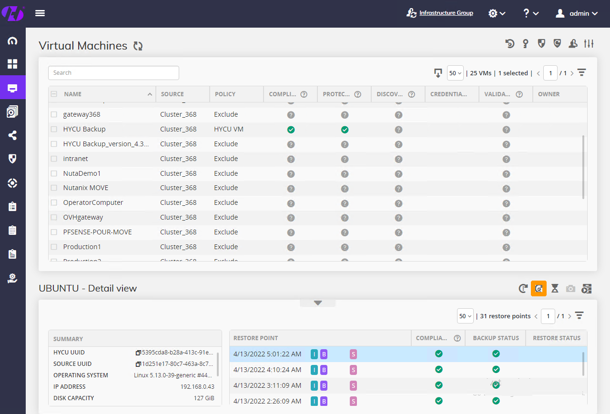{.thumbnail}

Select `Restore VM`{.action} and click `Next`{.action}.

{.thumbnail}

Leave the default options and click `Restore`{.action}.

{.thumbnail}

The virtual machine is fully restored. 

#### Retrieving a file

Click the `Restore files`{.action} button in the bottom right-hand corner.

{.thumbnail}

Leave `AUTOMATIC`{.action} in the **RESTORE FROM** drop-down menu and click `Next`{.action}.

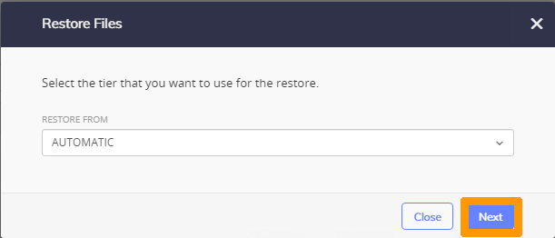{.thumbnail}

Select the file to restore and click `Next`{.action}.

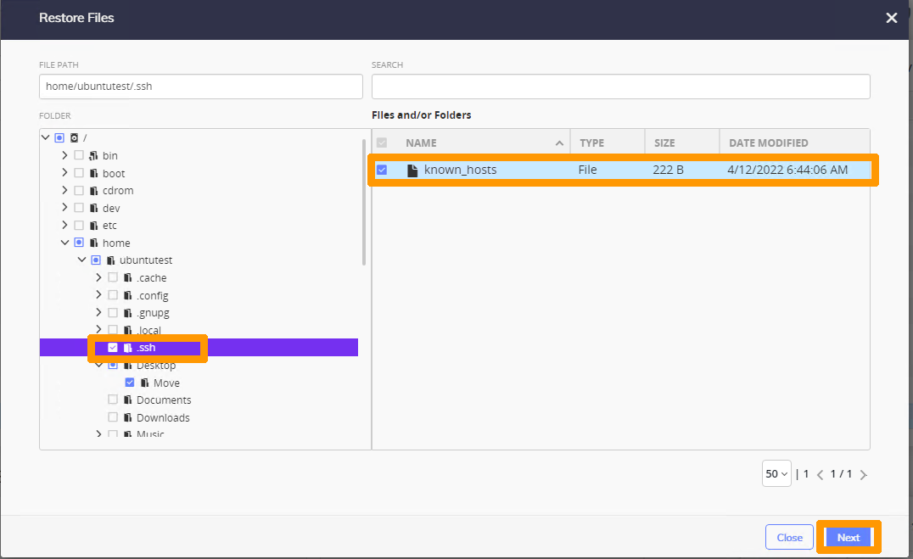{.thumbnail}

Leave the default options and click `Next`{.action}.

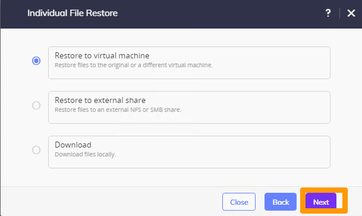{.thumbnail}

Choose `Rename restored`{.action} and click `Restore`{.action}.

{.thumbnail}

The restored file is located inside the virtual machine with a new name so as not to delete the old file.

#### Restoring an application 

Click the `Applications`{.action} menu and then choose an application to restore by clicking an application below **Name**.

{.thumbnail}

Click the `Restore`{.action} button in the bottom right-hand corner.

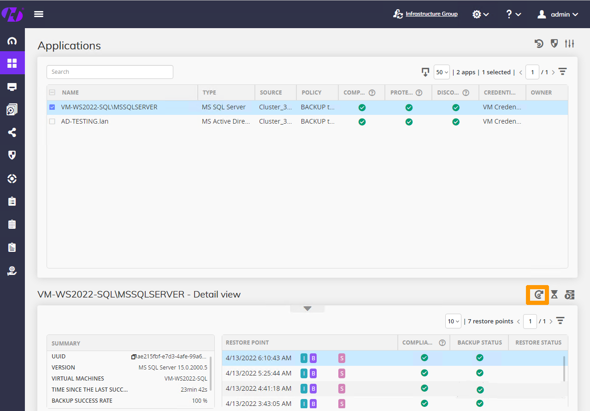{.thumbnail}

Select `Restore Databases`{.action} and click `Next`{.action}.

{.thumbnail}

Choose a database and click `Next`{.action}.

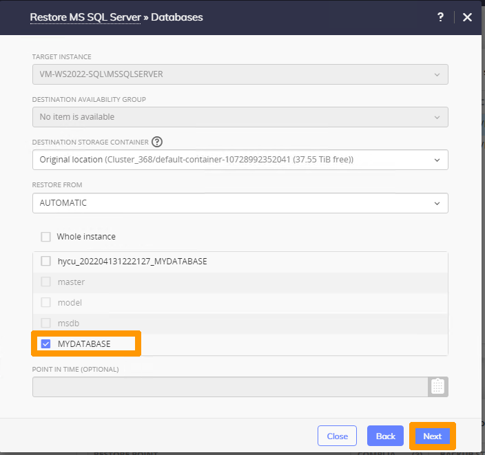{.thumbnail}

Disable `OVERWRITE EXISTING DATABASES`{.action} and click `Restore`{.action}.

{.thumbnail}

The database is restored into a new database.

## Go further <a name="gofurther"></a>

[Nutanix Hyper-Convergence](https://docs.ovh.com/us/es/nutanix/nutanix-hci/)

[HYCU Home Page](https://www.hycu.com/)

[HYCU documentation](https://support.hycu.com/hc/en-us/sections/115001018365-Product-documentation)

[OVHcloud Load Balancer documentation](https://docs.ovh.com/gb/en/load-balancer/)

[Our OVHcloud Object Storage solutions](https://www.ovhcloud.com/es/public-cloud/object-storage/)

Join our community of users on <https://community.ovh.com/en/>.
