**Dernière mise à jour le 04/05/2022**

## Objectif


Veeam backup for Nutanix est un logiciel de sauvegarde disponible pour Nutanix. 

**Apprenez à installer, configurer et utiliser VEEAM sur un cluster Nutanix sur un dossier partagé**

> [!warning]
> OVHcloud vous met à disposition des services dont la configuration, la gestion et la responsabilité vous incombent. Il vous appartient donc de ce fait d’en assurer le bon fonctionnement.
>
> Ce guide a pour but de vous accompagner au mieux sur des tâches courantes. Néanmoins, nous vous recommandons de faire appel à un prestataire spécialisé si vous éprouvez des difficultés ou des doutes concernant l’administration, l’utilisation ou la mise en place d’un service sur un serveur.
>


## Prérequis

- Disposer d'un cluster Nutanix dans votre compte OVHcloud
- Être connecté à votre [espace client OVHcloud](https://www.ovh.com/auth/?action=gotomanager&from=https://www.ovh.com/fr/&ovhSubsidiary=fr).
- Être connecté sur le cluster via Prism Central. 
- D'avoir installé VEEAM Backup et Replication sur une machine virtuelle de votre cluster Nutanix avec cette procédure [Installer Veeam Backup & Replication](https://docs.ovh.com/fr/storage/veeam-backup-replication/)
- d'avoir 4 Go de mémoires vive, 60 Go de stockage et 4 vCPU pour une machine virtuelle supplémentaire nécessaire au bon fonctionnement des sauvegardes d'un cluster Nutanix avec le logiciel **Veeam Backup**


## En pratique

Nous allons personnaliser VEEAM Backup & Replication pour l'utilisation sur un cluster Nutanix avec une sauvegarde distante de type **NAS** en **SMB**. 

### Ajouter un utilisateur dans **Prism Element pour Veeam Backup**

IL faut tout d'abord créer un utilisateur spécifique dans Prism Element pour l'utilisation de Veeam Backup.

Au travers de **Prism central** connectez-vous sur **Prism Element** en cliquant sous **Cluster Quick Access** sur le cluster.

{.thumbnail}

A partir de **Prism Element** allez dans les paramètres en cliquant sur l'icone representant un `engrenage`{.action} en haut à droite.

{.thumbnail}

Déroulez le menu à gauche à l'aide de la `barre de défilement`{.action}.

{.thumbnail}

Cliquez sur `Local User Management`{.action}.

{.thumbnail}

Cliquez sur le bouton `New User`{.action}.

{.thumbnail}


Saisissez ces informations :

- **Username** : `svc_veeam`
- **First Name** : `Veeam`
- **Last Name** : `Backup`
- **Email** : `veeam@example.com`
- **Password** : `mot de passe`

> [!primary]
> Ces données sont fournies à titre d'exemple, l'adresse de messagerie est obligatoire mais n'est pas utilisée.

Cochez la case `Cluster Admin`{.action} et cliquez sur `Save`{.action}

{.thumbnail}

Ce compte utilisateur est créé et il est  dans la liste des utilisateurs de **Prism Element**.

{.thumbnail}

### Télécharger et installer l'extension pour un cluster **Nutanix**

Connectez-vous sur la machine virtuelle où se trouve VEEAM Backup.

A partir d'un navigateur Web Télécharger la dernière version de l'extension sur ce lien [Extension AHV pour VEEAM](https://www.veeam.com/availability-nutanix-ahv-download.html), Si vous n'avez pas un compte utilisateur sur le site de **Veeam** il faudra le créer, ce compte est gratuit.

Lancez l'installation de l'extension.

> [!warning]
> Avant de lancer d'exécuter l'installation bien s'assurer que la console VEEAM BACKUP ne soit pas lancée.
>
>


Double-cliquez sur l'installateur `NutanixAHPlugin_...`{.action}

{.thumbnail}

Acceptez les conditions générales d'utilisation du logiciel en sélectionnant `I accept the terms of the Veeam license agreement`{.action} et `I accept the terms of the 3rd party components license agreements`{.action} ensuite cliquez sur `Next`{.action}.

{.thumbnail}

Cliquez sur `Next`{.action}.

{.thumbnail}

Cliquez sur `Install`{.action}.

{.thumbnail}

Patientez pendant l'installation.

{.thumbnail}

Cliquez sur `Finish`{.action}.

{.thumbnail}

### Intégrer le cluster Nutanix dans la configuration de **Veeam Backup**

Lors de La configuration de Veeam Backup pour Nutanix, une nouvelle machine virtuelle est ajoutée dans le cluster, elle sert d'interface entre le logiciel de sauvegarde **Veeam Backup** et le cluster.

Lancez la console **Veeam Backup** et cliquez sur `Connect`{.action}.

{.thumbnail}

Positionnez-vous dans `Backup Infrastucture`{.action} dans le menu en bas à droite, choisissez `Managed Servers`{.action} et cliquez sur `Add Server`{.action}.

{.thumbnail}

Cliquez sur `Nutanix AHV`{.action}.

{.thumbnail}

Saisissez `l'adresse IP privée`{.action} de **Prism Element** dans **DNS name or IP address** et cliquez sur `Next`{.action}.

{.thumbnail}

Cliquez sur `Add`{.action} pour ajouter le compte utilisateur de **Prism Element**

{.thumbnail}

Saisissez ces informations avec le compte créé précedemment dans Prism Element :

- **Username** : `svc_veeam`{.action}
- **Password** ! `Mot de passe`{.action}

Cliquez sur `OK`{.action}.

{.thumbnail}

Vérifiez dans **Credentials** que le compte créé soit sélectionné et cliquez sur `Next`{.action}.

{.thumbnail}

Cliquez sur `Continue`{.action} pour valider le message d'avertissement concernant le certificat.

{.thumbnail}

Cochez `Use the following IP address`{.action} et choisissez une adresse IP privé non utilisée (cette adresse sert au moment des sauvegardes et des restaurations de fichiers) , ensuite cliquez sur `Next`{.action}.

{.thumbnail}

Cliquez sur `Next`{.action}.

{.thumbnail}

Cliquez sur `Finish`{.action}.

{.thumbnail}

Cliquez sur `Yes`{.action}.

{.thumbnail}

Selectionnez `Deploy a new proxy`{.action} et cliquez sur `Next`{.action} 

{.thumbnail}

Choisissez un `Nom`{.action} dans **Name** et cliquez sur `Next`{.action} 

{.thumbnail}

Cliquez sur `Configure`{.action} 

{.thumbnail}

Choisissez `une adresse IP`{.action} non utilisée sur le réseau local pour la machine virtuelle et cliquez sur `Ok`{.action} 

{.thumbnail}

Cliquez sur `Next`{.action} 

{.thumbnail}

Cliquez sur `Add`{.action} pour ajouter et créer le compte de connexion à la machine virtuelle spécifique à Veeam.

> [!warning]
> Notez bien le compte utilisateur créé ainsi que le mot de passe il pourra servir pour se connecter sur la nouvelle machine virtuelle
> au travers du navigateur WEB.

{.thumbnail}

Saisissez ces informations avec le compte crée précèdemment dans Prism Element :

- **Username** : `proxy_user`{.action}
- **Password** : `Mot de passe`{.action}

Cliquez sur `OK`{.action}.

{.thumbnail}

Vérifiez le compte utilisateurs dans **Credentials** et cliquez sur `Next`{.action}.

{.thumbnail}

Sélectionnez la case à cocher `Allow access to all backup repositories`{.action} et cliquez sur `Next`{.action}.

{.thumbnail}

Patientez quelques minutes.

{.thumbnail}

L'installation est terminée avec un Warning, n'en tenez pas compte c'est à cause du DNS qui n'arrive pas à résoudre le nom du serveur Veeam. Cliquez sur `Next`{.action}.

{.thumbnail}

#### Modification du fichier host de la machine virtuelle d'interface.

> [!primary]
> 
> Cette opération est nécessaire si vous n'utilisez pas de serveur DNS en interne qui fait la résolution des nom d'ordinateurs
> Notamment celui qui sert pour le logiciel Veeam Backup. 

Au travers de Prism Central connectez vous à la machine virtuelle NUTANIX-PROXY. 

Cliquez en haut à gauche sur `icône`{.action} du menu principal et choisissez `VMs`{.action}.

{.thumbnail}


Cliquez sur la machine virtuelle NUTANIX-PROXY. 

{.thumbnail}

cliquez sur `Launch console`{.action}.

{.thumbnail}

Connectez vous avec le compte utilisateur créé précedemment et le mot de passe de ce compte.

{.thumbnail}

A partir de la console modifier le ficher **/etc/hosts**

```bash
proxy_user@NUTANIX-PROXY~$sudo nano /etc/hosts
[sudo] password for proxy_user:
```
Ajoutez  cette information qui est l'adresse IP et le nom de la machine virtuelle ou est installée Veeam Backup.

```bash
192.168.0.245 VEEAM-BACKUP 
```

Enregistrez le fichier et lancez cette commande
```bash
proxy_user@NUTANIX-PROXY~$sudo /etc/init.d/networking restart
[sudo] password for proxy_user:
```
### Ajouter un dépot pour les sauvegardes

Nous allons rajouter un stockage SMB qui se trouve sur un site distant accessible au travers d'un VPN.

Au travers de l'interface Veeam Backup cliquez en bas à droite sur `Backup Infrastructure`{.action}, choisissez `Backup Repositories`{.action} et cliquez sur `Add repository`{.action}. 

{.thumbnail}

Choisissez `Network attached storage`{.action}. 

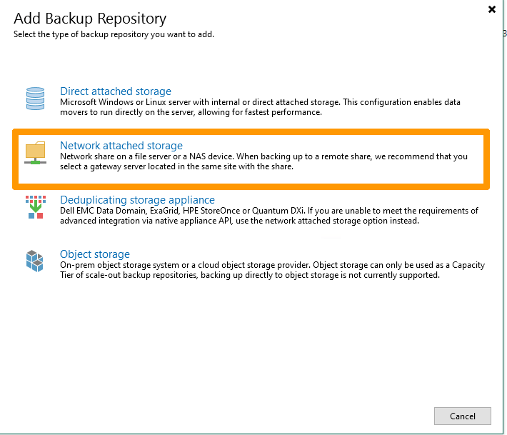{.thumbnail}

CLiquez sur `SMB share`{.action}. 

{.thumbnail}

Saisissez le `nom du dépot`{.action} dans la zone de saisie **Name** et cliquez sur `Next`{.action}. 

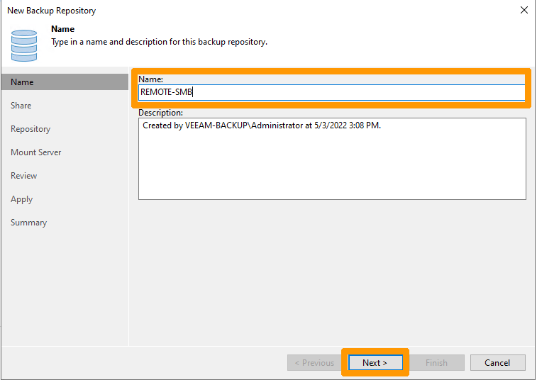{.thumbnail}

Ecrivez le `nom UNC`{.action} du partage dans **Shared folder** cochez la case `This share requires access credentials`{.action} et cliquez sur `Add`{.action}. 

{.thumbnail}

Saisir le nom d'utilisateur dans `Username`{.action} ainsi que son mot de passe dans `Password`{.action} et cliquez sur `OK`{.action}

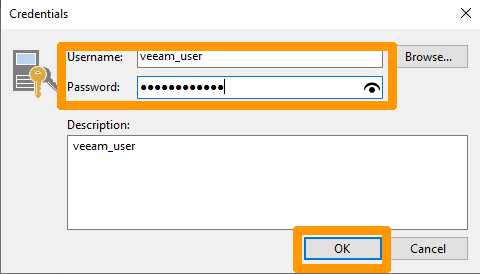{.thumbnail}

Vérifiez que l'utilisateur apparraisse bien et cliquez sur `Next`{.action}

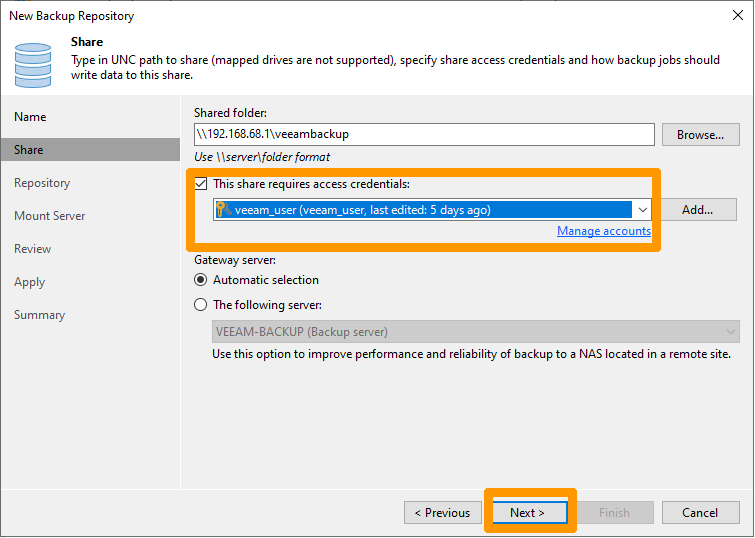{.thumbnail}

Cliquez sur `Next`{.action}

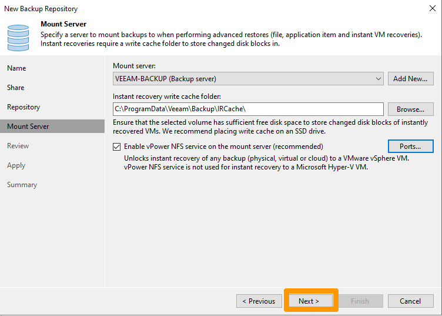{.thumbnail}

Cliquez sur `Apply`{.action}

{.thumbnail}

Cliquez sur `Next`{.action}

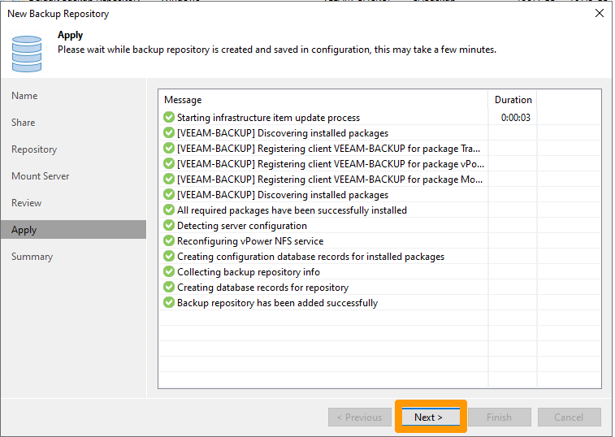{.thumbnail}

Cliquez sur `Finish`{.action}

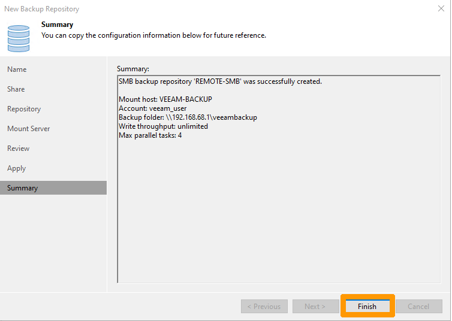{.thumbnail}

Cliquez sur `No`{.action}

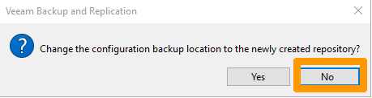{.thumbnail}

Le nouveau dépot apparait et est utilisable pour des sauvegardes

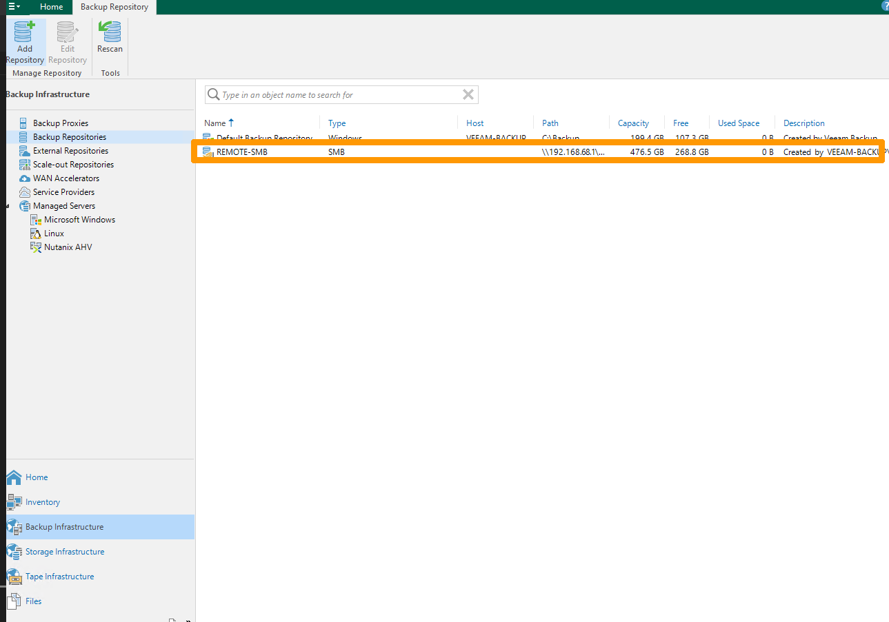{.thumbnail}

### Mise en place d'une sauvegarde

Nous allons créer une tâche de sauvegarde automatisée.

Dans Veeam backup cliquez en bas sur `No`{.action} , ensuite ouvrez le menu `Backup Job`{.action} et choisissez `Nutanix AHV`{.action}

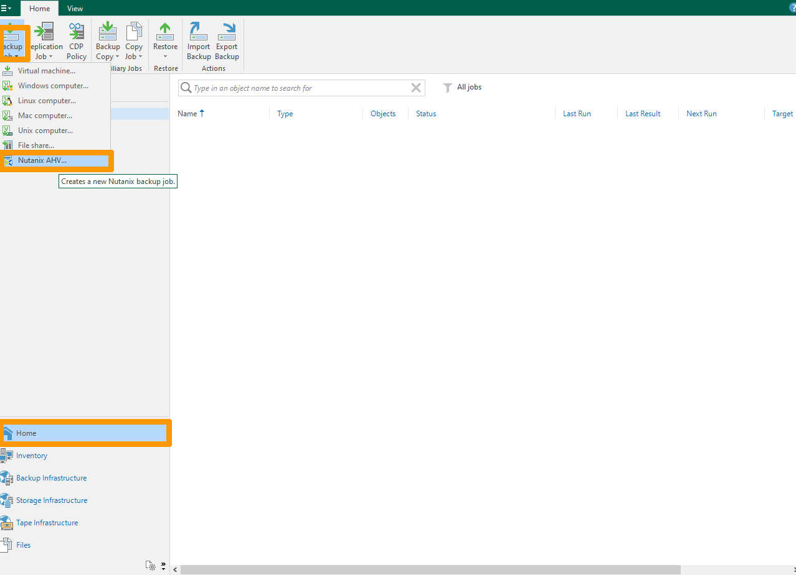{.thumbnail}

Saississez un nom dans `Name`{.action} et cochez l'option `Backup job`{.action} ensuite cliquez sur `Next`{.action}

{.thumbnail}

Cliquez sur le bouton  `Add`{.action}

{.thumbnail}

Sélectionnez les machines virtuelles que vous voulez sauvegarder en utilisant la  `case à cocher`{.action} à gauche des machines virtuelles que vous voulez sauvegarder.

{.thumbnail}

Cliquez sur `Next`{.action}

{.thumbnail}

Sélectionnez le dépot dans  `Backup repository`{.action} et cliquez sur `Next`{.action}

{.thumbnail}

Cochez la case `Run the job automatically`{.action}, choisissez l'heure de sauvegarde et cliquez sur `Next`{.action}

{.thumbnail}

Cliquez sur `Finish`{.action} pour finir la création de la tâche de sauvegarde.

{.thumbnail}

### Restauration d'un ordinateur virtuel

Pour tester le bon fonctionnement des sauvegardes nous allons créer une tâche de restauration

Se positionner dans le menu en bas sur `Home`{.action} choisissez dans le bandeau du haut `Restore`{.action} et prenez `Nutanix AHV`{.action}.

{.thumbnail}

Cliquez sur `Restore from AHV backup`{.action}.

{.thumbnail}

Cliquez sur `Entire VM restore`{.action}.

{.thumbnail}

Cliquez sur `Add`{.action}.

{.thumbnail}

Faites défiler et sélectionnez une `machine virtuelle`{.action} et cliquez sur `Add`{.action}.

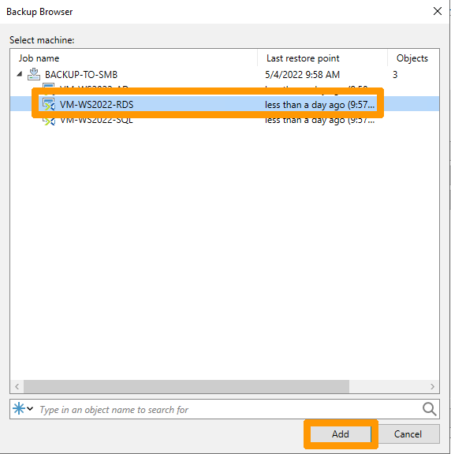{.thumbnail}

Cliquez sur `Next`{.action}.

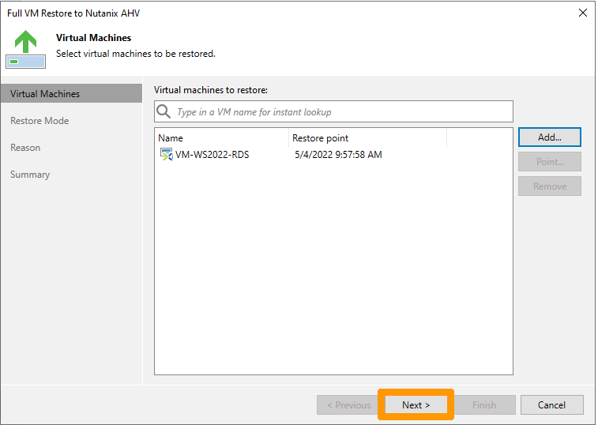{.thumbnail}

Choisissez l'option `restore to a new location or with different settings`{.action} et cliquez sur `Next`{.action}.

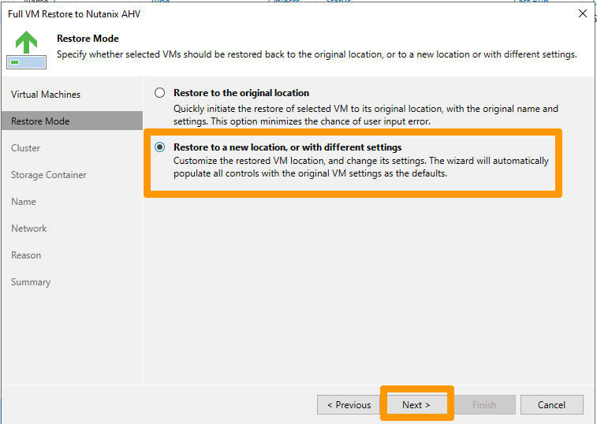{.thumbnail}

Cliquez sur `Next`{.action}.

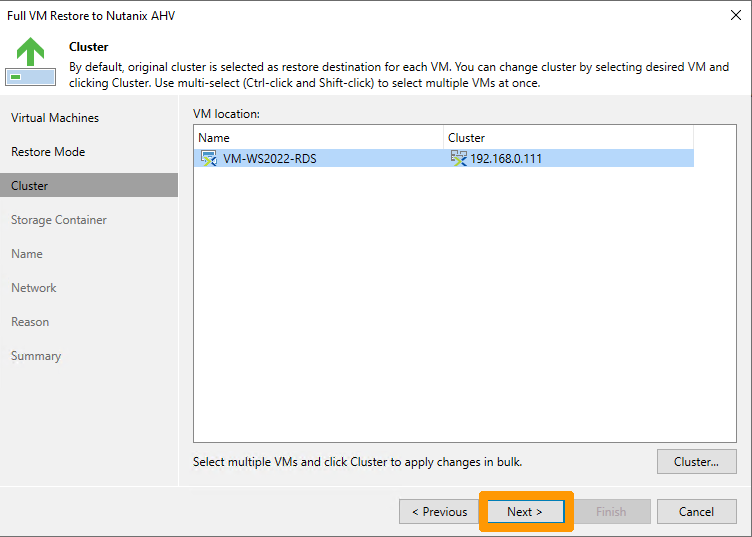{.thumbnail}

Cliquez sur `Next`{.action}.

{.thumbnail}

Renommez la VM dans `New name`{.action} et cliquez sur `Next`{.action}.

{.thumbnail}

Cliquez sur `Disconnect`{.action} pour isoler la machine virtuelle restaurée du réseau.

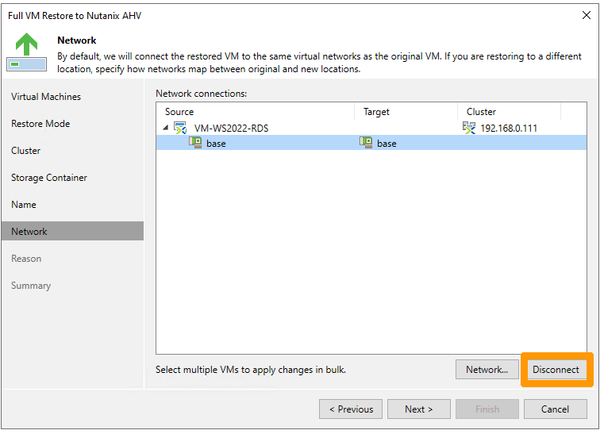{.thumbnail}

Cliquez sur `Next`{.action}.

{.thumbnail}

Cliquez sur `Next`{.action}.

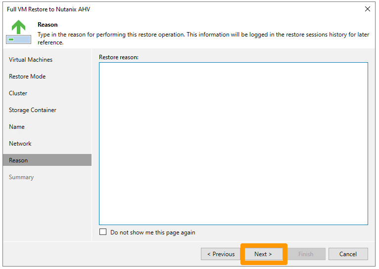{.thumbnail}

Cliquez sur `Finish`{.action}.

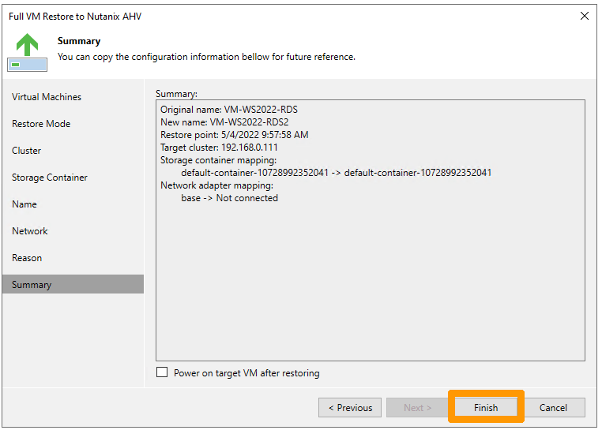{.thumbnail}

Un apercu de l'état de la restauration se lance, il faut patienter le temps de la restauration.

{.thumbnail}


## Aller plus loin <a name="gofurther"></a>

[Documentation VEEAM concernant l'installation de VEEAM Backup](https://helpcenter.veeam.com/docs/van/userguide/installing.html?ver=30)

Échangez avec notre communauté d'utilisateurs sur <https://community.ovh.com/>.

