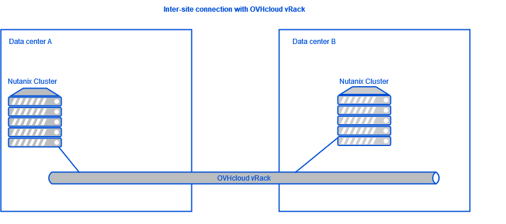
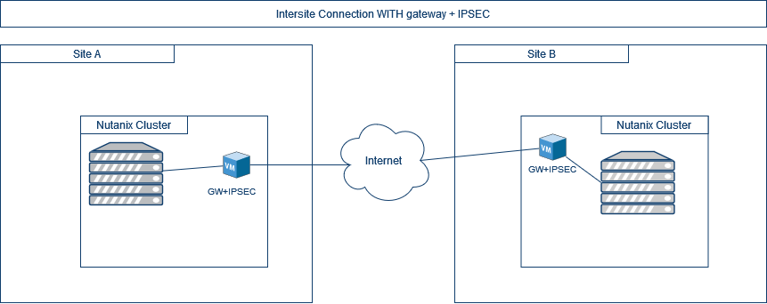

**Dernière mise à jour le 10/05/2022**

## Objectif

Présenter les possibilités offertes avec des clusters Nutanix installés dans les infrastructures d'OVHcloud pour la mise en place de divers plans de reprise d'activités.

> [!warning]
> OVHcloud vous met à disposition des services dont la configuration, la gestion et la responsabilité vous incombent. Il vous appartient donc de ce fait d’en assurer le bon fonctionnement.
>
> Ce guide a pour but de vous accompagner au mieux sur des tâches courantes. Néanmoins, nous vous recommandons de faire appel à un prestataire spécialisé si vous éprouvez des difficultés ou des doutes concernant l’administration, l’utilisation ou la mise en place d’un service sur un serveur.
>

## Prérequis

- Disposer de plusieurs clusters Nutanix avec ces deux options
    + Plusieurs clusters Nutanix sur des sites physiquement différents chez OVHcloud
    + Un cluster sur site et un cluster chez OVHcloud
- Être connecté à votre [espace client OVHcloud](https://www.ovh.com/auth/?action=gotomanager&from=https://www.ovh.com/fr/&ovhSubsidiary=fr)
- Être connecté sur vos cluster via Prism Central.
- Avoir les deux clusters sur deux sites distants physiquement.
- Avoir une interconnexion de type vRack ou VPN IPSEC entre les deux clusters.

## Présentation des diverses solutions

### Solutions d'interconnexions 

Il est important de bien choisir l'interconnexion des sites distants dans le cas d'un plan de reprise d'activité. mais ce qui est essentiel c'est que les deux clusters soit entierements visibles entre eux sur chacun de leurs réseaux privés pour cela il est possible d'utiliser diverses technologies que voici :

* Connexion des divers sites en utilisant chaque le même vRACK sur les tous les sites, pour plus d'information concernant la solution vRack d'OVHCloud allez sur ce site site [Solution vRack d'OVHcloud](https://www.ovh.com/fr/solutions/vrack/) 

{.thumbnail}

* Mise en place d'un VPN IPSEC entre les deux clusters Nutanix en utilisant une machine virtuelle.

{.thumbnail}

### Solutions Nutanix pour la mise en place d'un plan de reprise d'activité

Certaines solutions sont disponibles avec **Prism Element** :

* Async DR: La réplication ne se fera qu'une fois par heure , si un problème survient il sera possible de perdre une heure de données mais le redémarrage peut se faire manuellement dans la minute.
* NearSync DR: La réplication se fait plusieurs fois par heure il sera possible d'avoir un R.P.O entre 1 minutes et 15 minutes.
* Metro/Sync Rep DR: il est possible d'avoir un retour à la normale instantanément sans perte de données.

Il est possible d'améliorer la gestion des plan de reprises d'activités au travers d'outils tiers ou avec une solution Nutanix nommé **Leap** au travers de **Prism Central**.

> [!warning]
> La réplication asynchrone entre deux sites est intégrée avec l'offre **Nutanix Standard** d'OVHcloud par contre il est sera nécessaire de passer sur l'offre **Nutanix Advanced** d'OVHcloud pour pouvoir utiliser les autres options.

## Aller plus loin

Échangez avec notre communauté d'utilisateurs sur <https://community.ovh.com/>.
