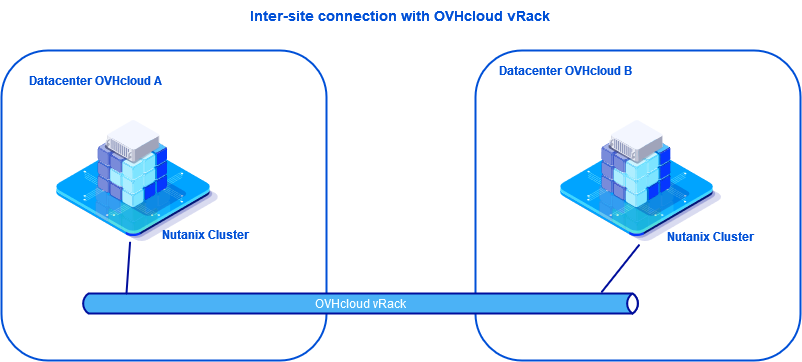
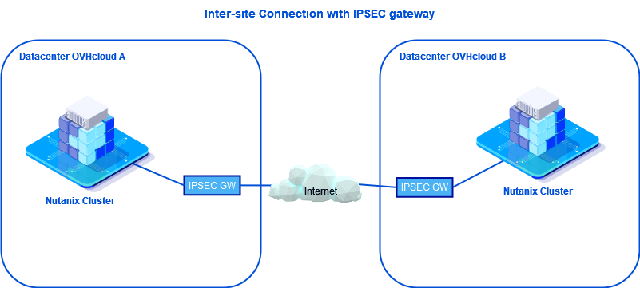

**Last updated 29th June 2022**

## Objective

This guide will take you through the possibilities offered by Nutanix clusters installed on OVHcloud infrastructures, for implementing Disaster Recovery Plans (DRPs).

> [!warning]
> OVHcloud provides services for which you are responsible, with regard to their configuration and management. It is therefore your responsibility to ensure that they they function correctly.
>
> This guide is designed to assist you in common tasks as much as possible. Nevertheless, we recommend contacting a [specialist service provider](https://partner.ovhcloud.com/en-gb/directory/) or reaching out to [our community](https://community.ovh.com/en/) if you experience any issues.
>

## Requirements

- Multiple Nutanix clusters with either organisation:
    - Multiple Nutanix clusters at physically different sites at OVHcloud
    - A Nutanix cluster provided by OVHcloud and another Nutanix cluster from another provider
- Access to the [OVHcloud Control Panel](https://www.ovh.com/auth/?action=gotomanager&from=https://www.ovh.co.uk/&ovhSubsidiary=GB)
- Access to your clusters via Prism Central
- A vRack or IPSEC VPN connection between the two clusters, as required

## Solutions overview

### Interconnection solutions

As part of a disaster recovery plan, it is important to choose the right interconnection between remote sites. 
The two clusters must be fully visible to each other through a secure connection.

To do this, you can use various methods such as:

- Connecting all sites via the same [vRack](https://www.ovh.co.uk/solutions/vrack/).

{.thumbnail}

- Setting up an IPsec VPN between the two Nutanix clusters.

{.thumbnail}

An example of an IPsec interconnection in this guide: [IPsec interconnection between two sites](https://docs.ovh.com/gb/en/nutanix/ipsec-interconnection/)

### Nutanix solutions for implementing a disaster recovery plan

Some solutions are available with **Prism Element**:

- **Async DR**: replication between two remote **storage containers** is only done once per hour. If a problem occurs, it is possible to lose one hour of data (RPO 1 hour) but the restart can be done manually in one minute.
- **NearSync DR**: replication occurs several times per hour. You can sync between 1 and 15 minutes, depending on the licence you have (RPO between 1 and 15 minutes).

Details of these solutions can be found in our documentation on [asynchronous or NearSync replication through Prism Element](https://docs.ovh.com/gb/en/nutanix/prism-element-nutanix-replication/)

The management of disaster recovery plans can be improved via third-party tools or a Nutanix solution called **Leap** through **Prism Central**.

> [!warning]
> Asynchronous replication between two sites is integrated with the OVHcloud **Nutanix Standard** solution. However, you will need to upgrade to the OVHcloud **Nutanix Advanced** solution to use the other options.

## Go further

[IPsec interconnection between two sites](https://docs.ovh.com/gb/en/nutanix/ipsec-interconnection/)

[Asynchronous or *NearSync* replication through Prism Element](https://docs.ovh.com/gb/en/nutanix/prism-element-nutanix-replication/)

Join our community of users on <https://community.ovh.com/en/>.
