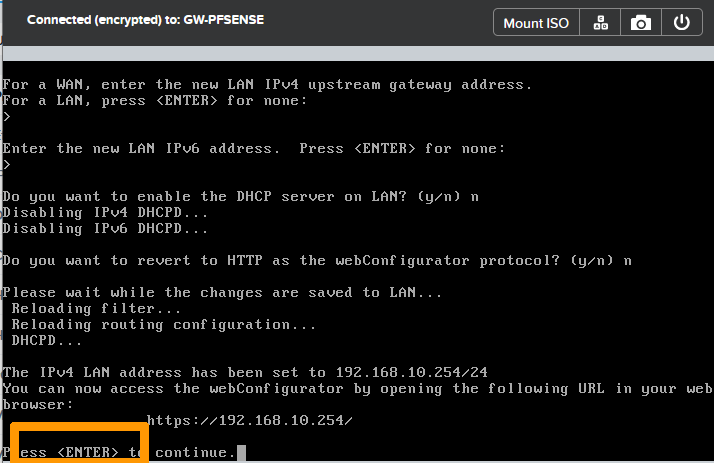
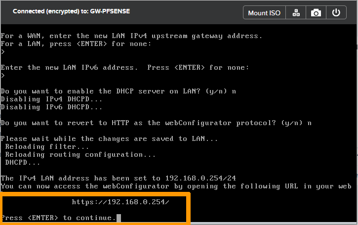

**Dernière mise à jour le 27/06/2022**

## Objectif

Ce guide vous présente comment interconnecter deux clusters Nutanix Fournis par OVHcloud au travers d'un VPN IPsec. Pour cela, nous allons remplacer les machines virtuelles **OVHgateway** qui fournissent l'accès à Internet par une passerelle sous le systême d'exploitation **pfSense**.

> [!warning]
> OVHcloud vous met à disposition des services dont la configuration, la gestion et la responsabilité vous incombent. Il vous appartient donc de ce fait d’en assurer le bon fonctionnement.
>
> Ce guide a pour but de vous accompagner au mieux sur des tâches courantes. Néanmoins, nous vous recommandons de faire appel à un prestataire spécialisé si vous éprouvez des difficultés ou des doutes concernant l’administration, l’utilisation ou la mise en place d’un service sur un serveur.
>

## Prérequis

- Avoir pris connaissance des cas d'usages d'un VPN IPsec à l'aide du guide « [Plan de reprise d'activité sur Nutanix](https://docs.ovh.com/fr/nutanix/disaster-recovery-plan-overview/) ».
- Disposer de deux clusters Nutanix fournis par OVHcloud, sur des sites différents.
- Être connecté à votre [espace client OVHcloud](https://www.ovh.com/auth/?action=gotomanager&from=https://www.ovh.com/fr/&ovhSubsidiary=fr).
- Être connecté sur vos clusters via Prism Central.
- Utiliser un plan d'adressage IP privé différent par cluster.

## En pratique

Dans ce guide, nous devons réaliser une partie de l'installation sur le cluster se trouvant au Canada et une autre en France. Vous trouverez-ci dessous la liste des tâches à effectuer par étapes sur chacun des clusters :

[Etape 1 Présentation de la solution](#presentation)<br /> 
[Etape 2 Remplacement de la passerelle au Canada](#configurecanada)<br />
&ensp;&ensp;[Etape 2.1 Téléchargement des sources pour l'installation de pfSense](#downloadsources)<br />
&ensp;&ensp;[Etape 2.2 Création de la machine virtuelle **GW-PFSENSE**](#createvmpfsense)<br />
&ensp;&ensp;[Etape 2.3 Arrêt de la machine virtuelle **OVH-GATEWAY**](#shutdownovhgateway)<br />
&ensp;&ensp;[Etape 2.4 Récupération de l'adresse publique sur l'espace client OVHcloud](#getpublicaddress)<br />
&ensp;&ensp;[Etape 2.5 Démarrage de la machine virtuelle **GW-PFSENSE**](#poweronvmpfsense)<br />
&ensp;&ensp;[Etape 2.6 Installation de **pfSense**](#pfsenseinstall)<br />
&ensp;&ensp;[Etape 2.7 Ejection du CDROM pfSense de la machine virtuelle **GW-PFSENSE**](#pfsenseremovecdrom)<br />
&ensp;&ensp;[Etape 2.8 Configuration des adresses IP de pfSense au travers de la console](#configureippfsense)<br />
&ensp;&ensp;[Etape 2.9 Configuration de certaines options au travers de l'interface Web](#configurepfsenseoptions)<br />
&emsp;&emsp;[Etape 2.9.1 Changement du mot de passe par défaut de **pfSense**](#changepassword)<br />
&emsp;&emsp;[Etape 2.9.2 Ajout d'une règle pour autoriser l'administration à distance à partir d'une adresse publique](#addadminrule)<br />
[Etape 3 Configuration de la passerelle en France](#configuregatewayfrance)<br />
&ensp;&ensp;[Etape 3.1 Téléchargement des sources pour l'installation de pfsense](#downloadsources-fr)<br />
&ensp;&ensp;[Etape 3.2 Création de la machine virtuelle **GW-PFSENSE**](#createvmpfsensefr)<br />
&ensp;&ensp;[Etape 3.3 Arrêt de la machine virtuelle **OVH-GATEWAY**](#shutdownovhgatewayfr)<br />
&ensp;&ensp;[Etape 3.4 Récupération de l'adresse publique sur l'espace client OVHcloud](#getpublicaddressfr)<br />
&ensp;&ensp;[Etape 3.5 Démarrage de la machine virtuelle **GW-PFSENSE**](#poweronvmpfsensefr)<br />
&ensp;&ensp;[Etape 3.6 Installation de **pfSense**](#pfsenseinstallfr)<br />
&ensp;&ensp;[Etape 3.7 Ejection du CDROM pfSense de la machine virtuelle **GW-PFSENSE**](#pfsenseremovecdromfr)<br />
&ensp;&ensp;[Etape 3.8 Configuration des adresses IP de pfSense au travers de la console](#configureippfsensefr)<br />
&ensp;&ensp;[Etape 3.9 Configuration de certaines options au travers de l'interface Web](#configurepfsenseoptionsfr)<br />
&emsp;&emsp;[Etape 3.9.1 Changement du mot de passe par défaut de **pfSense**](#changepasswordfr)<br />
&emsp;&emsp;[Etape 3.9.2 Ajout d'une règle pour autoriser l'administration à distance à partir d'une adresse publique](#addadminrulefr)<br />
[Etape 4 Mise en place du VPN IPsec](#configurevpnipsec)<br />
&ensp;&ensp;[Etape 4.1 Configuration du site au Canada](#ipseccanada)<br />
&emsp;&emsp;[Etape 4.1.1 Mise en place du VPN IPsec vers la France](#paramipsectofrance)<br />
&emsp;&emsp;[Etape 4.1.2 Ajout d'une règle de pare-feu pour autoriser le flux réseau au travers du VPN IPsec entre le Canada et la France](#addfwruletofrance)<br />
&ensp;&ensp;[Etape 4.2 Configuration du site en France](#ipsecfrance)<br />
&emsp;&emsp;[Etape 4.2.1 Mise en place du VPN IPsec vers le Canada](#paramipsectocanada)<br />
&emsp;&emsp;[Etape 4.2.2 Ajout d'une règle de pare-feu pour autoriser le flux réseau au travers du VPN IPsec entre le Canada et la France](#addruletocanada)<br />

<a name="presentation"></a>
### Etape 1 Présentation de la solution

Nous allons interconnecter deux clusters Nutanix, l'un se trouvant au Canada et l'autre en France, tous les deux dans des datacenters OVHcloud.<br>
Ils utilisent chacun un plan IP différent que voici :

- **Le cluster au Canada** : 192.168.10.0/24
- **Le cluster en France** : 192.168.0.0/24

Pour permettre cette configuration, nous allons remplacer sur chacun des sites la machine virtuelle **OVHgateway** par une machine virtuelle avec le système d'exploitation **pfSense** qui continuera à fournir l'accès à Internet en sortie et gérera le tunnel VPN à l'aide du protocole IPsec.

<a name="configurecanada"></a>
### Etape 2 Remplacement de la passerelle au Canada 

<a name="downloadsources"></a>
#### Etape 2.1 Téléchargement des sources pour l'installation de pfSense

Téléchargez l'image ISO de l'installation de **pfSense** à partir de ce lien : [Téléchargement de pfSense](https://www.pfsense.org/download/){.external}.

A l'aide de [cette documentation](https://docs.ovh.com/fr/nutanix/image-import/), ajoutez l'image **ISO pfSense** dans votre cluster Nutanix.

<a name="createvmpfsense"></a>
#### Etape 2.2 Création de la machine virtuelle **GW-PFSENSE**

Créez une machine virtuelle avec ces paramètres :

- **Nom** : `GW-PFSENSE`
- **Stockage1** : `60 Go HDD` 
- **Stockage2** : `Un lecteur DVD connecté à l'image ISO de pfSense`
- **RAM** : `4 Go` 
- **CPU** : `2 vCPU`
- **Réseau** : `deux cartes réseau sur le réseau de AHV: **Base**`

Vous pouvez vous aider de [notre guide sur la gestion des machines virtuelles](https://docs.ovh.com/fr/nutanix/virtual-machine-management/) pour créer cette machine virtuelle.

{.thumbnail}

<a name="shutdownovhgateway"></a>
#### Etape 2.3 Arrêt de la machine virtuelle **OVH-GATEWAY**

Pour éviter des doublons d'adresses IP sur le réseau, il faut arrêter la machine virtuelle **OVHgateway** avant de démarrer la nouvelle machine virtuelle sous **pfSense**.

Via **Prism Central**, cliquez en haut à gauche sur le `menu principal`{.action}.

{.thumbnail}

Cliquez sur `VMs`{.action}.

{.thumbnail}

Cliquez sur la machine virtuelle `OVHgateway`{.action}.

{.thumbnail}

Depuis le menu `More` en haut, cliquez sur `Soft Shutdown`{.action}.

{.thumbnail}

<a name="getpublicaddress"></a>
#### Etape 2.4 Récupération de l'adresse publique sur l'espace client OVHcloud 

Récupérez les informations concernant les paramètres réseau de la passerelle OVHcloud.

Connectez-vous à [l'espace client OVHcloud](https://www.ovh.com/auth/?action=gotomanager&from=https://www.ovh.com/fr/&ovhSubsidiary=fr), sélectionnez votre cluster Nutanix et relevez l'information se trouvant dans le champ `IPFO`.

{.thumbnail}

Ce que l'on nomme **IPFO** est une plage de 4 adresses. La première et la dernière sont réservées, la troisième se trouve sur un équipement OVHcloud et sert de passerelle **Internet**. La seule adresse IP utilisable est la seconde adresse de la plage. 

Lors de l'installation, nous allons réutiliser ces informations pour les affecter à la nouvelle machine virtuelle **GW-PFSENSE**

```console
XX.XX.XX.N      Adresse de réseau réservée qui apparait sur le site client OVHcloud
XX.XX.XX.N+1    Adresse IP qui doit être affectée à l'interface WAN de la machine virtuelle GW-PFSENSE
XX.XX.XX.N+2    Adresse à utiliser en tant que passerelle sur l'interface WAN de la machine virtuelle GW-PFSENSE
XX.XX.XX.N+3    Adresse IP de broadcast réservée
```

Par exemple, si l'adresse **IPFO** affichée sur le site client est 123.123.123.4/30, il faut utiliser :

- **123.123.123.5** pour l'adresse de l'interface **WAN** ;
- **123.123.123.6** pour la passerelle sur l'interface **WAN**.

<a name="poweronvmpfsense"></a>
#### Etape 2.5 Démarrage de la machine virtuelle **GW-PFSENSE**

Revenez dans la gestion des machines virtuelles sur **Prism Central** et cliquez sur `GW-PFSENSE`{.action}.

{.thumbnail}

Via le menu `More`, cliquez sur `Power On`{.action}.

{.thumbnail}

Cliquez sur `Launch console`{.action}.

{.thumbnail}

<a name="pfsenseinstall"></a>
#### Etape 2.6 Installation de **pfsense**

Prenez connaissance des informations liées à la licence pfSense et appuyez sur la touche `Entrée`{.action} pour les accepter.

{.thumbnail}

Choisissez `Install`, positionnez-vous sur `OK` avec la touche `Tabulation`{.action} et appuyez sur la touche `Entrée`{.action}.

{.thumbnail}

Sélectionnez `Continue with default keymap`, allez sur `Select` avec la touche `Tabulation`{.action} et appuyez sur la touche `Entrée`{.action}.

{.thumbnail}

Sélectionnez `Auto (ZFS)`, allez sur `OK` avec la touche `Tabulation`{.action} et tapez sur la touche `Entrée`{.action}.

{.thumbnail}

Positionnez-vous sur `Select` avec la touche `Tabulation`{.action} et appuyez sur la touche `Entrée`{.action}.

{.thumbnail}

Sélectionnez `Stripe`, positionnez-vous sur `OK` avec la touche `Tabulation`{.action} et appuyez sur la touche `Entrée`{.action}.

{.thumbnail}

Sélectionnez `NUTANIX VDISK` avec la barre `Espace`{.action}. Allez ensuite sur `OK` avec la touche `Tabulation`{.action} et appuyez sur la touche `Entrée`{.action}.

{.thumbnail}

Allez sur `YES` avec la touche `Tabulation`{.action} et appuyez sur la touche `Entrée`{.action}.

{.thumbnail}

Choisissez `NO` avec la touche `Tabulation`{.action} et appuyez sur la touche `Entrée`{.action}.

{.thumbnail}

Sélectionnez `Reboot` et appuyez sur la touche `Entrée`{.action}.

{.thumbnail}

<a name="pfsenseremovecdrom"></a>
#### Etape 2.7 Ejection du CDROM pfSense de la machine virtuelle GW-PFSENSE

Depuis **Prism central**, revenez sur la gestion de la machine virtuelle **GW-PFSENSE** et effectuez les opérations suivantes pour éjecter le **CDROM**.

Cliquez sur `Soft Shutdown`{.action} via le menu `More` de la machine virtuelle **GW-PFSENSE** pour arrêter cette machine virtuelle.

{.thumbnail}

Cliquez sur `Update`{.action}.

{.thumbnail}

Cliquez sur `Next`{.action}.

{.thumbnail}

Cliquez sur l'icone `Eject`{.action} au niveau du CDROM.

{.thumbnail}

Cliquez sur `Next`{.action}.

{.thumbnail}

CLiquez sur `Next`{.action}.

{.thumbnail}

CLiquez sur `Save`{.action}.

{.thumbnail}

Cliquez sur `Power On`{.action} dans le menu `More`.

{.thumbnail}

Cliquez sur `Launch Console`{.action} pour continuer l'installation après le démarrage. 

{.thumbnail}

<a name="configureippfsense"></a>
#### Etape 2.8 Configuration des adresses IP de pfSense au travers de la console

Nous allons configurer les adresses IP de passerelle **pfSense** comme ceci :

- Interface WAN : Utilisez cette partie du guide « [Récupération de l'adresse publique sur l'espace client OVHcloud](#getpublicaddress) » pour affecter l'adresse IP et la passerelle sur cette interface.
- Interface LAN: 192.168.10.254/24 qui correspond à l'adresse de passerelle du réseau privé du cluster Nutanix suivi du masque de sous réseau. 

Acceptez la licence en appuyant sur la touche `Entrée`{.action}.

{.thumbnail}

Saisissez `n` et appuyez sur la touche `Entrée`{.action} lorsque l'on vous demande s'il faut des **VLAN**.

{.thumbnail}

Saisissez `vtnet0` comme nom d'interface pour le **WAN** et appuyez sur la touche `Entrée`{.action}.

{.thumbnail}

Saisissez `vtnet1` comme nom d'interface pour le **LAN**  et appuyez sur la touche `Entrée`{.action}.

{.thumbnail}

Validez les changements en saisissant `y` et appuyez sur la touche `Entrée`{.action}.

{.thumbnail}

Saisissez `2` pour choisir `Set interface(s) IP address` et appuyez sur la touche `Entrée`{.action}.

{.thumbnail}

Sélectionnez l'interface **WAN** en saisissant `1` et appuyez sur la touche `Entrée`{.action}.

{.thumbnail}

Saisissez `n` et appuyez sur la touche `Entrée`{.action} à la demande de la configuration de l'adresse par DHCP.

{.thumbnail}

Saisissez **l'adresse IP publique avec le masque** et appuyez sur la touche `Entrée`{.action}. Par exemple **123.123.123.5/30**.

Saisissez ensuite **l'adresse IP de la passerelle publique** et appuyez sur la touche `Entrée`{.action}. Par exemple **123.123.123.6**.

{.thumbnail}

Répondez `n` et appuyez sur la touche `Entrée`{.action} lorsque l'assistant vous propose la configuration de l'**IPv6 address WAN interface via DHCP6**.

{.thumbnail}

A la demande **revert to HTTP as the webConfigurator protocol**, saisissez `n` et appuyez sur la touche `Entrée`{.action}.

{.thumbnail}

Appuyez sur `Entrée`{.action} pour valider l'enregistrement de l'adresse IP du **WAN**.

{.thumbnail}

Saisissez `2` et appuyez sur la touche `Entrée`{.action} pour configurer les adresses IP.

{.thumbnail}

Prenez l'option `2` et appuyez sur la touche `Entrée`{.action} pour modifier l'adresse IP du LAN.

{.thumbnail}

Saisissez l'adresse IP privée suivie du masque `192.168.10.254/24` et appuyez sur la touche `Entrée`{.action}.

{.thumbnail}

Appuyez sur la touche `Entrée`{.action} pour ne pas mettre de passerelle sur l'interface **LAN**

{.thumbnail}

Appuyez sur la touche `Entrée`{.action} afin de désactiver l'usage d'IPv6.

{.thumbnail}

Saisissez `n` et appuyez sur la touche `Entrée`{.action} à la demande d'activation du serveur DHCP.

{.thumbnail}

Répondez `n` et appuyez sur la touche `Entrée`{.action} à la demande **revert to HTTP as the webConfigurator protocol**.

{.thumbnail}

Il est maintenant possible d'administrer la passerelle en HTTPS sur le réseau privé du cluster **Nutanix**.

Appuyez sur la touche `Entrée`{.action} pour terminer la configuration en ligne de commande.

{.thumbnail}

<a name="configurepfsenseoptions"></a>
#### Etape 2.9 Configuration de certaines options au travers de l'interface WEB

Connectez-vous sur la console Web de pfSense avec cette URL https://192.168.10.254 à partir d'une machine virtuelle du cluster se trouvant sur le réseau local **AHV : Base**.

Saisissez ces informations :

- **Compte utilisateur** : admin
- **Default password** : pfsense

Cliquez ensuite sur `SIGN IN`{.action}.

{.thumbnail}

<a name="changepassword"></a>
##### **Etape 2.9.1 Changement du mot de passe par défaut de pfSense**

Dans le menu `System`{.action}, choisissez `User Manager`{.action}.

{.thumbnail}

Cliquez sur l'icône en forme de `Stylo`{.action}.

{.thumbnail}

Saisissez et confirmez le mot de passe  à droite de `Password`.

{.thumbnail}

Validez les changements en cliquant sur `Save`{.action} en bas du menu.

{.thumbnail}.

<a name="addadminrule"></a>
##### **Etape 2.9.2 Ajout d'une règle pour autoriser l'administration à distance à partir d'une adresse publique**

Allez dans le menu `Firewall`{.action} et choisissez `Rules`{.action}.

{.thumbnail}

Vérifiez que vous êtes sur l'onglet `WAN` puis cliquez sur le bouton `Add`{.action} (en bas avec la flèche pointant vers le haut) pour créer une règle de pare-feu.

{.thumbnail}

Définissez ces options dans la partie **Edit Firewall Rule** :

- **Action** : `Pass`
- **Interface** : `WAN`
- **Address Family** : `IPv4`
- **Protocol** : `TCP`

Sélectionnez `Single host or alias` dans le mendu déroulant **Source**  et saisissez `l'adresse publique` autorisée à se connecter au pare-feu **pfSense**.

{.thumbnail}

Définissez ensuite ces options dans la partie **Destination** :

- **Destination** : `WAN address`
- **Destination Port Range From** : `HTTPS`
- **Destination Port Range To** : `HTTPS`

Cliquez sur `Save`{.action}.

{.thumbnail}

Cliquez sur `Apply Changes`{.action} pour activer la règle.

{.thumbnail}

L'interface d'administration de **pfSense** est alors accessible depuis Internet, uniquement à partir du réseau autorisé en HTTPS, ici https://123.123.123.5 .

<a name="configuregatewayfrance"></a>
### Etape 3 Configuration de la passerelle en France

Nous allons effectuer l'installation de la passerelle **GW-PFSENSE** en France sur le plan IP **192.168.0.0/24**.

<a name="downloadsourcesfr"></a>
#### Etape 3.1 Téléchargement des sources pour l'installation de pfSense

Téléchargez l'image ISO de l'installation de **pfSense** à partir de ce lien : [Téléchargement de pfSense](https://www.pfsense.org/download/){.external}.

A l'aide de [cette documentation](https://docs.ovh.com/fr/nutanix/image-import/), ajoutez l'image **ISO pfSense** dans votre cluster Nutanix.

<a name="createvmpfsensefr"></a>
#### Etape 3.2 Création de la machine virtuelle **GW-PFSENSE**

Créez une machine virtuelle avec ces paramètres :

- **Nom** : `GW-PFSENSE`
- **Stockage1** : `60 Go HDD` 
- **Stockage2** : `Un lecteur DVD connecté à l'image ISO de pfSense`
- **RAM** : `4 Go` 
- **CPU** : `2 vCPU`
- **Réseau** : `deux cartes réseau sur le réseau de AHV: **Base**`

Vous pouvez vous aider de [notre guide sur la gestion des machines virtuelles](https://docs.ovh.com/fr/nutanix/virtual-machine-management/) pour créer cette machine virtuelle.

{.thumbnail}

<a name="shutdownovhgatewayfr"></a>
#### Etape 3.3 Arrêt de la machine virtuelle **OVH-GATEWAY**

Pour éviter des doublons d'adresses IP sur le réseau, il faut arrêter la machine virtuelle **OVHgateway** avant de démarrer la nouvelle machine virtuelle sous **pfSense**.

Via **Prism Central**, cliquez en haut à gauche sur le `menu principal`{.action}.

{.thumbnail}

Cliquez sur `VMs`{.action}.

{.thumbnail}

Cliquez sur la machine virtuelle `OVHgateway`{.action}.

{.thumbnail}

Depuis le menu `More` en haut, cliquez sur `Soft Shutdown`{.action}.

{.thumbnail}

<a name="getpublicaddressfr"></a>
#### Etape 3.4 Récupération de l'adresse publique sur l'espace client OVHcloud

Récupérez les informations concernant les paramètres réseau de la passerelle OVHcloud.

Connectez-vous à [l'espace client OVHcloud](https://www.ovh.com/auth/?action=gotomanager&from=https://www.ovh.com/fr/&ovhSubsidiary=fr), sélectionnez votre cluster Nutanix et relevez l'information se trouvant dans le champ `IPFO`.

{.thumbnail}

Ce que l'on nomme **IPFO** est une plage de 4 adresses. La première et la dernière sont réservées, la troisième se trouve sur un équipement OVHcloud et sert de passerelle **Internet**. La seule adresse IP utilisable est la seconde adresse de la plage. 

Lors de l'installation, nous allons réutiliser ces informations pour les affecter à la nouvelle machine virtuelle **GW-PFSENSE**

```console
XX.XX.XX.N      Adresse de réseau réservé qui apparait sur le site client OVHcloud
XX.XX.XX.N+1    Adresse IP qui doit être affectée à l'interface WAN de la machine virtuelle GW-PFSENSE.
XX.XX.XX.N+2    Adresse à utiliser en tant que passerelle sur l'interface WAN de la machine virtuelle GW-PFSENSE. 
XX.XX.XX.N+3    Adresse IP de broadcast réservée
```

Par exemple, si l'adresse **IPFO** affichée sur le site client est 123.123.123.4/30 il faut utiliser :

- **123.123.123.5** pour l'adresse de l'interface **WAN**;
- **123.123.123.6** pour la passerelle sur l'interface **WAN**.

<a name="poweronvmpfsensefr"></a>
#### Etape 3.5 Démarrage de la machine virtuelle **GW-PFSENSE**

Revenez dans la gestion des machines virtuelles sur **Prism Central** et cliquez sur `GW-PFSENSE`{.action}.

{.thumbnail}

Via le menu `More`, cliquez sur `Power On`{.action}.

{.thumbnail}

Cliquez sur `Launch console`{.action}.

{.thumbnail}

<a name="pfsenseinstallfr"></a>
#### Etape 3.6 Installation de pfSense

Prenez connaissance des informations liées à la licence pfSense et appuyez sur la touche `Entrée`{.action} pour les accepter.

{.thumbnail}

Choisissez `Install`, positionnez-vous sur `OK` avec la touche `Tabulation`{.action} et appuyez sur la touche `Entrée`{.action}.

{.thumbnail}

Sélectionnez `Continue with default keymap`, allez sur `Select` avec la touche `Tabulation`{.action} et appuyez sur la touche `Entrée`{.action}.

{.thumbnail}

Sélectionnez `Auto (ZFS)`, allez sur `OK` avec la touche `Tabulation`{.action} et tapez sur la touche `Entrée`{.action}.

{.thumbnail}

Positionnez-vous sur `Select` avec la touche `Tabulation`{.action} et appuyez sur la touche `Entrée`{.action}.

{.thumbnail}

Sélectionnez `Stripe`, positionnez-vous sur `OK` avec la touche `Tabulation`{.action} et appuyez sur la touche `Entrée`{.action}.

{.thumbnail}

Sélectionnez `NUTANIX VDISK` avec la barre `Espace`{.action}. Allez ensuite sur `OK` avec la touche `Tabulation`{.action} et appuyez sur la touche `Entrée`{.action}.

{.thumbnail}

Allez sur `YES` avec la touche `Tabulation`{.action} et appuyez sur la touche `Entrée`{.action}.

{.thumbnail}

Choisissez `NO` avec la touche `Tabulation`{.action} et appuyez sur la touche `Entrée`{.action}.

{.thumbnail}

Sélectionnez `Reboot` et appuyez sur la touche `Entrée`{.action}.

{.thumbnail}

<a name="pfsenseremovecdromfr"></a>
#### Etape 3.7 Ejection du CDROM pfSense de la machine virtuelle GW-PFSENSE

Depuis **Prism central**, revenez sur la gestion de la machine virtuelle **GW-PFSENSE** et effectuez les opérations suivantes pour éjecter le **CDROM**.

Cliquez sur `Soft Shutdown`{.action} via le menu `More` de la machine virtuelle **GW-PFSENSE** pour arrêter cette machine virtuelle.

{.thumbnail}

Cliquez sur `Update`{.action}.

{.thumbnail}

Cliquez sur `Next`{.action}.

{.thumbnail}

Cliquez sur l'icone `Eject`{.action} au niveau du CDROM.

{.thumbnail}

Cliquez sur `Next`{.action}.

{.thumbnail}

CLiquez sur `Next`{.action}.

{.thumbnail}

CLiquez sur `Save`{.action}.

{.thumbnail}

Cliquez sur `Power On`{.action} dans le menu `More`.

{.thumbnail}

Cliquez sur `Launch Console`{.action} pour continuer l'installation après le démarrage. 

{.thumbnail}

<a name="configureippfsensefr"></a>
#### Etape 3.8 Configuration des adresses IP de pfSense au travers de la console

Nous allons configurer les adresses IP de passerelle **pfSense** comme ceci :

- Interface WAN : Utilisez cette partie du guide « [Récupération de l'adresse publique sur l'espace client d'OVHcloud](#getpublicaddressfr) » pour affecter l'adresse IP et la passerelle sur cette interface.
- Interface LAN: 192.168.0.254/24 qui correspond à l'adresse de passerelle du réseau privé du Nutanix suivi du masque de sous réseau. 

Acceptez la licence en appuyant sur la touche `Entrée`{.action}.

{.thumbnail}

Saisissez `n`{.action} et appuyez sur la touche `Entrée`{.action} lorsque l'on demande s'il faut des **VLAN**.

{.thumbnail}

Saisissez `vtnet0` comme nom d'interface pour le **WAN** et appuyez sur la touche `Entrée`{.action}.

{.thumbnail}

Saisissez `vtnet1` comme nom d'interface pour le **LAN**  et appuyez sur la touche `Entrée`{.action}.

{.thumbnail}

Validez les changements en saisissant `y` et appuyez sur la touche `Entrée`{.action}.

{.thumbnail}

Saisissez `2` pour choisir `Set interface(s) IP address` et appuyez sur la touche `Entrée`{.action}.

{.thumbnail}

Sélectionnez l'interface **WAN** en saisissant `1` et appuyez sur la touche `Entrée`{.action}.

{.thumbnail}

Saisissez `n`{.action} et appuyez sur la touche `Entrée`{.action} à la demande de la configuration de l'adresse par DHCP.

{.thumbnail}

Saisissez **l'adresse IP publique avec le masque** et appuyez sur la touche `Entrée`{.action}. Par exemple **123.123.123.5/30**.

Saisissez ensuite **l'adresse IP de la passerelle publique** et appuyez sur la touche `Entrée`{.action}. Par exemple **123.123.123.6**.

{.thumbnail}

Répondez `n` et appuyez sur la touche `Entrée`{.action} lorsque l'assistant vous propose la configuration de l'**IPv6 address WAN interface via DHCP6**.

{.thumbnail}

A la demande **revert to HTTP as the webConfigurator protocol**, saisissez `n` et appuyez sur la touche `Entrée`{.action}.

{.thumbnail}

Appuyez sur `Entrée`{.action} pour valider l'enregistrement de l'adresse IP du **WAN**.

{.thumbnail}

Saisissez `2` et appuyez sur la touche `Entrée`{.action} pour configurer les adresses IP.

{.thumbnail}

Prenez l'option `2` et appuyez sur la touche `Entrée`{.action} pour modifier l'adresse IP du LAN.

{.thumbnail}

Saisissez l'adresse IP privée suivie du masque `192.168.0.254/24` et appuyez sur la touche `Entrée`{.action}.

{.thumbnail}

Appuyez sur la touche `Entrée`{.action} pour ne pas mettre de passerelle sur l'interface **LAN**

{.thumbnail}

Appuyez sur la touche `Entrée`{.action} pour desactiver IPv6 sur l'interface **LAN**.

{.thumbnail}

Saisissez `n` et appuyez sur la touche `Entrée`{.action} à la demande d'activation du serveur DHCP.

{.thumbnail}

Répondez `n` et appuyez sur la touche `Entrée`{.action} à la demande **revert to HTTP as the webConfigurator protocol**.

{.thumbnail}

Il est maintenant possible d'administrer la passerelle en HTTPS sur le réseau privé.

Appuyez sur la touche `Entrée`{.action} pour terminer la configuration en ligne de commande.

{.thumbnail}

<a name="configurepfsenseoptionsfr"></a>
#### Etape 3.9 Configuration de certaines options au travers de l'interface Web

Connectez-vous sur la console Web de pfSense avec cette URL https://192.168.0.254 à partir d'une machine virtuelle se trouvant sur le réseau local **AHV : Base**.

Saisissez ces informations :

- **Compte utilisateur** : admin
- **Default password** : pfsense

Cliquez ensuite sur `SIGN IN`{.action}.

{.thumbnail}

<a name="changepasswordfr"></a>
##### **Etape 3.9.1 Changement du mot de passe par défaut de pfSense**

Dans le menu `System`{.action}, choisissez `User Manager`{.action}.

{.thumbnail}

Cliquez sur l'icône en forme de `Stylo`{.action}.

{.thumbnail}

Saisissez et confirmez le mot de passe  à droite de `Password`.

{.thumbnail}

Validez les changements en cliquant sur `Save`{.action} en bas du menu.

{.thumbnail}.

<a name="addadminrulefr"></a>
##### **Etape 3.9.2 Ajout d'une règle pour autoriser l'administration à distance à partir d'une adresse publique.**

Allez dans le menu `Firewall`{.action} et choisissez `Rules`{.action}.

{.thumbnail}

Vérifiez que vous êtes sur l'onglet `WAN` puis cliquez sur le bouton `Add`{.action} (en bas avec la flèche pointant vers le haut) pour créer une règle de pare-feu.

{.thumbnail}

Choisissez ces options dans **Edit Firewall Rule** :

- **Action** : `Pass`
- **Interface** : `WAN`
- **Address Family** : `IPv4`
- **Protocol** : `TCP`

Sélectionnez `Single host or alias` dans le mendu déroulant **Source**  et saisissez `l'adresse publique` autorisée à se connecter au pare-feu **pfSense**.

{.thumbnail}

Ajoutez ces options dans **Destination** :

- **Destination** : `WAN address`
- **Destination Port Range From** : `HTTPS`
- **Destination Port Range To** : `HTTPS`

Cliquez sur `Save`{.action}.

{.thumbnail}

Cliquez sur `Apply Changes`{.action} pour activer la règle.

{.thumbnail}

L'interface d'administration de **pfSense** est alors accessible depuis Internet, sur le réseau autorisé via cette url https://adressewan, ici https://123.123.123.5 .

<a name="configurevpnipsec"></a>
### Etape 4 Mise en place du VPN IPsec

Maintenant que les deux passerelles ont été remplacées, nous allons configurer le VPN IPsec pour permettre la communication entre les deux clusters.

<a name="ipseccanada"></a>
#### Etape 4.1 Configuration du site au Canada

<a name="paramipsectofrance"></a>
##### **Etape 4.1.1 Mise en place du VPN IPsec vers la France**

Connectez-vous depuis un réseau autorisé sur l'adresse publique du Canada en HTTPS avec cette URL https://adressepublique-pfsense-canada. 

Allez dans le menu `VPN`{.action} et choisissez `IPsec`{.action}.

{.thumbnail}

Cliquez sur `Add P1`{.action} pour créer la phase 1 du VPN IPsec.

{.thumbnail}

Saisissez ces informations :

- **Description** : `VPN TO FRANCE`
- **Key Exchange version** : `IKEv2`
- **Internet Protocol** : `IPv4`
- **Interface**  : `WAN`
- **Remote Gateway** : `Adresse publique de la machine virtuelle pfSense se trouvant en France`

{.thumbnail}

Cliquez sur `Generate new Pre-Shared Key`{.action} pour générer une clé pré-partagée dans le champ `Pre-Share Key`.

> [!primary]
> 
> Notez ou copiez la clé, elle servira pour la configuration du VPN sur la passerelle en France.
> 
> Conservez les informations contenues dans `Encryption Algorithm`.
>

{.thumbnail}

Cliquez sur `Save`{.action} en bas du menu.

{.thumbnail}

Cliquez sur `Apply Changes`{.action}.

{.thumbnail}

Cliquez sur `Show Phase 2 Entries`{.action}.

{.thumbnail}

Cliquez sur `Add P2`{.action} pour ajouter la phase 2 du VPN IPsec.

{.thumbnail}

Effectuez la saisie de ces informations :

- **Description** : `TO LAN 192.168.0.0/24 France`
- **Local Network** : `LAN subnet`
- **Remote Network** : Type `Network`, Address `192.168.0.0/24`


{.thumbnail}

> [!primary]
> 
> Prenez note des paramètres de chiffrement.
>

{.thumbnail}

Cliquez sur `Save`{.action}.

{.thumbnail}

Cliquez sur `Apply Changes`{.action} pour finaliser la création du VPN IPsec sur la machine virtuelle **pfSense** du Canada.

{.thumbnail}

<a name="addfwruletofrance"></a>
##### **Etape 4.1.2 Ajout d'une règle de pare-feu pour autoriser le flux réseau au travers du VPN IPsec entre le Canada et la France**

Cliquez sur `Rules`{.action} dans le menu `Firewall`{.action}.

{.thumbnail}

Positionnez-vous sur l'onglet `IPsec`{.action} et cliquez sur `Add`{.action} (bouton en bas avec la flèche pointant vers le haut).

{.thumbnail}

Modifiez ces options :

- **Source** : `LAN net`
- **Destination** : `Network` et `192.168.0.0/24` 

Cliquez ensuite sur `Save`{.action}.

{.thumbnail}

Cliquez à nouveau sur le même bouton `Add`{.action} (en bas avec la flêche pointant vers le haut) pour rajouter une deuxième règle.

{.thumbnail}

Modifiez ces options : 

- **Source** : `Network` et `192.168.0.0/24` 
- **Destination** : `LAN net`

Cliquez sur `Save`{.action}.

{.thumbnail}

Cliquez sur `Apply Changes`{.action}.

{.thumbnail}

Le paramétrage sur la passerelle au Canada est alors terminé.

<a name="ipsecfrance"></a>
#### Etape 4.2 Configuration du site en France

<a name="paramipsectocanada"></a>
##### **Etape 4.2.1 Mise en place du VPN IPsec vers le Canada**

Connectez-vous sur l'adresse publique de la passerelle de la France en HTTPS via : https://adressepublique-pfsense-france.

Allez dans le menu `VPN`{.action} et choisissez `IPsec`{.action}.

{.thumbnail}

Cliquez sur `Add P1`{.action} pour créer la phase 1 du VPN IPsec.

{.thumbnail}

Choisissez ces informations :

- **Description** : `VPN TO CANADA`
- **Key Exchange version** : `IKEv2`
- **Internet Protocol** : `IPv4`
- **Interface**  : `WAN`
- **Remote Gateway** : `Adresse publique de la machine virtuelle pfSense se trouvant au Canada`

{.thumbnail}

Collez dans **Pre-shared Key** la clé pré-partagée qui a été générée sur la passerelle se trouvant au Canada.

Comparez et faites correspondre les paramètres dans `Encryption Algorithm` avec la passerelle du Canada.

{.thumbnail}

Cliquez sur `Save`{.action}.

{.thumbnail}

Cliquez sur `Apply Changes`{.action}.

{.thumbnail}

Cliquez sur `Show Phase 2 Entries`{.action}.

{.thumbnail}

Cliquez sur `Add P2`{.action} pour ajouter la phase 2 du VPN IPsec.

{.thumbnail}

Saisissez les informations suivantes :

- **Description** : `TO LAN 192.168.10.0/24 CANADA`
- **Local Network** : `LAN subnet`
- **Remote Network** : Type `Network`, Address `192.168.10.0/24`

{.thumbnail}

Vérifiez les paramètres de chiffrement et faites en sorte qu'ils soient identiques avec deux définis sur la passerelle du Canada.

{.thumbnail}

Cliquez sur `Save`{.action}.

{.thumbnail}

Cliquez sur `Apply Changes`{.action} pour finaliser la création du VPN IPsec.

{.thumbnail}

<a name="addruletocanada"></a>
##### **Etape 4.2.2 Ajout d'une règle de pare-feu pour autoriser le flux réseau au travers du VPN IPsec entre le Canada et la France**

Cliquez sur `Rules`{.action} dans le menu `Firewall`{.action}.

{.thumbnail}

Positionnez-vous sur l'onglet `IPsec`{.action} et cliquez sur `Add`{.action} (bouton en bas avec la flèche pointant vers le haut).

{.thumbnail}

Modifiez ces options :

- **Source** : `LAN net`
- **Destination** : `Network` et `192.168.10.0/24` 

Cliquez ensuite sur `Save`{.action}.

{.thumbnail}

Cliquez à nouveau sur `Add`{.action} (bouton en bas avec la flèche pointant vers le haut) pour ajouter une deuxième règle.

{.thumbnail}

Modifiez ces options : 

- **Source** : `Network` avec ce réseau `192.168.10.0/24` qui correspond au réseau privé du Canada
- **Destination** : `LAN net`

Cliquez sur `Save`{.action}.

{.thumbnail}

Cliquez sur `Apply Changes`{.action}. 

{.thumbnail}

Le paramétrage du VPN est terminé sur les deux clusters. Il est maintenant possible de mettre en place des réplications au travers du tunnel VPN sécurisé.

<a name="gofurther"></a>
## Aller plus loin

[Plan de reprise d'activité sur Nutanix](https://docs.ovh.com/fr/nutanix/disaster-recovery-plan-overview/)

[Réplication asynchrone ou synchrone au travers de Prism Element](https://docs.ovh.com/fr/nutanix/prism-element-nutanix-replication/)

Échangez avec notre communauté d'utilisateurs sur <https://community.ovh.com/>.
