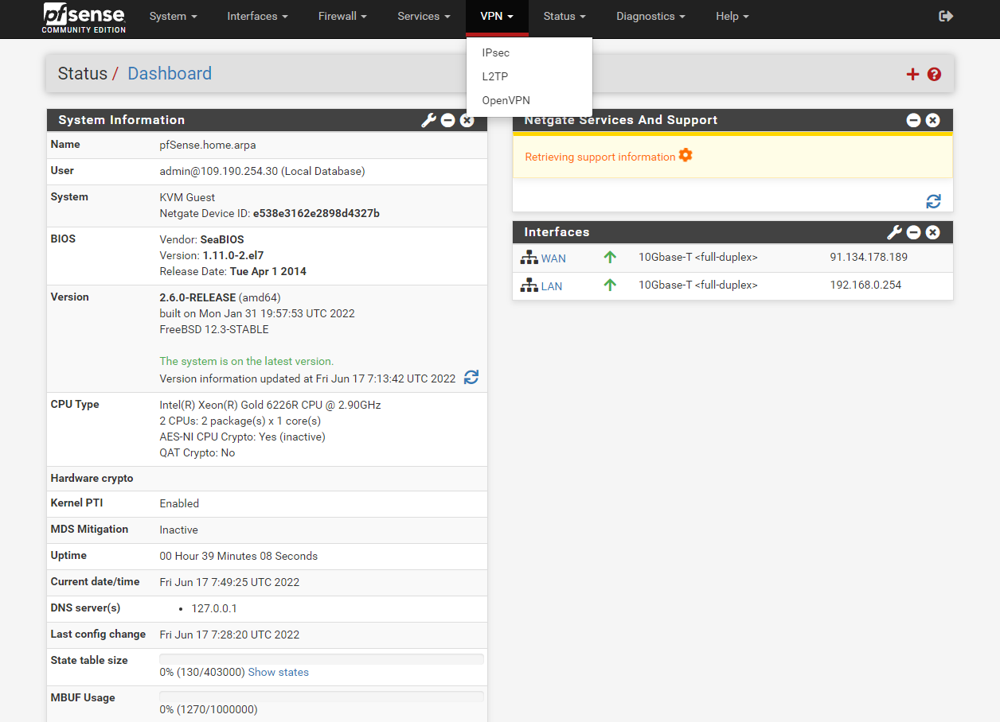
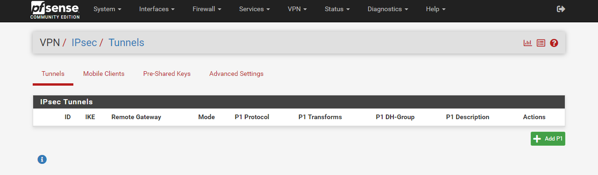
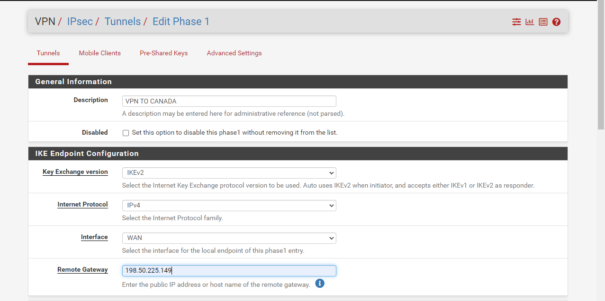
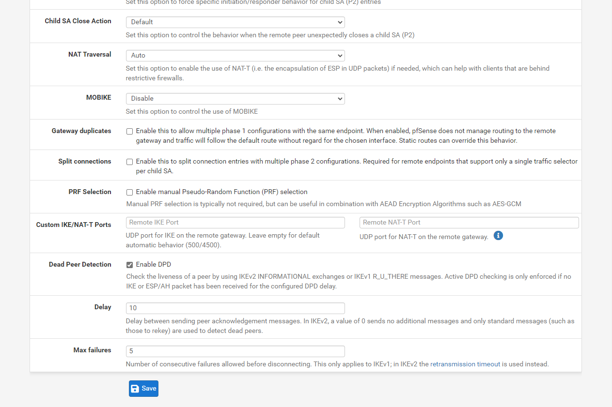
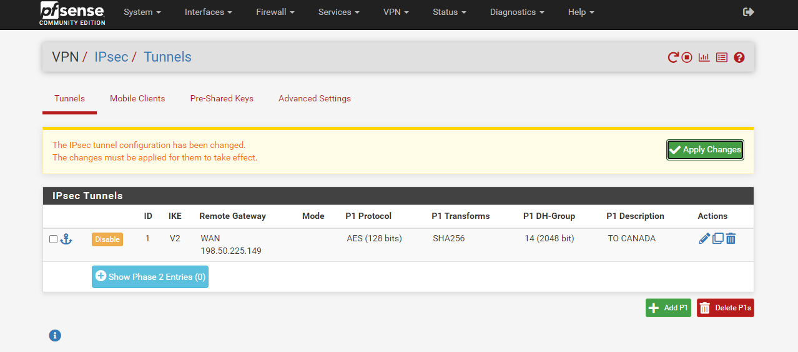
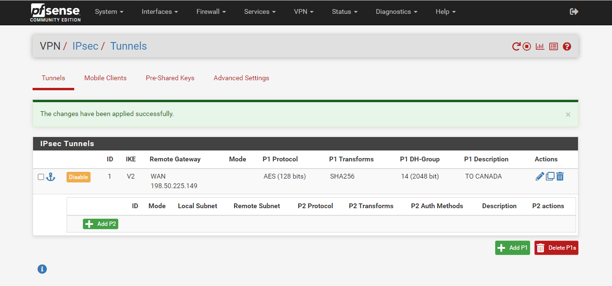
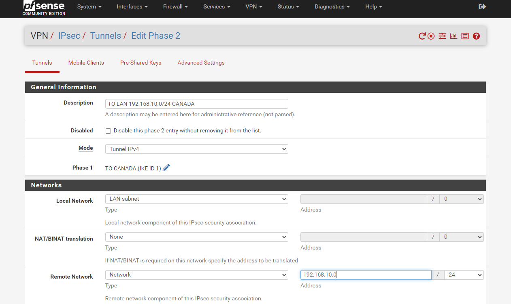
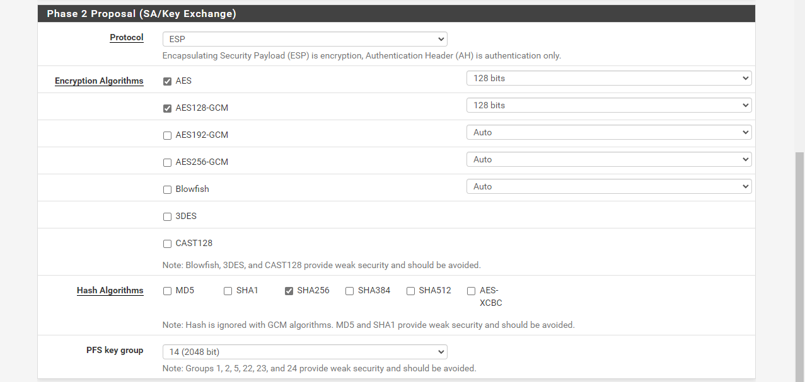

#### Configuration du site en FRANCE

##### Mise en place du VPN IPSEC vers le CANADA

Connectez-vous sur l'adresse publique de la passerelle de la FRANCE en HTTPS comme ceci https://adressepublique-pfsense-france.

Allez dans le menu `VPN`{.action} et choisissez `IPSec`{.action}.

{.thumbnail}

Cliquez sur `Add P1`{.action} pour créer la phase 1 du VPN IPSEC

{.thumbnail}

Choisissez ces informations

* **Description** : `VPN TO CANADA`
* **Key Exchange version** : `IKEv2`
* **Internet Protocol** : `IPv4`
* **Interface**  : `WAN`
* **Remote Gateway** : `Adresse publique du PFSENSE distant au CANADA`

Ensuite faites défilez la fênetre à l'aide de la `Barre de défilement`{.action}

{.thumbnail}

Collez dans **Pre-shared Key** la clé prépartagée qui a été générée sur la passerelle se trouvant au CANADA.

Comparez les paramètres dans `Encryption Algorithm` avec la passerelle du CANADA 

Ensuite faites défiler la fenêtre à l'aide de la `Barre de défilement`{.action}

{.thumbnail}

Cliquez sur `Save`{.action}

{.thumbnail}

Cliquez sur `Apply Changes`{.action}

{.thumbnail}

Cliquez sur `Show Phase 2 Entries`{.action}

{.thumbnail}

Cliquez sur A`dd P2`{.action} pour ajouter la phase 2 du VPN IPSEC

{.thumbnail}

Effectuez la saisie de ces informations

* **Description** : `TO LAN 192.168.10.0/24 CANADA`
* **Local Network** : `LAN subnet`
* **Remote Network** : Type `Network`, Address `192.168.10.0/24`

Faites défilez la fenêtre avec la `Barre de défilement`{.action}

{.thumbnail}

Vérifiez les paramètres de chiffrements avec la passerelle du CANADA et faites defilez la fenêtre à l'aide de la `Barre de défilement`{.action}

{.thumbnail}

Cliquez sur `Save`{.action}

{.thumbnail}

Cliquez sur `Apply Changes`{.action} pour finaliser la création du VPN IPSEC coté CANADA

{.thumbnail}

##### Ajout d'un règle de parefeu pour autoriser le flux réseau au travers du VPN IPSEC entre le CANADA et la FRANCE

Choisisez Cliquez sur `Rules`{.action} dans le menu `Firewall`

{.thumbnail}

Positionnez vous sur l'onglet `IPsec`{.action} et cliquez en bas sur `Add`{.action} avec la flêche vers le haut.

{.thumbnail}

Modifiez ces options :

* **Source** : `LAN net`
* **Destination** : `Network` et `192.168.10.0/24` 

Ensuite cliquez sur `Save`{.action} 

{.thumbnail}

Cliquez à nouveau sur `Add`{.action} avec la flêche vers le haut. pour rajouter une deuxième règle

{.thumbnail}

Modifiez ces options : 

* **Source** : `Network` et `192.168.10.0/24` 
* **Destination** : `LAN net`

Et cliquez sur `Save`{.action} 

{.thumbnail}

Cliquez sur `Apply Changes`{.action} 

{.thumbnail}

Le paramétrage coté canada est terminé.

