**Dernière mise à jour le 14/06/2022**

## Objectif

**Cette page montre comment mettre en place une réplication entre cluster au travers de Prism Element**

> [!warning]
> OVHcloud vous met à disposition des services dont la configuration, la gestion et la responsabilité vous incombent. Il vous appartient donc de ce fait d’en assurer le bon fonctionnement.
>
> Ce guide a pour but de vous accompagner au mieux sur des tâches courantes. Néanmoins, nous vous recommandons de faire appel à un prestataire spécialisé si vous éprouvez des difficultés ou des doutes concernant l’administration, l’utilisation ou la mise en place d’un service sur un serveur.
>
> Certaines options comme l'utilisation de la compression ou de la déduplication nécessitent des licences particulières fournies par Nutanix au travers d'OVHcloud, nous vous invitons à vous renseigner auprès du service commercial OVHcloud pour plus d'informations.

## Prérequis

- Disposer de deux clusters Nutanix dans votre compte OVHcloud
- Être connecté à votre [espace client OVHcloud](https://www.ovh.com/auth/?action=gotomanager&from=https://www.ovh.com/fr/&ovhSubsidiary=fr)
- Être connecté sur vos clusters via Prism Central

## Présentation de la réplication synchrone et asynchrone

Il est possible au travers de Prism Element de faire des réplications entre clusters si ils sont reliés ensemble.

Avec le pack **Nutanix Standard** d'OVHcloud il est possible faire une réplication asynchrone toutes les heures.

Il est possible de faire une réplication synchrone avec un délai de réplication compris entre 1 et 15 minutes pour cela il faut choisir le pack **Nutanix Advanced** d'OVHcloud.

## En pratique

Nous allons interconnecter deux cluster Nutanix se trouvant dans les datacenter d'OVHcloud ,l'un au CANADA et l'autre en FRANCE au travers d'un VPN IPSEC sur deux plans d'adressages IP differents qui sont :

* ** `192.168.0.0/24` pour le cluster se trouvant dans un Datacenter en FRANCE
* ** `192.168.10.0/24` pour le cluster se trouvant dans un Datacenter au CANADA

### Configuration des sites distants

Connectez vous sur **Prism Element** du cluster de la France à partir de **Prism Central** vous pouvez vous aider de la documentation [Hyperconvergence Nutanix](https://docs.ovh.com/fr/nutanix/nutanix-hci/)

Au travers du menu Home cliquez sur `Data Protection`{.action}.

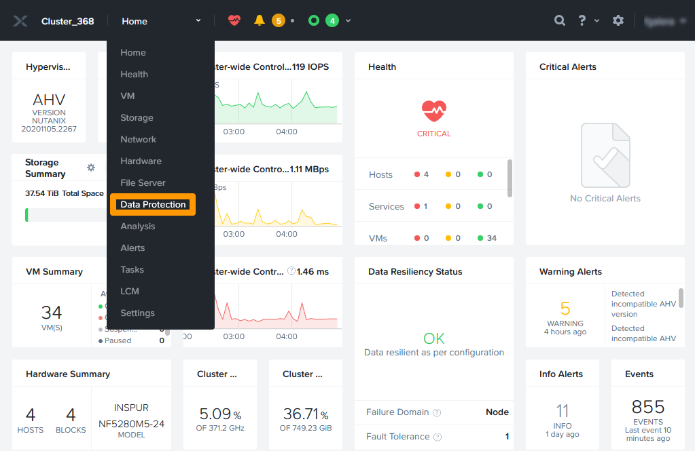{.thumbnail} 

Cliquez sur `Remote Site`{.action} à gauche de l'écran.

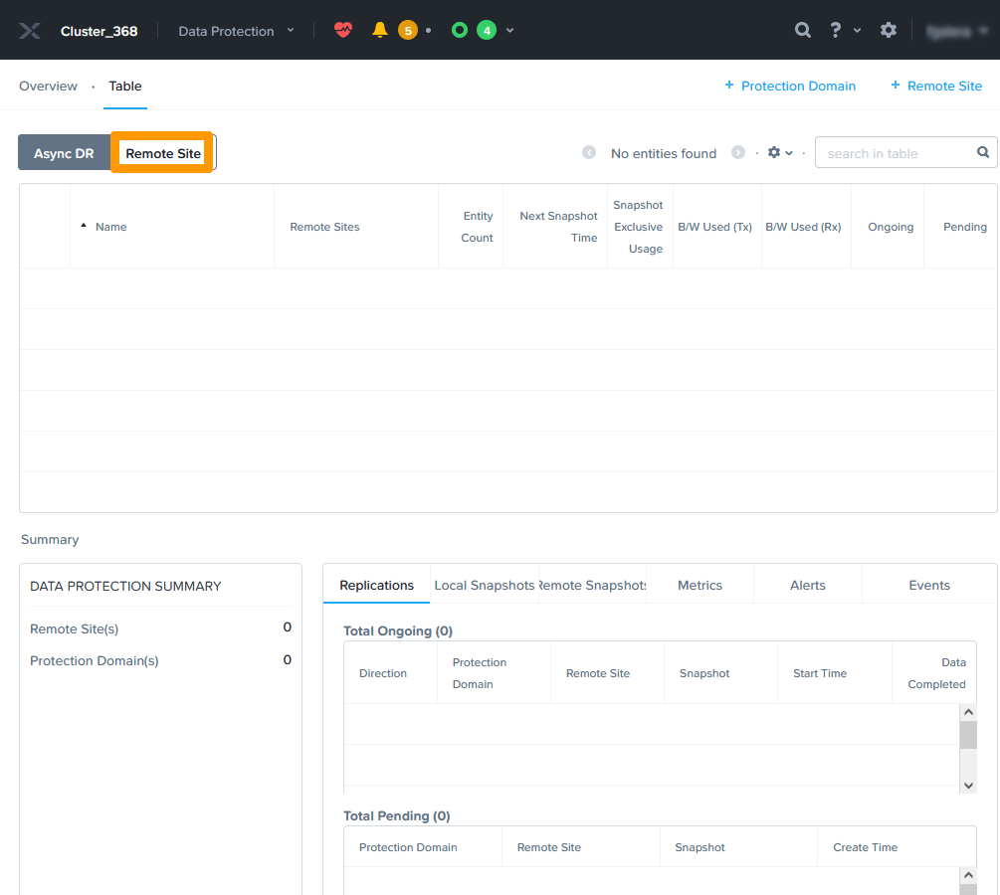{.thumbnail}

Cliquez `+ Remote Site`{.action} à droite de l'écran pour rajouter un site distant

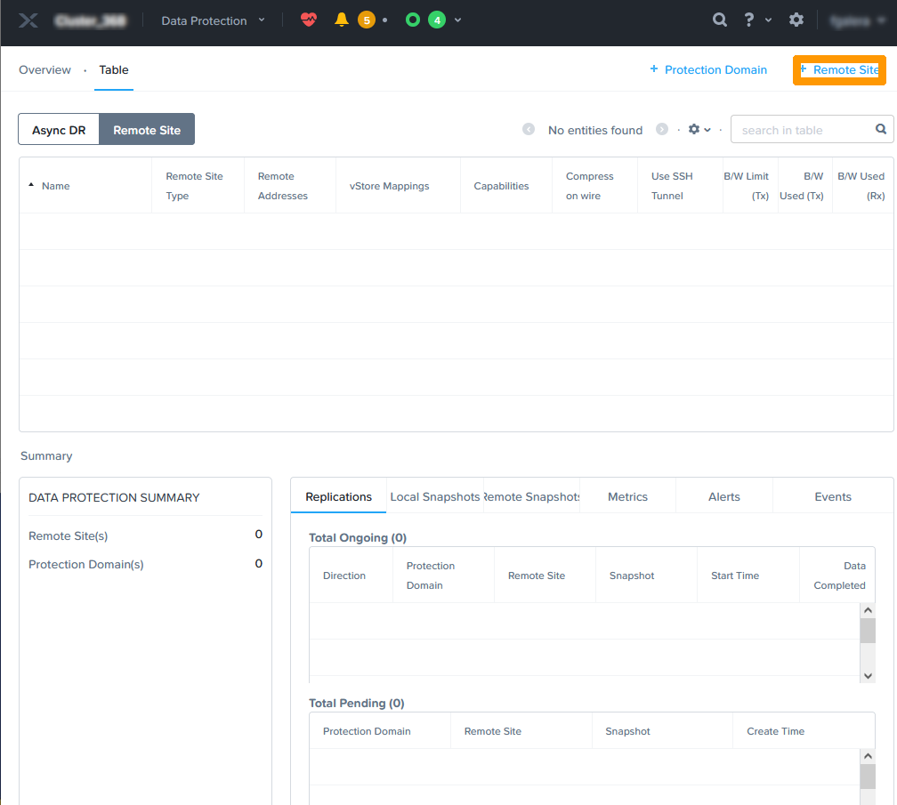{.thumbnail}

Choisissez `Physical Cluster`{.action} dans le sous menu.

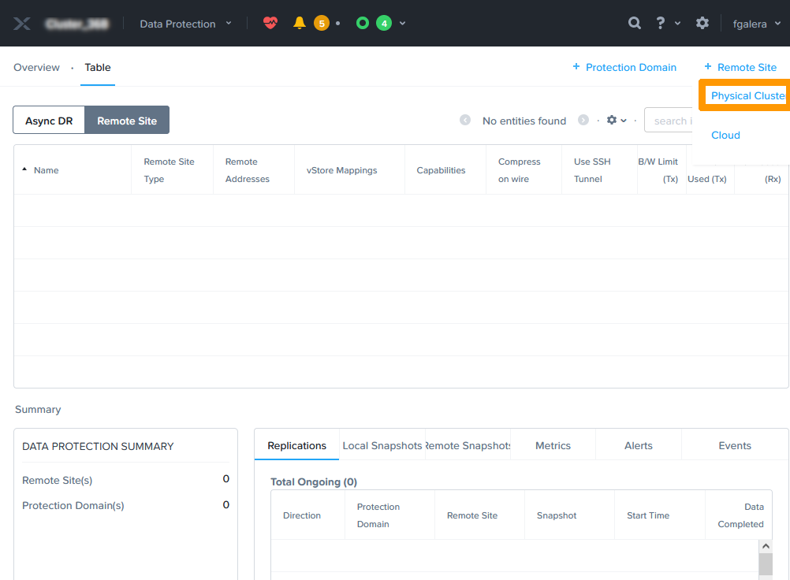{.thumbnail}

Nommez le site distant dans `REMOTE SITE NAME` , saisissez l'adresse IP du **Prism Element** du site distant en FRANCE dans `CLUSTER VIRTUAL IP` et cliquez sur `Add Site`{.action}.

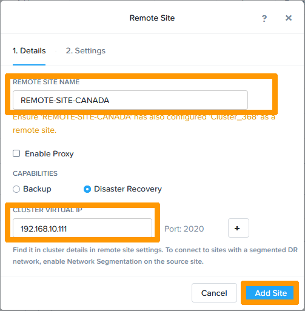{.thumbnail}

Faites défiler la fenêtre à l'aide de La `barre de défilement`{.action}.

{.thumbnail}

Dans **Network Mapping** Selectionnez `AHV: base`pour **Source Cluster** et **Destination Cluster** et cliquez sur le bouton `+`{.action}  

{.thumbnail}

Si vous avez un autre VLAN Faites la même opération avec le nom du VLAN `AHV: VLAN50` en cliquant sur le bouton `+`{.action} pour valider l'association des réseaux sources et destinations.

{.thumbnail}

Choisissez le `default-container...` dans Source **VStore** et **Destination VStore** et cliquez sur le bouton `+`{.action} pour la correspondance des stockages sources et destination. 

{.thumbnail}

Cliquez sur `Save`{.action}

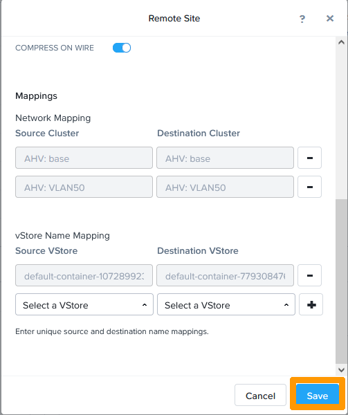{.thumbnail}

Le site distant apparait dans la liste **Remote Site**

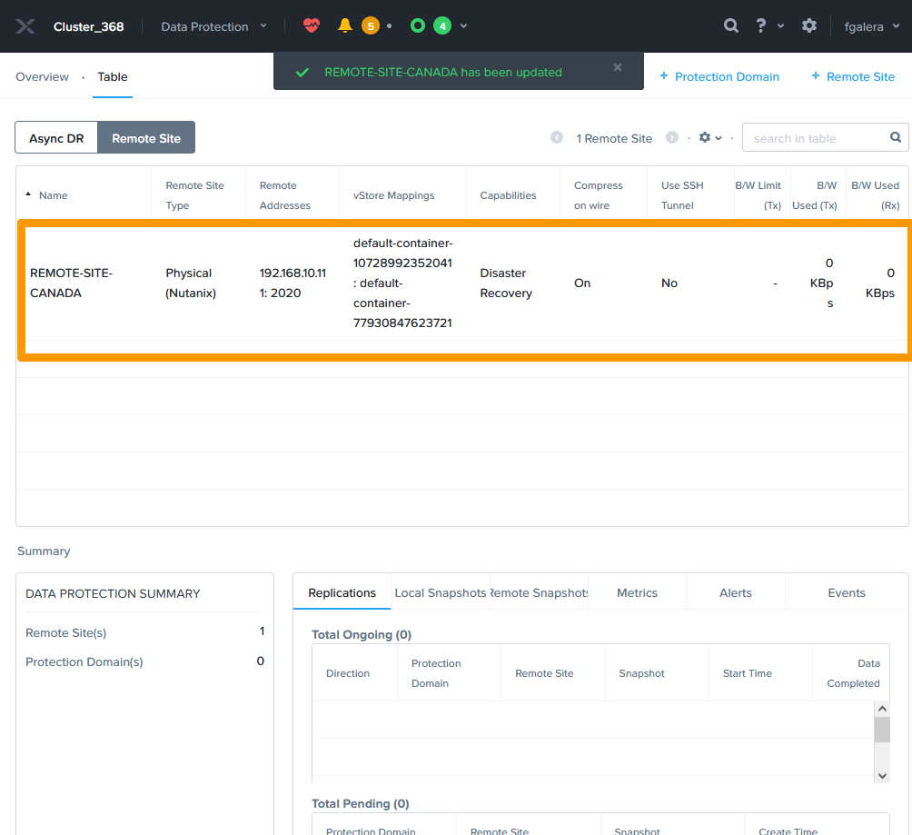{.thumbnail}

Nous allons maintenant nous connecter à **Prism Element** du site distant au CANADA et faire la même operation.

Au travers du menu Home cliquez sur `Data Protection`{.action}.

{.thumbnail} 

Cliquez sur `Remote Site`{.action} à gauche de l'écran.

{.thumbnail}

Cliquez `+ Remote Site`{.action} à droite de l'écran pour rajouter un site distant

{.thumbnail}

Choisissez `Physical Cluster`{.action} dans le sous menu.

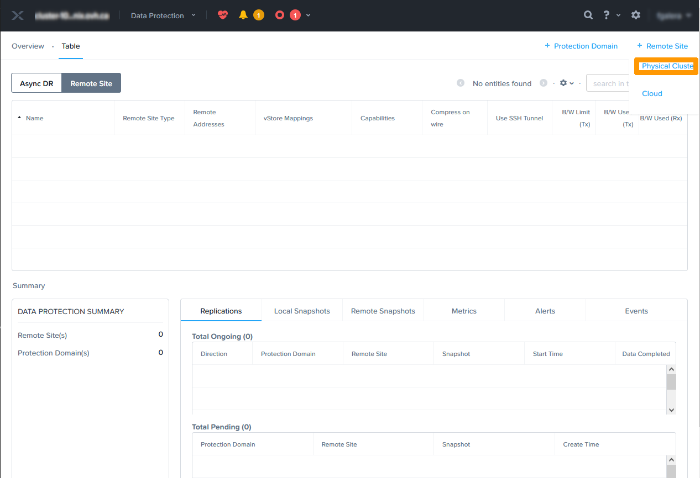{.thumbnail}

Nommez le site distant dans `REMOTE SITE NAME` , saisissez l'adresse IP du **Prism Element** du site distant au canada dans `CLUSTER VIRTUAL IP` et cliquez sur `Add Site`{.action}.

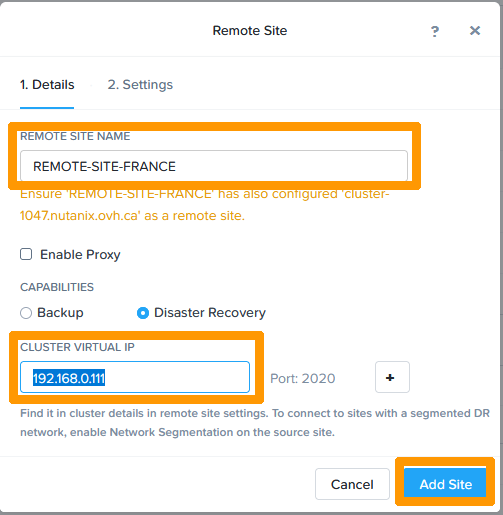{.thumbnail}

Faites défiler la fenêtre à l'aide de La `barre de défilement`{.action}.

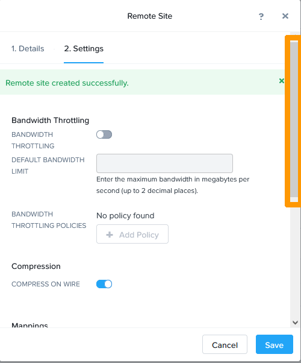{.thumbnail}

Dans **Network Mapping** Selectionnez `AHV: base`pour **Source Cluster** et **Destination Cluster** et cliquez sur le bouton `+`{.action}  

{.thumbnail}

Si vous avez un autre VLAN Faites la même opération avec le nom du VLAN `AHV: VLAN50` en cliquant sur le bouton `+`{.action} pour valider l'association des réseaux source et destination.

{.thumbnail}

Choisissez le `default-container...` dans Source **VStore** et **Destination VStore** et cliquez sur le bouton `+`{.action} pour la correspondance des stockages source et destination. 

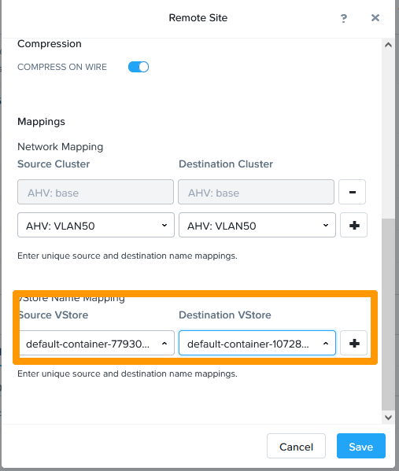{.thumbnail}

Cliquez sur `Save`{.action}

{.thumbnail}

Le site distant apparait dans la liste **Remote Site**

{.thumbnail}

### Mise en place de la réplication entre site

Maintenant que les deux sites se connaissent nous allons mettre en place un réplication asynchrone de 3 ordinateurs virtuels se trouvant en France vers le site distant du CANADA.

Revenez sur **Prism Element** du serveur se trouvant en FRANCE.

Choisissez dans le menu principal `Data Protection`{.action}

{.thumbnail}

Au travers du tableau de bord **Data Protection** cliquez en haut à droite sur `+ Protection Domain`{.action}.

{.thumbnail}

Cliquez sur `Async DR`{.action}.

{.thumbnail}

Saisissez un  `Nom` et cliquez sur `Create`{.action}.

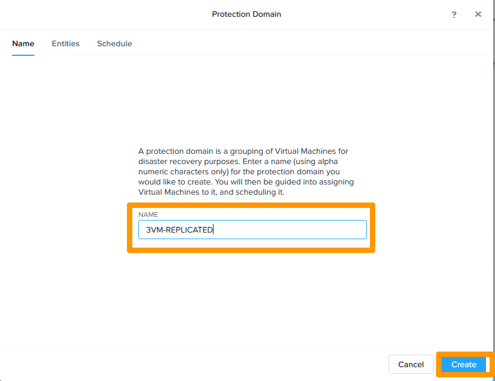{.thumbnail}

Sélectionnez `trois machines` virtuelles et cliquez sur `Protect Selected Entities`{.action}.

{.thumbnail}

Cliquez sur `Next`{.action}

{.thumbnail}

Cliquez sur `New Schedule`{.action} pour programmer la planification.

{.thumbnail}

Choisissez dans *Repeat every* `1 hour` , et prenez comme politique de rétention `2 snapshots` en local et sur le site distant `2 snapshots` Ensuite cliquez sur `Create Schedule`{.action}

{.thumbnail}

La tâche de réplication est crée pour fonctionner toutes les heures se sera une réplication asynchrone fournie avec la licence **Nutanix Standard** d'OVHcloud. cliquez sur `Close`{.action} pour fermer la fenêtre.

{.thumbnail}

Le domaine de protection est créé et apparait dans la liste des réplications.

{.thumbnail}

### Bascule des VM en mode migration

Il est possible de basculer les machines virtuelles à la volée sans perte de données si l'on a nos cluster actifs et qui communiquent entre eux.

Pour cela il faut aller sur le cluster ou se trouve actuellement les VM dans **Prism Element**

### Bascule des VM en mode PRA

## Aller plus loin

Échangez avec notre communauté d'utilisateurs sur <https://community.ovh.com/>.
