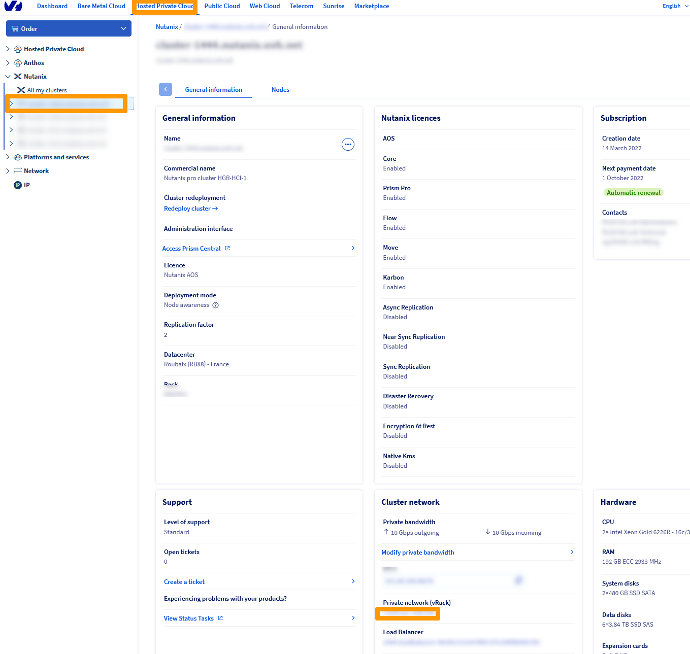
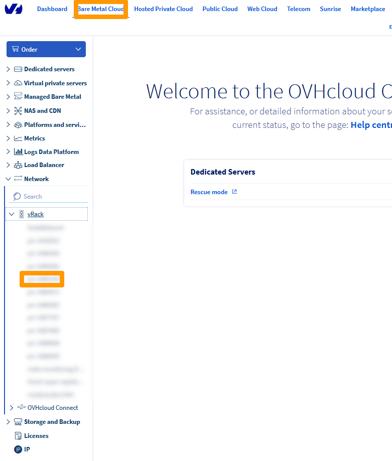
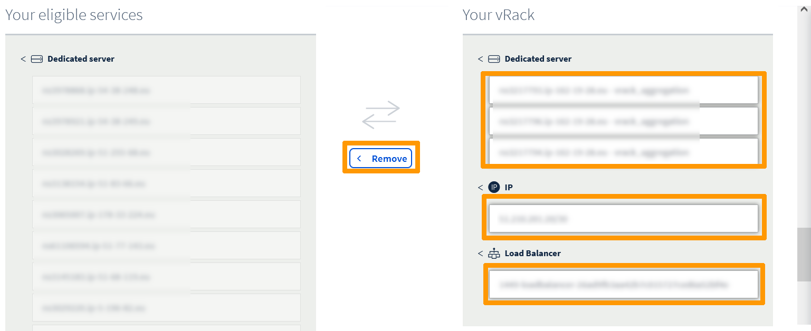

**Dernière mise à jour le 26/09/2022**

## Objectif

**Ce guide vous présente comment interconnecter deux clusters Nutanix Fournis par OVHcloud au travers d'un même vRack sur deux sites OVHcloud distants. Dans ce guide l'interconnexion est effectuée entre les datacenters de Gravelines et de Roubaix.** 

> [!warning]
> OVHcloud vous met à disposition des services dont la configuration, la gestion et la responsabilité vous incombent. Il vous appartient donc de ce fait d’en assurer le bon fonctionnement.
>
> Ce guide a pour but de vous accompagner au mieux sur des tâches courantes. Néanmoins, nous vous recommandons de faire appel à un prestataire spécialisé si vous éprouvez des difficultés ou des doutes concernant l’administration, l’utilisation ou la mise en place d’un service sur un serveur.
>

## Prérequis

- Être connecté à votre [espace client OVHcloud](https://www.ovh.com/auth/?action=gotomanager&from=https://www.ovh.com/fr/&ovhSubsidiary=fr).
- Être connecté sur vos clusters via Prism Central.

## En pratique

Nous allons interconnecter deux clusters Nutanix distants, l'un à Gravelines et l'autre à Roubaix au travers du même **vRack**. Cliquez sur le ce lien [Présentation des vRack](https://www.ovh.com/fr/solutions/vrack/) pour en savoir plus sur la solution OVHcloud de **vRack**.

### Préparation des deux clusters avant l'interconnexion

Avant d'interconnecter les deux clusters il faut s'assurer qu'ils utilisent des adresses IP différentes (sauf pour la passerelle et le load-balancer) sur une même plage d'adresses IP. Dans notre guide nous allons utiliser cette plage d'adresse `192.168.0.0/22`.

 Le cluster de Gravelines utilise ces adresses :

- Serveur 1 : adresse VM **CVM** `192.168.2.1`, adresse IP hyperviseur **AHV** `192.168.2.21`.
- Serveur 2 : adresse VM **CVM** `192.168.2.2`, adresse IP hyperviseur **AHV** `192.168.2.22`.
- Serveur 3 : adresse VM **CVM** `192.168.2.3`, adresse IP hyperviseur **AHV** `192.168.2.23`.
- Adresse virtuelle de **Prism Element** : `192.168.2.100`.
- Adresse IP **Prism Central** :`192.168.2.101`.
- Passerelle : `192.168.2.254`.
- LoadBalancer : `192.168.0.128/27`
- Version du cluster : `6.1`.

Le cluster de Roubaix utilise ces adresses :

- Serveur 1 : adresse VM **CVM** `192.168.1.1`, adresse IP hyperviseur **AHV** `192.168.1.21`.
- Serveur 2 : adresse VM **CVM** `192.168.1.2`, adresse IP hyperviseur **AHV** `192.168.1.22`.
- Serveur 3 : adresse VM **CVM** `192.168.1.3`, adresse IP hyperviseur **AHV** `192.168.1.23`.
- Adresse virtuelle de **Prism Element** : `192.168.1.100`.
- Adresse IP **Prism Central** :`192.168.1.101`.
- Passerelle : `192.168.2.254`.
- LoadBalancer : `192.168.0.128/27`
- Version du cluster : `6.1`.

Aidez-vous de ce guide pour redéployer vos clusters [Redéploiement personnalisé de votre Cluster](https://docs.ovh.com/fr/nutanix/cluster-custom-redeployment/)

> [!primary]
> Ce guide vous propose de redéployer les deux clusters mais vous pouvez n'en redéployer qu'un, le plus important est qu'il ne faut pas avoir d'adresses IP identiques sur le réseau sauf pour la passerelle OVHGateway.
>

### Arrêt de la machine virtuelle **OVHgateway**.

La connexion Internet sortante est fournie par les machines virtuelles **OVHGateway** avec la même adresse IP privée sur les deux sites nous allons arrêter la machine virtuelle **OVHGateway** du **Cluster2** à Roubaix. La connexion Internet sortante sera rétablie quand l'interconnexion au travers du **vRack** sera faites.

Connectez-vous à l'interface **Prism Central** du cluster situé à Roubaix. 

Allez dans la gestion des machines virtuelles sélectionnez `OVHgateway` au travers du menu `Actions`{.action} et cliquez sur `Guest Shutdown`{.action}.

{.thumbnail}

L'accès à Prism Central est maintenu à l'aide du **Load-Balancer**.

#### Paramétrage des **vRack**

Cette opération consiste à supprimer l'affectation du **vRack** à Roubaix et ensuite d'étendre le **vRack** de Gravelines avec Roubaix. Les modifications du **vRack** se font au travers de l'espace client OVHcloud. 

Connectez-vous à votre [espace client OVHcloud](https://www.ovh.com/auth/?action=gotomanager&from=https://www.ovh.com/fr/&ovhSubsidiary=fr). 

#### Suppression des éléments du **vRack** de Roubaix.

A partir du menu `Hosted Private Cloud`{.action} choisissez le cluster de Roubaix à gauche dans la catégorie `Nutanix` et notez le nom du **vRack** qui se trouve en dessous de **Réseau privé(vRack)**.

{.thumbnail}

Allez dans le menu `Bare Metal Cloud` cliquez sur `le vRack`{.action} en dessous de l'option **vRack** dans la catégorie **Network**.

{.thumbnail}

Sélectionnez tous les éléments qui se trouvent dans **Votre vRack** :
 - `Les serveurs dédiés`.
 - `les IP`.
 - `le Load Balancer`.

 Notez les et cliquez sur `Retirer`{.action}

> [!warning]
> 
> Cette opération peut durer quelques minutes, veuillez patientez pendant cette période.
> 

{.thumbnail}

#### Ajout des éléments supprimées du **vRack** de Roubaix dans le **vRack** de Gravelines

Revenez dans le menu `Hosted Private Cloud`{.action} choisissez le cluster de Gravelines dans la catégorie `Nutanix` et notez le nom du **vRack** en dessous de **Réseau privé(vRack)**.

{.thumbnail}

Allez dans le menu `Bare Metal Cloud` sélectionnez le `vRack`{.action} de Gravelines en dessous de l'option **vRack** dans **Network**.

{.thumbnail}

Sélectionnez ces éléments du cluster de Roubaix : 

- `Les serveurs physiques`. 
- `l'IP publique`.

Ensuite cliquez sur `Ajouter`{.action} 

> [!Warning]
> 
> Cette opération peut durer quelques minutes, veuillez patienter pendant cette période. 
> 

> [!primary]
> 
> L'ajout de l'adresse publique n'est pas obligatoire mais elle sera disponible pour de futurs besoins.
> 

{.thumbnail}

Le **vRack** qui était uniquement utilisé par les serveurs du cluster de Gravelines est maintenant utilisé sur les deux sites et contient :

- Les serveurs physiques des deux clusters.
- Les adresses IP publiques des deux clusters.
- Le load balancer de Gravelines qui sert pour **Prism Central**.

L'accès Internet sur le site de Roubaix en sortie est à nouveau disponible au travers du **vRack** et de la machine virtuelle **OVHgateway** de Gravelines. L'accès à Prism Central du cluster de Roubaix est pour l'instant innacessible.

### Modification du load balancer de Roubaix

Nous allons reconfigurer le **Load Balancer** de Roubaix pour qu'il fonctionne avec le **vRack** commun aux deux sites pour pouvoir accéder à **Prism Central** du cluster de Roubaix.

Toujours dans le menu `Bare Metal Cloud` sélectionnez le `Load Balancer`{.action} de Roubaix en dessous de l'option **Load Balancer**.

Positionnez-vous sur `Réseaux privés`{.action}, cliquez sur le bouton `...`{.action} à droite du **réseau privé** existant.

{.thumbnail}

Cliquez sur `Supprimer`{.action}.

{.thumbnail}

Répondez `Supprimer`{.action} à la demande de confirmation.

{.thumbnail}

Cliquez sur `Activer`{.action} à droite de **vRack**.

{.thumbnail}

Choisissez `Existant` sélectionnez le **vRack** commun aux deux sites et cliquez sur `Activer`{.action}.

{.thumbnail}

Cliquez sur `Ajouter un réseau privé`{.action}.

{.thumbnail}

Choisissez ces valeurs :

- **Nom (facultatif)** : `Nom du réseau privé`.
- **VLAN ID** : `VLAN du réseau d'administration de Nutanix normalement le 1`.
- **Subnet** : `LAN du réseau privé 192.168.0.0/22`.
- **NatIP** :  `Plage d'adresses utilisé par le Load Balancer 192.168.2.128/27`.
- **Nom** : `NutaCluster-all`.

> [!Warning]
> 
> La plage choisie par **NatIp** ne doit pas être utilisée par d'autres éléments du réseau privé. 
> 

Ensuite cliquez sur `Ajouter`{.action}

{.thumbnail}

Un bandeau jaune apparait vous indiquant que la configuration n'est pas appliqué cliquez sur `Appliquer la configuration`{.action}.

{.thumbnail}

Sélectionnez le `Datacenter Roubaix(RBX)`{.action} et clquez sur `Appliquer la configuration`{.action}.

{.thumbnail}

Le load balancer est relié au **vRack** commun aux deux sites et l'accès à **Prism Central** de Roubaix est à nouveau disponible.

{.thumbnail}

## Aller plus loin

[Réplication asynchrone ou NearSync au travers de Prism Element](https://docs.ovh.com/fr/nutanix/prism-element-nutanix-replication/)

[Réplication avancée avec Leap](https://docs.ovh.com/fr/nutanix/leap-replication/)

[Présentation des vRack](https://www.ovh.com/fr/solutions/vrack/)

Échangez avec notre communauté d'utilisateurs sur <https://community.ovh.com/>.

