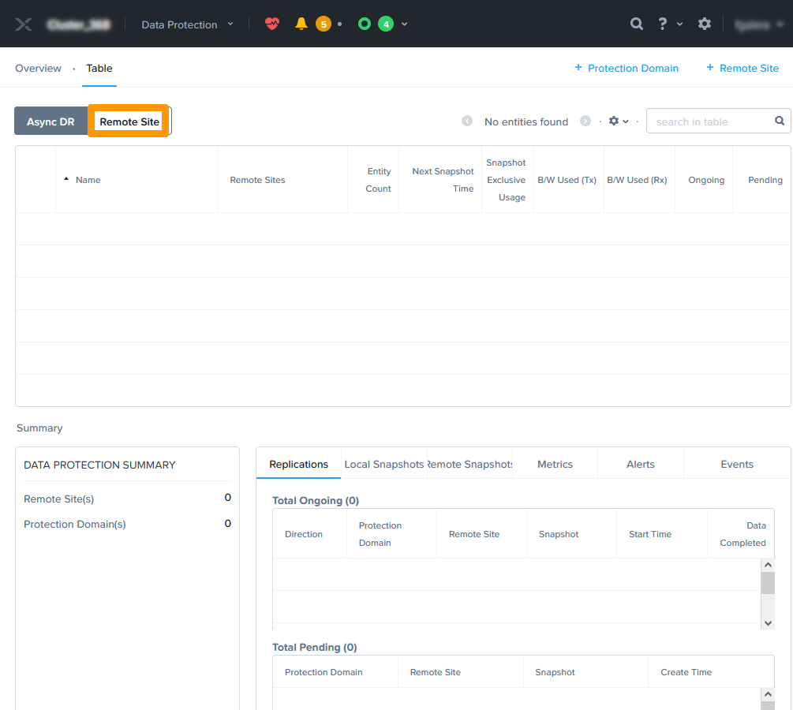
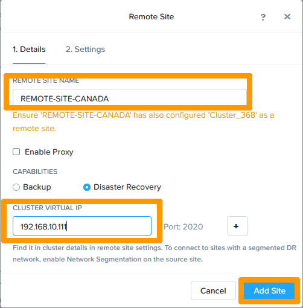
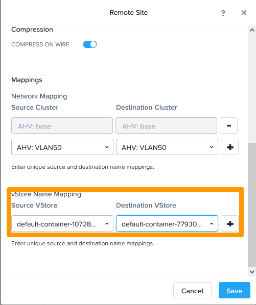
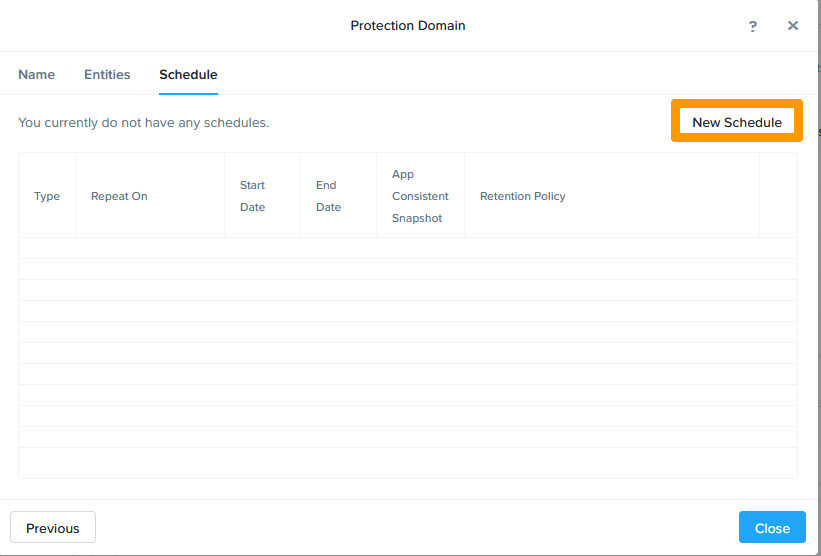
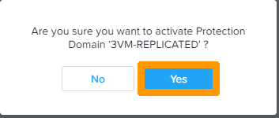

**Last updated 29th June 2022**

## Objective

This guide details how to set up cluster replication via Prism Element.

> [!warning]
> OVHcloud provides services for which you are responsible, with regard to their configuration and management. It is therefore your responsibility to ensure that they they function correctly.
>
> This guide is designed to assist you in common tasks as much as possible. Nevertheless, we recommend contacting a [specialist service provider](https://partner.ovhcloud.com/it/directory/) or reaching out to [our community](https://community.ovh.com/en/) if you experience any issues.
>

## Introduction

Via **Prism Element**, you can:

- Add links to remote clusters.
- Create protection domains to add replications to remote sites.

> [!warning]
> 
> The **Nutanix Standard** OVHcloud pack allows you to use asynchronous replicas **every hour**.
>
> For a shorter replication time between 1 and 15 minutes, you must configure NearSync replicas. This option is only available with the **Nutanix Advanced** OVHcloud pack.
> 

## Requirements

- Two Nutanix clusters in your OVHcloud account
- Access to the [OVHcloud Control Panel](https://www.ovh.com/auth/?action=gotomanager&from=https://www.ovh.it/&ovhSubsidiary=it)
- Access to your clusters via **Prism Central**
- An interconnection between two clusters, e.g. via an IPsec VPN

## Instructions

We will use two Nutanix clusters in OVHcloud data centres, one in Canada and the other in France, connected via an IPsec VPN, on two different IP addressing schemes which are:

- **192.168.0.0/24** for the cluster in a data centre in France.
- **192.168.10.0/24** for the cluster in a Canadian data centre.

If you need help setting up an IPsec VPN, please refer to our guide on [interconnecting two Nutanix clusters through an IPsec VPN](https://docs.ovh.com/it/nutanix/ipsec-interconnection/).

Connect via **Prism Element** to the cluster in France from **Prism Central**, as shown in this documentation: [Nutanix Hyperconvergence](https://docs.ovh.com/it/nutanix/nutanix-hci/).

Click `Data Protection`{.action} from the `Home`{.action} menu.

{.thumbnail} 

Click `Remote Site`{.action} on the left side of the screen.

{.thumbnail}

Click `+ Remote Site`{.action} to the right of the screen and choose `Physical Cluster`{.action} to add a remote site.

{.thumbnail}

Name the remote site in the `REMOTE SITE NAME` field, enter the IP address of the **Prism Element** of the remote site in France in the `CLUSTER VIRTUAL IP` field, and click `Add Site`{.action}.

{.thumbnail}

Scroll through the window using the `scroll bar`{.action}.

{.thumbnail}

In the **Network Mapping** section, select `AHV:base` in the **Source Cluster** and **Destination Cluster** drop-down menus. Then click the `+`{.action} button.

{.thumbnail}

If you have another VLAN, repeat the same operation with `AHV VLAN: VLAN50`. Click the `+`{.action} button to validate the association of source and destination networks.

{.thumbnail}

Choose `default-container...` from the **Source VStore** and **Destination VStore** drop-down menus. Then click the `+`{.action} button to connect the source and destination storage.

{.thumbnail}

Click `Save`{.action}.

{.thumbnail}

The remote site will then appear in the list.

{.thumbnail}

We will now connect to the **Prism Element** interface of the remote site in Canada and perform the same operation.

From the `Home`{.action} menu, click `Data Protection`{.action}.

{.thumbnail} 

Click `Remote Site`{.action} on the left side of the screen.

{.thumbnail}

Click `+ Remote Site`{.action} to the right of the screen and choose `Physical Cluster`{.action} to add a remote site.

{.thumbnail}

Name the remote site in the `REMOTE SITE NAME` field, enter the IP address of the **Prism Element** of the remote site in Canada in the `CLUSTER VIRTUAL IP` field, and click `Add Site`{.action}.

{.thumbnail}

Scroll through the window using the `scroll bar`{.action}.

{.thumbnail}

In the **Network Mapping** section, select `AHV:base` in the **Source Cluster** and **Destination Cluster** drop-down menus. Then click the `+`{.action} button.

{.thumbnail}

If you have another VLAN, repeat the same operation with `AHV VLAN: VLAN50`. Click the `+`{.action} button to validate the association of source and destination networks.

{.thumbnail}

Choose `default-container...` from the **Source VStore** and **Destination VStore** drop-down menus. Then click the `+`{.action} button to connect the source and destination storage.

{.thumbnail}

Click `Save`{.action}.

{.thumbnail}

The remote site will then appear in the list. 

{.thumbnail}

### Setting up inter-site replication

Now that the two sites are connected, we will create a protection domain with asynchronous replication containing three virtual machines located on the cluster in France to the remote site in Canada.

Return to the cluster’s **Prism Element** interface, located in France.

Choose `Data Protection`{.action} from the main `Home`{.action} menu.

{.thumbnail}

In the **Data Protection** dashboard, click `+ Protection Domain`{.action} in the top right-hand corner, then `Async DR`{.action}.

{.thumbnail}

Name the protection domain and click `Create`{.action}.

{.thumbnail}

Select three virtual machines and click `Protect Selected Entities`{.action}.

{.thumbnail}

Click `Next`{.action}.

{.thumbnail}

Click `New Schedule`{.action} to configure the schedule.

{.thumbnail}

Modify this option to **Configure your local schedule**:

- Enter **Repeat every** `1 hour`. 

Then enter the retention policies in **Retention policy**:

- Choose locally and remotely **keep the last** `2` **snapshots** to keep two snapshots locally and remotely.

Click `Create Schedule`{.action} to commit the schedule.

{.thumbnail}

The replication task is created to run hourly. This will be asynchronous replication, which can be used with the OVHcloud **Nutanix Standard** pack. 

Click `Close`{.action} to close the window.

> [!primary]
> 
> You can change the schedule to reduce the risk of data loss in the event of a disaster, but replication will switch from asynchronous to *NearSync* mode, and you will then need to upgrade your licence to the OVHcloud **Nutanix Advanced** pack.

{.thumbnail}

The protection domain is created and appears in the list.

{.thumbnail}

### Virtual machine migration

Migrating VMs is an operation to move VMs that are members of a protection domain to the remote site without losing data. Both clusters must be online and communicate correctly with each other. 

The migration steps are as follows:

1. Stopping virtual machines on the source cluster (if they are turned on).
2. Replication of missing data to destination cluster.
3. Deleting virtual machines on the source cluster.
4. Disable scheduling.
5. Enabling virtual machines on the destination cluster.
6. Replication is reversed, the destination becomes the source.

Go to the **Prism Element** interface where the replicated virtual machines are located.

In the **Data Protection** dashboard, click `Migrate`{.action}. 

{.thumbnail}

Select the remote site, type `MIGRATE`, and click `Migrate`{.action}.

{.thumbnail}

The migration is then launched. It will be completed when the VMs appear at the remote site and are no longer visible at the original site. 

Since the migrated virtual machines are turned off, you must start them manually.

{.thumbnail}

### Virtual machine failover in case of disaster

If the original site is down, you can enable virtual machines that are members of a protection domain at the destination site. 

> [!warning]
> Activation of virtual machines at the remote site will be done with the latest replicated data. For asynchronous replication, the maximum data loss risk is one hour.

Connect to the functional site with **Prism Element**.

Go to the **Data Protection** dashboard.

Select the site to activate and click `Activate`{.action}. 

{.thumbnail}

Click `Yes`{.action}. 

{.thumbnail}

The virtual machines will appear in the **Prism Element** console in the state of last replication. Data modified after the last valid replication will be lost.

## Go further

[Disaster Recovery Plan in Nutanix](https://docs.ovh.com/it/nutanix/disaster-recovery-plan-overview/)

[IPsec interconnection between two sites](https://docs.ovh.com/it/nutanix/ipsec-interconnection/)

[Nutanix Documentation on Data Protection and Disaster Recovery](https://portal.nutanix.com/page/documents/solutions/details?targetId=BP-2005-Data-Protection:top-backup-and-disaster-recovery-on-remote-sites.html)

Join our community of users on <https://community.ovh.com/en/>.