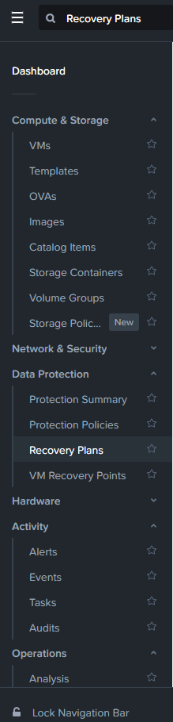
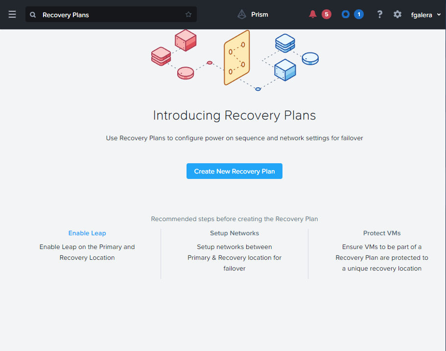
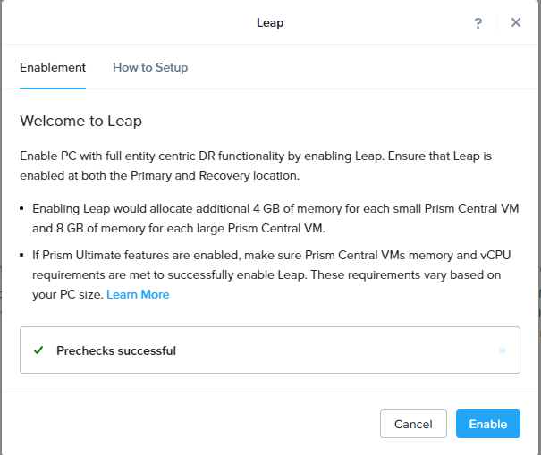
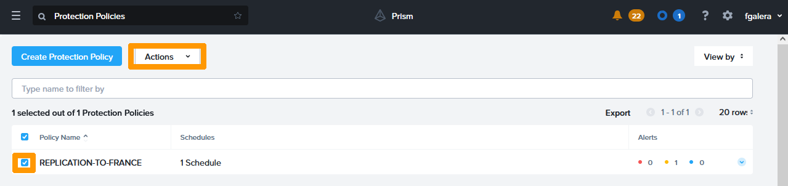
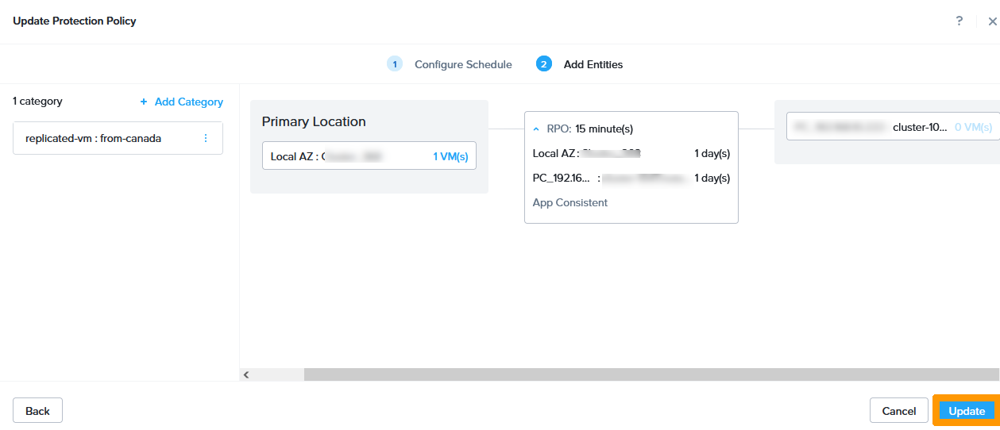
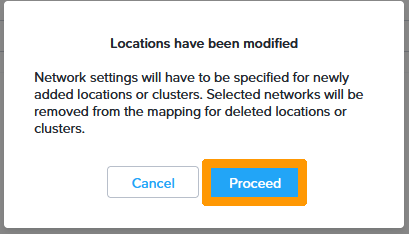

**Dernière mise à jour le 12/07/2022**

## Objectif

Mettre en place des réplications et des plans de reprises d'activités avancées avec **Nutanix LEAP** dans **Prism Central**.

## Présentation

Nutanix LEAP permet :

- de faire des réplication asynchrones et synchrones en fonction du pack de licence choisi. 
- de tester les réplications.
- de faire des plans de reprises d'activités avancées avec démarrage de machine virtuelles et dans certains cas une automatisation de la bascule d'un cluster à l'autre (Uniquement avec une réplication synchrone et un témoin de cluster).
- D'avoir une destination vers le cloud de Nutanix avec **Xi Leap** (Attention cette solution n'est pas disponible avec les licences fournies par OVHcloud).

> [!warning]
> OVHcloud vous met à disposition des services dont la configuration, la gestion et la responsabilité vous incombent. Il vous appartient donc de ce fait d’en assurer le bon fonctionnement.
>
> Ce guide a pour but de vous accompagner au mieux sur des tâches courantes. Néanmoins, nous vous recommandons de faire appel à un prestataire spécialisé si vous éprouvez des difficultés ou des doutes concernant l’administration, l’utilisation ou la mise en place d’un service sur un serveur.
>

## Prérequis

- Disposer de deux clusters Nutanix dans votre compte OVHcloud.
- Être connecté à votre [espace client OVHcloud](https://www.ovh.com/auth/?action=gotomanager&from=https://www.ovh.com/fr/&ovhSubsidiary=fr).
- Être connecté à vos clusters via **Prism Central**.
- Avoir mis en place une interconnexion entre deux clusters a l'aide de ces technologies par exemple :  
    + Via un VPN IPsec comme dans ce guide [Interconnexion IPsec entre deux sites](https://docs.ovh.com/fr/nutanix/ipsec-interconnection/). 
    + Ou une connexion vRACK [vRack](https://www.ovh.com/fr/solutions/vrack/).
- **Prism Central** a besoin de plus de ressources en fonction du nombre de machines virtuelles dédiées à **Prism Central**
    + Single Mode : 4Go de RAM supplémentaires.
    + Scale Mode avec 3 machines virtuelles **Prism Central** : 8 Go de RAM supplémentaire par machines virtuelles.

## En pratique

Notre plan de reprise d'activité au travers de **Nutanix Leap** sera mis en place entre deux clusters, les deux se trouvant dans des datacenters OVHcloud distants l'un Canada et l'autre en France. Les deux clusters sont reliés par un VPN IPSec avec cette configuration réseau :

- Lan d'administration du cluster en France : **192.168.0.0/24**.
- Lan d'administration du cluster au Canada : **192.168.10.0/24**.

- Lan de production pour les machines virtuelles commun aux deux clusters **192.168.50.0/24**. sur le VLAN 50.
- Lan de test commun aux deux clusters **192.168.51.0/25** sur le VLAN 51.

### Mise en service de Nutanix Leap

#### Ajout d'une adresse IP en iSCSI sur chaque cluster 
Avant d'activer **Nutanix Leap** il est nécessaire de rajouter une adresse IP pour les connexions iSCSI sur chacun des clusters.

Connectez-vous à **Prism Element** au travers de **Prism Central** sur le cluster se trouvant en France, pour vous aider vous pouvez utiliser ce guide [Hyperconvergence Nutanix](https://docs.ovh.com/fr/nutanix/nutanix-hci/).

Au travers du tableau de bord de **Prism Element** en haut à gauche cliquez sur `Le nom du cluster`{.action}.

{.thumbnail}

Saisissez une `adresse IP non utilisée du réseau d'administration ` dans **iSCSI Data Service IP** et cliquez sur `Save`{.action}.

{.thumbnail}

Allez sur le cluster se trouvant au CANADA avec **Prism Central** pour effectuer la même opération qu'en France.

Dans le tableau de bord de **Prism Element** en haut à gauche cliquez sur `Le nom du cluster`{.action}.

{.thumbnail}

Saisissez une `adresse IP non utilisée du réseau d'administration ` dans **iSCSI Data Service IP** ensuite cliquez sur `Save`{.action}.

{.thumbnail}

#### Activation de LEAP

Revenez sur l'interface **Prism Central** du cluster se trouvant en France.

Depuis le menu principal, cliquez sur `Recovery Plans`{.action} dans le sous-menu `Data Protection`

{.thumbnail}

Cliquez sur `Enable Leap`{.action}.

{.thumbnail}

Si sur l'écran apparait `Prechecks successful` Cliquez sur `Enable`{.action}.

{.thumbnail}

Revenez sur l'interface **Prism Central** du cluster se trouvant au Canada et faites la même manipulation.

Cliquez sur `Recovery Plans`{.action}.

{.thumbnail}

Cliquez sur `Enable Leap`{.action}.

{.thumbnail}

Si sur l'écran est affiché `Prechecks successful`, cliquez sur `Enable`{.action}.

{.thumbnail}

Chaque cluster a maintenant une **Availability zone**, il va être possible d'interconnecter ces deux clusters.

### Connexion des deux clusters.

Restez sur **Prism Central** dans le cluster se trouvant au Canada.

Depuis le menu principal, cliquez sur `Availability Zones`{.action} sous `Administration`.

{.thumbnail}

Cliquez sur `Connect to Availability Zone`{.action}.

{.thumbnail}

Saisissez ces informations :

- **Availability Zone Type** : `Physical Location`.
- **IP Address for Remote PC** : `Adresse IP Prism Central distant`.
- **Username** : `Compte administrateur du Prism Central distant`.
- **Password** : `Mot de passe du compte Prism Central distant`.

Ensuite cliquez sur `Connect`{.action}.

{.thumbnail}

Le cluster distant apparait avec comme nom l'adresse IP privée du **Prism Central** se trouvant en France précédé de **PC_**.

{.thumbnail}

Connectez-vous au cluster en France avec **Prism Central**. 

Depuis le menu principal, cliquez sur `Availability Zones`{.action} dans le sous-menu `Administration` pour constater que le site distant du Canada apparait avec l'adresse IP privée du **Prism Central** se trouvant au Canada précédé de **PC_**.

{.thumbnail}

### Mise en place d'une réplication à partir du Canada vers la France.

> [!warning]
> Les machines virtuelles qui seront protégées avec **Nutanix Leap** ne doivent pas être membre d'un **Domain Protection** créé à partir de **Prism Element**. Il existe une procédure sur le site de Nutanix pour effectuer une migration. 
>

#### Création d'une catégorie contenant les machines virtuelles à répliquer

Depuis le `menu principal`, cliquez sur `Categories`{.action} dans le sous menu `administration`.

{.thumbnail}

Cliquez sur `New Category`{.action}.

{.thumbnail}

Saisissez ces informations :

- **Name** : `replicated-vm`
- **values** : `from-canada`

Ensuite cliquez sur `Save`{.action}.

{.thumbnail}

Revenez dans le menu principal sélectionnez `VMs`{.action} sous `Compute and Storage`.

{.thumbnail}

Sélectionnez la machine virtuelle à l'aide de la `case à cocher`{.action} à sa gauche.

Ensuite cliquez sur le menu `Actions`{.action}.

{.thumbnail}

Dans le menu cliquez sur `Manage Categories`{.action}.

{.thumbnail}

Sélectionnez la catégorie créée et cliquez sur le bouton `+`{.action} de couleur bleue.

{.thumbnail}

cliquez sur `Save`{.action}.

{.thumbnail}

#### Création de la stratégie de protection

Une stratégie de protection consiste à une connexion entre deux *Availability zones* avec un planning de réplication :

- asynchrone toutes les heures
- *nearsync* entre 1 & 15 minutes
- synchrone avec un délai de 0 secondes (Ce mode nécessite une latence réseau inférieure à 5ms entre les deux clusters)

Depuis le menu principal, cliquez `Protection Policies`{.action} sous `Data Protection`.

{.thumbnail}

Cliquez sur `Create Protection Policy`{.action}. 

{.thumbnail}

Saisissez `le nom de la stratégie` dans **Policy name**

Ensuite dans **Primary location** choisissez ces options : 

- **Location** : `Local AZ` pour choisir la zone contenant le cluster local.
- **Cluster** : `Cluster contenant ls machines virtuelles à répliquer`.

Cliquez sur `Save`{.action}.

{.thumbnail}

Dans **Recovery location** choisissez ces options :

- **Location** : `PC_192.168.0.222` qui correspond à zone contenant le cluster distant.
- **Cluster** : `Cluster de destination à l'intérieur de la zone de destination`.

Cliquez sur `Save`{.action}.

{.thumbnail}

Cliquez sur `Add schedule`{.action}.

{.thumbnail}

Choisissez `Asynchronous dans` **Protection Type**.

Modifiez ces options dans takes **Take Snapshot Every** par `Minutes : 15` pour faire une réplication *nearsync*.

Cochez la case `Take App-Consistent Snapshots` et cliquez sur `Save Schedule`{.action}.

{.thumbnail}

Cliquez sur `Next`{.action}.

{.thumbnail}

Sélectionnez la `catégorie` dont fait partie les machines virtuelles et cliquez sur `Add`{.action}.

{.thumbnail}

Cliquez sur `Create`{.action}.

{.thumbnail}

La stratégie de protection est activée et apparait dans le tableau de bord des **Protection Policies**.

{.thumbnail}

### Gestion des plans de reprises d'activité.

#### Présentation 

IL est possible de créer des plans de reprises d'activités avec diverses options : 

- Lancement manuel du plan de reprise d'activité si l'on n'a pas de témoin de cluster.
- Automatisation du plan de reprise d'activité en réplication synchrone avec un témoin de cluster.
- Choix du démarrage des machines virtuelles lors de l'activation du plan de reprise d'activité avec la possibilité supplémentaire d'exécuter un script.

Dans notre exemple ce sera un plan de reprise d'activité manuel avec le démarrage automatique des machines virtuelles.

#### Création du plan de reprise d'activité

Depuis le menu principal choisissez `Recovery Plans`{.action} sous `Data Protection`.

{.thumbnail}

Cliquez sur `Create New Recovery Plan`{.action}. 

{.thumbnail}

Saisissez ces valeurs : 

- **Recovery Plan Name** : `nom du plan de reprise d'activité`.
- **Primary Location** : `Local AZ` pour choisir la zone contenant le cluster local.
- **Recovery Location** : `Nom de la Zone distante` qui servira pour le plan de reprise d'activité.

Ensuite cliquez sur `Next`{.action}. 

{.thumbnail}

Cliquez sur `Add Entities`{.action}. 

{.thumbnail}

Cochez la `case`{.action} à côté des machines virtuelles qui font partie du plan de reprise d'activité.

Ensuite cliquez sur `Add`{.action}.

{.thumbnail}

Cochez la `case`{.action} à coté des machines virtuelles qui doivent démarrer automatiquement lors de l'activation du plan de reprise d'activité.

Ensuite cliquez sur `Next`{.action}. 

{.thumbnail}

Lors de la présentation du plan de reprise cliquez sur `OK, Got it`{.action}. 

{.thumbnail}

Sur le site primaire choisissez ces options :

- **Production** : `VLAN de production`.
- **Test Failback** : `VLAN de test`. 

Sur le site de reprise choisissez ces options :

- **Production** : `VLAN de production`.
- **Test Failback** : `VLAN de test`. 

Ensuite cliquez sur `Done`{.action}. 

{.thumbnail}

Le plan de reprise d'activité apparait dans la liste.

{.thumbnail}

#### Migration programmée 

##### Migration du site se trouvant au Canada vers la France

Connectez-vous avec **Prism Central** sur le cluster en France pour basculer la machine virtuelle du Canada vers la France.

Allez dans le menu `Principal` choisissez `Recovery Plans`{.action} dans la rubrique `Data Protection`.

{.thumbnail}

Sélectionnez le plan de reprise d'activité en utilisant la `case à cocher` à sa gauche ensuite cliquez sur `Actions`{.action} pour faire apparaitre le menu.

{.thumbnail}

Cliquez sur `Failover`{.action}. 

{.thumbnail}

Dans Failover type sélectionnez `Planned Failover`{.action} et cliquez sur le bouton `Failover`{.action}.

{.thumbnail}

Saisissez `Failover`{.action} et cliquez sur le bouton `Failover`{.action}.

{.thumbnail}

La machine virtuelle se trouvant sur le cluster d'origine va être éteinte, une dernière synchronisation des données va être faites, ensuite la machine virtuelle disparaitra du cluster d'origine pour apparaitre et démarrer sur le cluster de destinations.

Le résultat de de la migration apparait dans la colonne **Last Failover Status** avec le statut `Succeeded` si tout s'est bien passé.

{.thumbnail}

##### Inversion de la réplication 

Dans le cas d'un basculement programmé il faut inverser la réplication pour continuer à avoir la redondance entre les deux sites.

Connectez-vous sur le cluster de destination en FRANCE au travers de **Prism Central**.

Utilisez le `menu principal`, choisissez `Protection Policies`{.action} dans le sous-menu `Data Protection`.

{.thumbnail}

Cochez la `case`{.action} à gauche de la stratégie de protection et cliquez sur le boutons `Actions`{.action}.

{.thumbnail}

Cliquez sur le bouton `Update`{.action}.

{.thumbnail}

Positionnez-vous à gauche en dessous de `Primary Location` jusqu'a qu'un menu apparaisse. Cliquez sur `Edit`{.action}.

{.thumbnail}

Modifier ces informations dans **Primary Location** :

- **Location** : `Local AZ`
- **cluster** : `cluster de la zone locale`

Ensuite cliquez sur `Save`{.action}.

{.thumbnail}

Cliquez sur `Update Location`{.action}.

{.thumbnail}

Positionnez-vous à droite en dessous de la destination jusqu'a qu'un menu apparaisse. Cliquez sur `Edit`{.action}.

{.thumbnail}

Modifier ces informations dans **Primary Location** :

- **Location** : `zone de destination`.
- **cluster** : `cluster de la zone de destination`.

Ensuite cliquez sur `Save`{.action}.

{.thumbnail}

Cliquez sur `Update Location`{.action}.

{.thumbnail}

Cliquez sur `Next`{.action}. 

{.thumbnail}

Cliquez sur `Update`{.action} pour finaliser l'inversion.

{.thumbnail}

##### Modification du plan de reprise d'activité

De même que la réplication doit être inversée il faut aussi modifier le plan de reprise d'activité pour avoir la possibilité de migrer vers le site distant.

Allez dans le `menu principal` choisissez `Recovery Plans`{.action} dans le sous-menu `Data Protection`.

{.thumbnail}

Sélectionnez le plan de reprise d'activité à l'aide de la `case à cocher`{.action} à sa gauche ensuite cliquez sur le bouton `Actions`{.action}.

{.thumbnail}

Cliquez dans le menu sur `Update`{.action}.

{.thumbnail}

Remplacez dans **Primary Location** à gauche `le cluster distant` par `Local AZ`{.action}.

{.thumbnail}

Choisissez `La zone distante`{.action} dans **Recovery Location** à droite à la place de `Local AZ`.

{.thumbnail}

Maintenant que la source et la destination du plan de reprise d'activité sont modifiées, cliquez sur `Next`{.action}.

{.thumbnail}

Cliquez sur `Proceed`{.action}.

{.thumbnail}

Sélectionnez la `Machine virtuelle` qui doit démarrer lors du plan de reprise d'activité et cliquez sur `Next`{.action}.

{.thumbnail}

Sur le site primaire choisissez ces options :

- **Production** : `VLAN de production`
- **Test Failback** : `VLAN de test` 

Sur le site de destination choisissez ces options :

- **Production** : `VLAN de production`
- **Test Failback** : `VLAN de test` 

Ensuite cliquez sur `Done`{.action}. 

{.thumbnail}

Le plan de reprise d'activité est modifié pour permettre la bascule des machines virtuelles du cluster se trouvant en France vers celui se trouvant au Canada. 

Si vous souhaitez revenir au fonctionnement d'origine il faudra refaire un *failover*, modifier la réplication et le plan de reprise d'activités.

{.thumbnail}

#### Activation du plan de reprise d'activité suite à un incident sur le cluster d'origine

Il est possible d'activer les machines virtuelles sur le cluster de destination en cas de problème sur le cluster d'origine, dans ce cas l'activation se fera avec un risque de perte de données dans le cas d'une réplication asynchrone ou *nearsync*, 

Si l'on utilise une solution de réplication synchrone aucune perte de données ne sera à déplorer.

Dans notre cas la réplication est programmée toutes les 15 minutes, le risque de perte de données peut dans le pire des cas correspondre à cette durée.

Connectez-vous au cluster qui est le destinataire des replications avec **Prism Central** 

Allez dans le `menu principal`, choisissez `Recovery Plan`{.action} dans le sous menu `Data Protection`.

{.thumbnail}

Sélectionnez le plan de reprise d'activité avec `la case à cocher`{.action} et cliquez sur `Actions`{.action} 

{.thumbnail}

Choisissez dans le menu `Failover`{.action} 

{.thumbnail}

Cochez `Unplanned Failover`{.action} et cliquez sur `Failover`{.action}

{.thumbnail}

Saisissez `Failover` et cliquez sur `Failover`{.action}

{.thumbnail}

La machine virtuelle membre du plan de reprise d'activité va démarrer sur le cluster de destination avec le contenu de la dernière réplication.

## Aller plus loin

[Plan de reprise d'activité sur Nutanix](https://docs.ovh.com/fr/nutanix/disaster-recovery-plan-overview/)

[Interconnexion IPsec entre deux sites](https://docs.ovh.com/fr/nutanix/ipsec-interconnection/)

[vRack](https://www.ovh.com/fr/solutions/vrack/)

[Documentation Nutanix LEAP](https://portal.nutanix.com/page/documents/details?targetId=Leap-Xi-Leap-Admin-Guide-v6_1:Leap-Xi-Leap-Admin-Guide-v6_1)

Échangez avec notre communauté d'utilisateurs sur <https://community.ovh.com/>.
